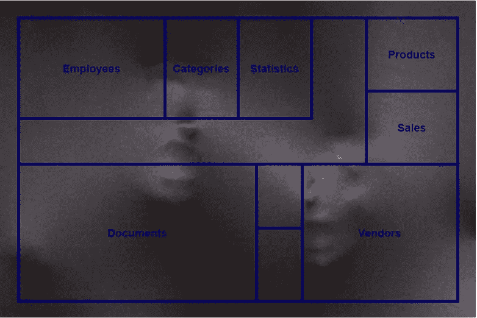

# 让我听到你尖叫(建筑)

> 原文：<https://levelup.gitconnected.com/let-me-hear-you-screaming-architecture-3adcc02f2ca3>

## 软件体系结构

## 软件架构应该表达系统的意图。—鲍勃叔叔

令人尖叫的软件架构

> 让我听到你想要的尖叫
> 让我听到你想要的尖叫

这是**奥兹·奥斯朋的歌曲《让我听到你尖叫》中的一段副歌**让我把它稍微修改一下，变成一个软件相关的上下文。

> 让我听到客户想要的尖叫
> 让我听到客户想要的尖叫

否则，让你的软件架构复制应用程序的意图。应用程序的目的主要是客户想要的。这是我创造力的上限。好好享受吧。不会有任何好转。

# 尖叫的建筑

“尖叫建筑”一词的作者是罗伯特·c·马丁。他在 2011 年的博客[帖子](https://blog.cleancoder.com/uncle-bob/2011/09/30/Screaming-Architecture.html)中展示了这一点。鲍勃大叔指出，每一个建筑蓝图都在告诉你建筑的意图。

从家庭住宅到图书馆，这种蓝图的读者可以很快认识到建筑的目的。蓝图强调建筑的用例，软件架构应该以同样的方式工作。你可以在我以前的文章中读到如何围绕应用用例集中你的软件架构。

 [## 每个软件开发人员都应该知道的 3 个以领域为中心的架构

### 建筑师首先关心的是确保房子是可用的，而不是确保房子是…

levelup.gitconnected.com](/3-domain-centric-architectures-every-software-developer-should-know-a15727ada79f) 

## 什么是软件的蓝图

> 蓝图是一张技术图纸或工程图纸的复制品，使用光敏纸上的接触印刷工艺——维基百科

软件的技术绘图大多是在每个项目开始的时候做的。但是这些图更多的是抽象的，而不是对应用程序的精确、详细的描述。

每当您想要找出应用程序功能的精确细节时，您都要浏览源代码并从中读取。由此可见，**软件的蓝图就是它的代码库**。

一旦软件架构的代码库结构围绕用例组织起来，它就能表达自己的意图。

# 职能组织

大多数情况下，我们围绕模式和原则组织代码库— **分类组织**。一旦我们知道了`Controller`的样子，我们就不用以父目录名的形式来标识它了。

我们可以根据系统的高级用例来组织我们的文件夹结构和名称空间；概念涉及用户与系统中对象的交互— **功能组织**。

功能组织和分类组织

您可能已经使用了数据访问层中文件夹的功能组织。根据模块来构造实体是很常见的，模块是与高级用例相同的抽象概念。你可以在下面链接的我的文章中找到更多关于图层的信息。

 [## 每个软件架构师都应该知道的软件体系结构的层次

### “所有的架构都有相同的目标——关注点的分离。都是通过分软件来实现的…

levelup.gitconnected.com](/layers-in-software-architecture-that-every-sofware-architect-should-know-76b2452b9d9a) 

## 赞成的意见

*   空间位置——应该在一起生活的事物。
*   易于导航
*   领域驱动的设计友好

## 骗局

*   框架约定的松散。
*   自动脚手架功能松动。
*   分类对于绿地项目来说更容易。

# 摘要

建筑应该表达它的意图，但也要遵循重要的原则。作为一名软件架构师，您的工作就是在它们之间找到最佳平衡。

我在我的代码库中使用了功能组织，但是只针对应用程序的业务部分。

*   在域和应用层的以域为中心的体系结构中。
*   在以数据库为中心的三层架构中的业务层。

我更喜欢表示层中的分类组织，因为我是后端开发人员，分类组织对初级程序员更友好。

# 来源

*   Matthew Renze 的《多视角课程——清洁建筑:模式、实践和原则》
*   [罗伯特·c·马丁 2011 年的博客——尖叫的建筑。](https://blog.cleancoder.com/uncle-bob/2011/09/30/Screaming-Architecture.html)
*   [维基百科上的蓝图。](https://en.wikipedia.org/wiki/Blueprint)

 [## 丹尼尔·鲁斯诺克的时事通讯

### 每个月我都会给你发一封邮件，列出我的最新文章。当然，这将是友好的联系…

www.danielrusnok.com](https://www.danielrusnok.com/daniel-rusnoks-newsletter) 