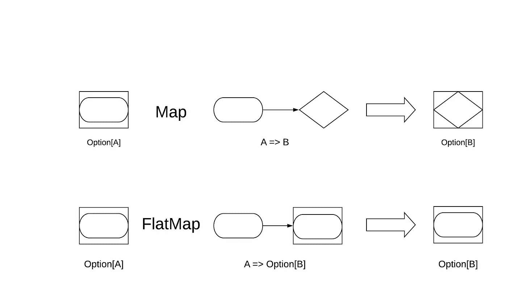

# 我来教你如何用猫实现 Monad

> 原文：<https://levelup.gitconnected.com/let-me-teach-you-how-to-implement-monad-with-cats-5da159386700>


*原载于*[*https://edward-huang.com*](https://edward-huang.com/functional-programming/scala/programming/monad/2020/03/16/let-me-teach-you-how-to-implement-monad-with-cats/)

单子是 Scala 中最常见的抽象之一。我们经常在 Scala 和其他语言中使用它们，但是我们经常不知道它们的名字。

我在学习函数式编程的时候，除了理解了引用透明和纯的规则之外，对什么是单子，函子，半群，幺半群完全是一头雾水。

在本文中，我想分享一下如何通过实现`pure`、`flatMap`和`tailRecM`来用 Cats 库创建单子。

在此之前，我想分享一些关于 map 和 flatMap 的信息，以及 Monad 的一个简短定义，然后我们将深入探讨如何为自定义类型实现一个 Monad。

# 什么是单子

简单地说，Monad 是一种对计算进行排序的机制。它是任何具有平面图功能的东西。

Monad 是函子的子集，具有映射功能。因此，所有的单子也是一个函子，它们可以在机制上应用一个映射。

单子的一些例子包括:列表、选项、未来。为了便于理解，人们经常使用 Scala 的特殊语法来支持单子运算。

让我们直接进入地图和平面地图的区别。然后，将自定义类型实现为 Monad。

# 地图与平面地图

当您从 JavaScript 的角度来看 map 和 flatMap 时，它是一个在迭代器上迭代的函数，转换迭代器中的那些元素，并返回一个包含转换后的迭代器的全新数组。

例如，您可以映射一个整数列表，并调用回调函数来转换字符串中的元素。

```
val lst = List(1,2,3)
val stringList = lst.map{el => s"${el}" }
println(stringArr);
```

`stringArr`的输出将是`List("1","2","3)`。地图在那边做了什么？

map 函数基本上将列表中的每个整数元素转换成一个字符串。然后，它返回一个新的列表，分配给`stringList`。

在 Scala 中，map 的含义不仅仅是迭代一个迭代器。该映射不是迭代模式。Put、flatMap 和 Map 是一种转换计算序列的方法。map 和 flatMap 通过忽略由相关数据类型决定的复杂性，对值执行一系列计算。

您不仅可以在列表中绘制地图，还可以选择未来，或者两者都选。

map 对这些数据类型所做的是剥离数据类型、列表的外层，并将回调函数应用于列表中的每个元素。然后，一旦操作完成，它就用剥离的现有数据类型(List)覆盖其中的值。

期权也是如此。Map 将其函数应用于选项内部的值。得到的值仍然是一个选项，但是选项中的值被改变和转换了。



Map 在某种程度上受到限制，它们只允许在计算开始时出现复杂性。Flatmap 走得更远，不仅可以在数据类型内部转换值，还可以将它链接到一系列计算中。

当您调用 flatMap 时，它主要用`map`做同样的事情，但是随后它调用`flatten`来展平结果值。一个例子是当你试图将一个 2D 列表扁平化为一个 1D 列表。

```
val twoDList = List(List(1,2), List(3,4), List(5,6))

twoDList.flatMap(el => el)
```

上面的代码和做`twoDList.map(el => el).flatten`是一样的。

让我们采取另一个选项。

```
def divide(a:Int, b:Int): Option[Int] = if(b == 0) None else Some(a/b)

Some(1).flatMap{ one =>
  Some(2).flatMap{two =>
    divide(one,two)
  }
}
```

在这个例子中，flatMap 去掉了中间的复杂性。选项的平面图考虑了中间选项。在 flatMap 内部传递的函数指定了特定于应用程序的计算。如果任何中间值为 None，则上面示例中的 flatMap 函数会缩短操作。

# 你如何定义一个自定义单子

在 Cats 库中，您可以通过实现以下三种方法来定义自定义的 monad:

*   平面地图
*   纯(适用)
*   tailRecM

我们已经讨论过平面地图。Pure 是应用程序提供的功能。Applicative 还扩展了 Functor，这给了 Monad 一个映射方法。tailRecM 是 Cats 库中使用的一种优化，用于限制使用的堆栈空间量。

当您可以实现 tailRecM tail 递归时，Cats 库可以保证大型操作(如折叠扩展列表)中的堆栈安全。然而，如果您不能使 tailRecM 尾部递归，那么就不能保证 cats 在极端用例中是堆栈安全的。

让我们将 CustomMonad 类创建为 Monad。

```
case class CustomMonad[A](value:A)
```

之前，您需要在 build.sbt 中导入 Cats 库，以便实现自定义 monad。

```
*// build.sbt* lazy val customMonad = project.in(file("customMonad"))
  .settings(
    name := "Custom Monad",
    commonSettings,
    libraryDependencies ++= Seq(
      "org.typelevel" %% "cats-core" % "2.0.0"
    )
  )
```

首先，我们实现了 pure，它将一个值转换为一个选项。

```
override def pure[A](x: A): CustomMonad[A] = CustomMonad(x)
```

下面是平面图函数:

```
override def flatMap[A, B](fa: CustomMonad[A])(f: A => CustomMonad[B]): CustomMonad[B] = f.apply(fa.value)
```

由于平面图函数`f`接受了一个`A => CustomMonad[B]`，我们只需要将该函数应用于`fa`。

最后，让我们实现 tailRecM 函数。

```
@tailrec
override def tailRecM[A, B](a: A)(f: A => CustomMonad[Either[A, B]]): CustomMonad[B] =        f(a) match {
      case CustomMonad(either) => either match {
        case Left(a) => tailRecM(a)(f)
        case Right(b) => CustomMonad(b)
      }
    }
```

tailRecM 函数将需要递归调用自身，直到`f`的结果返回一个`Right`。所以左边的函数会再次调用`tailRecM`，因为它不是序列的结尾。

将上述实现结合在一起:

```
import cats.Monad

 implicit val customMonad = new Monad[CustomMonad] {
    override def pure[A](x: A): CustomMonad[A] = CustomMonad(x)

    override def flatMap[A, B](fa: CustomMonad[A])(f: A => CustomMonad[B]): CustomMonad[B] = f.apply(fa.value)

    @tailrec
    override def tailRecM[A, B](a: A)(f: A => CustomMonad[Either[A, B]]): CustomMonad[B] = f(a) match {
      case CustomMonad(either) => either match {
        case Left(a) => tailRecM(a)(f)
        case Right(b) => CustomMonad(b)
      }
    }
  }
```

一旦你完成了这个类的实现，不要忘记导入`cats.implicits._`来获取你的`main`函数中的隐式。

你可以用仿函数的语法执行`CustomMonad`:

```
import cats.implicits._

object Main extends App {

  val endResult = for {
    a <- CustomMonad(1)
    b <- CustomMonad(2)
  } yield {
    a + b
  }
  println(endResult)
}
```

一旦你完成了自定义单子的实现，你可以导入猫[法则依赖](https://typelevel.org/cats/typeclasses/lawtesting.html)来检查你的自定义单子是否遵守[法则](https://wiki.haskell.org/Monad_laws)。这个 [StackOverflow 问题](https://stackoverflow.com/questions/39561525/how-to-test-monad-instance-using-discipline)展示了如何用纪律来检验莫纳德定律。

# 外卖食品

*   Monad 是一种对操作和任何可以平面映射的事物进行排序的机制。
*   Map 和 flatMap 是 Monad 对操作进行排序的一种方式，无需考虑任何复杂的数据类型和中间操作。
*   通过在 Cats 库中定义 flatMap、pure 和 tailRecM 函数来实现自定义 Monad。

源代码在 [Github](https://github.com/edwardGunawan/Blog-Tutorial/tree/master/ScalaTutorial/customMonad) 上。

**感谢阅读！如果你喜欢这篇文章，请随意订阅我的时事通讯，每周都会收到关于科技职业的文章、有趣的链接和内容。**

你也可以在 [Medium](https://medium.com/@edwardgunawan880) 上关注我更多类似的帖子。