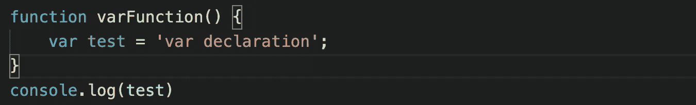
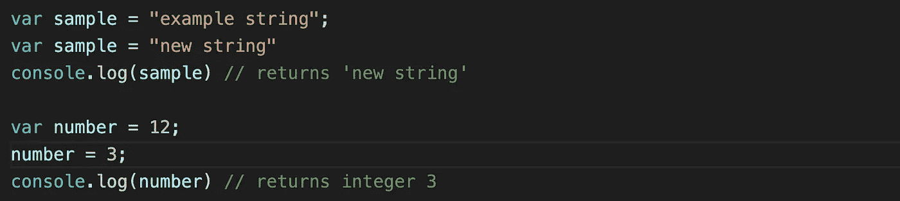
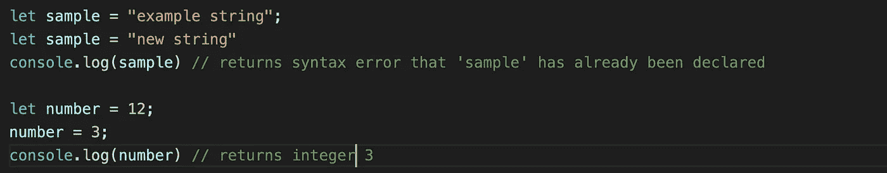
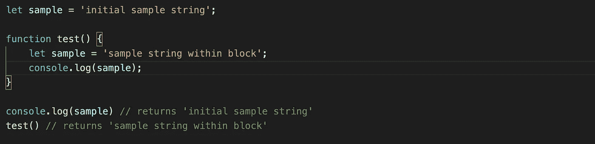
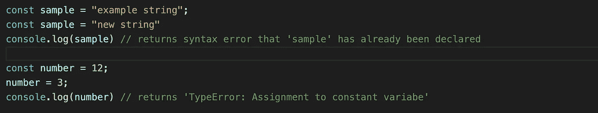
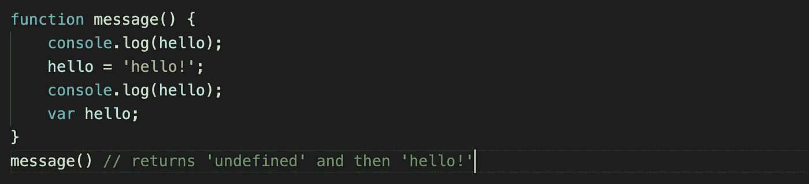
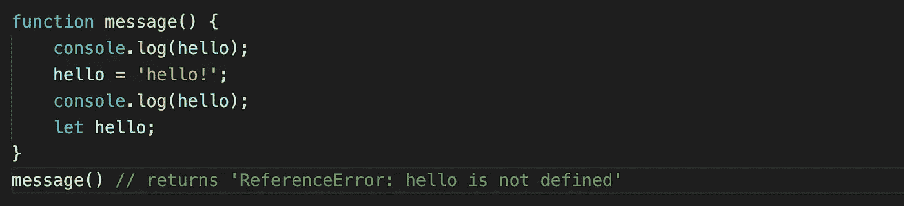

# Let/Var/Const +吊装

> 原文：<https://levelup.gitconnected.com/let-var-const-hoisting-91b9c90a6cbe>

到目前为止，在我申请和面试软件开发职位的过程中，一些最常见的 JS 问题包括区分`let`、`var`和`const`。同样，许多面试包括某种形式的“描述提升”。所以在这篇文章中，我将讨论`let` / `var` / `const`以及吊装，因为它们往往是齐头并进的。

# let，var，const 到底是什么？

`let`、`var`和`const`都是在 JavaScript 中声明变量的不同方式。`let`和`const`是 ES6 推出的，以前，`var`是唯一的选项。三者之间最大的区别之一是它们各自的作用域。范围——在代码中可以访问变量的地方——可以是局部的，也可以是全局的。这三个都可以全局声明(在函数外声明)，但是`var`也有函数作用域(在函数内声明)。

在此示例中，变量是在函数中定义的，在函数之外调用 console.log 中的 test 会返回一个错误，因为它在函数范围之外

另外，`var`变量可以被重新声明或者被认为是可变的。所以代码中前面的`var`声明可以被重新分配一个不同的值给同一个变量。

在上面的例子中，用 var 声明的变量被重新声明和更新

与`var`类似，`let`变量也是可变的，可以改变它的值，但只能在其作用域之外重新声明。你不能使用`let`在同一个作用域内重新声明一个变量，否则你会得到一个已经被声明的错误。如果声明在不同的作用域中，您可以使用相同的`let`变量，因为由于不同的作用域实例，它们将被视为不同的变量。

在第一段代码中，您可以看到尝试重新声明会返回一个错误，但是使用`let`更新值是可以接受的

不像`var`是函数作用域，`let`是*块*作用域。`let`变量不是包含在函数中，而是可以在一组花括号内访问。

变量名“sample”可以在两种不同的情况下使用，因为一个在全局范围内，另一个被限制在函数的块范围内

`const`与`let`非常相似，因为它是块范围的，但是`const`是不可变的。用`const`声明的变量不能更改或更新。一个声明的`const`对象可以改变它的*属性*——只是不能被重新声明。

在这里，您可以看到尝试重新声明或更新已声明变量的值都会导致错误

# 那么吊装呢？

在 JavaScript 中，所有的变量和函数声明在执行之前都被“提升”到它们的作用域的顶部，或者理论上被移动到顶部。不过初始化只针对`var`进行，这也是 var 和`let` / `const`的另一个区别。`var`被提升的声明用值`undefined`初始化，而`let` / `const`变量在被提升时不会被初始化，因此会返回一个`Reference Error`。

在上面使用`var`的例子中，第一个`console.log`返回 undefined，第二个返回`‘hello!’`的值。这是由于前面提到的`var` `hello`申报的提升。声明被提升到函数的顶部(由于`var`函数作用域的原因)，由于`console.log`还没有初始化，所以返回 undefined，变量被初始化，最后用第二个`console.log`返回。

下面是同样的例子，但是用`let`代替了`var`。不像`var`在被提升时被默认初始化为 undefined，`let`返回一个`Reference Error`来澄清所请求的变量还没有被定义。

函数提升和变量提升有点不同，因为它提升的是整个函数定义。通过像`var` / `let` / `const`这样的表达式声明的函数不会被提升。在这种情况下，与变量一样，声明本身被提升，但*不是*函数定义。试图调用一个函数表达式将导致一个`Type Error`，因为它试图利用一个没有定义的函数。

那么 TL:DR 是什么？

*   作用域:`var`声明是函数作用域，`let` / `const`是块作用域
*   重新申报:`var`可以更新和重新申报，`let`可以更新但不能重新申报，`const`不能更新或重新申报。
*   吊装:`var`吊装，初始化为`undefined`，`let` / `const`吊装，不初始化，返回一个`Reference Error`。

希望这个 JS 声明方法类型和提升之间的基础和差异的快速运行将帮助您理解这些常见的概念。值得注意的是，我收到的一些个人反馈都是让你的回答尽量简洁。尝试有一个简短的主题定义和一个简短的应用例子。祝你好运，编码快乐！