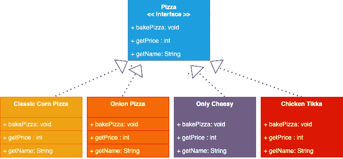
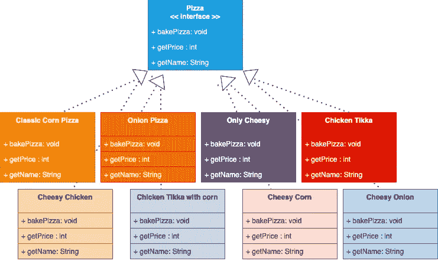
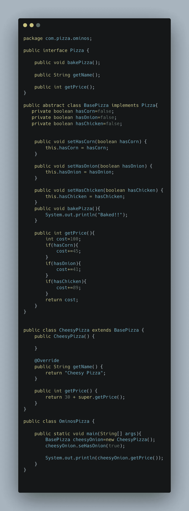
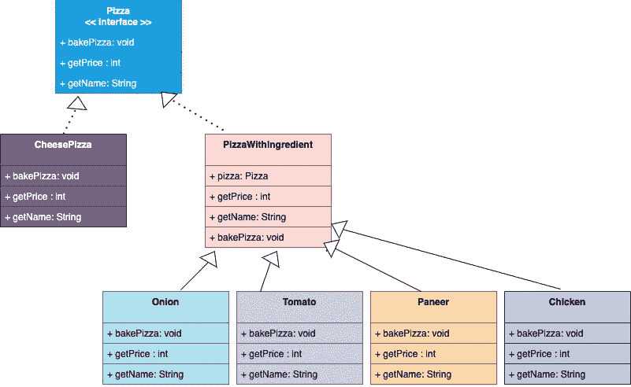
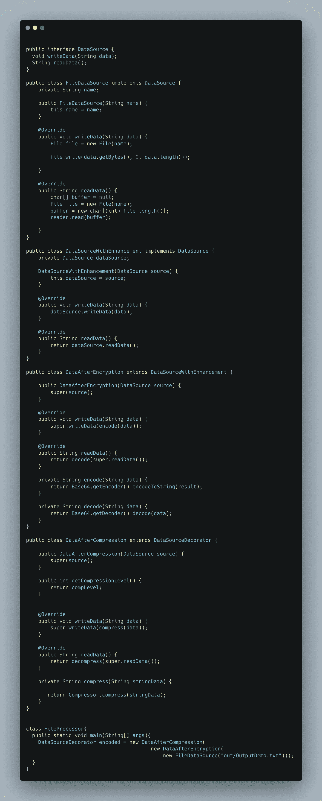
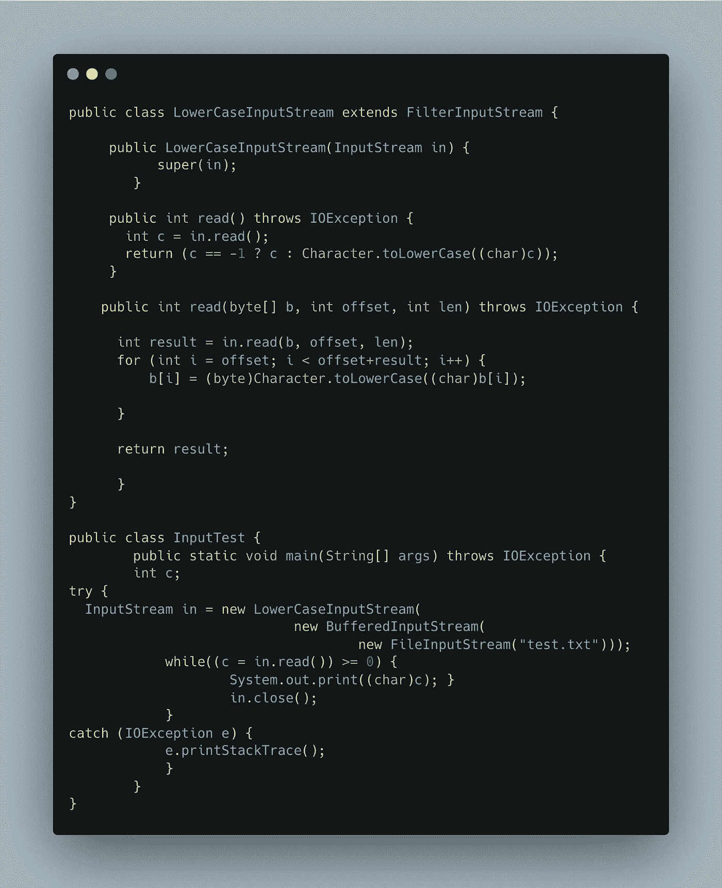

# 让我们给我们孤独的生活增添一些情趣吧

> 原文：<https://levelup.gitconnected.com/lets-add-some-spice-to-our-lonely-lives-d80e8d0ccd90>

我不确定目前我还需要什么，但是让它继续开着进行*修改*。

照片由[舒拉夫·谢赫](https://unsplash.com/@shouravsheikh01?utm_source=medium&utm_medium=referral)在 [Unsplash](https://unsplash.com?utm_source=medium&utm_medium=referral) 拍摄

这是软件设计模式系列的第三篇博客。让我们继续深入另一个强调 OOP 原则的美丽模式，我们已经在之前的博客中讨论过了。同样，博客的目的将是回答以下' ***Doublouuuu 的*** *':*

W ***它解决什么问题？***

W ***帽子的图案到底是什么？***

有哪些现实生活中的例子？

作为一名程序员，给人留下深刻印象的奇特定义是什么？

**我们来谈谈这个问题**

我听说过一句话‘人生来就有天赋’。有些人天生擅长自己的工作。但是如果一个人天生没有很多天赋(像我这样的人)会怎么样呢😩😩)，通常花更多时间去理解任何事情的人，反应迟钝的人。

> W 这样的人会怎么样？他们成功了吗？他们失败了吗？

我会说这要看情况。归根结底，如果你乐于做一个平庸的人，那很好。你不需要向任何人证明任何事。但是如果你想变得非凡，那就必须付出努力。

**没有天生的天赋和技能也没关系。在你的一生中，你可以一直努力工作，不断增加新的技能。**

***悟够了*？我们真的在这里讨论设计模式吗？😒😒**

我们确实在讨论设计模式，而且模式不仅限于代码。我们身边就有这样的例子，我们只需要观察和联系。

好的，我听到了！为了简单起见，让我们转移到一些简单的例子来理解这个问题。

你可能想知道为什么在顶部有一张比萨饼的照片😁。因为我们会谈论很多关于披萨的话题。

让我们假设我们正在开发一个在添加各种口味组合后告诉披萨价格的应用程序。我们将从非常简单的代码开始。我们还不会开始优化。

当你设计任何系统时，这是最糟糕的事情之一。*如果人们不喜欢我们的披萨怎么办😭😭😭？*

**当优化都不起作用时，它还有什么意义呢？**

所以，我们就接吻吧😍我说的是 [**保持简单愚蠢**](https://en.wikipedia.org/wiki/KISS_principle) 😂😂😂抓住你了。

因为在我们的第一篇博客中，我们已经学到了组合超越继承的力量，我们将利用这些知识设计一个简单的类图。

让我们看看到目前为止我们做了什么

*   我们已经创建了一个披萨接口，它有烘焙披萨的方法定义、每个披萨的价格函数，当然还有披萨的名称。简单吧？
*   我们开始供应 4 种不同的披萨。所以我们只是创建了我们的 Pizza 接口，并根据浇头和配料的类型实现了成本函数。

嗯，我认为这个设计目前符合我们的目的。没有必要过度复杂化，你猜怎么着？？

> 人们喜欢我们的披萨。人们疯狂订购🤩🤩

有一天，我们从一位顾客那里得到了有趣的反馈，他说他们点了我们唯一的奶酪洋葱披萨，并试着一起吃了两片，他们很喜欢。他们问我们是否有可能烤一种新的比萨饼，类似于“ ***奶酪洋葱*** ”。

与其他任何以顾客为中心的披萨制作公司不同，我们非常重视顾客的反馈。现在我们将考虑扩展我们现有的设计。让我们添加更多的类，但是这一次我们也将考虑其他的可能性。比如做玉米鸡丁或者 T21 芝士玉米丁或者芝士鸡丁怎么样？

让我们带着这些可能性来看看类图。

哇哦。！这是一个很大的类，仍然可以有很多很多的组合。这个设计肯定有一些缺陷。

> 添加新的类使得我们的代码库很难维护。奶酪、玉米或洋葱价格的微小变化将导致天知道多少阶层的变化😭😭

我们可以做的一个解决方案是创建一个基础抽象类 PizzaBase，在这个类中，我们可以维护用于成本计算的配料的布尔变量。让我们看看理解这种方法的代码

现在我们对每种成分都有单独的布尔变量，不需要那么多额外的类。我们只有一个具体的实现 CheesyPizza。在计算比萨饼的价格之前，我们可以只设置配料并获得更新的价格。乍一看，这种方法似乎还不错，但是当我们不得不引入更多的成分和尺寸时会发生什么呢？在我们当前的实现中，我们完全忽略了比萨饼的大小。它只是意味着代码中有很多 if-else。

## **我不太喜欢 IF-ELSE😩**

让我们看看这种方法有什么问题。我们讲过[开闭原理](https://en.wikipedia.org/wiki/Open%E2%80%93closed_principle#:~:text=In%20object%2Doriented%20programming%2C%20the,without%20modifying%20its%20source%20code.)对吧？如果某种成分的价格是动态的，会发生什么？通常情况就是这样。我们需要在基础比萨类中改变这一点，我们也可以预计在其他子类中也会有一些变化。这绝对不酷。

现在让我们想一些方法，这样添加任何新的成分都不会迫使我们在这么多地方改变代码。

现在我们将改变我们的方法，考虑分层。在比萨饼的例子中，我们创造了一层浇头和配料，最终产品仍然保持不变，那就是比萨饼。无论我们添加多少配料，它仍然是一个比萨饼。我们会想到*用不同的浇头和配料装饰*披萨。

如果我们有一些与我们的最终产品(比萨饼)类型相同的合同，但它的责任是装饰比萨饼，该怎么办？类似“PizzaWithIngredient”的东西。我对这里的命名非常挑剔，因为如果我将这份合同命名为 pizzaDecorator，那么这与我刚才所说的'***Pizza decorator 不是 Pizza。它与最终产品*** 不一样，对吗？因此，我们将它命名为 PizzaWithIngredient。

现在让我们看看类图和代码来理解这个场景。

因此，我们创建了一个新的“PizzaWithIngredient”类，它引用了比萨饼，并用一些配料来装饰它。所有的配料类都可以扩展这个 PizzaWithIngredient 类，并相应地计算成本。为了完全理解，让我们也对此进行编码。

现在我们可以看到没有 if-else 块。我们只是用不同的配料递归地装饰比萨饼。

**那么，我们解决了什么问题，具体是什么情况？**

> 场景是我们必须动态地给一些对象添加一些行为/装饰，而不是在编译时静态地定义。

受够了披萨！给我看一些我们可以使用这种模式的真实例子！

现在我们将看看如何利用这种模式来改变对象的行为，而不改变它们的代码。我们将举一个简单的例子，然后我们将看一个直接来自 Head First book 的非常酷的例子，它展示了这个模式如何在 Java 中用于输入流。

**例子 1:** 假设我们正在构建一个文件阅读器和压缩器。简单地说，我们的系统将读取文件，进行编码，然后压缩文件。同样，加密和压缩算法不会完全作为工作代码来实现，因为这里的目标不是实现。让我们看看代码来理解 this🥷

让我们明白我们做了什么:

*   我们将一个接口定义为 DataSource，它有两个方法“写数据”和“读数据”
*   有一个具体的实现是“FileDataSource ”,它处理的是以文件为切入点的数据。
*   然后我们有“DataSourceWithEnhancement”类，它也是与 DataSource 相同类型的**。**看看上面的披萨例子，为什么这是必要的。
*   然后我们有两个不同的装饰者。一个加密数据，另一个压缩数据。

**示例 2:** 正如承诺的那样，这是一个来自 Java 的很酷的示例。许多 Java 开发人员都会对此感兴趣🤩我们将看看非常著名的 [InputStream](https://docs.oracle.com/javase/8/docs/api/java/io/InputStream.html) 。InputStream 是一个抽象类，我们有不同的装饰器，如 [BufferedInputStrea](https://docs.oracle.com/javase/8/docs/api/java/io/BufferedInputStream.html) m、 [GzipInputStream](https://docs.oracle.com/javase/8/docs/api/java/util/zip/GZIPInputStream.html) 、 [FileInputStream](https://docs.oracle.com/javase/7/docs/api/java/io/FileInputStream.html) 等。它获取抽象类的一个实例并修饰它。

让我们看看 book🥷给出的代码

让我们理解我们在这里做什么:

*   FileInputStream 是 InputStream 的装饰类
*   LowerCaseInputStream 是以小写字符读取内容的具体装饰器。
*   在 LowerCaseInputStream 构造函数中，我们将引用传递给输入流。

> 那么这种模式的官方定义是什么？

根据 Head First 的书， ***装饰者模式*** *动态地给一个对象附加额外的责任。Decorators 为扩展功能提供了子类化的灵活替代方案。*

就是这样。我们已经成功地介绍了装饰模式。再次请通过参考更好的理解和更多的例子，请不要恨我，如果你发现任何错误或 incomplete🥺。我在努力做得更好，❤️

参考资料:

*   https://spring framework . guru/gang-of-four-design-patterns/decorator-pattern/
*   https://www.baeldung.com/java-decorator-pattern
*   [https://refactoring . guru/design-patterns/decorator/Java/example](https://refactoring.guru/design-patterns/decorator/java/example)
*   [https://howtodoinjava . com/design-patterns/structural/decorator-design-pattern/](https://howtodoinjava.com/design-patterns/structural/decorator-design-pattern/)
*   [https://www . journal dev . com/1540/decorator-design-pattern-in-Java-example](https://www.journaldev.com/1540/decorator-design-pattern-in-java-example)