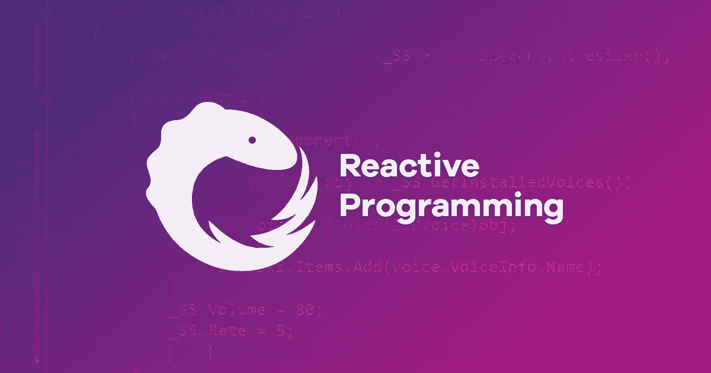
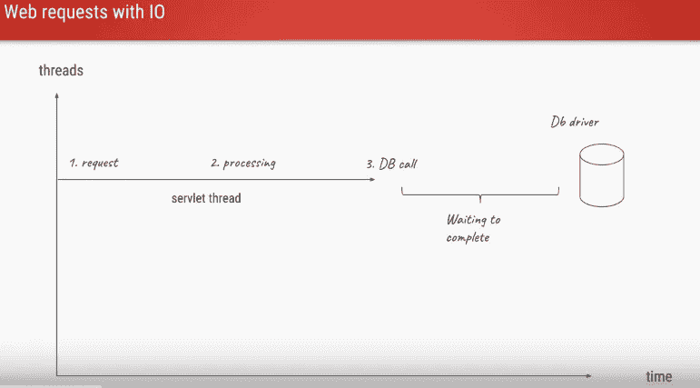
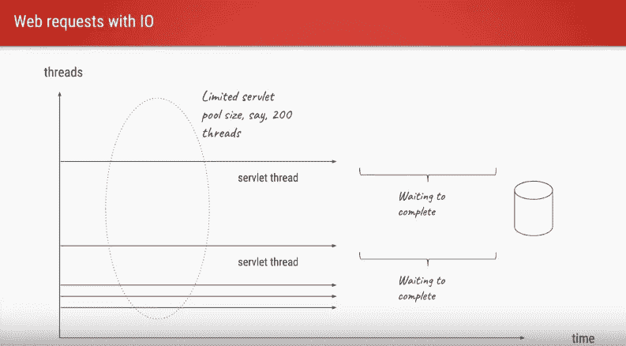
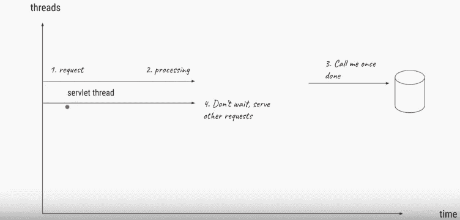

# 让我们更积极地应对

> 原文：<https://levelup.gitconnected.com/lets-be-more-reactive-7b1a1554e6da>

"R 活动编程？"—这是新事物吗？编程的下一件大事？

如果你现在也对这个术语感到好奇，并在互联网上搜索，你可能会看到这样的定义:

**“反应式编程是一种异步编程范式，关注数据流和变化的传播。”**

互联网上有很多不好的解释和定义。[维基百科](https://en.wikipedia.org/wiki/Reactive_programming)和往常一样过于笼统和理论化。 [Stackoverflow](http://stackoverflow.com/questions/1028250/what-is-functional-reactive-programming) 的规范回答显然不适合我这样的新人。这一切让我更加好奇，最终迫使我尝试以更简单的方式展开这个话题。

反应式编程并不是什么新东西。它已经存在很长时间了，但最近由于多种原因，它开始吸引开发人员，许多人正试图将他们的思想从典型的编程思维模式转变为反应式编程范式(如果不参考正确的内容，这可能不会那么容易)。

## 那么什么是反应式编程呢？

这里有一个真实的例子。比如说，今天是星期五，约翰想和他的朋友鲍勃一起度过这个晚上，吃披萨，看一集《黑客帝国》。让我们概括一下他的选择:

约翰完成了他的工作。然后去点披萨，一直等到做好。然后他抱起他的朋友。最后(带着鲍勃和披萨)回到家，去看电影。这将是 ***同步*** 的方法，而且耗时太长。到那个时候，约翰会想取消这件事的。

**方法 2:** 约翰在网上订了比萨饼，打电话给鲍勃，邀请他来。他回到家，叫了外卖披萨，开始看电影(吃披萨),没有等鲍勃出现。这就是使用 ***异步*** 方法可能发生的情况。

**方法 3:** 约翰点了披萨，打电话给鲍勃，邀请他来家里，然后让他的披萨外卖到了。但是这一次，他等到鲍勃来了，然后才打开电影。这就是 ***反应式方法*** 的内容。你一直等到所有的异步动作都完成了(披萨送到了，Bob 也到了)，然后继续下一步动作(打开 GOT 剧集)。

我们有这个现实生活中的例子，但我不清楚同样的事情在技术世界中是如何工作的。

> 让我们理解上述第 1 点，即*同步方法*

例如，假设我们有一个部署在 apache tomcat 服务器上的 web 应用程序，它为用户提供一些内容。因此，对于每个用户请求，都会创建一个新的 servlet 线程，它会进行一些处理，然后调用数据库来查询一些内容。当数据库执行查询时，线程处于等待状态，可能有几毫秒。

现在，如果我们的 web 应用程序开始获得更多数量的并发请求会怎么样。通常，servlet 线程池大小为 200。因此，如果有 200 个并发请求，那么我们将创建 200 个线程，每个请求一个线程，正如我们所见( ***每个请求一个线程模型*** )，所有这 200 个线程将等待数据库操作完成。如果我们同时收到更多的请求，每个请求都需要等到前面的线程完成它们的任务。这是阻塞 I/O —线程将进入阻塞状态。线程池的大小可以增加到适合任何数量(有硬件限制)，但这样也会带来上下文切换、缓存刷新等开销。

同步处理请求的问题是，它会导致线程(执行繁重的任务)在响应发出之前运行很长时间。如果这种情况大规模发生，Servlet 容器最终会耗尽线程。长时间运行的线程会导致线程饥饿。这是我们达到可伸缩性极限的地方。

可伸缩性限制包括耗尽内存或耗尽容器线程池。要创建可伸缩的 web 应用程序，您必须确保没有与请求相关联的线程处于空闲状态，这样容器就可以使用它们来处理新的请求。

线程池的大小可以增加到适合任何数量(有硬件限制)，但这样也会带来上下文切换、缓存刷新等开销。

有没有更好的方法可以在不增加容器线程池大小的情况下处理更多的并发用户？是的，当然，我们可以使用异步方法来实现。

> 让我们理解第二点，即异步方法

我们知道 servlet 容器是如何随着时间的推移而发展的，现在 Servlet 3.0 支持异步的、非阻塞的范例。回到同一个 web 应用程序多并发用户请求-响应场景，假设应用程序服务器接收到第一个新的用户请求，将会产生一个新的 servlet 线程来服务这个请求。然后，该线程将请求传递给另一个后台线程，后者将负责处理请求并将响应发送回客户端。初始线程一旦将请求传递给后台线程，就会返回到线程池，这样它就可以处理另一个请求了。

一旦数据库执行了查询并准备好响应，它将进行回调，同一线程或其他空闲线程将被分配来将该响应发送回最终用户。我们可以对所有线程使用类似的异步模型，避免在同步方法中遇到的问题。不再有线程切换，更高效地使用 CPU，更多并发请求。

> 异步 HTTP 的主要用例是客户端向服务器轮询延迟响应的情况。
> 通常的例子是一个 AJAX 聊天客户端，你想从客户端和服务器端推/拉。
> 这些场景让客户端长时间阻塞在服务器的套接字上，等待新消息。

> 让我们理解最后一点#3，即反应式方法

反应式编程是异步编程的一种形式。
异步编程只是意味着你正在编写的代码不会立即执行，就像命令式编程一样，而是在“未来的某个时刻”。

反应式编程的特点是异步代码的执行由要执行的数据的到达触发。不管代码是否准备好处理数据，数据都会到达。它被“推入”应用程序。

> 它是“推式”的。与之相反的是“拉式”。基于拉的代码不对到达的数据作出反应，相反，它准备好处理数据，只有在那时它才会请求数据。

在经历了同步、异步编程、阻塞和非阻塞 I/O 等一些非常重要的重载词汇之后，我希望我们都已经对“反应式”的含义有了基本的概念理解。

> 当使用反应式编程时，数据流将成为应用程序的核心。事件、消息、呼叫甚至故障都将通过数据流来传递。使用反应式编程，您可以观察这些流，并在发出值时做出反应。

因此，在您的代码中，您将创建任何内容和来自任何内容的数据流:点击事件、HTTP 请求、摄取的消息、可用性通知、变量的更改、缓存事件、来自传感器的测量——实际上是任何可能更改或发生的内容。

在理解了什么是反应式编程之后，最重要的问题出现在脑海中，什么时候使用它，什么时候不使用它。让我试着回答这个问题。

**何时使用反应式编程方法？**

当涉及到特定类型的*高负载* 或 ***多用户应用*** *:* 时，被动提供了一个优雅的解决方案

*   *社交网络、聊天*
*   *游戏*
*   *音频和视频应用*

以及任何应用程序类型的下列组件:

*   *服务于高度交互式 UI 元素的服务器代码*
*   *代理服务器、负载平衡器*
*   *人工智能，机器学习*
*   *实时数据流*

**何时不使用反应式编程方法？**

简而言之，不要在没有必要的情况下尝试应用 RP，例如，没有“实时”数据、高负载或大量用户同时更改数据的情况。

# **用 Spring WebFlux 构建反应式 Rest API**

Spring 5 通过引入一个名为 Spring WebFlux 的全新反应式框架，拥抱了反应式编程范式。

Spring WebFlux 是一个自下而上的异步框架。它可以在使用 Servlet 3.1 非阻塞 IO API 的 Servlet 容器上运行，也可以在 netty 或 undertow 等其他异步运行时环境上运行。

Spring WebFlux 使用一个名为 Reactor 的库来提供反应式支持。Reactor 是[反应流](https://github.com/reactive-streams/reactive-streams-jvm#reactive-streams)规范的一个实现。

反应器提供两种主要类型，称为`Flux`和`Mono`。这两种类型都实现了由反应流提供的`Publisher`接口。`Flux`用来表示一个 0 流..n 个元素和`Mono`用来表示一个 0 的流..1 个元素。

Spring WebFlux 支持两种类型的编程模型:

1.  传统的基于注释的模型，带有`@Controller`、`@RequestMapping`，以及您在 Spring MVC 中一直使用的其他注释。
2.  一个全新的基于 Java 8 lambdas 的函数式模型，用于路由和处理请求。

我已经使用 spring boot 和 spring webflux 创建了一个简单的演示项目。你可以在 [**我的 github 库**](https://github.com/jd268/reactor) 中找到完整的代码。请随意叉项目和工作。

这是一个小型的社交媒体应用程序。该应用程序将只有一个名为`Post`的域模型。每个帖子都有一个`text`和一个`createdAt`字段。它使用 mongodb 和反应式 MongoDB 驱动程序作为我们的数据存储。它有 REST APIs 来创建、检索、更新和删除 Tweet。所有的 REST APIs 都将是异步的，并将返回一个发布者。

记住:***权力越大，责任越大***😎

在做所有这些的时候，记住事情不会变得混乱，因为当你试图使用任何现代库如 Java Rx、Java Spring Reactor、Spring WebFlux、BaconJS 来实现反应式编程时，事情会变得有点复杂。反应式范式不同于命令式编程，反应式库提供了如此多的操作符和函数，以至于在编写代码时，你可能会觉得自己像个忍者，但很难理解和维护。所以请尽量保持事情简单。

## 包裹

“反应式编程”不再是一个时髦的词，但仍然没有明确的定义。我希望下一次你遇到这个术语时，它不会让你困惑，因为现在你知道它只是另一种编码风格，集中于有效管理异步数据流的变化。不要反应过度也很重要。在没有实际需求的情况下轻率地使用反应式方法只会用不必要的复杂性毁掉应用程序。