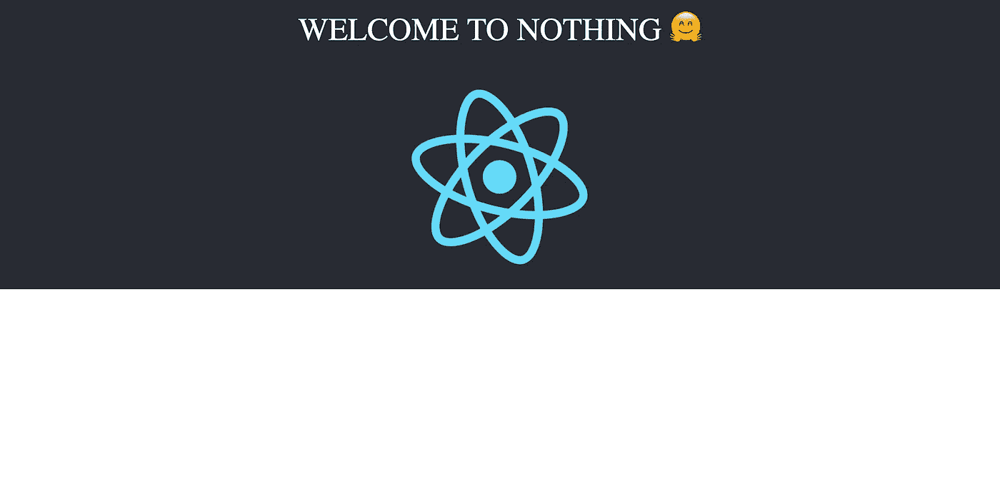

# 让我们用 React 和 Webpack 构建一个样板文件！

> 原文：<https://levelup.gitconnected.com/lets-build-a-boilerplate-with-react-and-webpack-eb2fbdb44283>


在之前的[文章](https://medium.freecodecamp.org/how-to-build-modern-applications-with-webpack-c81ccf6dd54f)中，我们可以浏览 Webpack 的简史，也可以构建一个简单的待办应用程序，并在没有任何定制 Webpack 配置的情况下将其与 Webpack 捆绑在一起。在本文中，我们将构建一个 React 样板文件。

选择样板文件的原因是，我们可以编写自己的自定义 Webpack 配置，并在此过程中了解在应用程序中使用 Webpack 时所有最重要的方面。我们不仅要构建一个基本的配置，而且在本文的最后我们还会有一个生产就绪的 Webpack 配置，它可以作为 React 应用程序的起点。



这是最终样板文件的样子(有创意吧？)

首先，我们需要理解一个典型的 Webpack 配置的结构，并很好地理解一些主要的构建模块。下面是一个典型的 Webpack 配置模式:

```
module.exports = {
  entry: "",
  output: {},
  devServer: {},
  devtool: debug ? "cheap-module-eval-source-map" : false,
  resolve: {},
  module: {
    rules: []
  },
  plugins: [],
  optimization: {}
};
```

每个 Webpack 配置必须要么是一个对象，要么是一个返回对象的函数——在我们的例子中，它是一个对象。在该对象中，我们有几个在配置中使用的选项。让我们逐一了解它们的功能:

*   `entry` —该选项接受文件的名称作为其属性，webpack 使用该文件开始捆绑(它将位于依赖关系图的顶部)。这是整个项目的入口点，我们可以有多个入口点。这个键接受一个字符串、对象或数组，如果在配置中没有指定，它默认为“src/index.js”。
*   `output` —该选项是一个包含多个选项的对象，这些选项决定 webpack 如何发出结果。基本上，这些选项告诉 webpack 捆绑的文件可以保存在哪里，以何种格式命名捆绑包。查看 webpack [文档](https://webpack.js.org/configuration/output)可以获得更详细的解释。
*   `devServer` —这主要用于开发，传递给该对象的选项用于影响/修改 [webpack-dev-server](https://github.com/webpack/webpack-dev-server) 的行为。
*   `devtool` —这个选项用于决定我们是否需要源代码映射，如果需要，那么我们需要什么样的源代码映射(如果你不太了解源代码映射，那么看看这篇很棒的[文章](https://blog.teamtreehouse.com/introduction-source-maps))。
*   这是我在 webpack 中最喜欢的选项之一。如果你在一个 Vue 项目中工作过，遇到过`import Component from @/components/Component`，就是这个属性处理它。它控制如何在你的代码库中解析文件路径和扩展名，例如，当我们设置自动解析`.js`文件时，我们可以这样做:

```
import something from 'somefile'//instead ofimport something from 'somefile.js'
```

我们将在样板文件中使用它。

*   `module` —该选项用于配置如何在项目中处理不同类型的模块，这是我们项目中的一个关键配置，因为它用于处理、加载我们项目中的任何文件类型，从 JS 到图像到我们的样式。要查看该属性的更详细解释，请阅读 webpack [文档](https://webpack.js.org/configuration/module)。
*   `plugins`——据 Webpack 维护者[肖恩·拉金](https://twitter.com/TheLarkInn)，“一切都是 webpack 中的插件”。该选项用于定制 webpack 构建过程并添加我们自己的外部插件。例如，在构建过程中，我们可以告诉 webpack 使用外部插件将所有样式表提取到单独的文件中(我们很快就会这样做)。
*   `optimization`—默认情况下，从 webpack 4 开始，webpack 会根据所选择的模式(开发或生产)帮助您运行优化，但是您可以手动覆盖它们，我们将在本例中这样做。

## 入门指南

现在我们已经了解了典型 webpack 配置的结构，让我们开始构建样板文件。要跟进，您需要:

*   NodeJS(版本≥ 8)
*   文本编辑器

如果你只是想看代码，那么访问[库](https://github.com/samie820/bare-react-app)。

让我们从创建一个空的`npm`项目开始，虽然这不是必需的(我们可以在一个目录中手动创建一个`package.json`文件)，但我们遵循这个约定似乎是正确的，因为它会自动为我们创建`package.json`文件并预先填充它。

要初始化`npm`项目，创建一个名为`bare-react-app`的文件夹，导航到该文件夹，然后运行`npm init -y`命令:

```
mkdir bare-react-appcd bare-react-appnpm init -y # this command automatically accepts 'yes' for all questions that will be asked during initialization
```

完成后，我们应该有一个带有类似于下面的`package.json`文件的项目:

```
{
  "name": "bare-react-app",
  "version": "1.0.0",
  "description": "",
  "main": "index.js",
  "scripts": {
    "test": "echo \"Error: no test specified\" && exit 1"
  },
  "keywords": [],
  "author": "",
  "license": "ISC"
}
```

我们将添加许多`devDependencies`,因此，让我们安装第一组依赖项，然后我们将了解每个依赖项的作用:

在`bare-react-app`文件夹中输入以下命令:

```
npm install --save-dev @babel/cli @babel/core @babel/plugin-proposal-class-properties @babel/plugin-proposal-decorators @babel/plugin-proposal-object-rest-spread @babel/plugin-syntax-dynamic-import @babel/preset-env @babel/preset-react babel-loader
```

是的，这是一大堆依赖项，但是相信我，它们都在实现一个共同的目标:

*   `@babel/cli` —这是 [babel](https://babeljs.io/docs/en/babel-cli) 命令行界面，允许我们从命令行编译文件(如果你不知道 babel 的用途，请查看他们的[站点](https://babeljs.io/docs/en/)
*   `@babel/core` —这是核心的巴别塔编译器
*   `@babel/plugin-proposal-class-properties` —这是一个巴别塔插件，允许我们使用 Javascript 中尚不存在的特性(但已被提议)，它允许我们在 JS 代码中使用静态类属性和属性初始化器语法，例如:

```
class Animal extends React.Component{
    // static class properties
    static name = "new name";// property initializer syntax
    state = {
        firstName: "",
        lastName: ""
    }
}
```

*   `@babel/plugin-proposal-decorators` —允许我们在代码中使用`@Decorator`语法。
*   这个插件允许我们使用 rest 和 spread 属性，并处理 ES5 的编译。
*   `@babel/plugin-syntax-dynamic-import` —允许解析`import()`语句
*   `@babel/preset-env` —这是一个智能预设，允许您使用最新的 JavaScript，而无需微观管理目标环境所需的语法转换。这个特殊的预置确实是可扩展的，但是我们将集中使用默认的。
*   `@babel/preset-react` —基本上，它允许我们编写 React，它处理 JSX 的编译。
*   `babel-loader` —这将在我们的 webpack 配置中使用，以处理 JS 和 JSX 文件。

对于我们的下一批`devDependencies`，我们将安装将在我们的 webpack 配置中使用的包，安装以下内容:

```
npm install --save-dev circular-dependency-plugin compression-webpack-plugin copy-webpack-plugin css-loader file-loader html-webpack-plugin mini-css-extract-plugin node-sass sass-loader style-loader terser-webpack-plugin url-loader webpack webpack-bundle-analyzer webpack-cli webpack-dev-server
```

需要注意的最重要的依赖项是 webpack、webpack-cli 和 webpack-dev-server。我不会在这里解释这个，因为我会解释在配置过程中每个人做什么。

现在让我们添加仅有的两个生产依赖项，即 React 和 React Dom。输入以下命令:

```
npm install react react-dom
```

现在，让我们添加一些样板文件所需的文件。

在我们项目的根目录下(package.json 文件所在的位置)创建一个新文件夹，并将其命名为`src`。然后创建一个`index.html`文件，这是我们唯一的 HTML 文件。将下面的代码复制到`index.html`文件中:

```
<!DOCTYPE html>
<html lang="en">
 <head>
  <meta charset="utf-8">
  <meta http-equiv="X-UA-Compatible" content="IE=edge">
  <meta name="viewport" content="width=device-width, initial-scale=1">
  <meta name="description" content="A simple React boilerplate">
  <title>Bare React App</title>
 </head><body>
   <div id="app"></div>
  <noscript>
            <p>You need Javascript enabled for this application to work</p>
  </noscript>
 </body>
</html>
```

然后，创建一个`index.js`文件，它将成为 webpack 在我们的应用程序中的入口点。将以下代码粘贴到其中:

```
import React from "react";
import ReactDOM from "react-dom";
import App from "./App.js";
ReactDOM.render(<App />, document.getElementById("app"));
```

现在我们有了，创建一个`App.js`文件，这是我们的 React 组件所在的位置，将下面的代码粘贴到其中:

```
import React, { Component } from "react";
import logo from "./logo.svg";
import "./App.css";class App extends Component {render() {
    return (
      <div className="App">
        <header className="App-header">WELCOME TO NOTHING 🤗</header>
        
      </div>
    );
  }
}export default App;
```

接下来我们将创建 CSS 文件，但是对于`logo.svg`，你可以从这个项目的 [repo](https://github.com/samie820/bare-react-app) 中获得。

如果您不需要`logo.svg`，您可以简单地从导入中移除它，然后移除图像标签。如果你这样做了，那么你的`App.js`文件应该是这样的:

```
import React, { Component } from "react";
import "./App.css";
class App extends Component {
render() {
    return (
      <div className="App">
        <header className="App-header">WELCOME TO NOTHING 🤗</header>
      </div>
    );
  }
}
export default App;
```

接下来，我们在`src`文件夹中创建一个名为`App.css`的 CSS 文件，并将以下样式粘贴到其中:

```
*{
  padding: 0;
  margin: 0;
}
.App {
  background-color: #282c34;
  text-align: center;
}.App-logo {
  animation: App-logo-spin infinite 20s linear;
  height: 40vmin;
  pointer-events: none;
}.App-header {
  height: 70px;
  display: flex;
  flex-direction: column;
  align-items: center;
  justify-content: center;
  font-size: calc(30px + 2vmin);
  color: white;
  padding: 20px;
  cursor: pointer;
}[@keyframes](http://twitter.com/keyframes) App-logo-spin {
  from {
    transform: rotate(0deg);
  }
  to {
    transform: rotate(360deg);
  }
}
```

为了能够运行这个应用程序，我们需要运行一个 webpack 命令来捆绑所有这些文件，然后将它们提供给浏览器。不过，有一些事情需要注意，当我们在开发中使用该应用程序时，我们将使用`webpack-dev-server`，根据 webpack 文档:

> “开发服务器使用 Webpack 的监视模式。它还防止 webpack 将结果文件发送到磁盘。相反，它从内存中保存并提供结果文件。”—这意味着您将不会在 bundle.js 中看到 webpack-dev-server 构建，要查看和运行该构建，您仍必须运行 webpack 命令。

当使用`webpack-dev-server`时，我们得到了热重载的好处(因为它基本上在监视模式下使用 webpack，以便监听我们文件中的变化)。

为了在我们的应用程序中使用`webpack-dev-server`，我们将在`package.json`文件中添加一个脚本:

```
..."scripts": {
    "test": "echo \"Error: no test specified\" && exit 1",
    "dev": "webpack-dev-server --mode development --hot"
  },...
```

我在 webpack 上的前一篇[文章](https://medium.freecodecamp.org/how-to-build-modern-applications-with-webpack-c81ccf6dd54f)中解释了`mode`是什么，但是这个脚本所做的是在开发模式下启动`webpack-dev-server`并启用热重载。要运行该命令，请在控制台中键入:

```
npm run dev
```

您应该会得到一个错误，这主要是因为 webpack 不理解我们正在使用的`jsx`语法，这就是我们定制 webpack 配置的原因。

在项目的根目录下，即`package.json`文件所在的位置，创建一个名为`webpack.config.js`的新文件。当运行任何 webpack 命令时，在运行其默认配置之前，它会检查是否存在具有该名称的文件。现在在文件中，我们需要导入一些之前安装的包，因为我们现在需要它们:

```
const debug = process.env.NODE_ENV !== "production";
const webpack = require("webpack");
const path = require("path");
const MiniCssExtractPlugin = require("mini-css-extract-plugin");
const { BundleAnalyzerPlugin } = require("webpack-bundle-analyzer");
const HtmlWebpackPlugin = require("html-webpack-plugin");
const CircularDependencyPlugin = require("circular-dependency-plugin");
const CompressionPlugin = require("compression-webpack-plugin");
const TerserPlugin = require("terser-webpack-plugin");
```

您可能已经注意到，我们现在在这个文件中使用`require`语句进行导入，这是因为 webpack 使用 Node (NodeJS)进行绑定，而 nodeJS 的早期版本不支持 es 模块(尽管 Node v10 和 v12 在 experimental-modules 标志下支持它，但它是用于`.mjs`)，这就是为什么我们必须使用`require`，它是用于在 nodeJS 中导入文件的。

接下来，我们导出一个包含所有配置的空对象，还记得我前面提到过配置是一个对象或者是一个返回对象的函数:

```
...
module.exports = {}
```

将添加的第一个配置是我们的入口点，它告诉 webpack 应该从哪里开始执行，它可以采用几种格式，但我通常坚持使用字符串和对象。在我们上面创建的对象中，添加以下代码:

```
...
  entry: "./src/index.js",
...
```

这告诉 webpack 我们的应用程序的入口点从这里开始(webpack 从这里开始构建它的依赖图)。

接下来的配置是我们的“输出”，顾名思义，它告诉 webpack 如何输出捆绑的 JS。它是一个有几个选项的对象，但我们将集中在几个选项上，将下面的代码添加到我们的配置文件中的对象:

```
output: {
    publicPath: "/",
    path: path.join(__dirname, "build"),
    filename: "js/[name].bundle.min.js",
    chunkFilename: "js/[name].bundle.js"
 },
```

我们告诉 webpack，它应该服务于浏览器中来自`/`路径的所有文件，以及任何生成的包的命名约定。

我们的下一个配置是`devServer`,它用于配置`webpack-dev-server`,描述项目的基本目录在哪里，以及应用程序应该从哪个端口提供服务。添加以下代码:

```
...
devServer: {
    inline: true,
    contentBase: "./src",
    port: 3000,
    historyApiFallback: true
 },
...
```

下一个选项配置应用程序中是否应该使用源地图。在我们的例子中，我们将只在开发中使用它(您可以更改它，查看[文档](https://webpack.js.org/configuration/devtool)以了解如何更改)，复制以下代码:

```
...
  devtool: debug ? "cheap-module-eval-source-map" : false,
...
```

现在我们将告诉 webpack 如何在应用程序中解析我们的`js and jsx`导入，复制下面的代码并将其添加到我们的配置对象中:

```
...
  resolve: {
    extensions: [".js", ".jsx"]
  },
...
```

我们的下一个配置是我们的`modules`，它告诉 webpack 如何加载各种类型的文件。我们的模块选项有一个`rules`选项，它接受一个数组，我们这个数组有第一个规则来处理`js/jsx`文件的加载:

```
...
module: {
  rules: [      
      {
        test: /\.(js|jsx)$/,
        exclude: /(node_modules)/,
        loader: "babel-loader",
        query: {
          presets: ["[@babel/env](http://twitter.com/babel/env)", "[@babel/preset-react](http://twitter.com/babel/preset-react)"],
          plugins: [
            "[@babel/plugin-proposal-class-pro](http://twitter.com/babel/plugin-proposal-class-pro)perties",
            "[@babel/plugin-syntax-dynamic-imp](http://twitter.com/babel/plugin-syntax-dynamic-imp)ort",
            "[@babel/plugin-proposal-object-re](http://twitter.com/babel/plugin-proposal-object-re)st-spread",
            ["[@babel/plugin-proposal-decorator](http://twitter.com/babel/plugin-proposal-decorator)s", { legacy: true }]
          ]
        }
      },
  ]
}
...
```

我们的下一个规则是加载萨斯/SCSS/CSS 文件:

```
...
      {
        test: /\.(sa|sc|c)ss$/,
        use: debug
          ? [
              {
                loader: "style-loader"
              },
              {
                loader: "css-loader"
              },
              {
                loader: "sass-loader"
              }
            ]
          : [
              MiniCssExtractPlugin.loader,
              "css-loader",
              "sass-loader"
            ]
      },
...
```

这里我们告诉 webpack 根据环境使用不同的加载器(如果我们是在开发或生产中)。

下一个规则是加载字体和 SVG:

```
...
      {
        test: /\.(eot|ttf|woff|woff2|otf|svg)$/,
        use: [
          {
            loader: "url-loader",
            options: {
              limit: 100000,
              name: "./assets/fonts/[name].[ext]"
              // publicPath: '../'
            }
          }
        ]
      },
...
```

最后一个规则是加载图像资源(PNG、JPG、JPEG、GIF):

```
...
      {
        test: /\.(gif|png|jpe?g)$/i,
        use: [
          {
            loader: "file-loader",
            options: {
              outputPath: "assets/images/"
            }
          }
        ]
      }
...
```

我们的下一个配置是我们的`plugins`，对于此选项，我们将根据环境(开发或生产)传递不同的阵列:

```
...
  plugins: debug
    ? [
        new CircularDependencyPlugin({
          // exclude detection of files based on a RegExp
          exclude: /a\.js|node_modules/,
          // add errors to webpack instead of warnings
          failOnError: true,
          // set the current working directory for displaying module paths
          cwd: process.cwd()
        }),
        new HtmlWebpackPlugin({
          template: "./src/index.html"
        })
      ]
    : [
        // define NODE_ENV to remove unnecessary code
        new webpack.DefinePlugin({
          "process.env.NODE_ENV": JSON.stringify("production")
        }),
        new webpack.optimize.OccurrenceOrderPlugin(),
        new webpack.optimize.AggressiveMergingPlugin(), // Merge chunks
        // extract imported css into own file
        new MiniCssExtractPlugin({
          // Options similar to the same options in webpackOptions.output
          // both options are optional
          filename: "[name].css",
          chunkFilename: "[id].css"
        }),
        new webpack.LoaderOptionsPlugin({
          minimize: true
        }),
        new webpack.IgnorePlugin(/^\.\/locale$/, /moment$/),
        new HtmlWebpackPlugin({
          template: "./src/index.html"
          // minify: {
          //   collapseWhitespace: true,
          //   removeAttributeQuotes: false
          // }
        }),
        new CompressionPlugin({
          test: /\.(html|css|js|gif|svg|ico|woff|ttf|eot)$/,
          exclude: /(node_modules)/
        }),
        new BundleAnalyzerPlugin()
      ],
...
```

对于我们的最终配置`optimization`，我们正在传递一个处理 JS 最小化的新插件。所以传入下面的代码:

```
...
    minimizer: [
      new TerserPlugin({
        cache: true,
        parallel: true,
        sourceMap: true, // Must be set to true if using source-maps in production
        terserOptions: {
          ie8: true,
          safari10: true,
          sourceMap: true
        }
      })
    ]
...
```

如果您能够继续操作，您的配置文件应该如下所示:

```
const debug = process.env.NODE_ENV !== "production";
const webpack = require("webpack");
const path = require("path");
const MiniCssExtractPlugin = require("mini-css-extract-plugin");
const { BundleAnalyzerPlugin } = require("webpack-bundle-analyzer");
const HtmlWebpackPlugin = require("html-webpack-plugin");
const CircularDependencyPlugin = require("circular-dependency-plugin");
const CompressionPlugin = require("compression-webpack-plugin");
const TerserPlugin = require("terser-webpack-plugin");module.exports = {
  entry: "./src/index.js",
  output: {
    publicPath: "/",
    path: path.join(__dirname, "build"),
    filename: "js/[name].bundle.min.js",
    chunkFilename: "js/[name].bundle.js"
  },
  devServer: {
    inline: true,
    contentBase: "./src",
    port: 3000,
    historyApiFallback: true
  },
  devtool: debug ? "cheap-module-eval-source-map" : false,
  resolve: {
    extensions: [".js", ".jsx"]
  },
  module: {
    rules: [
      {
        test: /\.(js|jsx)$/,
        exclude: /(node_modules)/,
        loader: "babel-loader",
        query: {
          presets: ["[@babel/env](http://twitter.com/babel/env)", "[@babel/preset-react](http://twitter.com/babel/preset-react)"],
          plugins: [
            "[@babel/plugin-proposal-class-pro](http://twitter.com/babel/plugin-proposal-class-pro)perties",
            "[@babel/plugin-syntax-dynamic-imp](http://twitter.com/babel/plugin-syntax-dynamic-imp)ort",
            "[@babel/plugin-proposal-object-re](http://twitter.com/babel/plugin-proposal-object-re)st-spread",
            ["[@babel/plugin-proposal-decorator](http://twitter.com/babel/plugin-proposal-decorator)s", { legacy: true }]
          ]
        }
      },
      {
        test: /\.(sa|sc|c)ss$/,
        use: debug
          ? [
              {
                loader: "style-loader"
              },
              {
                loader: "css-loader"
              },
              {
                loader: "sass-loader"
              }
            ]
          : [
              MiniCssExtractPlugin.loader,
              "css-loader",
              "sass-loader"
            ]
      },
      {
        test: /\.(eot|ttf|woff|woff2|otf|svg)$/,
        use: [
          {
            loader: "url-loader",
            options: {
              limit: 100000,
              name: "./assets/fonts/[name].[ext]"
              // publicPath: '../'
            }
          }
        ]
      },
      {
        test: /\.(gif|png|jpe?g)$/i,
        use: [
          {
            loader: "file-loader",
            options: {
              outputPath: "assets/images/"
            }
          }
        ]
      }
    ]
  },
  plugins: debug
    ? [
        new CircularDependencyPlugin({
          // exclude detection of files based on a RegExp
          exclude: /a\.js|node_modules/,
          // add errors to webpack instead of warnings
          failOnError: true,
          // set the current working directory for displaying module paths
          cwd: process.cwd()
        }),
        new HtmlWebpackPlugin({
          template: "./src/index.html"
        })
      ]
    : [
        // define NODE_ENV to remove unnecessary code
        new webpack.DefinePlugin({
          "process.env.NODE_ENV": JSON.stringify("production")
        }),
        new webpack.optimize.OccurrenceOrderPlugin(),
        new webpack.optimize.AggressiveMergingPlugin(), // Merge chunks
        // extract imported css into own file
        new MiniCssExtractPlugin({
          // Options similar to the same options in webpackOptions.output
          // both options are optional
          filename: "[name].css",
          chunkFilename: "[id].css"
        }),
        new webpack.LoaderOptionsPlugin({
          minimize: true
        }),
        new webpack.IgnorePlugin(/^\.\/locale$/, /moment$/),
        new HtmlWebpackPlugin({
          template: "./src/index.html"
          // minify: {
          //   collapseWhitespace: true,
          //   removeAttributeQuotes: false
          // }
        }),
        new CompressionPlugin({
          test: /\.(html|css|js|gif|svg|ico|woff|ttf|eot)$/,
          exclude: /(node_modules)/
        }),
        new BundleAnalyzerPlugin()
      ],
  optimization: {
    minimizer: [
      new TerserPlugin({
        cache: true,
        parallel: true,
        sourceMap: true, // Must be set to true if using source-maps in production
        terserOptions: {
          ie8: true,
          safari10: true,
          sourceMap: true
        }
      })
    ]
  }
};
```

现在尝试再次运行下面的命令:

```
npm run dev
```

现在，当您导航到`http://localhost:3000`时，您应该能够看到您的应用程序。

哇！那是相当长的时间，花一些时间来欣赏你刚刚完成的事情。

如果你在阅读过程中迷失了方向，或者你需要一些澄清，请随时在评论中联系，或者在[回购](https://github.com/samie820/bare-react-app)上制造一个问题(实际上我可能会反应更快😌).