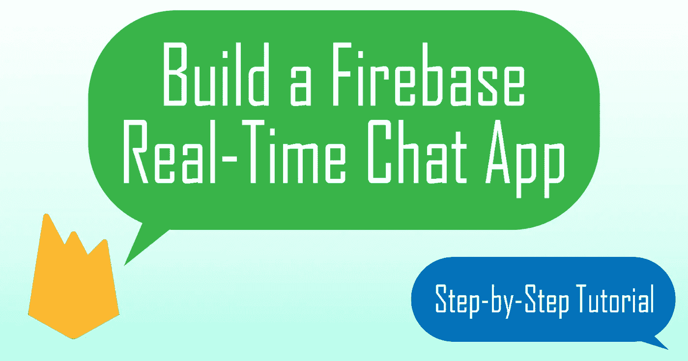
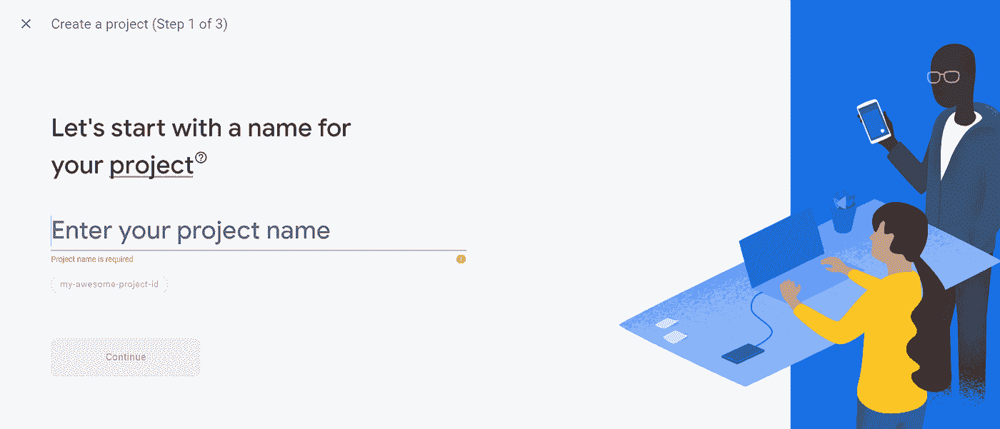
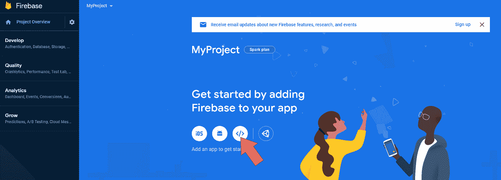
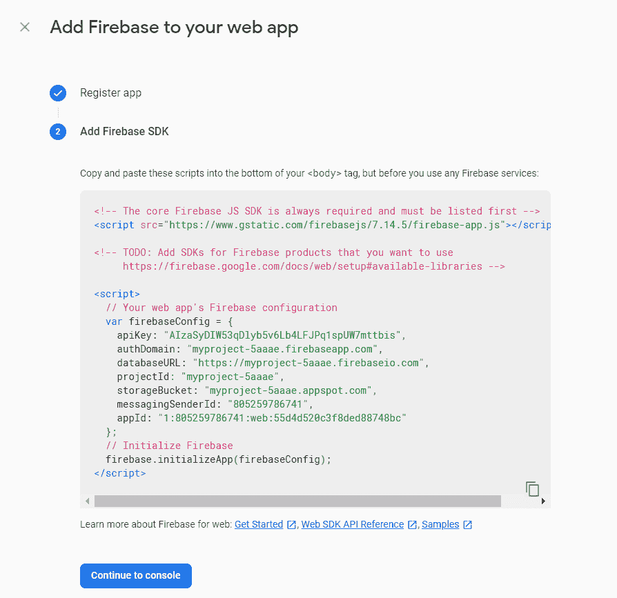
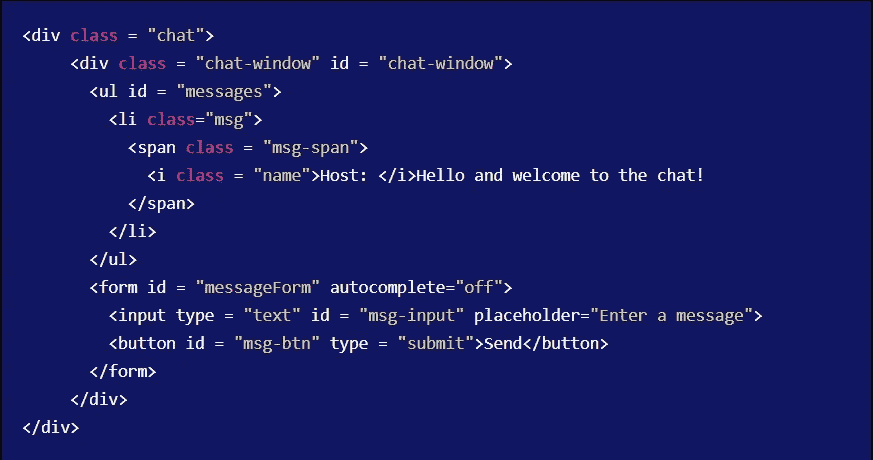
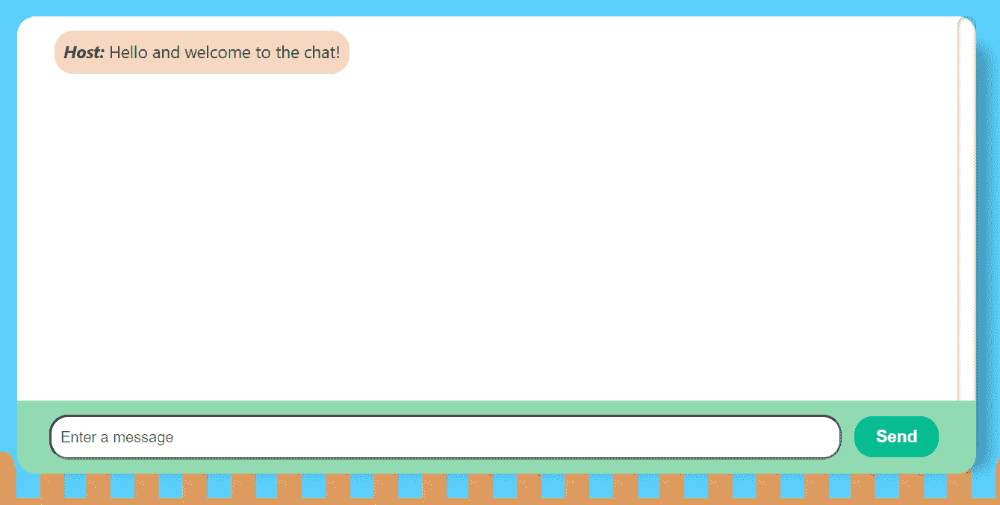
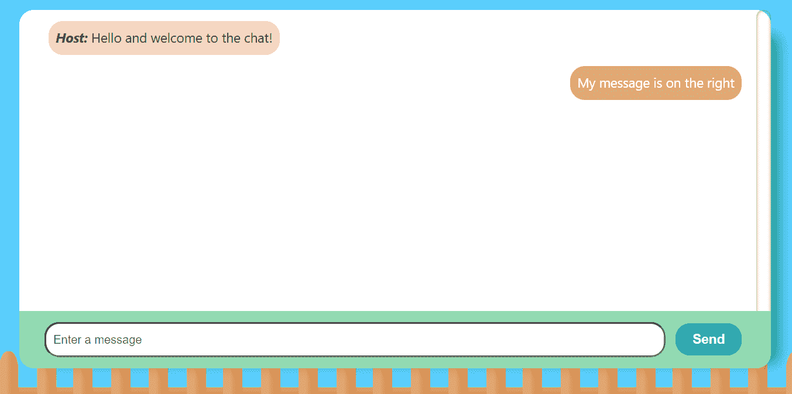
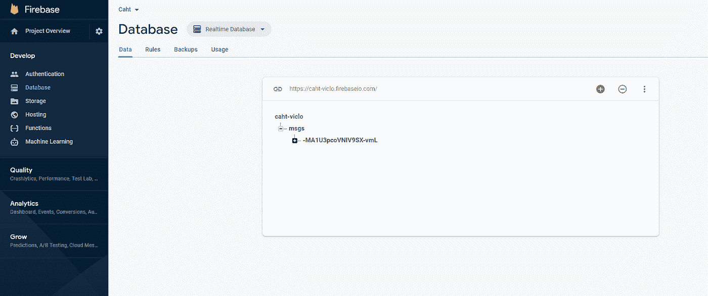
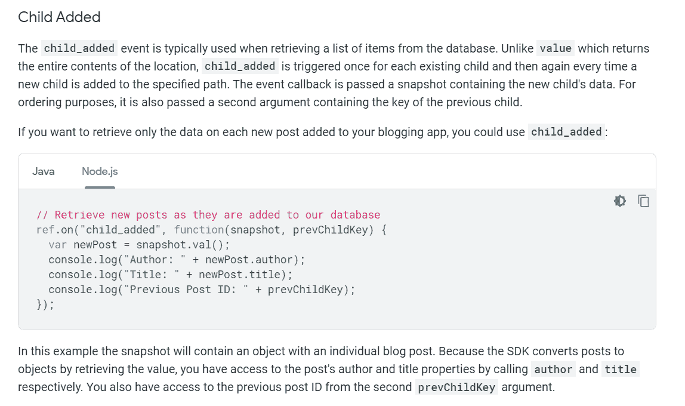
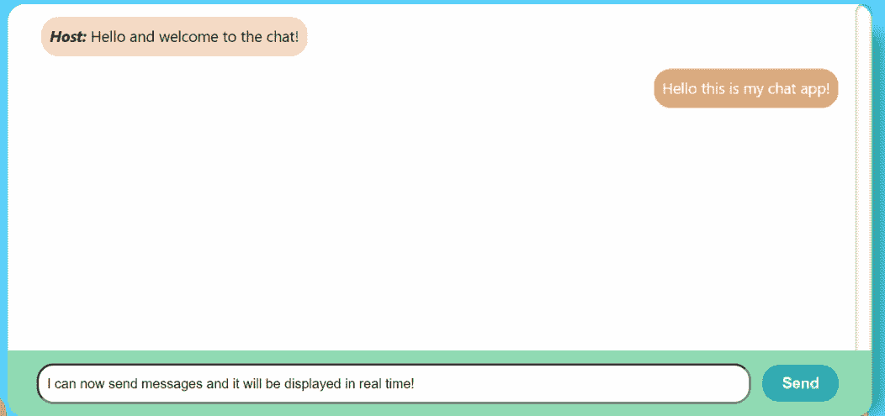

# 让我们使用普通的 JavaScript 构建一个 Firebase 聊天应用程序

> 原文：<https://levelup.gitconnected.com/lets-build-a-firebase-chat-app-using-vanilla-javascript-4baf877d9f49>



各位程序员好！今天，我们将使用 Firebase 和普通 JavaScript 构建一个实时消息聊天应用程序！将不会使用框架，所以它是**完美的初学者**跟随。首先，让我从 Firebase 101 开始。

# 消防基地 101


【firebase.google.com】T5[T6](https://firebase.google.com/)

Firebase 是一个移动和网络开发平台，自 2014 年以来归谷歌所有。它有大量的产品可以帮助开发者更快更好地开发应用。它的一些知名产品是 Firebase 认证、托管、云功能以及我们今天将使用的**实时数据库**。

# 步骤 1:设置 Firebase

1.  前往 https://firebase.google.com/，如果你还没有，注册一个 Firebase 账户。否则，登录到您的 Firebase 控制台。

2.创建一个新项目，并随意命名。



3.然后在仪表板上，选择“Web App”图标



4.获取 firebaseConfig 变量并将其存储在某个地方。我们以后会用到它。



# 步骤 2:设置 HTML 和 CSS

1.  为你的聊天应用页面创建一个**index.html**和 **main.css** 。

2.在你的 index.html 的`<body>`里面添加`<script src="https://www.gstatic.com/firebasejs/7.8.1/firebase-app.js"></script>`

3.用 HTML 和 CSS 创建聊天窗口，聊天输入和发送消息按钮。

类“聊天”是我们的聊天应用程序所在的整个部分。“聊天窗口”包含我们的

*   内的单个消息列表。将包含消息的文本，*以粗体显示发送者的名字。*



正如你在 HTML 代码和上面的图片中看到的，我添加了一个占位符欢迎消息，来看看单个聊天消息

*   在窗口上会是什么样子。

## 区分用户和非用户的消息

在聊天应用程序中，用户的消息通常显示在右侧，而另一方的消息将显示在左侧。所以让我们添加一个 CSS 类来区分你的消息和别人的消息。

我添加了一个“my”类，它将文本右对齐。如果

*   类只是“消息”,那么文本将在左边，如果是“我的消息”,文本将在右边显示，如下所示:

你可以在我的 github [上找到我的自定义 css 的完整版本。](https://github.com/victoria-lo/Caht-Cfae/blob/master/public/css/style.css)

# 步骤 3:创建数据库

既然我们已经设置了 HTML 和 CSS，那么让我们来研究 Firebase 和 JavaScript。

创建一个 **app.js** 文件并添加你的 firebaseConfig 变量

```
const firebaseConfig = {
  apiKey: APP_API_KEY,
  authDomain: AUTH_DOMAIN,
  databaseURL: DATABASE_URL,
  projectId: PROJECT_ID,
  storageBucket: STORAGE_BUCKET,
  messagingSenderId: MESSAGING_SENDER_ID,
};

firebase.initializeApp(firebaseConfig);
```

获取以下 DOM 元素

```
const msgScreen = document.getElementById("messages"); //the <ul> that displays all the <li> msgs
const msgForm = document.getElementById("messageForm"); //the input form
const msgInput = document.getElementById("msg-input"); //the input element to write messages
const msgBtn = document.getElementById("msg-btn"); //the Send button
```

初始化一个数据库参考，我们将使用它来存储我们的消息并创建一个 msgs 文件夹

```
const db = firebase.database();
const msgRef = db.ref("/msgs"); 
//to store data in the msgs folder by creating a reference in database
```

# 步骤 4:向数据库发送消息

既然我们已经在 Firebase 数据库中创建了对 msgs 文件夹的引用，现在我们就可以发送消息并实时将其推送到数据库中。Firebase 为我们处理所有困难的工作。我们所需要做的就是在我们的发送按钮上编写一个发送消息的函数。我们开始吧！

首先，让用户在加载应用程序时给出他/她的名字。

```
let name="";
function init() {
  name = prompt("Please enter your name");
}
document.addEventListener('DOMContentLoaded', init);
```

## 说明

允许 init 函数在 HTML 页面渲染完成后立即运行。name 变量被初始化为一个空字符串，但是一旦 init 函数运行，一个提示窗口将要求输入用户名，name 变量将等于用户名。

接下来，在我们的 msgForm 上添加一个 eventListener:

```
msgForm.addEventListener('submit', sendMessage);
```

在我们的 sendMessage 函数中，我们必须检查我们的输入文本是否为空，因为我们为什么要发送空白消息呢？如果**不为**空，我们可以创建一个消息对象，它包含用户的**名称**和他/她写的**文本**以存储到数据库中。然后，我们应该清除输入字段，为下一条消息做准备。

```
function sendMessage(e){
  e.preventDefault();
  const text = msgInput.value;

    if(!text.trim()) return alert('Please type a message'); //no msg submitted
    const msg = {
        name: name,
        text: text
    };

    msgRef.push(msg);
    msgInput.value = "";
}
```

我们还没有在页面上实现要更新的消息，所以如果您在单击“发送”后没有在屏幕上看到您的消息，请不要惊慌。你可以测试你的发送按钮是否工作，方法是进入你的 Firebase 仪表板，点击左边面板的“数据库”,看到你的信息出现在一个名为“msgs”的文件夹中。



# 步骤 5:在屏幕上显示/更新消息

现在，我们必须在聊天窗口上显示我们的消息，这样用户就可以互相交流了。我们可以为此创建一个简单的 updateMessage 函数。

首先，我们必须从 Firebase 数据库中检索消息数据。为此，我们可以使用 Firebase 中一个名为“child_added”的便利事件。这里可以阅读更多[。](https://firebase.google.com/docs/database/admin/retrieve-data#node.js_1)



*来源:*[*firebase.google.com/docs/database/admin/ret..*](https://firebase.google.com/docs/database/admin/retrieve-data#node.js_1)

> *“child _ added”事件允许从数据库中检索数据，然后我们可以在回调函数中处理数据。每次数据库更新时都会触发该事件。在我们的例子中，当我们向数据库发送新消息时。*

出于我们的目的，我们希望在页面加载时准备好这个事件，以便聊天窗口检索我们的所有消息，并在应用程序启动后显示在聊天窗口上。这意味着我们可以在 init()函数中添加以下几行:

`msgRef.on('child_added', updateMsgs);`

然后在 init()函数下面，让我们编写回调 updateMsgs 函数:

```
const updateMsgs = data =>{
  const {dataName, text} = data.val(); //get name and text

  //load messages, display on left if not the user's name. Display on right if it is the user.
  const msg = `<li class="${dataName == name ? "msg my": "msg"}"><span class = "msg-span">
    <i class = "name">${name}: </i>${text}
    </span>
  </li>`

  msgScreen.innerHTML += msg; //add the <li> message to the chat window

  //auto scroll to bottom
  document.getElementById("chat-window").scrollTop = document.getElementById("chat-window").scrollHeight;
}
```

## 代码解释

在这个函数中，我们基本上以存储数据的相同格式获取数据，即名称和文本。然后，我们必须创建我们的

*   消息元素，将它附加到我们的

在我们的

*   中，我们必须确定消息是显示在左边还是右边。请记住，如果消息不是用户写的，它将显示在左侧，带有“msg”类。否则，在右侧显示带有类别“我的消息”的消息。我们可以通过将检索到的数据名与用户名进行比较来实现这一点。如上面的代码所示，为了提高效率和可读性，我使用了三元 if 语句。最后，我们将在元素中插入我们的文本。

然后我们将整个

*   消息添加到我们的聊天窗口(即 msgScreen)。作为可选的最后一步，我们可以通过将窗口自动滚动到底部来确保应用程序总是显示最新的消息。

# 我们来测试一下！

在本教程结束时，您应该有一个这样的应用程序:



当点击发送按钮时，我们将消息发送到数据库。我们的“child_added”事件将触发并调用我们的 updateMsgs 函数，该函数将立即检索我们的消息并将其显示在聊天窗口上！

# 就是这样！

我希望这篇教程对你开始使用 Firebase 和学习更多关于 JavaScript 的知识有所帮助。制作这个聊天应用程序会给你带来很多乐趣。对我来说，我创造了一种加密模式，使文字看起来杂乱无章。你可以点击查看我的聊天应用[。](https://caht-viclo.firebaseapp.com/)

查看我的 gitHub repo，了解我的聊天应用的完整实现代码:[https://github.com/victoria-lo/Caht-Cfae](https://github.com/victoria-lo/Caht-Cfae)

除了数据库之外，您还可以将更多的 Firebase 产品集成到这个项目中，就像我如何使用 Firebase 托管和认证一样。学起来会很好。我鼓励你花些时间阅读 Firebase 的文档,因为它是一个非常有用的应用平台。

感谢阅读，祝学习愉快！干杯！