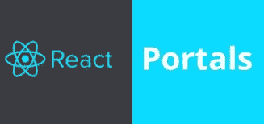
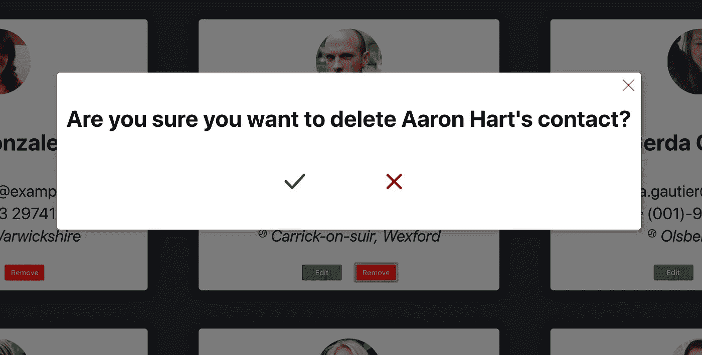

# 让我们在 React with Portals 中构建一个功能性的、可重用的模态组件

> 原文：<https://levelup.gitconnected.com/lets-build-a-functional-reusable-modal-component-in-react-with-portals-edff0b8d4bf7>



模态已经成为跨所有设备的应用程序的组成部分，但是它们的实现有很大的不同。我认为，普遍的看法是，它需要一点 CSS 魔法(与 z-index 或其他东西有关，对吗？？)，但是我想出了一个在我的几个项目中非常成功地为我工作的方法，我想与你分享它(当然，它确实使用了一点 CSS 魔法)。

如标题所示，不会涉及基于类的组件，因为我是 React 钩子的狂热粉丝(如果你不了解钩子，可以看看我的其他帖子或者参考 [React 文档](https://reactjs.org/docs/hooks-intro.html)来了解更多关于它们的信息)。所以让我们开始吧。在设计 React 时，我们将使用我最喜欢的库。

为了简单起见，我将在用`create-react-app`构建的 React 应用程序的上下文中解释这种类型组件的用例。在你的公共目录中(你可能很少冒险)，在`index.html`里面为我们即将出现的模态组件添加一个定位点，就在我们应用程序的下面。

```
...<div id="root"></div>
<div id="modal"></div>...
```

就是这样！这就是全部了。开玩笑的。回到我们的`src`目录，让我们在`src/Modal.js`中创建我们的模态组件:

```
import React, { useEffect } from "react";
import { createPortal } from "react-dom";
import styled from "styled-components";
import PropTypes from "prop-types"; const Portal = ({ children }) => {  
 const modalRoot = document.getElementById("modal");
 const el = document.createElement("div");

 useEffect(() => {    
  modalRoot.appendChild(el);  
 }, []);   useEffect(() => {    
  return () => modalRoot.removeChild(el); 
 }); return createPortal(children, el);};const Modal = ({ children, toggle, open }) => (  
 <Portal>    
  {open && (      
   <ModalWrapper>       
    <ModalCard>          
     <CloseButton onClick={toggle}>            
      
      {children}
    </ModalCard>
    <Background onClick={toggle} />      
   </ModalWrapper>    
  )}  
 </Portal>
); export default Modal; Modal.propTypes = {  
 children: PropTypes.arrayOf(PropTypes.object).isRequired,
 toggle: PropTypes.func.isRequired,
 on: PropTypes.bool.isRequired
}; const ModalWrapper = styled.div`
  position: fixed;  top: 50%;
  left: 50%;
  transform: translate(-50%, -50%);
  width: 100%;  height: 100%;
  display: flex;
  justify-content: center;
  align-items: center;
`;const ModalCard = styled.div`
  position: relative;
  min-width: 320px;
  z-index: 10;
  margin-bottom: 100px;
  background: white;
  border-radius: 5px;
  padding: 15px;
  box-shadow: 2px 2px 10px rgba(0, 0, 0, 0.3);
`; const CloseButton = styled.button`
  position: absolute;
  top: 0;
  right: 0;
  border: none;
  background: transparent;
  padding: 10px;
  &:hover {    
    cursor: pointer;
  }`; const Background = styled.div`
  position: absolute;
  width: 100%;
  height: 100%;
  top: 0;
  left: 0;
  background: black;
  opacity: 0.5;
`;
```

哇哦。这看起来像一堆废话。真的不是，我们来解剖一下。首先，注意这是二合一的组件。我完全支持将组件分离到它们各自的文件中，但是我用`React.createPortal`创建的门户(我们稍后会讲到)是专门为前面的模态组件设计的。我觉得让他们生活在同一个文件中似乎没什么问题。

对于那些不熟悉`styled-components`的人来说，在模型的道具类型下面定义的所有东西都是样式化的组件，这保证了它们自己的位置(而且非常棒)。

那么 React 中的“*门户*”是什么呢？嗯，根据[反应文件](https://reactjs.org/docs/portals.html):

"*门户提供了一种一流的方式来将子组件呈现到存在于父组件的 DOM 层次结构之外的 DOM 节点中。*"我还将引用 [Siobhan Mahoney](https://medium.com/@siobhanpmahoney) 的话，她在题为" React.js 中的[门户"的文章中很好地解释了这一点，"*门户可用于在父组件的 DOM 节点之外呈现元素，同时保留它在 React 层次结构中的位置，允许它保留它从 React 树继承的属性和行为。*](https://medium.com/@siobhanpmahoney/portals-in-react-js-5d98bb89797c)

我宁愿引用别人的话也不愿意自己解释，因为，完全透明，我喜欢用门户不代表我完全理解！

好了，现在我们对 React 中的门户有了一个大致的了解，让我们浏览一下上面定义的`Portal`组件。注意我是如何从 props 中析构`children`的，然后把它作为第一个参数传递给`React.createPortal`。再次引用 React 文档，"第一个参数是任何 [*可呈现的 React 子级*](https://reactjs.org/docs/react-component.html#render) *，比如元素、字符串或片段。第二个参数是一个 DOM 元素[充当 React 子元素的容器]* 。这个“容器”是在`Portal`组件的顶部创建的，就在我们之前在`index.html`建立的定位点之后。

在第一个`useEffect`钩子(相当于基于类的 React 中的`componentDidMount`生命周期方法)中，我们挂载了容器元素。在第二个`useEffect`中，类似于`componentWillUnmount`，我们本质上是在自己之后下马或清理。

现在事情变得有趣了。让我们浏览一下`Modal`组件，它利用了我们新创建的 React 门户。注意这个组件是如何利用`toggle`和`on`属性的，前者用于切换模态的可见性，后者作为布尔属性来决定模态是“开”还是“关”(“开”或类似的效果也可以，命名是任意的)。在这个`Modal`组件中，我们渲染了之前定义的`Portal`组件，利用我们花哨的样式化组件使其看起来更漂亮。本质上，这个组件所做的就是将`children`传递给 React 门户的实例。它的用户界面看起来像这样(来自我以前制作的一个联系人应用程序):



右上角的关闭按钮，以及更粗的红色 X 都使用了`toggle`处理程序来关闭模态，并且您可以根据您的用例在模态中连接您想要的任何其他点击处理程序。我不会深入讨论样式化组件所涉及的 CSS，因为，首先，它很无聊，其次，它是你可以编写(或复制)一次就再也不用处理的东西。

我经常结合这个`Modal`组件使用的一个 React 钩子是我写的一个自定义的`useToggle`钩子，我在[之前的一篇文章](/two-simple-reusable-custom-hooks-for-your-react-apps-a0275724f8ab)中详细讨论过。总的来说，这些组件中的每一个都提供了一个真正可重用的，而且我敢说看起来相当漂亮的模态体验，供您在 React 应用程序中使用！我希望这对你有用，因为我每次需要模型的时候都会用到它。

感谢您的倾听。

[](https://levelup.gitconnected.com)[](https://gitconnected.com/learn/react) [## 学习 React -最佳 React 教程(2019) | gitconnected

### 排名前 49 的 React 教程-免费学习 React。课程由开发人员提交并投票，使您能够…

gitconnected.com](https://gitconnected.com/learn/react)