# 让我们使用 React Native 克隆 Google Fit 应用程序

> 原文：<https://levelup.gitconnected.com/lets-build-a-google-fit-component-81139bb06e36>

*使用 React Native 克隆 Google Fit 应用程序 UI 的步骤*

在我之前的 [**帖子**](https://medium.com/swlh/lets-build-a-google-play-component-fc4c4424e803?source=friends_link&sk=e0558737ad5a28f85d19cc7bbad8b6eb) 中，我用 React Native 和 Expo 搭建了一个 Google Play Movies & TV UI 组件。接下来，在这篇文章中，我将构建谷歌健身应用程序`Google Fit`的主屏幕，它有一个漂亮流畅的用户界面和微妙的动画。

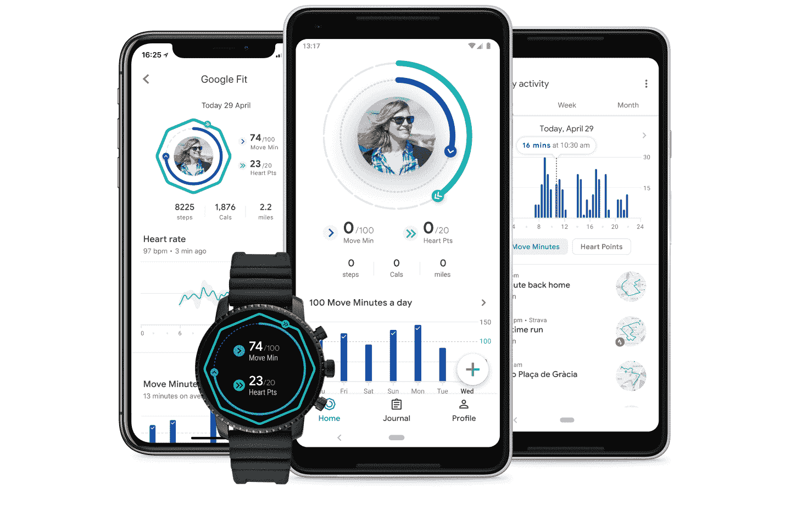

谷歌健身应用

我喜欢圆形动画，一个用于移动点，一个用于心脏点，在应用程序启动后动画。我想尝试一下，看看我是否能在 react-native 中构建该组件。

查看在[https://snack.expo.io/@chandankkrr/google-fit-app-clone](https://snack.expo.io/@chandankkrr/google-fit-app-clone)世博小吃上运行的实际组件

## 该过程

让我们从创建底部的选项卡导航器和所需的屏幕开始。

## 底部选项卡导航器

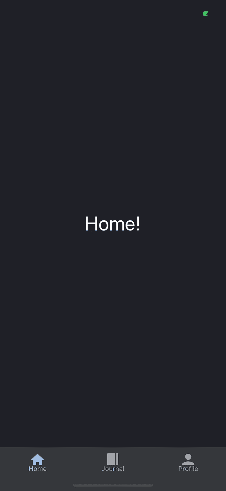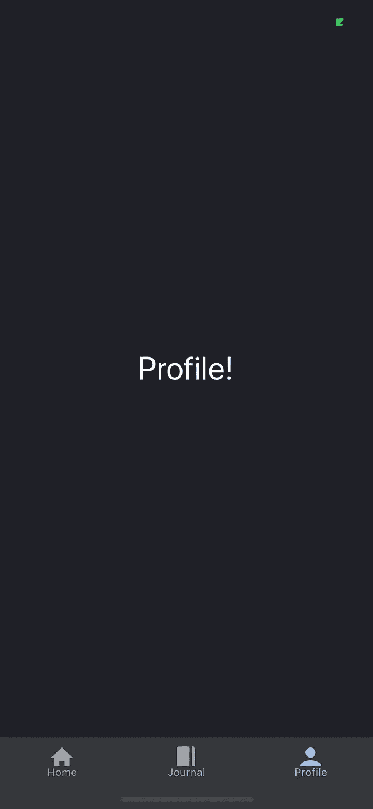

底部选项卡导航器

完美！我将只为主屏幕创建 UI，所以让我们看看主屏幕中有哪些组件。

## FitExercise & FitHealth 组件

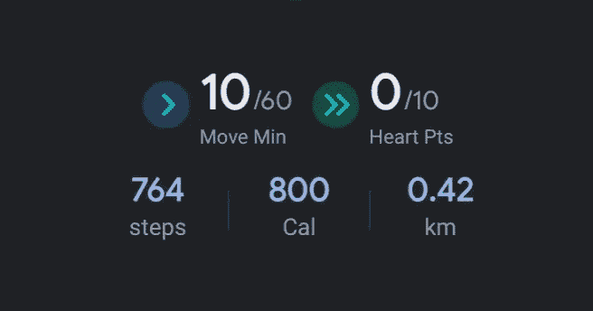

统计组件

让我们从创建中央统计组件开始。我们可以把它分成两个独立的部分。顶部`FitHealthStat`和底部`FitExerciseStat.`

我们将把这些组件包装成一个将在`Home`选项卡中呈现的`GoogleFit`组件。

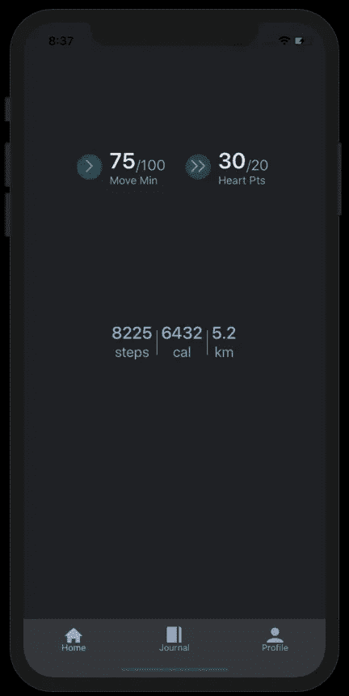

带有统计数据的主屏幕

这些部件彼此间隔开很远。现在没问题，我们将在添加所有组件后修复间距。接下来让我们创建条形图组件。

## FitChart 组件

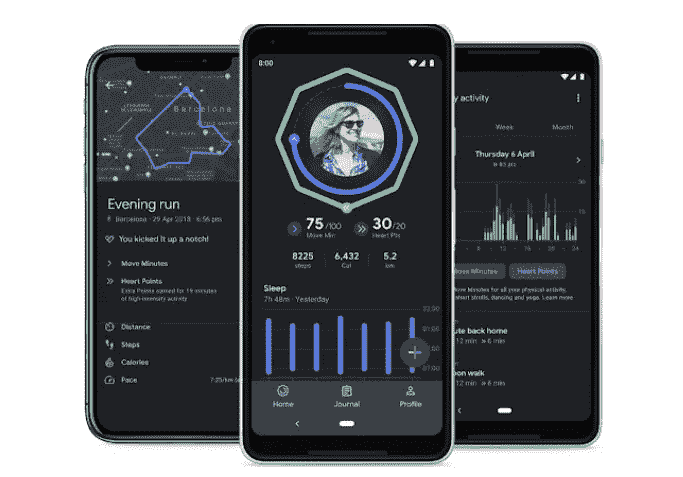

谷歌健身应用

为此，我们将使用名为`[**react-native-chart-kit**](https://www.npmjs.com/package/react-native-chart-kit)**.**` 的 npm 包，它提供了我们可以使用的不同类型的图表，但我们只需要`BarChart`组件，所以让我们构建该组件并将其添加到我们的`GoogleFit`组件中。我将添加两个图表，一个用于`Sleep`，另一个用于`Steps`数据。

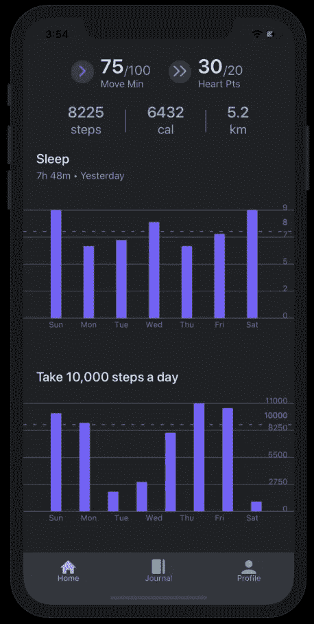

带有统计数据和图表的主屏幕

> 看起来不错，但我必须对图表库进行一些更改，以使图表看起来像 google fit 应用程序中的图表。默认情况下，图表在屏幕左侧呈现垂直标签。没有将标签渲染到右侧的选项。此外，没有为图表添加基线的概念。我修改了 charts 包代码以获得想要的输出。

## 附加统计组件

很好，让我们继续添加我称之为附加的统计数据，它显示在屏幕的底部。

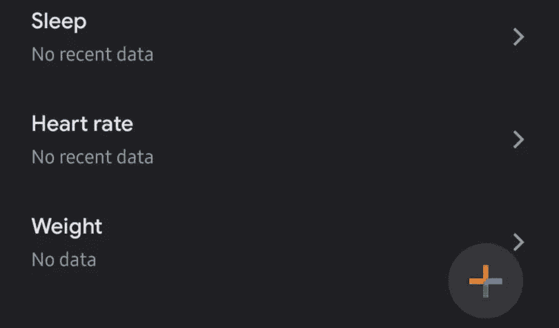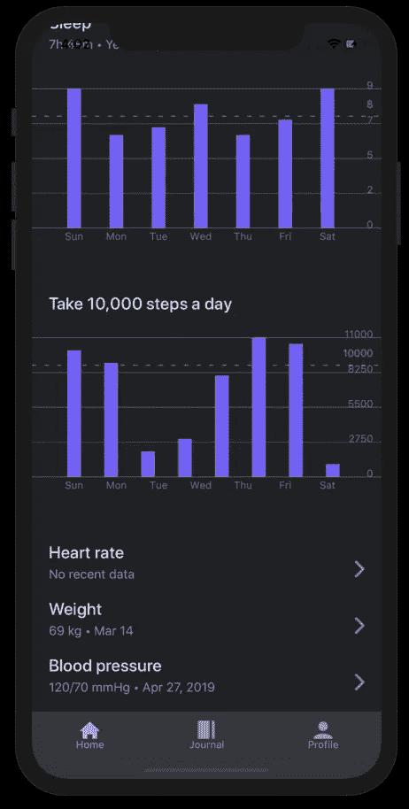

带有附加统计数据的主屏幕

## FitImage 组件

现在，最后是动画 UI 组件，它让我首先尝试在 react 中构建该组件。我花了一些时间摆弄，并得到最终的用户界面。

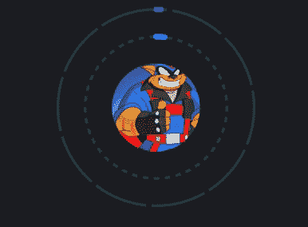

Google fit 动画

让我们构建`FitImage`组件。

我正在使用`react-native-svg` npm 包来构建动画圆圈。我使用了两个 SVG 圆，分别用于内圆和外圆，以获得动画效果。第一个静态的`Circle`有一个`strokeDashArray`，第二个`AniamtedCircle`的`strokeDashOffset`值在一段时间`2000ms`内被动画化以获得动画效果。两个 SVG 圆具有相同的`cx`、`cy`和`radius`值。为了噱头，我使用变换比例样式在中心图像上添加了`spring`效果。让我们将`FitImage`添加到`GoogleFit`组件中。

有关 SVG circle 的更多信息，请访问 moz://a

[https://developer . Mozilla . org/en-US/docs/Web/SVG/Element/circle](https://developer.mozilla.org/en-US/docs/Web/SVG/Element/circle)

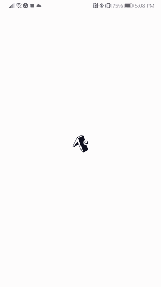

Google Fit

这就是了，Google Fit 应用程序的用户界面带有在 react native 中完成的动画。对结果和动画相当满意。🎉🎉🎉

 [## Chandankkrr/googlefit

### 使用 react-native 克隆 Google fit 应用程序。通过在…上创建帐户，为 Chandankkrr/googlefit 的发展做出贡献

github.com](https://github.com/Chandankkrr/googlefit) 

> ***想试试自己试试？***
> 
> *叉或克隆*[***Google fit***](https://github.com/Chandankkrr/googlefit)*回购在我的 GitHub 账户上可用。🙏🙏🙏*