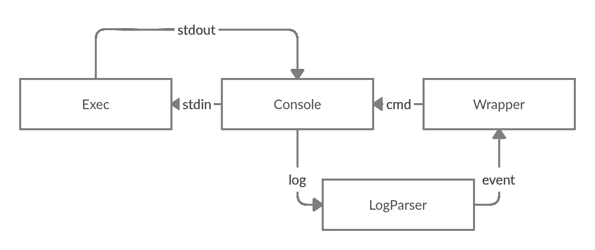
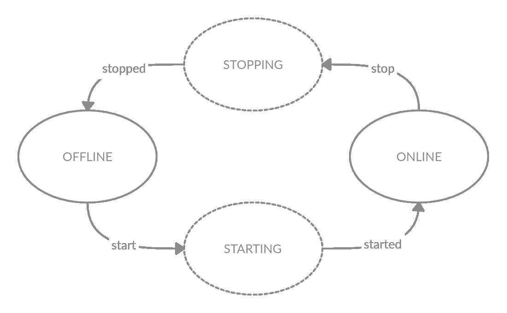
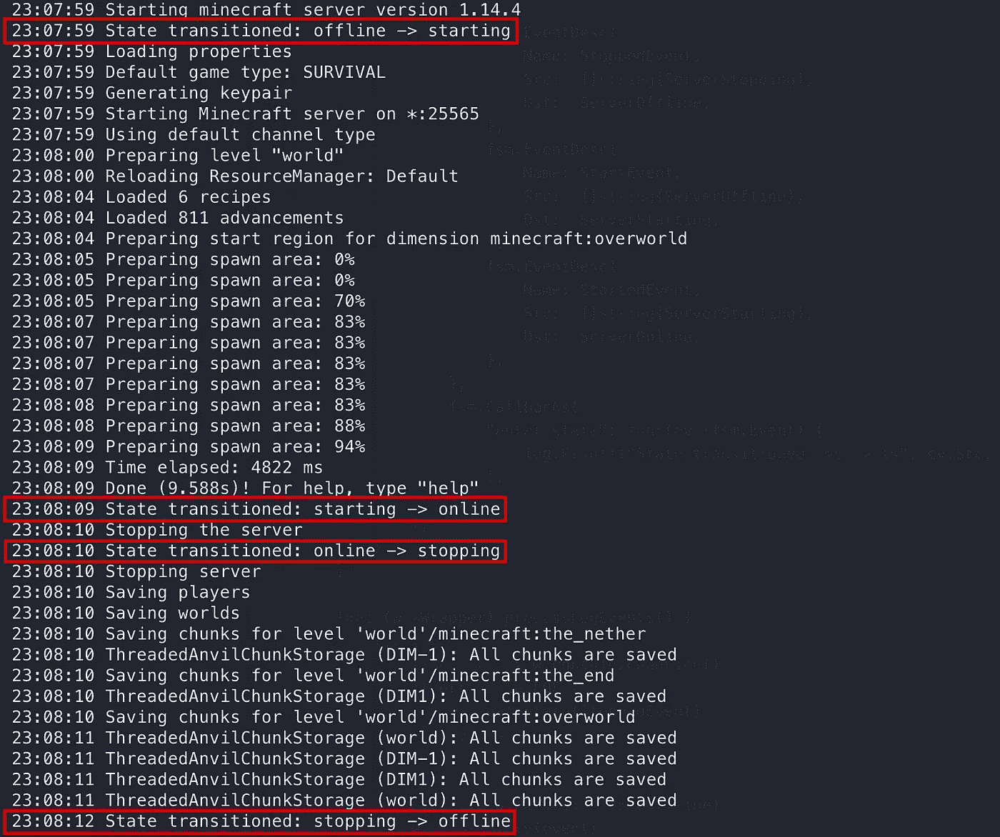
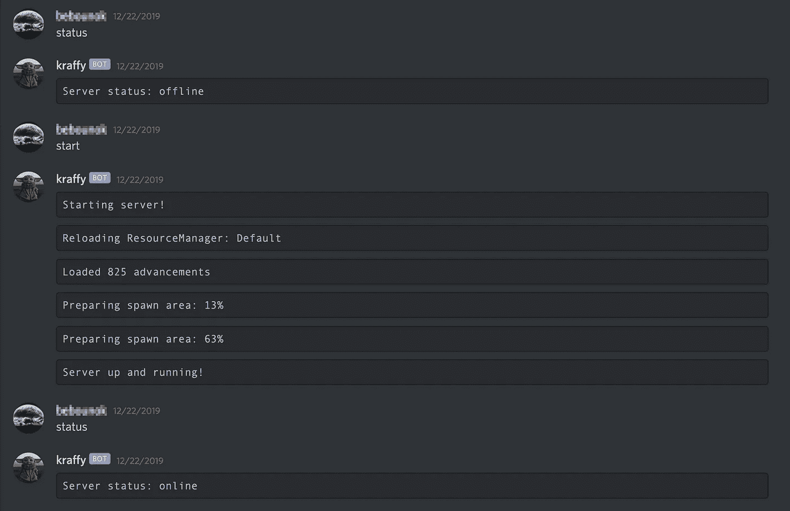

# 让我们在 Go 中构建一个《我的世界》服务器包装器

> 原文：<https://levelup.gitconnected.com/lets-build-a-minecraft-server-wrapper-in-go-122c087e0023>


来自 [pixilart](https://www.pixilart.com/photo/pixel-gopher-e12f7b080c61303?fbclid=IwAR0Iuvkzpg8z_F-MD3ngSFMxdowAmmFunqAelpmShqDIfPy6psU-Pg25Jow) 的地鼠由 [Ana Wan](https://www.pixilart.com/anael-wan)

*本文基于 Go 1.14 &《我的世界》服务器 1.14。*

《我的世界》不需要介绍，《我的世界》的服务器也不需要介绍！但是《我的世界》服务器包装器(MSW)怎么样呢？你可能是一个休闲玩家或者是一个铁杆《我的世界》迷，但是如果你曾经在社区服务器上玩过，那么很有可能你已经间接地和一个 MSW 互动过了。

> MSW 是一个包装《我的世界》服务器的工具，它通过推送命令和读取服务器日志来与服务器交互。

大多数《我的世界》社区服务器或托管服务使用某种 MSW。对于开发人员来说，围绕他们的《我的世界》服务器构建解决方案非常方便，例如:

*   运行聊天机器人，如 [discord](https://discord.com/) 、 [slack](https://slack.com/) 或 [gitter](https://gitter.im/) ，通过消息发送命令和接收服务器更新。
*   公开一些 API 来支持 web 客户端或移动应用程序。
*   创建一个网页挂钩，通过机器人或电子邮件获得通知。

以下是一些著名的垃圾:

[](https://minecraftservers.gamepedia.com/Server_wrappers) [## 服务器包装

### 从《我的世界》服务器 Wiki 服务器包装器是不修改《我的世界》服务器或其数据文件的系统，但是…

minecraftservers.gamepedia.com](https://minecraftservers.gamepedia.com/Server_wrappers) 

*PS:如果想直接钻研代码，可以在*[*Github*](https://github.com/wlwanpan/medium/tree/master/minecraft-server-wrapper)*上找到。*

# 要求

在我们开始之前，您需要:

*   可以从[官网](https://www.minecraft.net/en-us/download/server)免费下载的《我的世界》服务器`.jar`文件。任何版本都可以工作，因为《我的世界》命令和日志都相当一致。
*   而且，很明显，[转](https://golang.org/doc/install)安装在本地。

您可以通过在终端中运行以下命令来直接启动服务器:

```
java -Xmx1024M -Xms1024M -jar server.jar nogui
```

第一次这样做时，您会看到以下消息:

```
You need to agree to the EULA in order to run the server. Go to eula.txt for more info.
```

这是因为在使用服务器之前，您需要接受[条款&条件](https://account.mojang.com/documents/minecraft_eula)，所以继续在`eula.txt`文件中设置`eula=true`，显然是在阅读了协议 xD 之后

# 概观



都市固体废物概述

都市固体废物由四个主要部分组成:

1.  Exec:运行《我的世界》服务器的可执行命令`exec.Cmd`。
2.  控制台:Java 线程和主 Goroutine 之间的交互点。
3.  LogParser:将服务器日志解析到服务器`Event` ('starting '，' started '，' stopping '和' stopped ')。
4.  包装器:服务器的有限状态机(FSM)表示。

# 1.高级管理人员

第一步是写一个函数`JavaExecCmd`来配置 Java 可执行命令。我们将采用 3 个参数:

*   `serverPath`:您的`server.jar`文件的文件路径。
*   `initialHeapSize`:启动服务器时的初始内存量(Mb)。
*   `maxHeapSize`:服务器可以消耗的最大 RAM (Mb)限制。

内存的使用会随着玩家的数量，使用的模式和世界的大小而变化。我在 4gigs 实例( [EC2 — a1.large](https://aws.amazon.com/ec2/instance-types/a1) )上运行了一个私人香草《我的世界》服务器，我发现它足以支持大约 2-4 个玩家，没有明显的延迟或同步问题。

在进入下一步之前，我们可以通过在主函数中启动输出`exec.Cmd`来测试`JavaExecCmd`:

注意，我们将默认的`Stdout`设置为`os.Stdout`，这允许我们在终端上查看从服务器线程返回的服务器日志。

# 2.安慰

我们的下一步是处理`Console`，它将包装上一步的`exec.Cmd`，通过 stdin/stdout 管道管理并与服务器进程通信。

控制台结构

在设置了 stdin/stdout 管道之后，我们可以公开以下方法:

*   `WriteCmd`:向 java 线程的 stdin 写入一个字符串命令。
*   `ReadLine`:从 java 线程中逐行读取 stdout。

读取线和写入命令

我们现在有了读取服务器日志的方法。

# 3.LogParser


来源:[游戏百科](https://minecraft.gamepedia.com/File:Gear_(N).gif)

日志解析器用于将每个服务器日志转换为各自的服务器事件。我们将很快进入服务器事件的更多细节。

让我们来看看问题中的日志的结构。以下是服务器日志的一小段:

```
[11:41:05] [Server thread/INFO]: Starting minecraft server version 1.14.4
[11:41:05] [Server thread/INFO]: Loading properties
[11:41:05] [Server thread/INFO]: Default game type: SURVIVAL
[11:41:05] [Server thread/INFO]: Generating keypair
[11:41:05] [Server thread/INFO]: Starting Minecraft server on *:25565
[11:41:05] [Server thread/INFO]: Using epoll channel type
[11:41:05] [Server thread/INFO]: Preparing level "world"
```

每行有 4 条主要信息:

*   格式为 H:MM:SS 的时间戳。
*   线程名称，表示日志是来自主 java 线程还是工作线程。
*   日志级别—跟踪、调试、信息、致命和错误。
*   输出——最重要的部分，因为这是我们可以根据某些关键字提取服务器正在做什么的地方。

酷！现在我们了解了日志结构，我们可以使用下面的正则表达式:

```
(\[[0-9:]*\]) \[([A-z(-| )#0-9]*)\/([A-z #]*)\]: (.*)
```

匹配上面提到的每条信息，并将其表示为 Go 结构`LogLine`:

`ParseToLogLine`是一个助手函数，将服务器日志的一行分解成一个`LogLine`实例。

例如，当《我的世界》服务器成功加载并准备好接受播放器时，会返回以下日志:

```
[21:25:21] [Server thread/INFO]: Done (13.681s)! For help, type "help"
```

相应的`LogLine`实例是:

```
&LogLine{
    timestamp: "[21:25:21]",
    threadName: "Server thread",
    level: "INFO",
    output: `Done (13.681s)! For help, type "help"`,
}
```

在对`LogLine`的服务器日志进行初步解析之后，我们可以使用其`output`字符串字段将其转换为特定的服务器`Event`，如下所示:

这里我们定义了一个`Event`到`*regexp.Regexp`的映射，将任何给定的`output`字符串匹配到一个预定义的`Event`。然后在下一节中使用`Event`来更新我们的`Wrapper`的状态。

请注意，我们没有针对`EventStopped`的`regexp`，因为服务器日志没有提供可靠的消息来表明服务器已经成功停止。因此，我们将使用 stdout 管道关闭时返回的错误`io.EOF`，这发生在服务器停止时。

# 4.包装材料



包装器有限状态机

最后，`Wrapper`！`Wrapper`将利用`Console`和`LogParser`来协调 FSM。我们将使用这个简洁的 go 包 [fsm](https://github.com/looplab/fsm) 由 [looplab](https://github.com/looplab) 定义我们的状态和转换，如概述图所示:

定义了我们的`Wrapper`之后，下一步是通过添加我们的`LogParser`函数来处理和更新我们的 FSM，从而将这些点连接起来，所以让我们开始吧:

`processLogEvents`是一个私有方法，它运行一个`for`循环，这个循环本来是要在`goroutine`中运行的，一旦我们想要启动服务器，它就在后台处理和更新我们的状态转换。为了便于使用，我们可以在我们的`Wrapper`中公开一个`Start`和`Stop`方法:

# 最后试验

最后，我们可以初始化`Start`一个新的`Wrapper`并在 15 秒后调用`Stop`进行测试。在一些日志的帮助下，我们可以在日志被读取和处理后检查`Wrapper`的当前状态:

输出:



最终代码的控制台输出

我们完了。

既然构建模块已经布置好了，那么就可以在城市固体废弃物的顶部建立各种各样的创造性系统。就个人而言，我想要一种友好的方式来打开和关闭我的《我的世界》服务器，在“克拉夫”之后不久，不和谐机器人就出现了。



和克拉夫聊天

感谢您阅读到最后:)我希望这篇文章是有启发性的，并激励您尝试一下！快乐建筑&黑客！