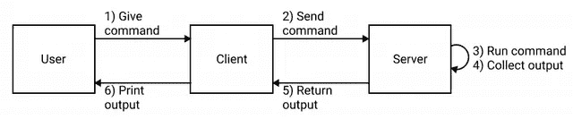
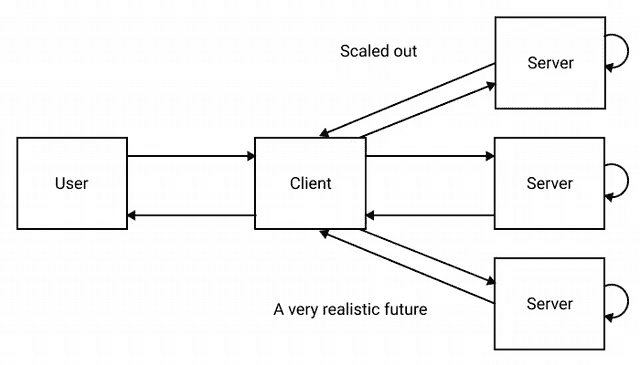

# 让我们用 Rust 构建一个二进制 gRPC 服务器-客户端

> 原文：<https://levelup.gitconnected.com/lets-build-a-single-binary-grpc-server-client-with-rust-498c1cb900d3>

关于 Rust 和协议缓冲区+ gRPC 的基础知识有很多资源，所以我不想浪费你的时间去做太多的介绍。我想让你尽快采取行动。

如果你在这里，我会对你做一些假设。

*   你可以用另一种语言写代码，但是你对 Rust 感兴趣
*   您已经基本熟悉了简单任务的命令行(比如用`ls`列出文件)
*   您在自己编写的代码中使用了 REST、GraphQL 或 gRPC 等 web 服务 API
*   你已经*浏览过*至少一次[官方协议缓冲区(v3)文档](https://developers.google.com/protocol-buffers/docs/proto3)
*   您正在寻找一些可以复制/粘贴和修改的示例代码

# 岗位目标

我的目标是编写一个小型异步 Rust CLI 应用程序。它将从客户端获取用户输入，将其发送到远程 gRPC 服务器，并将输出返回给客户端。

完成的代码在我的 [rust-examples repo](https://github.com/tjtelan/rust-examples) 中可用，名为 [cli-grpc-tonic-blocking](https://github.com/tjtelan/rust-examples/tree/main/cli-grpc-tonic-blocking) 。但是我鼓励你们跟着做，因为我会在做改变的时候叙述它们。

# 我们在写什么？

在这个例子中，我将编写一个远程命令行服务器/客户机。

客户端将接受一个命令行命令，并将其发送给服务器，服务器将执行该命令，并将标准输出的内容发送回来。

我们将要使用的交互框图

为了简单起见，这个例子将在返回输出之前等待执行在服务器端完成。在以后的文章中，我将演示如何将输出流回客户端。

我将向您展示如何:

1.  解析命令行用户输入
2.  编写协议缓冲区消息类型和服务接口
3.  将协议缓冲区编译成 Rust 代码
4.  实现 gRPC 客户端
5.  实施 gRPC 服务器(非流式)
6.  使用基本的异步/等待模式

## 更大的目标

这不仅仅是一个简单的 Hello World。

我想提供一个有现实应用作为基础的例子。它有可能被用于一些有用的东西，但请记住，这个例子只是一个基本的脚本运行程序，并不安全。

这种配置是可能的，但超出了范围

人们可以在多台主机上运行该服务器的多个实例，并使用客户端在每台主机上运行 shell 命令，类似于 jenkins、puppet 或 ansible 等持续集成工具。(热门话题:CI 只是一个花哨的 shell 脚本)

我不建议在任何重要的环境中按原样运行这段代码。仅用于演示和教育目的！

# 编写命令行界面

命令行界面是允许我们将 gRPC 服务器和客户机打包到同一个二进制文件中的基础。我们将首先使用 CLI 启动我们的新板条箱。

我们将使用一个名为 [StructOpt](https://crates.io/crates/structopt) 的板条箱。StructOpt 利用了功能强大的命令行解析器 [Clap](https://crates.io/crates/clap) crate。但是 Clap 使用起来可能有点复杂，所以 StructOpt 额外提供了许多方便的功能 Rust a[#[derive]attribute](https://doc.rust-lang.org/reference/attributes/derive.html)，这样我们就不用写那么多代码了。

Cargo.toml —刚刚开始

为了将我们的客户机和服务器捆绑在一起，我们需要使用 CLI 在作为客户机运行和作为服务器运行之间切换。

# CLI 的一些用户界面设计

注意:当我们在开发的时候，你可以使用`cargo run --`来运行我们的 cli 二进制文件，并且在`--`之后的任何参数都作为参数传递给我们的二进制文件

## 启动服务器

当我们启动服务器时，我们想传入子命令`server`

## 服务器的可选参数

大多数时候，我们的服务器会监听一个默认的地址和端口，但我们想给用户选择不同的东西。

我们将在标志`--server-addr-listen`中提供服务器监听地址的选项

## 使用客户端

当用户从我们的客户端运行一个命令时，我们想要使用子命令`run`。

## 客户端所需的位置参数

`subcommand run`之后的任何内容都将是我们传递给服务器执行的命令。一个命令有一个可执行名称，也可以有参数。

或者举例说明如何在没有货物的情况下使用这个命令，如果它被命名为`remotecli`:

## 客户端的可选参数

就像我们的服务器将有一个默认的监听地址和端口一样，我们的客户机将假设连接到默认地址。我们只是想为用户提供连接到不同服务器的选项。

我们将在标志`--server-addr`中提供服务器地址的选项

# 到目前为止的 CLI 代码

我将把当前的`main.rs`分解成它们的结构、枚举和函数来描述 StructOpt 是如何被利用的。

**如果你想在一个代码块中查看这个文件，跳到下一节** `[**All together**](#9cbb)` **。**

# 部分

## 应用程序参数

应用程序参数— main.rs

*   正如注释所说，这将是您用来解析来自用户输入的参数的主要结构。
*   我们在这个结构上使用`derive(StructOpt)`来让编译器知道要生成命令行解析器。
*   `structopt(name)`属性反映在生成的 CLI 帮助中。Rust 将使用这个名字代替板条箱的名字，也就是`cli-grpc-tonic-blocking`。这纯粹是装饰性的。
*   `structopt(flatten)`属性用于`ApplicationArguments`结构字段。结果实际上是用`SubCommand`类型的内容替换了这个字段，我们接下来会讲到。

如果我们不使用 flatten，那么用户需要像这样使用 CLI:

没有子命令展平的 CLI 调用—非常冗长

但是通过展平，我们得到了一个没有文字的简化形式。

子命令扁平化的 CLI 调用—无需键入

这种模式的原因是允许将子命令分组到我们可以进行模式匹配的类型中，这对于开发人员来说很好。但同时，我们为用户保持最小的 CLI 层次结构。

## 子命令

子命令— main.rs

*   这次我们用的是枚举。但是同样，最重要的部分是`derive(StructOpt)`属性。
*   使用枚举的原因是为了提供一些开发便利。枚举中的每个字段都接受一个结构，当选择子命令时，会在该结构中进行额外的解析。但是这种模式使我们能够不在这个枚举中混淆，使代码不集中，难以阅读。

*   第二个最重要的细节是注意带有 3 个斜线`///`的注释。
*   这些是[文档注释](https://doc.rust-lang.org/reference/comments.html#doc-comments)，它们的放置是有意的。Rust 将在生成的帮助命令中使用这些注释。这两个斜线注释只是给你(开发人员)的注释，用户看不到。

*   对于第一个子命令，我承认我将这个字段命名为`StartServer`,这样我就可以使用`structopt(name)`属性来展示了。

如果没有该属性，用户将会体验到默认情况下被转换成“kebab-case”形式的子命令`start-command`。使用 StartServer 字段上定义的`name`,我们告诉 Rust 我们希望用户使用`server`来代替。

(您可以用`structopt(rename_all)`属性配置这种行为。我不会报道的。[在文档中阅读更多关于 rename_all 的信息](https://docs.rs/structopt/0.3.16/structopt/#specifying-argument-types)

第二个子命令`Run`...你得原谅我的👋挥手👋。

*   请记住，StructOpt 是建立在 [Clap](https://crates.io/crates/clap) 机箱之上的。
*   Clap 相当灵活，但我认为它很难使用。StructOpt 提供了将配置传递给 Clap 的能力，我们只针对这个子命令的解析行为设置了一个配置设置。

*   我们希望从客户机向服务器传递一个完整的命令。但是我们不一定知道这个命令有多长，也不希望完整的命令被解析。
*   在这种情况下，这种 CLI 参数的技术描述是“可变长度参数”或 VarArg。这是一个如何解析最后一个参数的提示，因此您不需要定义结束长度——它只是变短了。
*   我们正在配置`Run`子命令，告诉 Rust 它使用了一个 VarArg。请参见[Clap 文档](https://docs.rs/clap/2.33.1/clap/enum.AppSettings.html#variant.TrailingVarArg)了解更多关于这个和其他 AppSettings 的信息。

## 服务器选项

ServerOptions — main.rs

*   我们的`server`子命令有一个可配置的选项。
*   `structopt(long)`属性指定这是一个选项，用户将使用双连字符模式指定该选项的名称，默认情况下是 kebab-case。因此，用户会将其用作`--server-listen-addr`。
*   `structopt(default_value)`很有希望不言自明。如果用户没有覆盖，将使用默认值。默认的值类型是一个字符串片`&str`，但是 structopt 在默认情况下将它转换成一个`String`。

## RemoteCommandOptions

RemoteCommandOptions — main.rs

我们的`run`子命令有两个可能的参数。

1.  第一个参数`server_addr`是可选的`structopt(long)`参数，其默认值与`server`默认值一致。
2.  第二个`command`是必需的位置参数。注意这里没有`structopt`属性。可变长度参数的结果向量。解析器拆分每个单词的空格，并在 Vec <字符串>中按顺序提供它们。(在我们的情况下，匹配的引号被解释为一个单词)。

***主()***

main() — main.rs

我们的`main()`短小精悍。

*   我们的返回类型是一个`Result`。我们在情况良好时返回`()`，并返回一个实现了`std::error::Error`特征的装箱[特征对象](https://doc.rust-lang.org/reference/types/trait-object.html)作为我们的错误(返回的特征对象是装箱的，因为 Rust 不知道分配多少空间)。
*   我们使用 StructOpt 定制的带有`from_args()`的`ApplicationArguments`结构来解析用户输入。最棒的是无效输入得到了处理，因此我们不需要花费任何时间偏离这条快乐的道路。
*   解析之后，我们需要知道下一步要采取什么行动。我们要么采取服务器动作，要么采取客户端动作。
*   我们对我们的`SubCommand`结构进行模式匹配，并且[析构枚举的内部结构](https://doc.rust-lang.org/rust-by-example/flow_control/match/destructuring/destructure_enum.html)以获得额外的参数。
*   我们最终将调用相应的服务器或客户机来传递参数。然而现在我们调用`println!()`来显示这些值。

## 一起

**main . RS**

到目前为止，完成 main.rs

这就是我们目前所做的。对于这个例子来说，这将是命令行解析功能的全部范围，但是我们稍后将再次讨论`main()`函数。

如果您正在跟进，这段代码将与本节顶部提供的`cargo.toml`一起工作。使用`cargo`四处玩耍。

例如，尝试以下命令:

*   `cargo run --`
*   `cargo run -- server`
*   `cargo run -- server -h`
*   `cargo run -- run`
*   `cargo run -- run ls -al`
*   `cargo run -- run -h`
*   `cargo run -- blahblahblah`

# 协议缓冲区

# 什么是协议缓冲区？

[协议缓冲区](https://developers.google.com/protocol-buffers/docs/proto3) (protobufs)是一种定义数据架构的方式，用于定义数据的结构，以及如何定义程序如何以独立于语言的方式就数据进行交互。

这是通过以 protobuf 格式编写数据并将其编译成您选择的支持语言来实现的，如 [gRPC](https://grpc.io/) 。

编译的结果会生成大量样板代码。

不仅仅是对语言的本地数据类型具有相同形状和命名约定的数据结构。而且为发送这些生成的数据结构的客户机或接收这些数据结构的服务器生成 gRPC 网络代码。

对于它的价值，一个额外的好处是服务器和客户端有可能实现在不同的语言和互操作没有问题，由于。但是在这个例子中，我们将继续完全在 Rust 中工作

# protobuf 应该在代码库中的什么位置？

在进入 protobuf 之前，我想提一下我在保存文件本身的地方的实践。

我喜欢将 protobuf 保存在一个名为`proto`的目录中，通常与`Cargo.toml`在同一层，因为我们很快就会看到，编译时构建脚本需要引用 protobuf 的路径。文件名本身是任意的，给事物命名是困难的，所以尽你所能用有意义的名字来支持你未来的自我。

# 示例 protobuf

***cli.proto***

我们通过声明我们正在使用的语法的特定版本来开始文件。`proto3`。

*   我们需要提供一个包名。
*   [proto3 文档](https://developers.google.com/protocol-buffers/docs/overview#packages)说这是可选的，但是我们的 protobuf Rust 代码生成器 [Prost](https://crates.io/crates/prost) 要求为模块命名空间和命名结果文件定义它。

*   定义了两种数据结构，称为`message`。
*   字段的顺序是有编号的，当它们被序列化/反序列化用于 gRPC 通信时，对于识别有线协议中的字段是很重要的。
*   消息中的数字必须是唯一的，最佳做法是一旦使用就不要更改。

(更多详情，请阅读文档中关于字段编号[的更多内容。)](https://developers.google.com/protocol-buffers/docs/proto3#assigning_field_numbers)

*   `CommandInput`消息有 2 个`string`字段——一个是单数，另一个是`repeated`。
*   主可执行文件，我们称之为`command`用户输入的第一个单词。
*   剩下的用户输入留给`args`。
*   这种分离意味着为 Bash 这样的命令解释器定义命令的方式提供结构。

*   `CommandOutput`消息不需要太多的结构。运行命令后，标准输出将作为单个文本块返回。

*   最后，我们用一个端点`Shell`定义一个服务`RemoteCLI`。
*   `Shell`取一个`CommandInput`，返回一个`CommandOutput`。

# 用补品编译 Rust 代码中的 protobuf

现在我们有了 protobuf，当我们需要使用生成的代码时，如何在 Rust 程序中使用它呢？

嗯，我们需要配置构建，首先将 protobuf 编译成 Rust。

我们实现的方法是使用[构建脚本](https://doc.rust-lang.org/stable/rust-by-example/cargo/build_scripts.html)(惊喜！用 Rust 编写)但是在其余的编译发生之前被编译和执行。

如果您的项目根目录中有一个名为`build.rs`的文件，Cargo 将运行您的构建脚本。

**T22**

用 Rust 构建脚本编译 proto buf—build . RS

构建脚本只是一个带有`main()`功能的小 Rust 程序。

我们使用`tonic_build`将我们的原型编译成 Rust。在我们余下的 gRPC 旅程中，我们将很快看到更多`[tonic](https://crates.io/crates/tonic)`。

但是现在我们只需要将这个机箱作为构建依赖添加到我们的`Cargo.toml`中。

***Cargo.toml***

添加构建依赖项— Cargo.toml

构建依赖项列在它自己的章节`[build-dependencies]`下。如果您不知道，您的构建脚本只能使用本节中列出的箱子，反之亦然。

当您执行`cargo build`时，您可以在您的`target`目录中查看生成的 Rust 代码。

由于构建脚本输出，您将有多个目录，其中包含您的包名和额外生成的字符。因此，您可能需要查看多个目录。

我将把生成代码的内容留给后面的人，因为有很多代码和相关信息要么来自原型，要么将在服务器和客户机实现中涉及。

这段代码只会生成一次。或者除非你改变`build.rs`。因此，如果您对原型进行了更改，并且想要重新生成代码，那么您可以使用`touch`强制代码重新生成。

# 计算机网络服务器

现在我们可以使用 protobuf 生成的代码了，继续编写我们的服务器。我们将在一个新的模块中编写服务器(和客户机)。

## ***Cargo.toml***

Cargo.toml —最终版本

*这是我们将对 Cargo.toml 进行的最后一次更改*

当我们实现 gRPC 服务器/客户端时，我们添加了`tonic`和`prost`。 [Prost](https://crates.io/crates/prost) 是 Rust 中协议缓冲区的实现，当我们将它包含到包的其余部分时，需要它来编译生成的代码。

Tokio 是我们正在使用的异步运行时。gRPC 服务器/客户端是`async`，我们将需要调整我们的`main()`来在我们现在调用的异步函数中进行更多的通信..

# remotecli/mod.rs

为了保持实现的组织性，我们将把服务器和客户机代码进一步分离到它们自己的模块中。从服务器开始。

# remotecli/server.rs

与前端 CLI 演练类似，我将把这个文件分成几个部分，并查看它们。

***在这个文件的*** ***部分底部的*** [***我会把完整的文件放在那里，以便复制/粘贴。***](#bacb)

***进口***

Imports — server.rs

*   在文件的顶部，我们声明了一个模块`remotecli_proto`，它的作用域只在这个文件中。名称`remotecli_proto`是任意的，并且是为了清晰的目的。
*   `tonic::include_proto!()`宏有效地将我们的 protobuf 翻译的 Rust 代码(根据 protobuf 包名)复制/粘贴到模块中。

*   protobuf 翻译的命名约定一开始可能会有点混乱，但是都是一致的。
*   我们的 protobuf 的`RemoteCLI`服务使用 [snake case](https://en.wikipedia.org/wiki/Snake_case) + `_server`或`_client`生成独立的客户端和服务器模块。而生成的特征定义使用 [Pascal 大小写](https://en.wikipedia.org/wiki/Camel_case)(首字母大写的 camel 大小写的一种特殊形式)。
*   从特定于服务器的生成代码中，我们导入了一个特征`RemoteCli`，它要求我们用相同的函数签名实现 gRPC 端点`Shell`。
*   此外，我们导入了`RemoteCliServer`，这是一个生成的服务器实现，它处理所有的 gRPC 网络语义，但是要求我们用一个实现了`RemoteCli`特征的结构进行实例化。

*   gRPC 代码的最后一个导入是我们的 protobuf 消息`CommandInput`和`CommandOutput`
*   从我们的前端，我们正在导入`ServerOptions`结构，因为我们将为服务器监听地址传递用户输入。

最后，我们从`std::process`导入。`Command`和`Stdio` -用于执行命令和捕捉输出。

## RemoteCli 特征实现

RemoteCli 特征— server.rs

*   我们声明我们自己的结构`Cli`，因为我们需要`impl RemoteCli`。
*   我们生成的代码使用了一个`async`方法。我们将`#[tonic::async_trait]`添加到我们的 trait impl 中，这样服务器就可以在我们的方法中使用`async fn`。我们只有一个方法来定义，`async fn shell()`。

*   我是👋挥动我的双手👋这里是函数签名，但我最初学习如何编写它们的方法是进入生成的代码，浏览`remote_cli_server`模块中的代码并修改板条箱路径。

*   我们进入`shell`后做的第一件事就是用`.into_inner()`剥掉`request`上的`tonic`包装。我们进一步将数据的所有权分成`command`和`args`变量。
*   我们将`process`构建为`std::process::Command`结构，这样我们就可以生成用户进程并捕获标准输出。
*   然后我们等待`process`退出并用`.wait_with_output()`收集输出。我们只是想要`stdout`,所以我们进一步获得了那个句柄的所有权。

*   最后，我们构建一个`tonic::Response`，当我们实例化我们的`CommandOutput`时，将流程 stdout 转换成一个`String`。最后将`Response`包装在`Result`中并返回给客户端。

## 启动服务器

start_server() — server.rs

*   前端将使用该函数来启动服务器。

*   监听地址通过`opts`传入。它是作为`String`传入的，但是编译器会根据我们稍后使用它的方式来判断我们调用`.parse()`时所指的类型。

*   我们用作为 protobuf 特征`RemoteCli`实现的`Cli`结构来实例化`cli_server`。

*   `tonic::Server::builder()`创建我们的 gRPC 服务器实例。
*   `.add_service()`方法使用`RemoteCliServer::new(cli_server)`创建一个 gRPC 服务器，通过`RemoteCliServer`生成端点，通过`cli_server`生成特征 impl。
*   `serve()`方法接受我们解析的监听地址，提供编译器推断所需类型所需的提示，并返回一个`async Result<T>`给我们`.await` on。

# main.rs —目前为止

我们正在对`main.rs`做一些小改动，以插入服务器模块。

main.rs —添加服务器模块后。第 47–50 行

*   我们现在导入我们的`remotecli`模块。
*   `main()`功能也略有变化。首先，我们将函数改为`async`。
*   我们添加了`#[tokio::main]`属性来标记要执行的异步函数。
*   当用户运行`server`子命令时，我们调用新的`start_server()`来实际启动服务器。

# remotecli/server.rs 一起

这是服务器模块的最终形式。

server.rs —最终版本

这就是服务器实现和启动服务器的前端代码。这是令人惊讶的少量代码。

您可以通过运行以下命令来启动服务器实例:

# 客户

我们正处于最后冲刺阶段。实现客户端。我们将在`remotecli`中创建一个名为`client.rs`的新模块，它将遵循我们为服务器建立的相同模式。

# remotecli/mod.rs

我们将在`mod.rs`中声明客户端模块

# remotecli/client.rs

我们的委托人要简单得多。但是为了描述的目的，将模块分成几个部分。

***又来了，满档是在*** [***一节的末尾***](#5ac1) ***。***

***进口***

导入—客户端. rs

*   就像在我们的服务器中一样，我们创建一个模块`remotecli_proto`，并使用`tonic::include_proto!()`宏将我们生成的代码复制/粘贴到这个模块中。
*   然后我们包含生成的`RemoteCliClient`来连接，以及`CommandInput`结构，因为这是我们发送给服务器的内容。
*   最后一个 include 是来自前端的`RemoteCommandOptions`结构，因此我们可以传入我们想要连接的服务器地址。

***客户端 _ 运行***

client_run() —客户端. rs

*   助手函数`client_run()`和我们的服务器一样是一个`async`函数。前端为服务器地址信息以及我们的原始用户命令传入一个`RemoteCommandOptions`结构。

*   我们做的第一件事是创建`client`并用`RemoteCliClient::connect`连接到服务器并执行`.await`。

*   然后我们通过用我们的`CommandInput`创建一个`tonic::Request`结构来构建我们的请求。
*   用户命令是原始的，需要分割以适应服务器期望的形状。用户命令的第一个词是 shell 命令，其余的是参数。

*   最后，我们使用`client`并用我们的请求和`.await`调用我们的端点以完成执行。

## main.rs

这就是`main.rs`的最终形态。我们对`main.rs`做的最后一件事是插入我们的`client_run()`函数。

main.rs —添加客户端模块后。第 51–54 行。最终版

# remotecli/client.rs 一起

client.rs —最终版本

# 最终演示

为了端到端地查看这个服务器-客户端，我们需要打开两个终端窗口。一个是运行服务器，另一个是运行一个简单的`ls`命令。

## 计算机网络服务器

## 客户

## 输出

正如我们所看到的，为了以更易于阅读的方式格式化输出，还有很多工作要做。但这是留给读者的练习。

# 结论

我们刚刚构建了一个 CLI 应用程序，它解析用户输入，并使用 gRPC 将命令从 gRPC 客户端发送到服务器，以便执行和返回命令输出。

基于我们如何使用`StructOpt`构建前端 CLI，我们允许客户端和服务器编译成一个二进制文件。

协议缓冲区(或 protobufs)用于定义服务器的接口和所使用的数据结构。`Tonic`和`Prost`板条箱和货物构建脚本用于将 protobufs 编译成本地异步 Rust 代码。

感谢您和我一起了解细节。我希望这个演练能够满足对使用 gRPC 作为后端代码的一些好奇。也激起了你写一些 Rust 代码的兴趣。

## 资源

*   【https://developers.google.com/protocol-buffers/docs/proto3 
*   [https://grpc.io/](https://grpc.io/)
*   [https://github . com/tjtelan/rust-examples/tree/main/CLI-grpc-tonic-blocking](https://github.com/tjtelan/rust-examples/tree/main/cli-grpc-tonic-blocking)
*   [https://crates.io/crates/prost](https://crates.io/crates/prost)
*   [https://crates.io/crates/tonic](https://crates.io/crates/tonic)
*   [https://crates.io/crates/structopt](https://crates.io/crates/structopt)
*   [https://tokio.rs/](https://tokio.rs/)
*   [https://doc.rust-lang.org/reference/attributes/derive.html](https://doc.rust-lang.org/reference/attributes/derive.html)
*   [https://doc . rust-lang . org/reference/comments . html # doc-comments](https://doc.rust-lang.org/reference/comments.html#doc-comments)
*   [https://docs . RS/struct opt/0 . 3 . 16/struct opt/#指定参数类型](https://docs.rs/structopt/0.3.16/structopt/#specifying-argument-types)
*   【https://docs.rs/clap/2.33.1/clap/enum. AppSettings.html#variant。TrailingVarArg
*   [https://doc . rust-lang . org/rust-by-example/flow _ control/match/destructing/destructure _ enum . html](https://doc.rust-lang.org/rust-by-example/flow_control/match/destructuring/destructure_enum.html)
*   [https://doc.rust-lang.org/reference/types/trait-object.html](https://doc.rust-lang.org/reference/types/trait-object.html)
*   [https://doc . rust-lang . org/stable/rust-by-example/cargo/build _ scripts . html](https://doc.rust-lang.org/stable/rust-by-example/cargo/build_scripts.html)

*原载于*[*https://tjtelan.com*](https://tjtelan.com/blog/lets-build-a-single-binary-grpc-server-client-with-rust-in-2020/)*。*