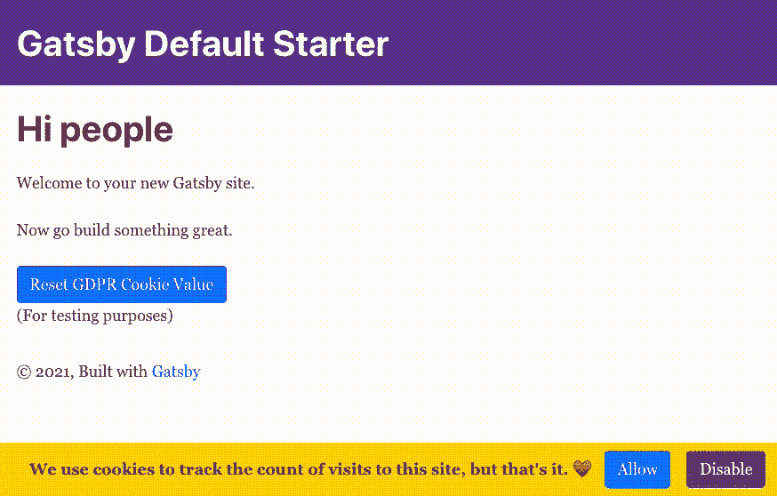

# 让我们建立一个时髦的动画粘页脚 GDPR 合规！

> 原文：<https://levelup.gitconnected.com/lets-build-a-snazzy-animated-sticky-footer-for-gdpr-compliance-65e510b7f091>

## **利用 react-reveal、react-cookie 和 Bootstrap 风格。**



一个小的 gif 图片，展示了我们将在这篇文章中构建的东西！

查看 GitHub Pages 站点运行 cookie 组件的示例！

*免责声明:我不是法律专家，因此您需要自己尽职调查，以确保 GDPR 合规性。*

# 先决条件

这篇文章假设你正在使用以下的组合:

*   盖茨比（姓）
*   反应
*   以打字打的文件
*   引导程序

如果你正在使用这些，这是最适合你的帖子。查看[示例站点](https://dev.to/fullstackchris/let-s-build-a-snazzy-animated-sticky-footer-for-gdpr-compliance-27ci)，其中有一个空的 Gatsby starter 站点，以查看横幅的实际效果！

# 基础组件

让我们从使用 Bootstrap 类呈现粘性页脚开始:

```
import * as React from "react"export function GDPRBanner() {
    return (
        <div className="fixed-bottom bg-gold p-2">
            <div className="row justify-content-center align-items-center">
                <span className="text-dark font-weight-bold mx-3">
                    We use cookies to track the count of visits to this site,
                    but that's it. ♥️
                </span>
                <button className="btn btn-primary mr-3">Allow</button>
                <button className="btn btn-secondary">Disable</button>
            </div>
        </div>
    )
}
```

这是一个好的开始，但它只是静态标记，没有实际功能。它会一直呆在那里，点击时按钮不会做任何事情。

# 添加 Cookie 和 Cookie 交互

在 Gatsby 插件网站上四处窥探，我发现了[Gatsby-plugin-gdpr-cookies](https://www.gatsbyjs.com/plugins/gatsby-plugin-gdpr-cookies/)插件。

我们可以通过以下方式安装:

```
npm install --save gatsby-plugin-gdpr-cookies
```

并像这样将其添加到我们的`gatsby-config.js`中:

```
{
    resolve: `gatsby-plugin-gdpr-cookies`,
    options: {
    googleAnalytics: {
        trackingId: 'YOUR_GOOGLE_ANALYTICS_TRACKING_ID',
        cookieName: 'gatsby-gdpr-google-analytics',
        anonymize: true,
        allowAdFeatures: false
    },
}
```

还有更多的设置，但这篇文章的范围将集中在谷歌分析。你可以在这里扩展这个过程，如果你正在使用其他的烹饪工具，比如脸书像素等等。

所以谷歌分析的 cookie 名称是`gatsby-gdpr-google-analytics`。为了避免在我的应用程序中硬编码，我通常会创建一个`Constants.ts`文件，在其中引用可重用的常量值，比如 cookie 名称。让我们现在创建它:

```
export class Constants {
    public static readonly GOOGLE_ANALYTICS_COOKIE_NAME =
        "gatsby-gdpr-google-analytics"
}
```

从[Gatsby-plugin-gdpr-cookies](https://www.gatsbyjs.com/plugins/gatsby-plugin-gdpr-cookies/)插件文档来看，当这个 cookie 的值被设置为`true`时，实际的 google analytics javascript 将被执行。其他任何值都不会。

我将使用 react 包 [react-cookie](https://www.npmjs.com/package/react-cookie) 来轻松地获取和设置这个 cookie 的值:

```
npm install --save react-cookie
```

我们可以从组件中的那个包导入钩子`useCookies`，我们将利用一个小的包装函数`setCookieValue`来设置值。然后我们可以在两个按钮的`onClick`属性中使用这个包装函数:

```
import * as React from "react"
+import { useCookies } from "react-cookie"export function GDPRBanner() {+    const [cookies, setCookie] = useCookies([
+        Constants.GOOGLE_ANALYTICS_COOKIE_NAME,
+    ])
+
+    const setCookieValue = (value: string) => {
+        setCookie(Constants.GOOGLE_ANALYTICS_COOKIE_NAME, value)
+    } return (
        <div className="fixed-bottom bg-gold p-2">
            <div className="row justify-content-center align-items-center">
                <span className="text-dark font-weight-bold mx-3">
                    We use cookies to track the count of visits to this site,
                    but that's it. ♥️
                </span>
+                <button className="btn btn-primary mr-3" onClick={() => setCookieValue("true")}>Allow</button>
+                <button className="btn btn-secondary" onClick={() => setCookieValue("false")}>Disable</button>
            </div>
        </div>
    )
}
```

# 添加动画

很好，这样我们就有了获取和设置 cookie 值的功能。让我们添加一些动画来增加横幅的趣味性。我们将使用 [react-reveal](https://dev.to/fullstackchris/let-s-build-a-snazzy-animated-sticky-footer-for-gdpr-compliance-27ci) ，所以我们现在可以安装它:

```
npm install --save react-reveal
```

我们可以将来自`react-reveal`的`<Fade/>`组件添加到我们的横幅组件中，并用它包装我们的横幅 div。我认为“底部”效果对这个粘性横幅最有意义:

```
import * as React from "react"
+import Fade from "react-reveal/Fade"
import { Constants } from "../../constants/Constants"export function GDPRBanner() {
    const [cookies, setCookie] = useCookies([
        Constants.GOOGLE_ANALYTICS_COOKIE_NAME,
    ]) const setCookieValue = (value: string) => {
        setCookie(Constants.GOOGLE_ANALYTICS_COOKIE_NAME, value)
    } return (
+        <Fade bottom>
            <div className="fixed-bottom bg-gold p-2">
                <div className="row justify-content-center align-items-center">
                    <span className="text-dark font-weight-bold mx-3">
                        We use cookies to track the count of visits to this
                        site, but that's it. ♥️
                    </span>
                    <button
                        className="btn btn-primary mr-3"
                        onClick={() => setCookieValue("true")}
                    >
                        Allow
                    </button>
                    <button
                        className="btn btn-secondary"
                        onClick={() => setCookieValue("false")}
                    >
                        Disable
                    </button>
                </div>
            </div>
+        </Fade>
    )
}
```

# 管理动画

现在，每当有人访问该网站时，无论他们是否允许 cookies，页脚都会动态显示。如果他们点击其中一个按钮，它也不会消失。那是相当讨厌的！我们需要一些逻辑上的补充来解决这些问题。

幸运的是，`react-reveal`有一个道具叫做`when`，如果设置为`true`，就会引发动画。更好的是，相反的情况也发生了:当`when`道具从`true`移动到`false`时，它将反向动画-在我们的例子中，离开屏幕。

在按照 cookie 逻辑做任何复杂的事情之前，我们首先需要知道组件是否被挂载——只有在那时我们才应该触发 fade 动画——否则，我们可能会看到难看的动画闪烁。为此，我使用了一个我称之为`useDidMount`的实用钩子:

```
import { useState, useEffect } from 'react'export function useDidMount() {
  const [didMount, setDidMount] = useState<boolean>(false) useEffect(() => {
    setDidMount(true)
  }, []) return didMount
}
```

我们可以导入`useDidMount`并在我们的组件以及`<Fade/>`组件的`when`属性中使用它:

```
import * as React from "react"
import Fade from "react-reveal/Fade"
import { Constants } from "../../constants/Constants"
+import { useDidMount } from "../../hooks/useDidMount"export function GDPRBanner() {
    const didMount = useDidMount()
    const [cookies, setCookie] = useCookies([
        Constants.GOOGLE_ANALYTICS_COOKIE_NAME,
    ]) const setCookieValue = (value: string) => {
        setCookie(Constants.GOOGLE_ANALYTICS_COOKIE_NAME, value)
    } return (
+        <Fade bottom when={didMount}>
            <div className="fixed-bottom bg-gold p-2">
                <div className="row justify-content-center align-items-center">
                    <span className="text-dark font-weight-bold mx-3">
                        We use cookies to track the count of visits to this
                        site, but that's it. ♥️
                    </span>
                    <button
                        className="btn btn-primary mr-3"
                        onClick={() => setCookieValue("true")}
                    >
                        Allow
                    </button>
                    <button
                        className="btn btn-secondary"
                        onClick={() => setCookieValue("false")}
                    >
                        Disable
                    </button>
                </div>
            </div>
        </Fade>
    )
}
```

但是我们需要扩展`when`属性，以包括我们甚至不需要显示横幅的情况——在 cookie 值已经设置好的情况下。让我们创建一个名为`needToShowBanner`的`const`来完成这个任务，并将其添加到我们的`when`道具中:

```
import * as React from "react"
import Fade from "react-reveal/Fade"
import { Constants } from "../../constants/Constants"
import { useDidMount } from "../../hooks/useDidMount"export function GDPRBanner() {
    const didMount = useDidMount()
    const [cookies, setCookie] = useCookies([
        Constants.GOOGLE_ANALYTICS_COOKIE_NAME,
    ]) const setCookieValue = (value: string) => {
        setCookie(Constants.GOOGLE_ANALYTICS_COOKIE_NAME, value)
    }+    const needToShowBanner =
+        cookies[Constants.GOOGLE_ANALYTICS_COOKIE_NAME] !== "true" &&
+        cookies[Constants.GOOGLE_ANALYTICS_COOKIE_NAME] !== "false" return (
+        <Fade bottom when={didMount && needToShowBanner}>
            <div className="fixed-bottom bg-gold p-2">
                <div className="row justify-content-center align-items-center">
                    <span className="text-dark font-weight-bold mx-3">
                        We use cookies to track the count of visits to this
                        site, but that's it. ♥️
                    </span>
                    <button
                        className="btn btn-primary mr-3"
                        onClick={() => setCookieValue("true")}
                    >
                        Allow
                    </button>
                    <button
                        className="btn btn-secondary"
                        onClick={() => setCookieValue("false")}
                    >
                        Disable
                    </button>
                </div>
            </div>
        </Fade>
    )
}
```

很好。因此，只有当 cookie 值无效时，才会显示横幅。换句话说，未设置为`true`或`false`。

# 最终微优化

我们已经非常接近了，但是我们还可以做最后两个微优化。😄

我发现我的站点加载*这么快*(是盖茨比吧？😜)，最好在显示横幅之前添加一点延迟，否则访问者可能甚至不会注意到底部的横幅淡入。

幸运的是，`react-reveal`支持另一个道具，`delay`，会延迟动画。我把这个值定为 600 毫秒。`react-reveal`还支持一个`duration`道具，我把它设置为 1000 毫秒。我将这两个值都添加到了我的`Constants`类中，但是可以随意修改它们的确切值:

```
export class Constants {
    public static readonly GOOGLE_ANALYTICS_COOKIE_NAME =
        "gatsby-gdpr-google-analytics"
+    public static readonly ANIMATION_DELAY = 600
+    public static readonly ANIMATION_DURATION = 1000
}
```

第二个微优化是这样的:当访问者点击“允许”或“禁用”按钮时，我们知道我们将隐藏横幅(通过`needToShowBanner`变量)，但是在隐藏动画中，我们*不希望*有延迟——我们希望对访问者的点击立即做出反应。因此，我们可以通过一个基于`needToShowBanner`值的三元组来设置`delay`的值，即:

```
const delay = needToShowBanner ? Constants.ANIMATION_DELAY : 0
```

有了这些补充，我们就有了组件的最终版本:

```
import * as React from 'react'
import { useCookies } from 'react-cookie'
import Fade from 'react-reveal/Fade'
import { Constants } from '../../constants/Constants'
import { useDidMount } from '../../hooks/useDidMount'export function GDPRBanner() {
  const didMount = useDidMount()
  const [cookies, setCookie] = useCookies([Constants.GOOGLE_ANALYTICS_COOKIE_NAME]) const setCookieValue = (value: string) => {
    setCookie(Constants.GOOGLE_ANALYTICS_COOKIE_NAME, value)
  } const needToShowBanner =
    cookies[Constants.GOOGLE_ANALYTICS_COOKIE_NAME] !== 'true' && cookies[Constants.GOOGLE_ANALYTICS_COOKIE_NAME] !== 'false'
+  const delay = needToShowBanner ? Constants.ANIMATION_DELAY : 0 return (
+    <Fade bottom delay={delay} when={didMount && needToShowBanner} duration={Constants.ANIMATION_DURATION}>
      <div className="fixed-bottom bg-gold p-2">
        <div className="row justify-content-center align-items-center">
          <span className="text-dark font-weight-bold mx-3">
            We use cookies to track the count of visits to this site, but that's it. ♥️
          </span>
          <button className="btn btn-primary mr-3" onClick={() => setCookieValue('true')}>
            Allow
          </button>
          <button c lassName="btn btn-secondary" onClick={() => setCookieValue('false')}>
            Disable
          </button>
        </div>
      </div>
    </Fade>
  )
}
```

# 我们完了！

太好了！我们有一个完整的生命周期，漂亮的风格，动画 GDPR 横幅。横幅按照[Gatsby-plugin-gdpr-cookies](https://www.gatsbyjs.com/plugins/gatsby-plugin-gdpr-cookies/)插件的要求与`gatsby-gdpr-google-analytics` cookie 的实际值进行交互，我们甚至通过`react-reveal`库添加了平滑的进入和退出动画。

[不要忘记查看运行 cookie 组件示例的 GitHub Pages 站点。](https://princefishthrower.github.io/gatsby-animated-gdpr-banner/)

**就这么定了！**

干杯！🍻

克里斯