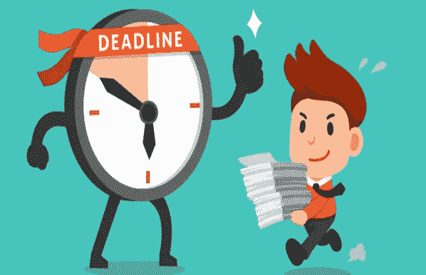

# 让我们挑战最后期限吧！

> 原文：<https://levelup.gitconnected.com/lets-challenge-the-deadlines-74fec9d8bca1>

## “没有期限的梦想在水里是死的。截止日期是实现我们目标的生命线。”- **马克·巴特森**

在时间压力下工作对学生来说是一项困难的任务。大多数学生正常工作，因为他们完成许多任务。任务是学生学术生涯不可或缺的一部分。每个学生，无论是在学校，学院或大学，都必须处理这些责任。学生必须一次阅读不同的科目，每个老师或教授指定一个要写的科目。如果特殊职务也接受需要完成的任务。需要完成与办公室工作相关的任务、项目和细节。每个求职者都应该处理这些任务。

嗯，让我告诉你，作为一名大学生是很难的，因为你必须在你的大学生活中提交这么多的作业。

它可能会破坏你希望在大学生活中获得的乐趣。所以让我们来看看我在接受任务时用过的一些技巧。

1.  **记下一切**

写下所有重要的作业日期是强制性的。你得到作业的日期和你必须提交作业的日期。如果你能把这一页日期贴在你房间的墙上会更好。它会帮助你记住所有活动和作业的日期。即使你写了题目、页数、标题和所有关于作业的东西，事实也会证明按时完成作业对你更有用。

除了写上提交日期，你还必须提到暂定日期，这样你就有足够的时间来编辑和校对你的工作文件。这是为您提供的一站式解决方案，它将有效地处理您的所有任务，并在您提到的暂定日期之前完成任务。即使在很短的时间内，他们也会提供质量最好的作业，并帮助你在所有的作业中获得更好的分数。

**2。阅读说明书&计划**

首先，你应该阅读任务说明书。也许你不会得到它。但只要通读一遍。记下提交截止日期。你可以知道你需要多少天来完成这项任务。把它写下来，或者只是在你的智能手机里放一个任务。也要为自己设定最后期限。

即使你有一大堆作业，但你需要单独完成每一项作业。所以你必须为每项作业制定一个时间表。一旦你得到任务，就有必要开始工作。你需要对你的任务有一个粗略的想法，不要继续拖延你的任务。即使没有很短的截止日期，你也有足够的时间，但没有必要一直推迟作业，因为你有很多时间来完成作业。这是大多数学生犯的最大错误。他们不断拖延任务，直到最后一天才开始做。所以，对于他们来说，在一天内完成它变得非常复杂和疲惫。如果你早点开始，你就不会错过最后期限，你会有足够的时间编辑、校对和修改作业。编辑和校对作业需要一个新的思维。如果你精疲力尽或疲惫不堪，那么你的大脑将无法发现错误和失误。

**3。优先完成任务**

现在你知道什么样的任务和你还剩多少天了。按照截止日期排序就行了。优先考虑最重要的和你必须先提交的作业。

现在再读一遍说明书，记下为了完成任务你必须填补的知识空白。一些谷歌搜索将填补这一空白，或者你可以使用你以前的讲座细节。

**4。设定时间目标**

最重要的是平衡你的工作和任务。你清楚地了解你的任务的大小和持续时间。所以管理好时间是非常重要的。

分配每项任务的预计时间目标。现实一点，用提交列表划分剩余的日期。不要试图从你自己身上期待奇迹。到时候相信我，你会因为压力和期限压力什么都做不了。所以，一定要在截止日期之前做好计划。确保收到截止日期的提醒。它会激励你去工作

**5。校对很重要！**

当一个人在写作业时，或者就此而言，写任何其他作品时；头脑中充满了思想和想法。因此，头脑和手并不同步，人们往往会犯某些错误。这些错误可能是不正确的语法用法、缺少标点符号、单词拼写错误等。作为一名学生，你的目标应该是在截止日期之前完成你的作业，这样你就有足够的时间重读你的作业并改正错误。

在这个阶段，对写作进行任何重大修改或进行一些重大编辑都不是一个好主意。但是你绝对可以重新组织段落，改变顺序以使你的想法更符合逻辑，并使用更好的词汇。使用像 Thesaurus.com 和 Grammarly.com 这样的在线网站，更好的词汇很容易整合，这些网站可以帮助你用同义词替换单词，在给定的上下文中听起来更好。大声朗读内容也是一个很好的练习，因为这将帮助你更好地发现语法、拼写和结构错误。

**6。从社交媒体上断开**

你需要远离你的干扰。当你试图解决你的任务时，把你的手机收起来，保持静音。社交媒体可能会分散你工作的注意力。所以最好远离你的工作时间。暂时离开脸书、Instagram 和其他平台。你应该做些小小的牺牲，以后你就可以幸福了。记住，**你要努力工作！没有人能为你做这些。**

继续专注于你的工作。当你需要休息时，就花时间和家人在一起。或者听音乐。它可以帮助你减轻压力，巩固你的人际关系。

**7。睡个好觉**

如果你被大量的作业困扰。大量的作业会让你的身心紧张，你无法专注于其中任何一项。所以，保持冷静和良好的睡眠是非常必要的。睡眠是减轻你焦虑和压力的最佳良药。大多数学生牺牲睡眠来完成作业。不建议学生使用。如果你睡眠不足，那么你将无法集中注意力，你的大脑将无法正常工作。你会因为睡眠不足而缺乏想法。如果你放松你的大脑，睡个好觉，你就能得到更多的想法。它往往以更快的方式工作。

**8。重复**

完成作业后，尽快提交。你会感到很轻松，也会激励你去完成下一个任务。休息一下吧。做你的其他工作，然后重新开始作业。不要让自己感到懒惰。继续你的计划。

如果你打算这样工作，毫无疑问，你会得到很多好处。所以开始工作吧！！！！

瞄准月亮，如果你错过了，你仍将是群星之一