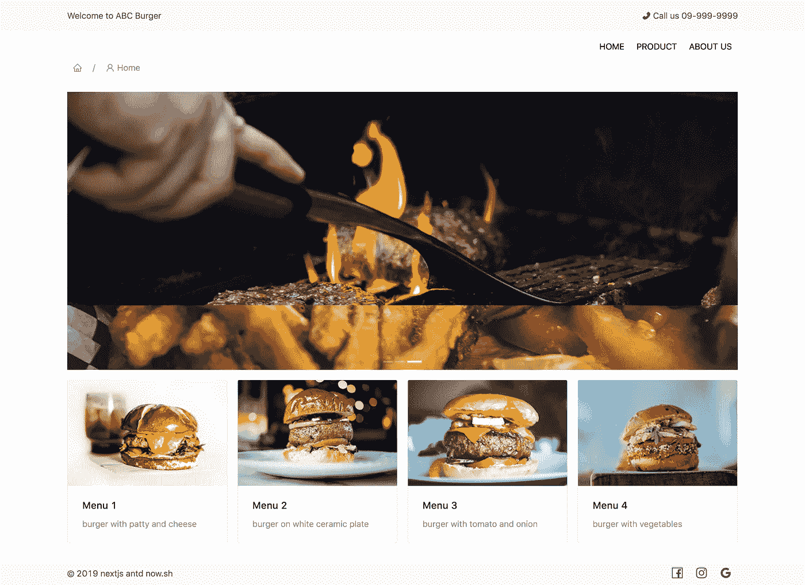

# 我们用 Next.js，Express，Antd 创建一个网站，用 Now.sh 部署

> 原文：<https://levelup.gitconnected.com/lets-create-a-project-with-nextjs-antd-and-deploy-with-now-sh-e38772348312>


本文我们将使用 Next.js，Express 创建一个示例 web，并使用 Ant Design 来设计 CSS 组件。我们将使用 Now.sh 部署项目。

结果 URL:[https://nextjs-antd-custom . autsakorn . now . sh](https://nextjs-antd-custom.autsakorn.now.sh)


要求:
-你要知道 HTML、CSS、Reactjs
-你要知道一点 Node.js
-你现在是会员了. sh([https://zeit.co/now](https://zeit.co/now))

首先，创建一个空的项目目录，并在其中初始化`npm`:

```
$ mkdir nextjs-antd-nowsh && cd nextjs-antd-nowsh && npm init -y
```

之后，让我们安装软件包

```
$ npm install next@latest --save-dev
$ npm install react react-dom --save
```

我们必须将 Next.js 保存到`devDependencies`，因为它是服务器的一个独立的依赖项。服务器端的依赖将在`devDependencies`部分。

下一步我们需要在`package.json`中定义一些脚本，因此我们将在那里添加以下内容:

```
{
  "scripts": {
    "dev": "next",
    "build": "next build",
    "start": "next start"
  }
}
```

现在，您可以通过在控制台中键入以下命令开始:

```
$ npm run dev
```

打开浏览器，访问`[http://localhost:300](http://localhost:3000)0`

哇！`404 | This page could not be found.`但这意味着你的服务器正在运行。

我们需要在其中创建一个“pages”目录和“index.js”文件。

```
// pages/index.js
export default () => (<div>Hello, World!</div>);
```

现在再次访问`http://localhost:3000`，你会看到你的第一页

## 安装和设计组件及其他

下一步，我们将添加 Ant 设计(`antd`)。我们将安装`antd`并自定义主题。

```
$ npm install antd less less-vars-to-js babel-plugin-import --save
$ npm install @zeit/next-less --save-dev
```

我们需要使用[少](http://lesscss.org/)作为造型的开发语言。为每个设计方面定义了一组较少的变量，可以根据您的需要进行定制。以下是一些主要变量:

```
@primary-color: #1890ff;         // primary color for all components @link-color: #1890ff;            // link color @success-color: #52c41a;                         // success state color @warning-color: #faad14;                  // warning state color @error-color: #f5222d;                  // error state color @font-size-base: 14px;                      // major text font size @heading-color: rgba(0, 0, 0, .85);       // heading text color @text-color: rgba(0, 0, 0, .65);              // major text color @text-color-secondary : rgba(0, 0, 0, .45);  // secondary text color @disabled-color : rgba(0, 0, 0, .25);      // disable state color @border-radius-base: 4px;                // major border radius @border-color-base: #d9d9d9;             // major border color @box-shadow-base: 0 2px 8px rgba(0, 0, 0, .15);   // major shadow for layers
```

我们将创建一个更简单的样式。用以下值初始化`assets/a-theme.less`:

```
[@primary](http://twitter.com/primary)-color: #ff4c3b;[@layout](http://twitter.com/layout)-header-height: 51px;
[@layout](http://twitter.com/layout)-header-padding : 0px 0px;
[@layout](http://twitter.com/layout)-header-background : #f8f8f8;
[@layout](http://twitter.com/layout)-body-background: #ffffff;
[@layout](http://twitter.com/layout)-footer-padding : 0px;[@border](http://twitter.com/border)-radius-base: 2px;[@collapse](http://twitter.com/collapse)-content-bg: #ffffff;
```

让我们在根目录中创建`.babelrc`并配置 Babel 以正确使用 Next.js 预置并导入`antd`

```
{
  "presets": ["next/babel"],
  "plugins": [
    [
      "import", {
        "libraryName": "antd",
        "style": true
      },
    ]
  ]
}
```

我们将创建一个`next.config.js`文件作为构建的入口点

```
module.exports = () => { /* eslint-disable */
  const withLess = require('[@zeit/next-less](http://twitter.com/zeit/next-less)')
  const lessToJS = require('less-vars-to-js')
  const fs = require('fs')
  const path = require('path') // Where your antd-custom.less file lives
  const themeVariables = lessToJS(
    fs.readFileSync(path.resolve(__dirname, './assets/antd-custom.less'), 'utf8')
  ) // fix: prevents error when .less files are required by node
  if (typeof require !== 'undefined') {
    require.extensions['.less'] = file => {}
  } return withLess({
    lessLoaderOptions: {
      javascriptEnabled: true,
      modifyVars: themeVariables // make your antd custom effective
    }
  })
};
```

现在你已经安装好了`Ant Design`和一个定制的主题。

现在让我们来构建我们的应用程序。

## 构建应用程序

这将是一个简单的应用程序，根路线是我们唯一的页面。打开 index.js 文件并更新下面的代码以使用我们的 Ant 组件。

```
import {
  Breadcrumb,
  Icon,
  Row,
  Col,
  Layout,
  Card,
  Carousel,
} from 'antd';
import Link from 'next/link'
import "../style.less";const {
  Header, Content,
} = Layout;export default () => (
  <Layout>
    <Header>
      <Row justify="space-around" type="flex">
        <Col span={20}>
          <Row justify="space-around" type="flex">
            <Col span={12} md={12} xs={24}>
              <span >Welcome to ABC Burger</span>
            </Col>
            <Col span={12} md={12} xs={0}>
              <span className="ml-30 float-right"><Icon type="phone" theme="filled" /> Call us 09-999-9999</span>
            </Col>
          </Row>
        </Col>
      </Row>
    </Header><Row justify="space-around" type="flex">
      <Col span={20} style={{ textAlign: 'right', height: 50, display: 'flex', justifyContent: 'flex-end', textTransform: 'uppercase' }}>
        <div style={{ width: 'fit-content', margin: 'auto 0px' }}>
          <Link href="/">
            <a>
              Home
            </a>
          </Link>
        </div>
        <div style={{ width: 'fit-content', margin: 'auto 0px' }}>
          <Link href="/">
            <a>
              Product
            </a>
          </Link>
        </div>
        <div style={{ width: 'fit-content', margin: 'auto 0px' }}>
          <Link href="/">
            <a>
              About us
            </a>
          </Link>
        </div>
      </Col>
    </Row><Row justify="space-around" type="flex">
      <Col span={20}>
        <Breadcrumb>
          <Breadcrumb.Item href="">
            <Icon type="home" />
          </Breadcrumb.Item>
          <Breadcrumb.Item href="">
            <Icon type="user" />
            <span>Home</span>
          </Breadcrumb.Item>
        </Breadcrumb>
      </Col>
    </Row><Row justify="space-around" type="flex">
      <Col span={20} style={{ paddingTop: '30px', paddingBottom: '30px', minHeight: '500px' }}>
        <Content>
          <div>
            <Carousel autoplay>
              <div>
                <h3>
                  
                </h3>
              </div>
              <div>
                <h3>
                  
                </h3>
              </div>
              <div>
                <h3>
                  
                </h3>
              </div>
            </Carousel>
          </div>
          <Row gutter={16}>
            <Col span={6} md={6} sm={12} xs={24}>
              <Card
                hoverable
                cover={
                  
                }
              >
                <Card.Meta
                  title="Menu 1"
                  description="burger with patty and cheese"
                />
              </Card>
            </Col>
            <Col span={6} md={6} sm={12} xs={24}>
              <Card
                hoverable
                cover={
                  }
              >
                <Card.Meta
                  title="Menu 2"
                  description="burger on white ceramic plate"
                />
              </Card>
            </Col>
            <Col span={6} md={6} sm={12} xs={24}>
              <Card
                hoverable
                cover={
                  }
              >
                <Card.Meta
                  title="Menu 3"
                  description="burger with tomato and onion"
                />
              </Card>
            </Col>
            <Col span={6} md={6} sm={12} xs={24}>
              <Card
                hoverable
                cover={
                  }
              >
                <Card.Meta
                  title="Menu 4"
                  description="burger with vegetables"
                />
              </Card>
            </Col>
          </Row>
        </Content>
      </Col>
    </Row><Row justify="space-around" type="flex" style={{ background: '#f9f9f9' }}>
      <Col md={8} xs={20} style={{height: '40px', display: 'flex'}}>
        <div style={{ margin: 'auto 0px' }}>
          &copy; 2019 nextjs antd now.sh
        </div>
      </Col>
      <Col md={8} xs={20}>
        <div style={{ margin: 'auto', height: '40px', display: 'flex', justifyContent: 'flex-end' }}>
          <Icon style={{ margin: 'auto 10px', fontSize: 20 }} type="facebook" />
          <Icon style={{ margin: 'auto 10px', fontSize: 20 }} type="instagram" />
          <Icon style={{ margin: 'auto 10px', fontSize: 20 }} type="google" />
        </div>
      </Col>
    </Row>
  </Layout>
)
```

在`pages`目录中创建`_document.js`，并编写如下代码。这是 Next.js 中的一个特殊文件，允许您更新提供给客户端的 HTML 文档，通常用于向`head`和`body`添加内容。

```
import Document, { Head, Main, NextScript } from 'next/document';export default class MyDocument extends Document {
  render() {
    return (
      <html>
        <Head>
          <meta name="viewport" content="width=device-width, initial-scale=1.0" />
        </Head>
        <body>
          <Main />
          <NextScript />
        </body>
      </html>
    )
  }
};
```

接下来，我们需要在根目录下创建一个`styles.less`文件，代码如下

```
.ant-carousel .slick-slide {
  text-align: center;
  height: 460px;
  line-height: 160px;
  background: #f8f8f8;
  overflow: hidden;
}
.ant-carousel {
  padding-bottom: 16px;
}
.ant-carousel .slick-slide h3 {
  color: #fff;
}a:visited, a:hover, a:active, a:focus {
  text-decoration: none;
}
a {
  color: #000;
  padding: 5px 10px;
}.ml-30 {
  margin-left: 30px;
}
.float-right {
  float: right;
}
```

由于`pages/index.js`使用了图像，我们需要创建`static/images/...`并将图像保存到该目录。

您可以看到来自资源库`[https://github.com/autsakorn/nextjs-antd-custom](https://github.com/autsakorn/nextjs-antd-custom)`的所有代码/文件

## 立即部署

我们现在有了一个正常运行的应用程序。您可以通过在下面键入命令并将结果上传到服务器来构建您的下一个应用程序。

```
$ npm run build
$ npm run start
```

但是，如果我们要用 now.sh，那就更简单了。

让我们用 now.sh 部署这个项目(需要有一个成员[https://zeit.co/now](https://zeit.co/now)

我们需要创建一个`now.json`文件，并使其遵循

```
{
  "version": 2,
  "builds": [
    { "src": "package.json", "use": "[@now/next](http://twitter.com/now/next)" }
  ]
}
```

并将`now`键入控制台

```
$ now
```

请等一会儿…你会得到网址，然后用你的浏览器访问



这只是一个示例项目，有些代码不是很好，所以你可以根据自己的需要进行改进。

结果网址:`[https://nextjs-antd-custom.autsakorn.now.sh](https://nextjs-antd-custom.autsakorn.now.sh)` 回购网址:`[https://github.com/autsakorn/nextjs-antd-custom](https://github.com/autsakorn/nextjs-antd-custom)`

谢谢:)

[](https://gitconnected.com/learn/react) [## 学习 React -最佳 React 教程(2019) | gitconnected

### 排名前 51 的 React 教程-免费学习 React。课程由开发人员提交并投票，使您能够…

gitconnected.com](https://gitconnected.com/learn/react)