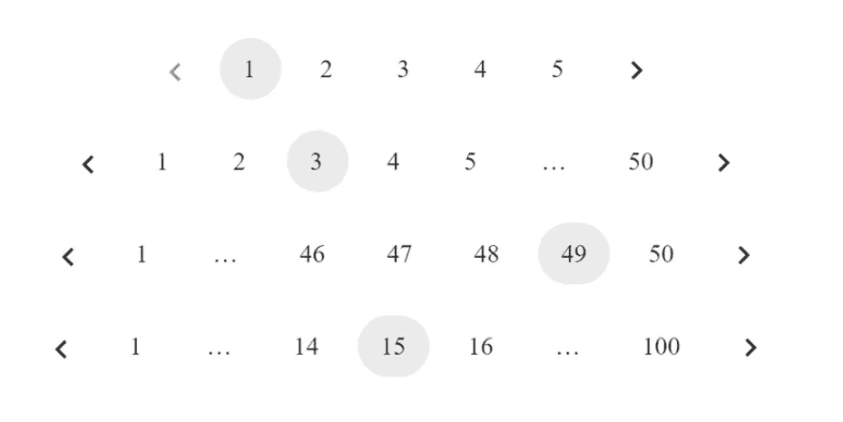

# 让我们创建一个 React 自定义分页(没有库！)

> 原文：<https://levelup.gitconnected.com/lets-create-a-react-custom-pagination-no-libraries-edc5d2531911>

## 从头开始构建


写完关于使用库添加分页栏的文章后，我想到从头开始创建分页。我在网上搜索了一下，发现了一个非常棒的定制分页库。这将是我们使用的 react 分页示例。

如果你愿意支持我成为一名作家，考虑报名参加[成为](https://freelancingcult.medium.com/membership)的媒体成员。每月只需 5 美元，你就可以无限制地使用 Medium。

我想为这个存储库写一个深入的解释。所以每个人都能理解这背后的逻辑。创建分页时也需要考虑同样的逻辑。

你可以从这里得到代码

[](https://github.com/mayankshubham/react-pagination) [## github-mayankshubham/react-pagination:用 StackBlitz ⚡️创建

### 这个项目支持两种 API:一个自定义钩子，它返回给你分页数据，这些数据可以用来…

github.com](https://github.com/mayankshubham/react-pagination) 

# 反应分页示例

以及来自这里的实时项目

[](https://stackblitz.com/edit/react-iy5zmn?devtoolsheight=33&file=src/index.js) [## react-分页(分叉)- StackBlitz

### 反应分页

stackblitz.com](https://stackblitz.com/edit/react-iy5zmn?devtoolsheight=33&file=src/index.js) 

# 创建自定义分页

我要讨论的第一件事是这个项目的核心逻辑。你可以在`usePagination.js`文件中找到核心逻辑

当开发核心逻辑以显示分页中的不同阶段时，这些是项目中使用的主要变量。

*   **当前页面**表示用户正在查看的当前活动页面。
*   **pageSize** -表示单个页面中显示的元素数量。
*   **totalCount** -是 API 端点返回的数据总数
*   **siblingCount-** 这是显示在所选页码两侧的最小按钮数。


*   **onPageChange-** 每当用户单击分页标签中不同的页码按钮时，都会调用该函数。`**onPageChange**` 抓取选中的页码并传递给逻辑。

在更高的层次上，基本上发生的事情是，我们将一组值传递给一个名为`paginationRange`的钩子，它将返回一组数字作为数组。该数组用于创建分页视图。


每当`currentPage`、`pageSize`、`siblingCount`或`totalCount`改变时，分页范围将被重新计算并给出更新值。

下面是`usePagination` 钩子的定义。

```
export const usePagination = ({
  totalCount,
  pageSize,
  siblingCount = 1,
  currentPage
}) => {
  const paginationRange = useMemo(() => {
     // Our implementation logic will go here 

  }, [totalCount, pageSize, siblingCount, currentPage]); return paginationRange;
};
```

这里我们使用了`useMemo`钩子，每当依赖数组中的值改变时，逻辑将再次运行。返回类似这样的`paginationRange`值。


在前端，我们将返回的`paginationRange`数组映射成这样


下面是分页的其他可能的表示形式。因为每次点击按钮时，分页栏都会改变它的视图。接下来，我们将看到如何为每个可能的用例生成相关的`paginationRange`数组。

这些是分页栏的不同状态和视图



在我们继续解释每个场景之前，让我们看看如何决定分页中的总页数。

`const totalPageCount = Math.ceil(totalCount / pageSize);`

这里的总计数是指需要显示的总值。我们使用`Math.ceil`将数字四舍五入到下一个值。

示例-我们总共有 96 个元素(`totalCount`)要显示，页面大小为 10( `pageSize`)。96 除以 10 是 9.6 (9 个完整的页面和 6 个剩余元素)要添加剩余的 6 个元素，我们必须添加另一页，所以我们需要 10 页。

接下来，我们实现了一个自定义的 range 函数，它将起始值和结束值作为参数来生成从头到尾都包含元素的特定数组。

类似这样的东西

```
const range = (start, end) => {
  let length = end - start + 1;
  /*
  	Create an array of certain length and set the elements within it from
    start value to end value.
  */
  return Array.from({ length }, (_, idx) => idx + start);
};
```

## 情况 1 -页数少于我们想要显示的页数

在这种情况下，我们返回范围 **[1..totalPageCount]** 。让我们看看如何生成这个范围

要显示的页数(`totalPageCount`)少于分页栏中可显示的总页数(`totalPageNumbers`)。

示例-同辈计数为 1 的分页栏中显示的总页数为 7(起始页+结束页+所选页+同辈计数+2*点标签)。如果来自 API 的总值可以显示在少于 7 页的页面中，我们必须返回 **[1..totalPageCount]**

在这种情况下，我们需要显示所有页面，同时不最小化中间的页码

当计算分页栏(`totalPageNumbers`)中可以显示的页数时，是这样计算的。
首页+末页+当前页+2 *点+siblingCount

同级计数根据用户需求而变化。

```
// Pages count is determined as siblingCount + firstPage + lastPage + currentPage + 2*DOTS
    const totalPageNumbers = siblingCount + 5;
```

逻辑返回 **[1..**根据案例 1

如果`totalPageNumbers`大于`totalPageCount`，那么分页条应该包含点和兄弟。

这里的同级按钮指的是所选页面两侧的页码按钮。


在上图中，同级值是 14 和 16。(因为选择的数字是 15)

如果有人点击了第 16 页，则兄弟值为 15 和 17。

所以我们必须计算相关值的兄弟索引。下面是计算兄弟索引的逻辑。请记住，这里的指数不是以 0 为基础的。您可以将这些值代入逻辑并计算出`leftSiblingIndex`、`rightSiblingIndex`值。


根据上图的逻辑兄弟索引是 2 和 4，它与兄弟值相同。同级 2 的索引也是 2。同级 4 的索引是 4。

当添加点时，还有另一种边缘情况。如果兄弟姐妹后面只剩下一页，我们就不加点。看下面的图片


这里 3 的兄弟姐妹是 2 和 4。但是我们不在 2 之前加点，因为下端只剩下一页了。当有人点击 97 时，情况也是如此


没有必要在 98 后添加点，因为还有一页到上端。

下面是相关的逻辑

## 情况 2:没有左侧点要显示，但有右侧点要显示

在下面的代码中`var DOTS="…"`


## 情况 3:没有右点显示，但有左点显示


## 情况 4:左右点都要显示

如何实现组件

通过导入我们之前创建的`usePagination`钩子，我们获得了相关的数组，并基于该数组映射前端。

在高层事物中，基于`paginationRange` 创建前端时我们应该做的是

1.我们应该将下一个的**和上一个**的**箭头按钮添加到分页栏中**

2.遍历数组，抓取数组中的点(…)，并在该处添加合适的样式。

3.抓取数组中选定的页码，并在该位置添加一个单独的样式(选定样式)

4.如果不是圆点或所选页面，只显示页码

我们已经使用了`classnames` npm 包来轻松地有条件地添加类。
你可以在这里找到关于类名包的更多细节

[](https://www.npmjs.com/package/classnames) [## 类名

### 一个简单的实用程序，用于有条件地将类名连接在一起

www.npmjs.com](https://www.npmjs.com/package/classnames) 

我希望你喜欢读这篇文章。如果你愿意支持我成为一名作家，可以考虑注册[成为一名媒体成员](https://freelancingcult.medium.com/membership)。每月只需 5 美元，你就可以无限制地使用 Medium。