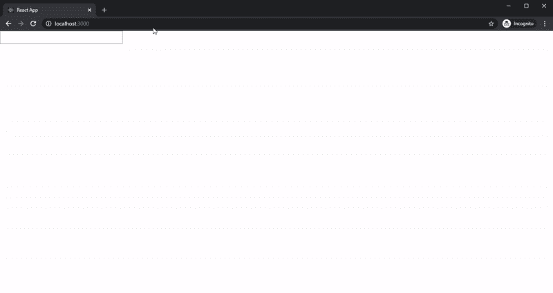

# 让我们在 React Hook 中创建一个自动完成组件

> 原文：<https://levelup.gitconnected.com/lets-create-an-autocomplete-component-in-react-hook-70a3f20008d2>

自动完成是一种通过比较当前文本和以前输入的文本来提示完成键入内容的功能。该功能有助于用户轻松使用软件。如下图示例所示:



自动完成示例

在这一章中，我们将展示以下主题
-创建一个 React 项目
-创建组件
-使用 React 钩子

## 创建 React 项目

在您的终端中使用以下命令安装该软件包。

```
npx create-react-app autocomplete-article
cd autocomplete-article
npm start
```

## 创建一个组件

我们将使用下面的代码创建一个新文件“src/components/Autocomplete.js ”,并保存它。

## 添加样式

我们需要为自动完成添加样式文件“App.css ”,编写以下代码:

使用下面的代码编辑 src/App.js 以导入自动完成组件。

打开你的浏览器访问:localhost:3000，你应该看到如下图。


自动完成组件

我已经完成了自动完成组件。

回购喜欢:[https://github.com/easywebsify/react-autocomplete-component](https://github.com/easywebsify/react-autocomplete-component)

感谢您的阅读。