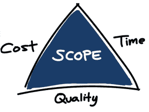

# 让我们来解构一下 10X 开发者

> 原文：<https://levelup.gitconnected.com/lets-deconstruct-the-10x-developer-d5b9857285e8>

Rockstar 开发者，10X 工程师，guru 等。绰号数不胜数。如果你在软件行业，你会在任何地方听到这个术语。

企业喜欢称他们的工程师为摇滚明星，IT 流行文化用这些绰号来暗示达到涅槃般地位的开明学者。

事实是，超级高性能开发人员拥有一套独特的技能，使他们比没有经验的同行更有效。

那么我们能从精英开发者身上学到什么呢？

**了解业务**

拥有丰富经验和多个项目的工程师通常了解项目的业务方面，并能够与利益相关者和非技术人员有效沟通。

他们理解产品的目标、生命周期、预期用途和客户。

**他们考虑价值传递**

作为开发者，我们通常在用户故事和功能的优先级和概念上有发言权。优秀的开发人员致力于价值交付、特性和任务，这些将影响客户，并对他有真正的附加价值。

他们不会把时间投入到过早的优化或追逐像新的酷框架和库这样闪亮的东西上。

> 理解妥协是存在的，但目标是在给定的预算和时间内向客户交付最大的价值和质量。

**掌握高投资回报率的技术技能**

他们拥有大多数初级开发人员尚未掌握的技术技能，其中一些技能在软件解决方案的自动化、质量保证和工业化方面带来了巨大的投资回报。

了解可伸缩性、性能、安全性以及可能的瓶颈和问题。

代码、管道自动化、shell 脚本或数据库优化等基础设施都是这些高产出技能中的一部分。

**理解软件开发背后的理论**

关注点分离、坚实的原则、编程范例、设计模式和软件架构等概念对他们来说并不陌生。

为了成为一名伟大的工程师，你必须理解工程背后的理论，并将这一概念融入你的决策过程。

我不是说你需要大学文凭才能达到这个水平。然而，优先考虑学习概念而不是框架。

**指导没有经验的开发人员**

一个更有经验的工程师能为团队做的最有价值的事情之一就是指导更多没有经验的开发人员，帮助他们提高水平。

结对编程和公关评论是分享知识的好方法。

**永远不要停止学习**

所有的开发人员都听过这句话无数次，但是只有少数人真正长期保持这种心态。将每个项目视为一个学习机会，追逐真正的挑战是成为真正的摇滚明星的必由之路。

任何人都可以成为 10 倍的开发者，事实上，有一种误解认为他们比团队中的其他人产生 10 倍的故事点，这通常是一种幻想。

他们掌握了时间和精力分配的艺术，这导致了巨大的价值交付。