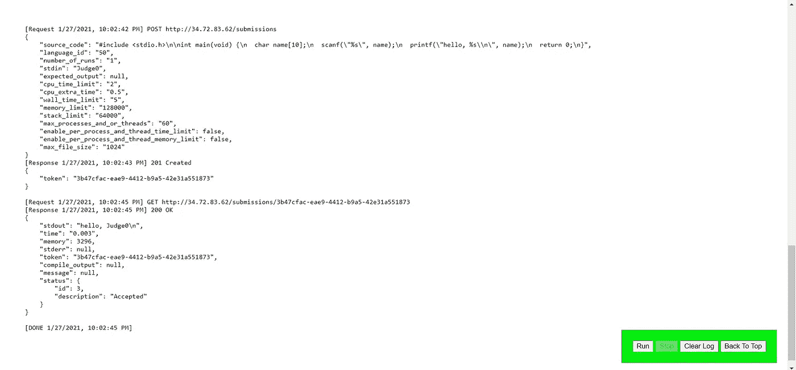
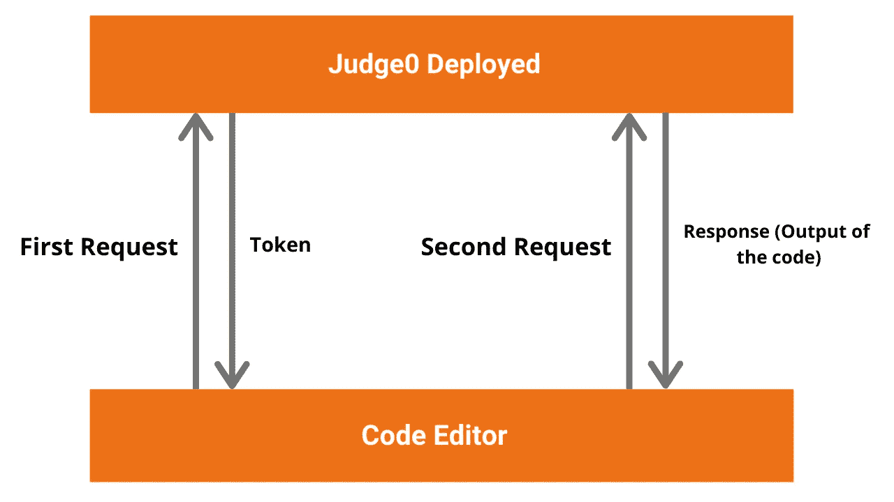

# 让我们开发一个像 HackerRank 这样的在线代码编辑器&编译器

> 原文：<https://levelup.gitconnected.com/lets-develop-an-online-code-editor-compiler-like-hackerrank-c433d8db060d>

第 2 部分:深入研究 API

[西格蒙德](https://unsplash.com/@sigmund?utm_source=medium&utm_medium=referral)在 [Unsplash](https://unsplash.com?utm_source=medium&utm_medium=referral) 上拍照

# 本系列教程

1.  [在谷歌云中部署我们的在线代码执行器](https://medium.com/javarevisited/lets-deploy-our-online-code-executor-in-google-cloud-e76a9fabac57?postPublishedType=repub)
2.  了解 Judge0 的 API(本教程)
3.  [创建在线代码编辑器前端](https://medium.com/javascript-in-plain-english/lets-develop-an-online-code-editor-compiler-like-hackerrank-702881803eee)

# YouTube 教程

# 简短的演示

决赛成绩

# 后端 API

让我们先来谈谈我们在本教程中使用的不同的 API。我们使用 [**Ace 编辑器**](https://ace.c9.io/) 进行代码编辑，使用 [**判断 0**](https://judge0.com/) 进行代码执行。

**Ace** 是一个用 JavaScript 编写的**嵌入式代码编辑器**。它与 Sublime、Vim 和 TextMate 等原生编辑器的功能和性能相匹配。它可以轻松嵌入到任何网页和 JavaScript 应用程序中。

**Judge0** 是一个健壮的、可扩展的、开源的**在线代码执行系统**，可用于构建需要在线代码执行特性的各种应用。它用于多种竞争性编程平台、代码编辑器、电子学习平台。

当我们编写代码时，我们将代码作为一个 **POST** 请求传递给`http://34.72.83.62/submissions`，并得到一个令牌作为响应。假设我们得到一个响应为`3b47cfac-eae9-4412-b845-42e31a551873`。这是我们需要发送给服务器的令牌，用于下一个 GET 请求。

我们做一个**得到**的请求给`http://34.72.83.62/submissions/3b47cfac-eae9-4412-b845-42e31a551873`。我们从这个网络调用中得到的响应就是我们的结果。我们在超时后进行这个网络调用，因为有时我们的代码可能需要一些时间来执行。

如果答案已经准备好了，那么第二个 API 调用将给出我们的答案。在我们的代码中，我们使用了 5 秒钟的超时时间。

该图描述了为编译代码和获得输出而进行的网络调用。`source_code`是我们写的代码，`language_id`是该语言的 id(50 代表 C++)。然后，使用令牌进行另一个调用，以获得程序的输出。

我们可以通过下图简单地理解这一点。

从代码编辑器到 judege0 服务器的数据流

下面是这方面的代码。我们从 HTML 中获取`lang_id`，并相应地进行网络调用。**对于 Java 代码是 62，C++是 53，Python 是 70** 。所有的语言都有不同的 id 与之关联。**列表可以使用** [**这个**](http://134.209.156.1/languages) 找到。这是在`language_id` 中传递的。我们还根据`lang_id`为编辑器设置默认值。我们还为每种语言设置了一些默认代码。

前端部分将在下一个教程中讨论。

完整的代码可以在下面的库中找到。

 [## webtutsplus/代码编辑器

### Ace 是用 JavaScript 编写的代码编辑器。此存储库仅生成了文件。如果你想在 ace 上工作，请…

github.com](https://github.com/webtutsplus/code-editor)