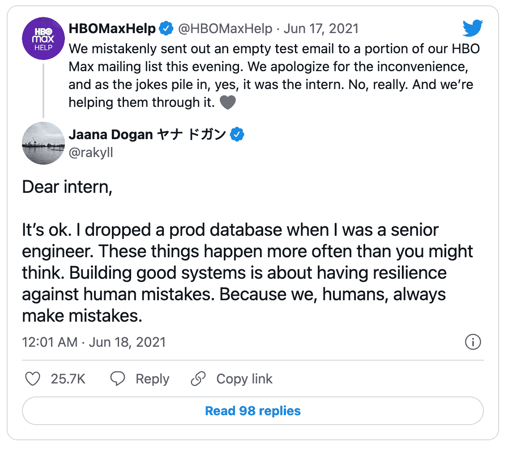
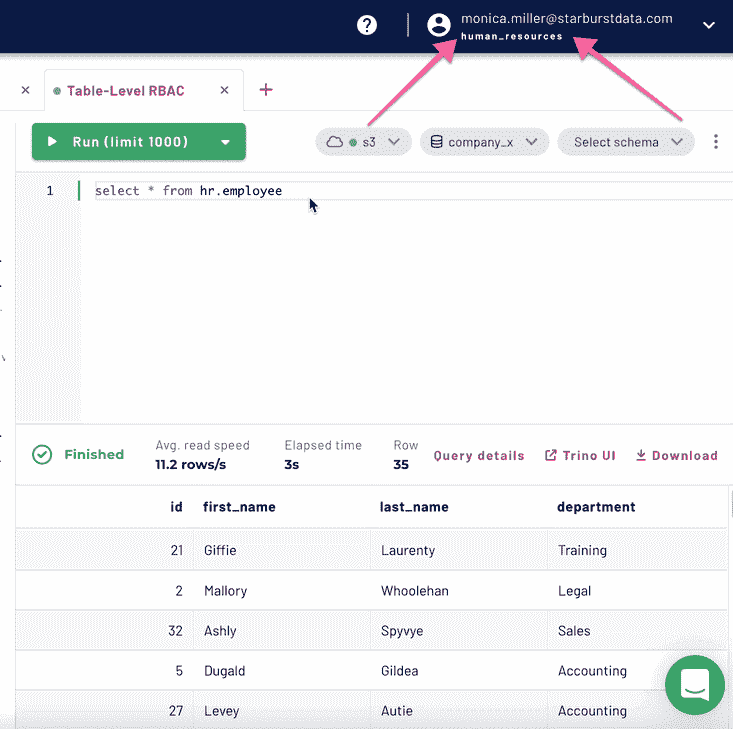
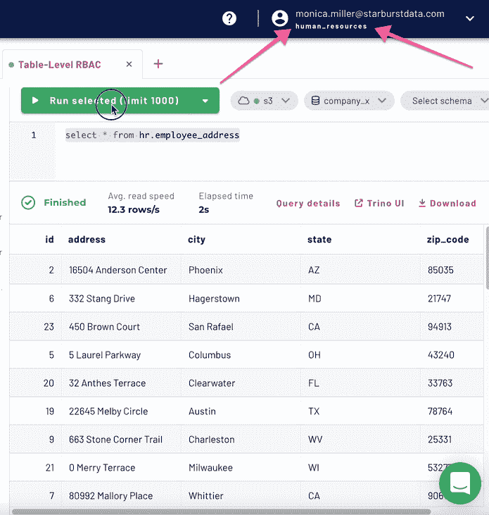
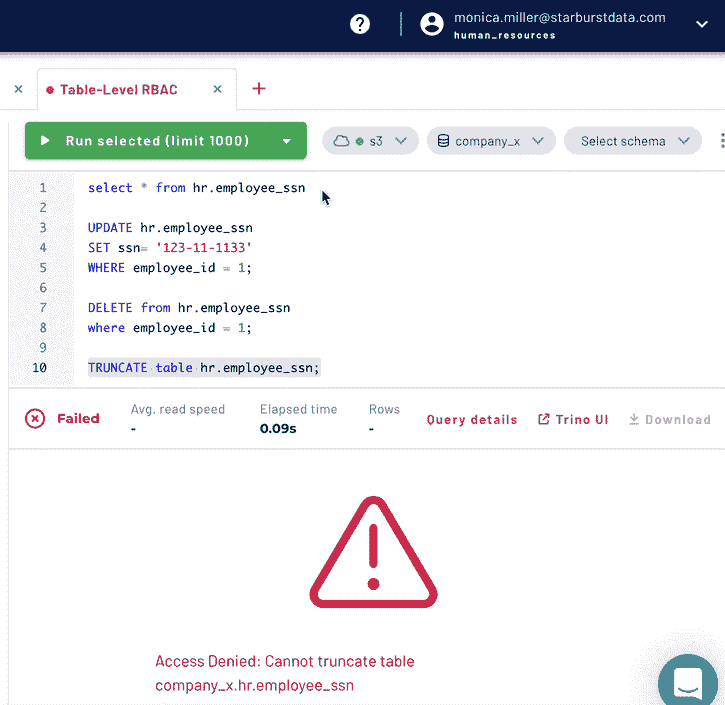

# 让我们来细化一下

> 原文：<https://levelup.gitconnected.com/lets-get-granular-d9087db8cab8>

## 为什么粒度会影响基于角色的访问控制的执行

凯尔·格伦在 [Unsplash](https://unsplash.com/photos/dGk-qYBk4OA) 上的照片

在我开始第一份工作大约一个月后，我完成了我的第一条数据管道。我沉浸在“那是我做的！”然后，我开始测试导致加载工作偏离方向的管道。在我的辩护中，我的工作成功地完成了，我的最终表有一个预期的输出，所以作为一个天真的数据工程师，我没有深谋远虑去进一步调查。然而，我最终截断了一个大约有 30 个人在使用的引用表，然后继续向那个表写入 500 多行垃圾。幸运的是，这只发生在开发环境中，但这并没有减少我的苦恼。最糟糕的部分？我甚至不是那个发现我做了什么的人。我不得不被告知我的错误，然后不好意思地向所有那些因为无法在自己的管道上工作而毁了自己周二的人道歉。信心大增。

照片由[瓦尔瓦拉格拉博娃](https://unsplash.com/@santabarbara77)在 [Unsplash](https://unsplash.com/photos/NCSARCecw4U) 拍摄

我相信你已经经历或目睹了一些类似的场景，最终一个人的工作影响了整个技术生态系统。这些故事不仅很常见，而且非常容易理解，以至于我们都为每一个新发生的事件集体叹息。我的一位同事甚至为这些人为错误注册了一个口头禅，并不断声明“问题出在椅子和键盘之间。”这些不幸的事故不仅是为新手或实习生保留的，而且是经验不可知论者，可能会发生，直到机器人起义消除了人类触摸任何计算机的需要。

贾娜·多安在推特上发推文

这些场景的概率直接随着访问王国之钥的人数增加而增加。适当地锁定王国，减少有人意外犯下像我这样的错误的可能性。您如何有效地做到这一点，并且仍然授予人们适当的权限来完成他们的工作？答案是**基于角色的访问控制(RBAC)** 。大规模的事故只是将 RBAC 恰当地集成到任何数据源系统中的众多原因之一。RBAC 还可以增强安全性，实现法规遵从性，并明确区分管理员责任和用户责任。

## **基于角色的访问控制基础(RBAC)**

那么，RBAC 到底是什么？*这是* *一种基于个人在组织中的角色授予和限制权限的正式方法*。其目的是建立适当的安全措施，防止信息被大众消费，而是只将这些权限授予需要它的人。这些想法并不新颖也不陌生，因为许多组织都在他们的系统中实现了某种 RBAC。然而，RBAC 真正的成败在于执行力。

当我们第一次建立访问组时，我们都打算适当地遵循 RBAC。我们许下承诺。别担心，这次会不一样的！我会保持小组小规模！问题是管理员不知所措，一时兴起就给出了访问权限。我知道第一手资料，因为我是一个特定角色的前管理员，他打算保持一个严密的船，但开始做有利于有利于和随意地分发访问权。很快，3 个管理员变成了 12 个。坦率地说，这是 12 个失败点，因为人们对系统了解不够，无法获得他们所拥有的访问权限，而不是将组只交给最了解系统的个人。在你知道之前，RBAC 不再意味着任何事情，我们是查理布朗又一次陷入露西的足球把戏。

## 表级别的 RBAC 粒度

真正的谈话。我应该让*永远不要让*访问引用表，更不用说截断它了。这里的失败是没有在表级别建立 RBAC 粒度，在表级别，我应该只拥有作为个人用户从表中进行选择的权限。如果我们继续在表级粒度深入研究 RBAC，有两个直接的实例可以应用于数据库来帮助执行最佳实践。这里的关键是理解用户可以访问哪些表，以及他们拥有什么样的访问权限。我使用 [Starburst Galaxy](https://www.starburst.io/platform/starburst-galaxy/) 创建了每个实例的示例，Starburst 的 saas 产品提供查询联合、数据湖分析、批处理，现在在表级别实现 RBAC，以支持最佳数据治理和数据合规性实践。[星爆银河](https://www.starburst.io/platform/starburst-galaxy/)也是管理员最好的朋友，它使得给每个角色分配不同的权限变得非常容易，穴居人也能做到。

1.  数据消费者应该只能从与其角色相关的表中进行选择。

电力公司最宝贵的是他们的数据。有了这种强大的能力，就有了适当保护任何种类的关键或敏感数据元素(如 PII、PCI、PHI 等)的重大责任。许多银行或医疗保健组织都熟悉未能执行正确的数据治理原则所带来的监管影响，而表级 RBAC 在粒度级别强化了正确的标准，这在模式级别是不可能的。

作者 GIF

虽然营销部门不应该直接访问企业数据仓库中的人力资源数据，但在某些情况下，一个特定的表需要这种访问。如果您的粒度级别仅归结为模式级别，那么该员工要么为某人创建大量额外的工作来复制数据以供私人查看，要么他们获得对其他表中该模式中所有专有员工信息的访问权。

作者 GIF

*2。在类似生产的环境中运行 SQL 动作查询必须有一个既定的障碍。*

我并不主张任何数据工程师都不应该拥有执行这些活动的权限，我也不是说个人应该只在较低级别的环境中拥有这些能力。然而，在极少数情况下，手动更新数据库的解决方案是正确的。如果文化规范是接受数据更正的手动变通方法，那么加载数据的系统需要重新设计。在任何情况下，仍然应该有额外的 RBAC 表级控制，以防止围绕提供第 1 层报告、仪表板或其他关键业务运营的表的这些潜在变化，从而将健康的数据治理实践扩展到可接受的答案之外。例如，一名人力资源工程师，即使他们有权访问人力资源表，也可能无权更改社会保障维度表中的任何信息。

作者 GIF

## **粒度 RBAC 实现的秘密**

仅仅谈论实施精细的 RBAC 战略而不采取后续行动是没有用的。以下是在增加当前 RBAC 方法的粒度时要考虑的一些主要因素。

***为新的和现有的角色建立明确的范围***

有了书面的职责定义，角色的意图和目的就不会模糊不清了。明确定义的目的不仅可以防止角色被误用，还可以防止责任的意外重复。清楚地定义这些需求可以避免在选择微妙的角色时的猜测，因为有三个不同的角色实际上最终执行相同的操作。同样重要的是要有可用的信息，并且要清楚谁符合每个角色的标准，谁不符合。

***审核角色准确性***

在明确确定每个角色的意图后，应该有一个定期确认每个角色有效性的审查过程。特别是在早期的系统开发中，角色和职责在到达它们的实际用例之前可能会改变十倍。通过建立评审周期，这可以确保所开发的角色是当前的，并且与意图相匹配。寻找评审过程中的任何缺口，并潜在地将一个角色分成两个，或者根据需要改变角色也是有益的。如果您只是给出访问权限，而没有正确遵守不断变化的协议，那么您就落伍了。如果没有适当的维护，让 RBAC 就位根本没用。

***设置保障措施***

就像任何其他开发项目一样，当涉及到在 RBAC 过程上执行时，应该有一个高的总线因子。通过将维护这些精细的 RBAC 标准的责任分配给多个个人，这种观念从可能被忽略的安全需求转变为日常工作不可或缺的一部分。这也鼓励了法规遵从性和数据治理标准的多个接触点，这使得健康的数据实践在组织中更加根深蒂固。

## **最终想法**

在正确的粒度上基于角色的访问控制，在这种情况下是在表级别，就像保险一样。你在这个过程中投入了大量的时间，希望你永远也不会用到它，但是当它把你从不幸中拯救出来的时候，你会永远感激它。这就是为什么我强烈建议制定一个计划来调查您当前的数据环境，并测试系统是否符合您对 RBAC 安全性的期望。如果理想结果和实际结果不一致，那么可能是时候投资工具来缩小差距了。试试[星爆银河](https://www.starburst.io/platform/starburst-galaxy/)，今天就可以获得价值 500 美元的免费积分来练习你自己的 RBAC。

作者提供的视频