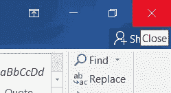
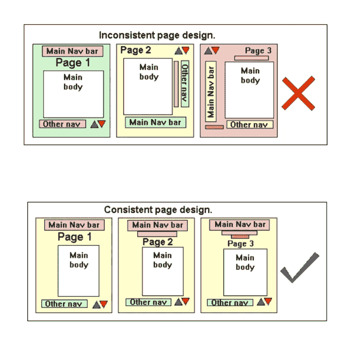
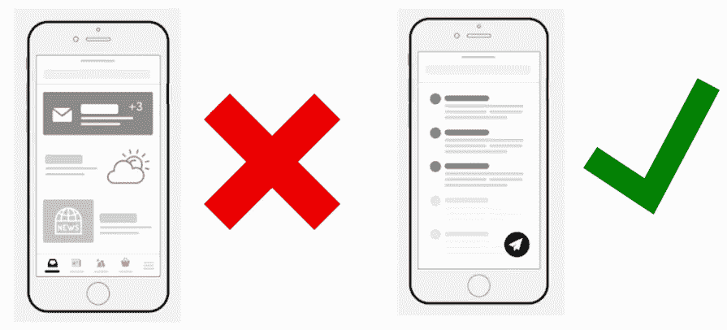

# 让我们来了解一下界面设计原则

> 原文：<https://levelup.gitconnected.com/lets-get-to-know-about-interface-design-principles-4a7e6f72415c>

## 可用于实现综合接口的设计原则

劳拉·热罗尔在 [Unsplash](https://unsplash.com/s/photos/web-designing?utm_source=unsplash&utm_medium=referral&utm_content=creditCopyText) 上的照片

> ***界面*** *是用户和系统之间的中间组件。因此，作为界面设计师，我们应该在不影响用户期望和先前体验的情况下仔细设计界面。为了克服糟糕的界面设计，我们可以在设计界面时遵循以下原则。以下每个原则都是通过设计原则的主要概念提取出来的，如* ***Shneidermans 的 8 条黄金法则*** *，* ***Norman 的 7 条原则*** *和****nielsens 的用户界面设计可用性启发式*** *。*

在设计界面的时候，没有严格的规则可以遵循，但是原则是我们应该知道和意识到的，记住关于界面设计的事情。

有 14 个重要的设计原则供你考虑，下面将逐一介绍。

# **1。启示**

根据 ***【启示】*** 原则，界面设计本身就指导着用户，如何处理和使用界面。这可以通过提供 hits 来实现，比如应该使用的接口。

例如，我们可以将界面设计与物理功能对应起来，

***按钮:*** *假设被按下*

***十字图标:*** *关闭窗口或停止动作*

作者图片

# **2。约束条件**

***【约束】*** 原则是指关于界面设计的一些规则、条件或限制。更确切地说，它限制了用户的期望，但它一眼就能指引正确的行动。因此，在设计界面时，我们应该小心翼翼，内容不要太多也不要太少。

# **3。一致性**

图片由谷歌提供

一个特定的界面有几个子组件，一个网站有多个页面。因此我们应该保持其中的 ***【一致性】*** 原则。

举个例子，如果我们有一个左对齐的界面，我们应该为在同一个网页上的界面保持这种布局，因为当保持一致性原则时，用户可能不会感到困惑，并以熟悉的方式工作。

另一方面，遵循一致性原则，界面设计可以重用。

# **4。可发现性**

如果我们的界面遵循 ***【可发现性】*** 的原则，当用户不知道如何做时，他们可以很容易地知道他们应该做什么。这个概念对新手用户很重要。

因此，我们的界面应该为用户提供一组可见的指令，特定的功能应该是可见的。

# **5。文档**

***【文档】*** 原理可以通过用户手册的概念很容易理解。实际上，用户手册是特定设备或机械项目的学习材料。

当设计界面时，我们应该维护一个单独的文档来学习，它将提供帮助并使搜索易于使用。当有许多交互和复杂的步骤要遵循时，这将非常有帮助。

# **6。轻松舒适**

**当我们与过去的界面设计相比时，这在现在是适用的，因为所有通过界面的服务都试图给用户更好的性能，与他们的竞争对手竞争。**

# ****7。股权****

**在解释公平原则之前，我们应该知道平等和公平的区别。**

*****平等:*** *给每个人提供同样的东西***

*****股权:*** *故意提供某物***

**因此，我们应该通过 ***【公平】*** 原则来理解，我们的界面应该为每个用户提供相同的用户体验。这实际上是一个很难实现的原则，因为我们的界面与具有不同能力的用户交互。**

# ****8。反馈****

****

**作者图片**

**当我们设计一个界面时，它应该通过 ***【反馈】*** 提供系统状态。如果用户执行任何动作或者改变系统的状态，我们的界面应该能够通知用户所做的改变。**

**提供反馈有助于用户理解未来，并可以避免错误的行动。**

**值得一提的是，“ ***糟糕的反馈可能比没有反馈更糟糕。*****

# ****9。灵活性****

**为了通过我们的界面解决用户的偏好，我们应该对他们最喜欢什么以及不喜欢什么有一个相当清楚的了解。因此 ***【灵活性】*** 原则有助于做出适合不同个人选择的更好的界面。**

# **10。映射**

*****【映射】*** 原则描述了我们的界面设计应该映射到现实世界的效果中，简单地说，我们的界面设计应该说用户的语言。**

# ****11。感知能力****

*****“可感知性”*** 原则是指用户应该了解系统状态，也就是能够感知发生了什么。这可以通过用户和系统之间的适当通信来实现。**

# ****12。公差****

**这个原则意味着公差如何与用户交互。如果我们的界面设计感觉安全，用户可以在不崩溃系统的情况下做实验。通过遵循 ***【宽容】*** 原则，我们可以创建一个有效的系统和界面来匹配用户的体验和期望。**

# **13。简单性**

****

**作者图片**

**我们的界面应该遵循 ***【简单】*** 的原则，不要把分散用户注意力的视觉对象搞得乱七八糟，因为太多可见的东西会让用户更难清楚地看到必然可用的选项。**

**因此，我们应该仔细选择什么是重点，什么应该更关注我们的界面，以简化界面。**

# ****14。结构****

*****【结构】*** 原则说，我们在设计用户界面时应该考虑它们的架构，因为根据用户心智模型组织良好的界面将有助于提取界面功能的实际价值。**

**另一方面，我们应该在不混淆用户的情况下将相关的东西放在附近。**

**酷友们…😊**

> **现在，通过上面描述的 14 个设计原则，我们对界面设计的原则有了更好的理解。当你在设计界面的时候，确保遵循这些原则来制作有效的界面，而不分散用户的期望。**

**希望你能对界面设计原理有一个清晰的认识，并拍手叫好🙌如果你认为这对你有用。**

**感谢您的阅读……**