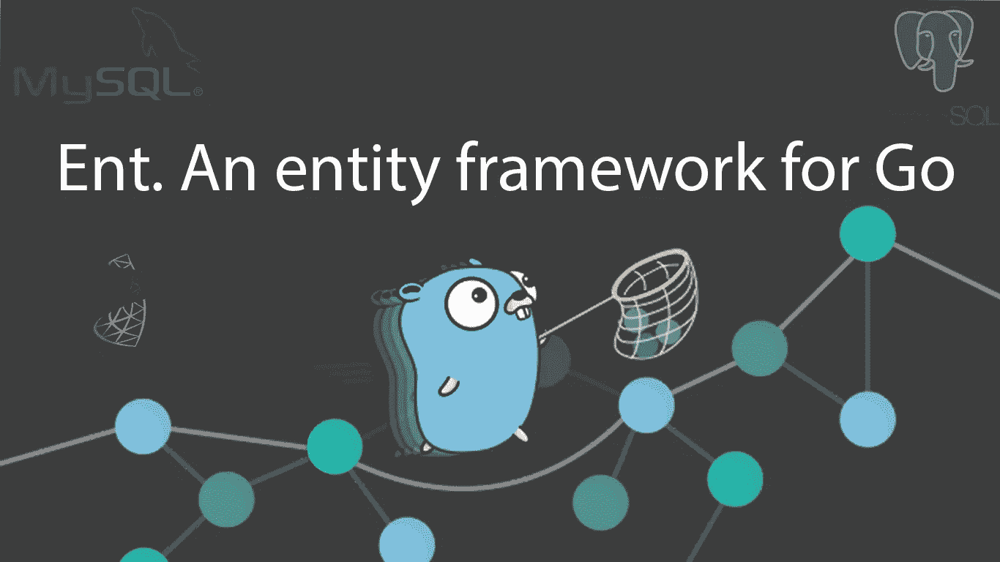
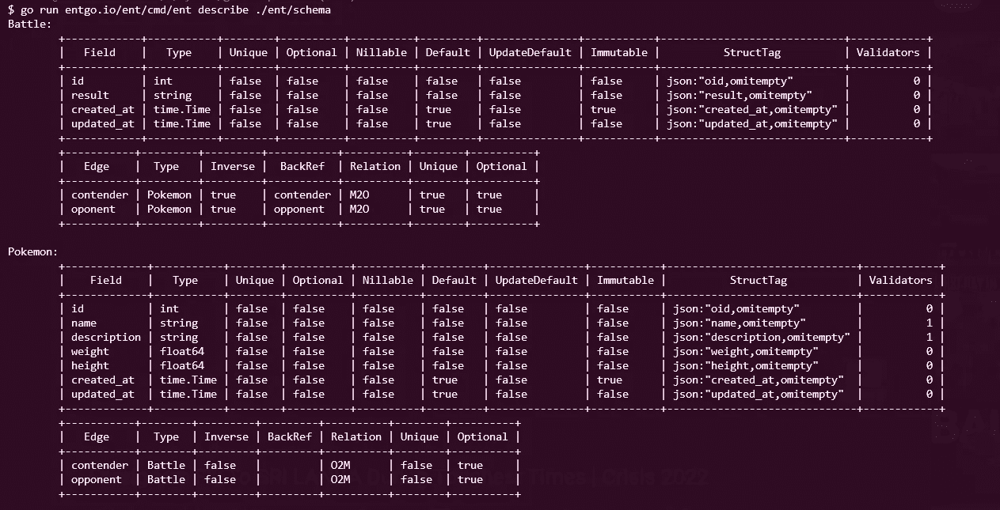
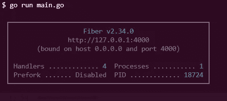
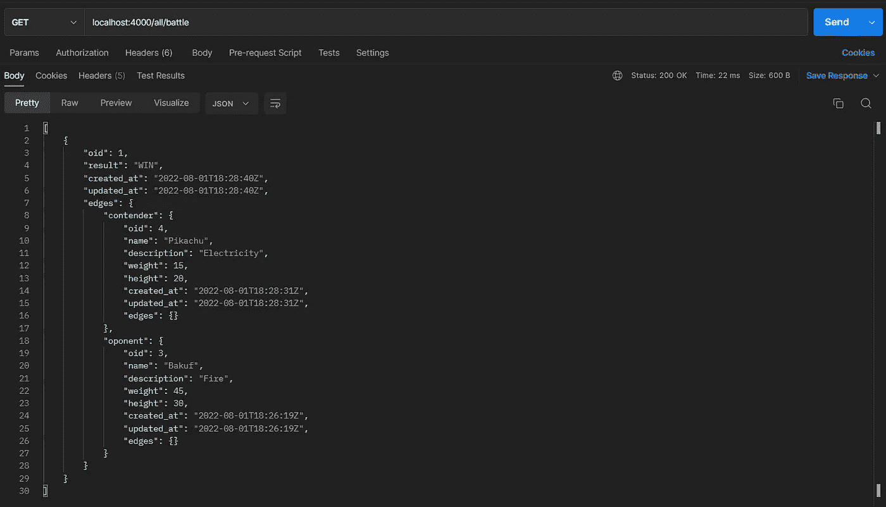

# 让我们开始用 Ent 构建一个应用程序

> 原文：<https://levelup.gitconnected.com/lets-go-and-build-an-application-with-ent-b45909b3aa90>



Golang 是 Google 开发的一种语言，主要关注性能和并发性。近年来，Go 已经成为开发人员最喜爱和最想要的编程语言之一。Golang 特别适合开发网络服务器甚至微服务等基础设施。尽管 Golang 拥有许多优秀的特性和工具，但在 Go 中只有少数工具可以正确处理数据层，比如 ORM。

# 什么是 ORM

> "使用面向对象编程语言在不兼容类型系统之间转换数据的技术"

对象关系映射器(Mapping)是一种使用您喜欢的编程语言的面向对象范例为关系数据库编写 SQL 查询的方法。ORM 将充当一个接口，将您的表或存储过程包装在类中，这样您就可以使用对象的方法和属性来访问它们，而不是编写 SQL 查询。

但是在 Go 中，大多数 ORM 库不能处理下面的特性。

*   关系支持
*   预取
*   多重创建
*   可组合查询

Go lang 中使用最广泛的 ORM， [GORM](https://gorm.io/) ，可以处理上述任务，但是 GORM 有几个缺点，像**性能**会伤害你的应用。考虑到这些问题，Meta 开发人员开发了一个 ORM，它可以在名为 **Ent** 的 Go 代码中轻松定义任何数据模型或图形结构。

# 什么是耳鼻喉？

Ent 是由 [Meta 开源](https://opensource.fb.com/)构建的 ORM(对象关系映射)框架，它提供了一个将任何数据库模式建模为 Go 对象的 API。使用 Ent，您可以运行查询和聚合，并遍历图形结构。Ent 支持主要数据库 [MySQL](https://www.mysql.com/) 、 [MariaDB](https://mariadb.org/) 、 [PostgreSQL](https://www.postgresql.org/) 、 [SQLite](https://www.sqlite.org/index.html) 和[基于 Gremlin 的](https://tinkerpop.apache.org/)图形数据库( [Azure Cosmos DB](https://cosmos.azure.com/) )。使用 Ent 您需要做的就是为您的应用程序定义模式，Ent 会为您处理剩下的事情。您指定的模式将由 Ent codegen(entc)验证，它将生成一个类型良好的惯用 API。

# 为什么耳鼻喉科更好

Golang 中有许多工具，如 [**go-pg**](https://pg.uptrace.dev/) **，** [**sqlx**](http://jmoiron.github.io/sqlx/) ， [**sqlc**](https://sqlc.dev/) ， [**sql-migrate**](https://github.com/rubenv/sql-migrate) 和 [**sqlboiler**](https://github.com/volatiletech/sqlboiler) 可以生成类型安全的代码，将应用程序的原语映射到具有 struct 的数据库表但是这些工具并不是一个完整的解决方案，所以您必须依赖每个工具来完成它的部分，比如在构建您的应用程序时生成代码和处理迁移。使用 Ent，您可以拥有一个完整的框架来实现所有相关的任务。耳鼻喉科还提供

*   静态类型和显式 API
*   查询、聚合和图形遍历
*   支持`[context.Context](https://pkg.go.dev/context)`
*   通过`[entcache](https://pkg.go.dev/ariga.io/entcache)`启用缓存
*   OpenAPI 规范(OAS，原名 Swagger 规范)生成经过`entoas`

有了这些选项或特性，你就能明白为什么 Ent 比其他工具和 ORM 更好了。接下来，让我们深入了解 Ent 中的概念和 API。

# 耳鼻喉科的概念和 API

在使用耳鼻喉科之前，您必须掌握几个概念/关键词。

*   **模式
    一个模式定义了图中的一个实体类型**
*   **字段** 代表其属性
*   **边**
    边表示 ent 中的关系(一对一、一对多、多对多)。
*   Mixin 是一个接口，它允许你创建一个模式的可重用部分，Mixin 可以将这些部分注入到另一个模式中。混合可以是一组场、边或钩。
*   **注释** 注释允许我们向模式对象添加额外的元数据，如边缘和字段。
*   **Privacy** Ent 最好的特性之一是 [Privacy](https://entgo.io/docs/privacy) 选项，它定义了数据库中实体的查询和变更的隐私策略。当您为一个模式定义一个策略时，无论何时对它执行查询和变更，都会对它进行评估。

要创建策略，你必须扩展类 ***ent。策略*** 持有两种方法， ***EvalQuery*** 和 ***EvalMutation，*** 负责读策略和写策略。一个策略可以由用户定义任意数量的规则，规则将按照模式中声明的顺序对它们进行评估。

# 用 Ent 构建应用程序

让我们继续用 Ent 构建一个应用程序。这里我们将使用 [Fiber](https://gofiber.io/) 构建一个小的口袋妖怪应用程序，这是一个用 Go 编写的受 Express 启发的 web 框架。

## 先决条件

在构建应用程序之前，您必须安装并配置 go 1.17 或最新版本。我们将使用 MySQL 作为本例的数据库，因此请确保您有一个正在运行的 MySQL 实例(最新版本为 5.6 及以上)。

> 你可以通过这个[镜像](https://hub.docker.com/_/mysql)通过 Docker 使用 MySQL。

## 安装 Ent 包

现在让我们安装构建应用程序所需的必要库。首先，我们建立一个 [Go 模块](https://github.com/golang/go/wiki/Modules#quick-start)项目。

```
**go mod init github.com/<username>/go-ent-pokemon**
```

现在让我们安装必要的库。我们将安装几个包，如

*   既然我们正在使用 MySQL，我们也必须为 MySQL 安装 go 驱动程序。

```
**go get -d entgo.io/ent/cmd/ent
go get github.com/go-sql-driver/mysql**
```

*   我们将安装 Viper，它是一个 Go 配置管理器，支持 JSON、TOML、YAML、HCL、env 和其他配置文件格式。我们将需要它来存储数据库的配置。

```
**go get github.com/spf13/viper**
```

*   **Fiber**
    Fiber 是一个构建在 Fasthttp 之上的 web 框架，fast http 是用于 Go 的最快的 HTTP 引擎。我们将创建一个 REST API，用 Ent 执行 CRUD 操作。

```
**go get github.com/gofiber/fiber/v2**
```

## 创建模式

现在我们已经安装了所有必需的包，让我们开始用 Ent 创建模式。让我们从创建 pokemon 模式开始。我们将使用 Ent CLI 来生成模式文件。

```
**go run entgo.io/ent/cmd/ent init Pokemon**
```

这将在目录 ***ent/schema/pokemon.go，*** 下生成一个模式文件，如下所示。

```
package schemaimport (
 "time""entgo.io/ent"
 "entgo.io/ent/schema/edge"
 "entgo.io/ent/schema/field"
)// Pokemon holds the schema definition for the Pokemon entity.
type Pokemon struct {
 ent.Schema
}// Fields of the Pokemon.
func (Pokemon) Fields() []ent.Field {
 return []ent.Field{
  field.Int("id").
   StructTag(`json:"oid,omitempty"`),
  field.Text("name").
   NotEmpty(),
  field.Text("description").
   NotEmpty(),
  field.Float("weight"),
  field.Float("height"),
  field.Time("created_at").
   Default(time.Now).
   Immutable(),
  field.Time("updated_at").
   Default(time.Now),
 }
}// Edges of the Pokemon.
**func (Pokemon) Edges() []ent.Edge {
 return []ent.Edge{
  edge.To("fights", Battle.Type),
  edge.To("opponents", Battle.Type),
 }
}**
```

请注意，边缘是在中定义的，它指的是一场战斗。
现在让我们使用 CLI 命令创建另一个名为 Battle 的模式。

```
**go run entgo.io/ent/cmd/ent init Battle**
```

现在，让我们为战斗模式定义字段和边，如下所示。

```
package schemaimport (
 "time""entgo.io/ent"
 "entgo.io/ent/schema/edge"
 "entgo.io/ent/schema/field"
)// Battle holds the schema definition for the Battle entity.
type Battle struct {
 ent.Schema
}// Fields of the Battle.
func (Battle) Fields() []ent.Field {
 return []ent.Field{
  field.Int("id").
   StructTag(`json:"oid,omitempty"`),
  field.Text("result"),
  field.Time("created_at").
   Default(time.Now).
   Immutable(),
  field.Time("updated_at").
   Default(time.Now),
 }
}// Edges of the Battle.
**func (Battle) Edges() []ent.Edge {
 return []ent.Edge{
  edge.From("contender", Pokemon.Type).
   Ref("fights").
   Unique(),
  edge.From("oponent", Pokemon.Type).
   Ref("opponents").
   Unique(),
 }
}**
```

既然我们已经定义了模式，我们可以从项目的根目录运行下面的命令。

```
***go* generate ./ent**
```

这将生成必要的结构和其他方法来帮助我们消费或查询数据库。

## 可视化模式

entc 允许您通过标记" **describe** "来可视化您的模式，该标记将列出模式及其属性。您需要做的就是运行下面的命令。

```
**go run entgo.io/ent/cmd/ent describe ./ent/schema**
```

以上命令将为您生成以下输出。



图式可视化

上表将直观地表示您的模式及其所有边(表之间的关系)。

## 连接到数据库

接下来，让我们看看如何连接到关系数据库。在这个例子中，我们将使用 MySQL 作为数据库。首先，让我们创建文件***main . go****和一个***。env*** 文件在你的项目的根目录下。让我们将以下内容添加到。环境文件。*

```
*DB_USER=root
DB_NAME=**databas_name**
DB_HOST=localhost
DB_PORT=3306
DB_PASSWORD=**database_password**
APP_PORT=4000*
```

*您可以添加*的值。env* 文件。接下来，让我们将内容添加到 *main.go* 文件中。*

```
*package mainfunc main() {
 **viper.SetConfigFile(".env")
 viper.ReadInConfig()**ctx := context.Background()**url** := **fmt.Sprintf**("**%s**:**%s**@(**%s**:**%s**)/%s?parseTime=True", viper.Get("DB_USER"), viper.Get("DB_PASSWORD"), viper.Get("DB_HOST"), viper.Get("DB_PORT"), viper.Get("DB_NAME"))**client, err := ent.Open(dialect.MySQL, url) // connect to MySQL**if err != nil {
  log.Fatal(err)
 }defer client.Close()if err := client.Schema.Create(ctx); err != nil {
  log.Fatalf("failed creating schema resources: %v", err)
 }
}*
```

*在上面的代码中，你可以注意到我们已经配置了 Viper 来读取 ***。项目根目录中的 env*** 文件。数据库 URL 是在 Viper 和 [fmt 的帮助下创建的。golang 中的 Sprintf](https://cs.opensource.google/go/go/+/go1.18.4:src/fmt/print.go;l=217) API。*

*接下来，您可以注意到数据库连接是通过 **Ent 完成的。通过 Ent 打开** API，通过**模式创建模式/表格。**创建(CTX)API 方法。*

*现在我们已经创建了数据库连接，让我们使用 Fiber 创建 web API。服务器代码将如下所示。*

```
*package mainimport (
 "context"
 "fmt"
 "log""entgo.io/ent/dialect"
 _ "github.com/go-sql-driver/mysql"
 "github.com/gofiber/fiber/v2"
 "github.com/gofiber/fiber/v2/middleware/cors"
 "github.com/gofiber/fiber/v2/middleware/logger"
 "github.com/spf13/viper"
 "github.com/tromesh/go-ent-pokemon/ent"
)func main() {
 viper.SetConfigFile(".env")
 viper.ReadInConfig()ctx := context.Background()
 **app := fiber.New()**url := fmt.Sprintf("%s:%s@(%s:%s)/%s?parseTime=True", viper.Get("DB_USER"), viper.Get("DB_PASSWORD"), viper.Get("DB_HOST"), viper.Get("DB_PORT"), viper.Get("DB_NAME"))
 client, err := ent.Open(dialect.MySQL, url)if err != nil {
  log.Fatal(err)
 }defer client.Close()if err := client.Schema.Create(ctx); err != nil {
  log.Fatalf("failed creating schema resources: %v", err)
 }**app.Use(cors.New())
 app.Use(logger.New())****app.Get("/", func(c *fiber.Ctx) error {
  return c.SendString("Hello, World!")
 })**log.Fatal(**app.Listen(fmt.Sprintf(":%s", viper.Get("APP_PORT")))**)
}*
```

*您可以通过以下命令启动 web 服务器。*

```
***go run main.go***
```

*如果一切正常，你会看到类似下图的东西。*

**

*光纤服务器*

## *执行 CRUD*

*现在我们已经有了一个 web API，让我们创建用于创建、检索口袋妖怪和战斗数据及其关系的纤程端点。*

*首先，让我们从创造一个口袋妖怪开始。*

*上面的 Fiber 端点将通过[***body parser***](https://docs.gofiber.io/api/ctx#bodyparser)API 将 JSON 主体数据解析为 golang 中的一个 struct，这允许我们读取数据来执行 CRUD 操作。您可能会注意到，口袋妖怪的属性是使用实体中可用的 set 函数来设置的。*

*接下来，让我们创建一个战斗对象，我们将处理口袋妖怪和战斗之间的一对多关系。*

*请注意，在上面的纤程端点中，我们使用了名为***setintegrid()***和 ***SetOponentID()，*** 的 set 函数，这些函数接受口袋妖怪的 ID 来创建战斗和口袋妖怪之间的边界/关系。*

*接下来，让我们在 Ent 中使用[急切加载](https://entgo.io/docs/eager-load/)技术检索战斗和它们各自的口袋妖怪。*

*你可以注意到我们使用了一些特殊的 API 叫做***with contender()***和 ***WithOponent()，*** 它们将检索与**竞争者**和**对手**边缘相关的口袋妖怪的数据。如果您向这个特定的端点发出 GET 请求，您将检索到一些类似下图的数据。*

**

*使用邮递员向/all/Battle 发出请求*

*注意**竞争者**和**对手**口袋妖怪在有效载荷的**边缘**部分内可用。*

*不仅仅是建立优势/关系。你甚至可以用 Ent 做更复杂的事情，比如[事务](https://entgo.io/docs/transactions)、[聚合](https://entgo.io/docs/aggregate)和[钩子](https://entgo.io/docs/hooks)。你可以通过这个[链接](https://github.com/TRomesh/go-ent-pokemon)找到上面例子的完整代码。*

# *耳鼻喉科的扩展*

*您可以通过 Ent 的[扩展 API](https://pkg.go.dev/entgo.io/ent/entc#Extension) 轻松地为 Ent 创建扩展，允许您向 Ent 的核心添加新功能。你必须用[钩子](https://entgo.io/docs/code-gen/#code-generation-hooks)、注释和[模板](https://entgo.io/docs/templates/)实现[扩展](https://pkg.go.dev/entgo.io/ent/entc#Extension)接口。在扩展的帮助下，Ent 可以很容易地通过库 [gqlgen](https://github.com/99designs/gqlgen) 与 GraphQL 集成，这是一个用于 Golang 的 graphql 服务器库。*

# *结论*

*Ent 是代码生成、迁移和 Graphql 集成的最佳 ORM 之一。你可以同意它提供了一个完整的 ORM 框架。Ent 现在是 Linux 基金会的一部分，该基金会管理其他开源软件项目，如 Kubernetes 和 GraphQL。Ent 在 slack 也有一个很好的活跃的社区，你可以在那里分享和学习。更多信息，你可以阅读他们优秀的[文档](https://entgo.io/docs/getting-started/)和指导良好的教程。最后，感谢您花时间阅读本文。我想看看你下面的问题和评论。*

*如果你喜欢我的内容，请帮我一个忙，为你和我买一杯咖啡！*

*干杯！*

# *了解更多信息*

*[](/lets-go-and-build-an-application-with-grpc-c5b754400f64) [## 让我们开始用 gRPC 构建一个应用程序

### REST(表述性状态转移)架构已经成为构建 web 等应用程序的首选方法

levelup.gitconnected.com](/lets-go-and-build-an-application-with-grpc-c5b754400f64) [](/lets-go-and-build-graphql-api-with-gqlgen-bfea2f346ea1) [## 让我们开始用 gqlgen 构建 Graphql API

### Golang 是过去十年中最受欢迎的编程语言之一，主要是因为它的快速…

levelup.gitconnected.com](/lets-go-and-build-graphql-api-with-gqlgen-bfea2f346ea1) [](/jotai-atom-based-state-management-for-react-1ce8fd380296) [## jotai:React 的基于原子的状态管理

### 在过去的几年里，国家管理有了很大的发展。有很多库和方法可以让你…

levelup.gitconnected.com](/jotai-atom-based-state-management-for-react-1ce8fd380296) [](/create-memory-and-type-safe-node-js-modules-with-rust-2c10bba92013) [## 用 Rust 创建内存和类型安全的 Node.js 模块

### Node 是开发应用程序最著名的平台之一，它运行在 V8 引擎上，执行 JavaScript…

levelup.gitconnected.com](/create-memory-and-type-safe-node-js-modules-with-rust-2c10bba92013) 

# 分级编码

感谢您成为我们社区的一员！在你离开之前:

*   👏为故事鼓掌，跟着作者走👉
*   📰查看[级编码出版物](https://levelup.gitconnected.com/?utm_source=pub&utm_medium=post)中的更多内容
*   🔔关注我们:[推特](https://twitter.com/gitconnected) | [LinkedIn](https://www.linkedin.com/company/gitconnected) | [时事通讯](https://newsletter.levelup.dev)

🚀👉 [**加入升级人才集体，找到一份惊艳的工作**](https://jobs.levelup.dev/talent/welcome?referral=true)*