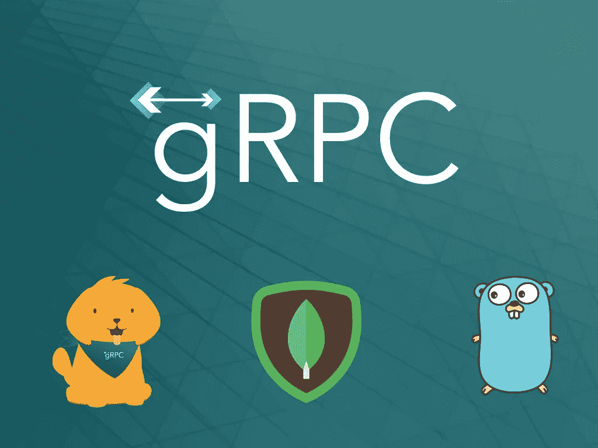
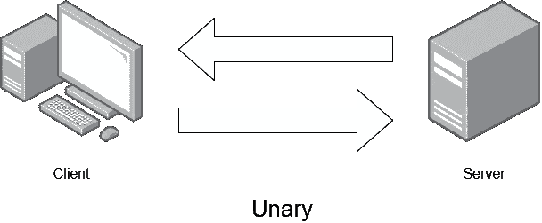
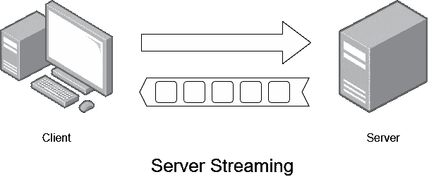
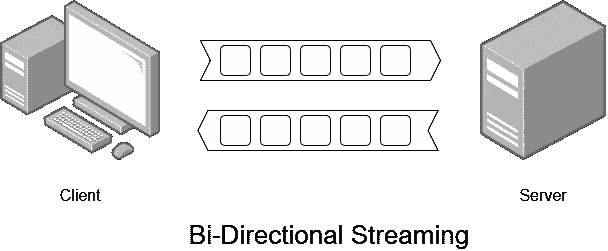
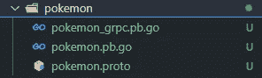
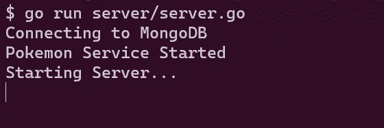
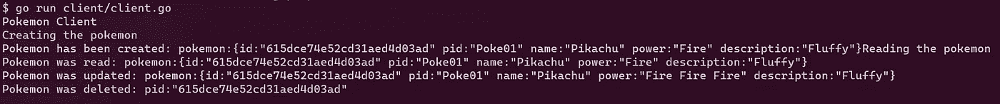
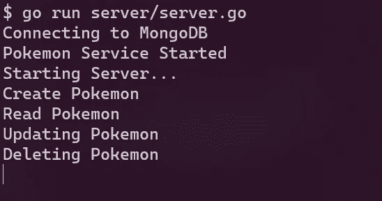

# 让我们开始用 gRPC 构建一个应用程序

> 原文：<https://levelup.gitconnected.com/lets-go-and-build-an-application-with-grpc-c5b754400f64>



REST(表述性状态转移)架构已经成为构建 web 应用、微服务等应用的首选方法。REST provide 提供了一套关于如何创建 API 的指南。REST 架构一般依赖 [HTTP 协议](https://developer.mozilla.org/en-US/docs/Web/HTTP/Overview)。当一个 API 完全满足以下条件时，它将被视为“RESTful”。

*   **统一的界面**
*   **客户端-服务器独立性**
*   **无状态**
*   **可缓存**
*   **分层**

虽然 REST 的引入是为了解决 [SOAP](https://en.wikipedia.org/wiki/SOAP) (它使用了 [RPC](https://en.wikipedia.org/wiki/Remote_procedure_call) )的缺点，但 REST 返回了大量元数据，这是它无法取代**轻量级 RPC 的主要原因，**这导致了新的或改进的技术的引入，如 [gRPC](https://grpc.io/) 和 [GraphQL](https://graphql.org/) 。

gRPC (Google Remote Procedure Call)是 Google 为实现微服务之间的高速通信而开发的高性能、开源的通用 [RPC](https://en.wikipedia.org/wiki/Remote_procedure_call) 框架。默认情况下，gRPC 有 Protobuf(协议缓冲区),它会将消息格式化或序列化为特定的格式，这将是高度打包的高效数据。所以很明显，像 gRPC 这样的轻量级 RPC 对于某些用例来说是理想的。在本文中，让我们深入了解使用 gRPC 和使用 Go 构建应用程序的好处，Go 是构建微服务最著名的语言之一。

# **什么是 RPC？**

RPC(远程过程调用)是最古老的可用体系结构之一。RPC 允许您以特定的格式调用远程服务器上的函数，并以相同的格式接收响应。在某种程度上，RPC API 的概念类似于 REST API 的概念。RPC APIs 定义了客户端可以与之交互的规则和方法。然后，客户端提交带有一些参数的调用来调用这些方法。您可以在查询字符串中找到这些参数。一个 RPC 调用**POST**/**DELETE pokemon**会有一个类似于 **{"id": 2 }** 的查询字符串，一个典型的 REST 会有**DELETE**/pokemon/DELETE/**2。**

# 探索 gRPC

gRPC 可以被认为是 RPC 的后继者，它是轻量级的。谷歌开发它是为了在微服务和其他需要交互的系统之间进行通信。使用 gRPC 有几个好处。

*   **使用协议缓冲区(Protobuf)代替 JSON**
*   **基于 HTTP 2 而非 HTTP 1.1 构建**
*   **内置代码生成**
*   **高性能**
*   **SSL 安全**

除了上面提到的主要优点，gRPC 还能在您的应用中促进更好的设计。gRPC 是面向 API 的，而不是像 REST 那样面向资源的。gRPC 的另一个特性是，默认情况下它是异步的，这意味着它不会根据请求阻塞线程，并且它可以并行处理数百万个请求，这确保了高可伸缩性。gRPC 中有四种类型的 API。

*   **一元** 看起来很像传统的 API (REST API ),客户端发出请求，服务器发送响应。



*   **服务器流** 这里客户端会发出一个请求，服务器会发送多个或者一个数据流。



*   **客户端流** 这类似于服务器流，但方式相反，客户端将发送一个数据流，而服务器将发送一个响应。


*   **双向流** 在双向流中，客户机和服务器都将发送数据流。



## **协议缓冲区有什么特别之处？**

Protocol Buffers 是一种开源、独立于语言且可扩展的数据序列化机制。协议缓冲区用于接口定义语言和消息交换格式。与 **JSON** (JavaScript 对象符号)不同，协议缓冲区是语言不可知的，更小(有效载荷大小)，更快，更简单，高性能。gRPC 使用协议缓冲区来定义

*   **消息**(数据、请求和响应)
*   **服务**(服务名和 RPC 端点)

有了协议缓冲区，你所需要的就是定义你的结构化数据，名为**protocol**的协议缓冲编译器会根据你选择的语言生成代码。最新的协议(版本 3)支持 C#、C++、Dart、Go、Java、Kotlin、Node、Objective-C、PHP、Python、Ruby 等语言。

# 什么时候应该使用 gRPC

有了上面提到的好处，你应该认识到 gRPC 将是选定的内部应用的理想选择。

*   微服务连接
*   实时流
*   多语言系统

你可以看到为什么 gRPC 会成为具有上述特性的微服务 API 和移动服务器 API 的未来。gRPC 是[云本地计算基金会(CNCF)](https://www.cncf.io/) 和几大科技巨头如谷歌、网飞、Square、CoackroachDB 的一部分。

# 【gRPC 入门

让我们通过使用 Golang 构建一个小型**服务器流** gRPC 应用程序来深入了解 gRPC。使用 gRPC，我们将不得不使用协议缓冲区来定义消息和服务。gRPC/protocol(proto buff 编译器)将为它们生成接口，我们应该实现更多的功能，比如为数据库层添加 [MongoDB](https://www.mongodb.com/) 来持久化数据。

## 先决条件

*   Go 的最新版本(1.0 或更高版本)
*   最新版本的**协议**(协议 3)

在开始使用 gRPC 之前，我们需要安装**protocol**编译器，并将其添加为从整个操作系统中的任何地方访问它的路径。你可以通过这个[链接](https://grpc.io/docs/protoc-installation/)找到你的操作系统的相关安装过程。

安装协议后，让我们初始化项目。让我们创建一个目录并运行以下命令。

```
go mod init github.com/username/grpc-pokemongo get -u google.golang.org/**grpc**
go get -u google.golang.org/**protobuf/protoc-gen-go**
```

第一个命令创建一个 [go.mod](https://golang.org/ref/mod) 文件来跟踪代码的依赖关系。接下来，让我们进入最激动人心的部分，那就是 ***的创造。proto*文件。在这**中*。proto*** 文件，我们要定义服务和各自的函数/消息，通过 protoc 编译器，它会生成必要的 protobuf 文件。接下来的两个命令将为 golang 的 **grpc** 和**protocol-gen-go、**安装依赖项。我们文件的原型文件**。现在让我们在名为**口袋妖怪**的目录下创建这个原型文件。****

在定义了消息和服务之后，让我们来编译一下，看看**protocol**编译器如何为 golang 生成相应的代码。为此，让我们从项目的根目录执行下面的命令。

```
**protoc** — go_out=**.** — go_opt=paths=**source_relative** — go-grpc_out=**.
** — go-grpc_opt=paths=**source_relative** **pokemon/pokemon.proto**
```

注意，我们使用了相对路径，并设置了要编译的 ***pokemon.proto*** 文件的路径。上面的命令将生成两个文件( [**pokemon.pb.go**](https://gist.github.com/TRomesh/d9d0f4e74fbb91dc1c61ffc78b8836a0) )，用于使用 protobuf 序列化消息，另一个文件([**pokemon _ grpc . Pb . go**](https://gist.github.com/TRomesh/cc4e414e139ce47ba19a3a2482b37faa))由 grpc 客户端的一些代码和服务器代码组成，我们将在稍后实现它们。



由协议生成的 go 文件

如果你仔细观察文件[**pokemon _ grpc . Pb . go**](https://gist.github.com/TRomesh/cc4e414e139ce47ba19a3a2482b37faa)****，**你会注意到 golang 是为客户端和服务器实现生成的**结构**和**接口**。**

**现在让我们开始为这个应用程序构建服务器和客户机，通过创建一个 **server.go** 文件来开始服务器实现。因为我们要持久化数据，所以我们将安装 MongoDB 的 golang 依赖项。**

```
go get go.mongodb.org/mongo-driver/mongo
```

**安装 MongoDB 之后，让我们创建服务器以及 MongoDB 连接，并实现由 protoc 编译器生成的功能。首先，让我们导入生成的 protobuff 定义，并使用协议生成的 **PokemonServiceServer** 创建一个结构。接下来，我们可以实现。proto 文件:createPokemon，ReadPokemon 等。**

```
import (
"context"
"fmt"
"log"
"net"
"os"
"os/signal"**pokemonpc** "github.com/TRomesh/grpc-pokemon/pokemon"
"github.com/joho/godotenv"
"go.mongodb.org/mongo-driver/bson"
"go.mongodb.org/mongo-driver/bson/primitive"
"go.mongodb.org/mongo-driver/mongo"
"go.mongodb.org/mongo-driver/mongo/options"
"google.golang.org/grpc"
"google.golang.org/grpc/codes"
"google.golang.org/grpc/reflection"
"google.golang.org/grpc/status"
)var collection *mongo.Collectiontype **server** struct {
  **pokemonpc**.**PokemonServiceServer**
}type **pokemonItem** struct {
 ID          primitive.ObjectID `bson:"_id,omitempty"`
 Pid         string             `bson:"pid"`
 Name        string             `bson:"name"`
 Power       string             `bson:"power"`
 Description string             `bson:"description"`
}func getPokemonData(data *pokemonItem) *pokemonpc.Pokemon {
 return &pokemonpc.Pokemon{
  Id:          data.ID.Hex(),
  Pid:         data.Pid,
  Name:        data.Name,
  Power:       data.Power,
  Description: data.Description,
 }
}func (*server) **CreatePokemon**(ctx context.Context, req *pokemonpc.**CreatePokemonRequest**) (*pokemonpc.**CreatePokemonResponse**, error) {fmt.Println("Create Pokemon")
pokemon := req.GetPokemon()
data := pokemonItem{
 Pid:         pokemon.GetPid(),
 Name:        pokemon.GetName(),
 Power:       pokemon.GetPower(),
 Description: pokemon.GetDescription(),
}res, err := collection.InsertOne(ctx, data)if err != nil {
 return nil, status.Errorf(
  codes.Internal,
  fmt.Sprintf("Internal error: %v", err),
 )
}oid, ok := res.InsertedID.(primitive.ObjectID)
  if !ok {
   return nil, status.Errorf(
    codes.Internal,
    fmt.Sprintf("Cannot convert to OID"),
  )
}return &pokemonpc.**CreatePokemonResponse**{
  Pokemon: &pokemonpc.Pokemon{
  Id:          oid.Hex(),
  Pid:         pokemon.GetPid(),
  Name:        pokemon.GetName(),
  Power:       pokemon.GetPower(),
  Description: pokemon.GetDescription(),
  },
}, nil}
```

**注意，我们使用了为每个请求生成的结构(*pokemonpc。 **CreatePokemonRequest** )和 response (*pokemonpc。**按协议创建口袋妖怪响应**)。以这种方式，我们可以实现所有其他的功能，读取，更新，删除口袋妖怪。**

**现在让我们转向应用程序的客户端。由于它是一个 CLI 应用程序，我们将在一次尝试中执行每个函数，如(createPokemon，ReadPokemon，UpdatePokemon 等。).**

**现在，我们已经使用协议生成的接口和结构创建了客户机和服务器。让我们通过执行以下命令来启动服务器。**

```
$ go run server/server.go
```

****

**启动口袋妖怪服务器**

**现在是运行客户端应用程序的时候了，它将调用服务器中为 Pokemon CRUD 操作定义的方法。**

****

**客户端执行**

**当客户端调用 Pokemon CRUD 操作时，您可以从服务器端注意到以下日志。**

****

**执行客户端后的服务器日志**

**你可以通过这个[链接](https://github.com/TRomesh/grpc-pokemon)找到上面例子的完整代码。**

# ****结论****

**总之，gRPC 是构建微服务和实时流服务的最佳方法之一。像 **protobuf** 、 **HTTP2 make 和 SSL Security** 这样的特性使得gRPC 比 REST 架构更健壮、更安全、性能更好。gRPC 还支持所有最著名的语言，这样你就可以用你最喜欢的语言开始使用 gRPC。要了解更多信息，请务必通读 gRPC 的[文档。最后，感谢您花时间阅读本文。我想看看你下面的问题和评论。](https://grpc.io/docs/)**

**还有最后一件事！如果你喜欢我的内容，请帮我一个忙，为你和我弄杯咖啡[！](https://www.buymeacoffee.com/tromesh)**

**干杯！**

**[](/lets-go-and-build-graphql-api-with-gqlgen-bfea2f346ea1) [## 让我们开始用 gqlgen 构建 Graphql API

### Golang 是过去十年中最受欢迎的编程语言之一，主要是因为它的快速…

levelup.gitconnected.com](/lets-go-and-build-graphql-api-with-gqlgen-bfea2f346ea1) [](/urql-the-highly-customizable-and-versatile-graphql-client-69e4e3406904) [## 高度可定制和多功能的 GraphQL 客户端

### 在过去的十年里，REST 架构已经成为 web 应用程序的行业标准，因为 REST 提供了一个…

levelup.gitconnected.com](/urql-the-highly-customizable-and-versatile-graphql-client-69e4e3406904) [](/build-your-own-self-hosted-ci-cd-workflow-with-github-actions-ec9ee1dcd800) [## 使用 GitHub 操作构建您自己的自托管 CI/CD 工作流

### GitHub 引入了 GitHub Actions，使开发人员能够直接从他们的 GitHub 库自动化工作流…

levelup.gitconnected.com](/build-your-own-self-hosted-ci-cd-workflow-with-github-actions-ec9ee1dcd800) [](/valtio-the-proxy-based-state-management-6f3304b53968) [## 基于代理的状态管理

### 在开发 web 应用程序之前，决定正确的状态管理工具是最重要的决定之一…

levelup.gitconnected.com](/valtio-the-proxy-based-state-management-6f3304b53968) [](/jotai-atom-based-state-management-for-react-1ce8fd380296) [## jotai:React 的基于原子的状态管理

### 在过去的几年里，国家管理有了很大的发展。有很多库和方法可以让你…

levelup.gitconnected.com](/jotai-atom-based-state-management-for-react-1ce8fd380296)**