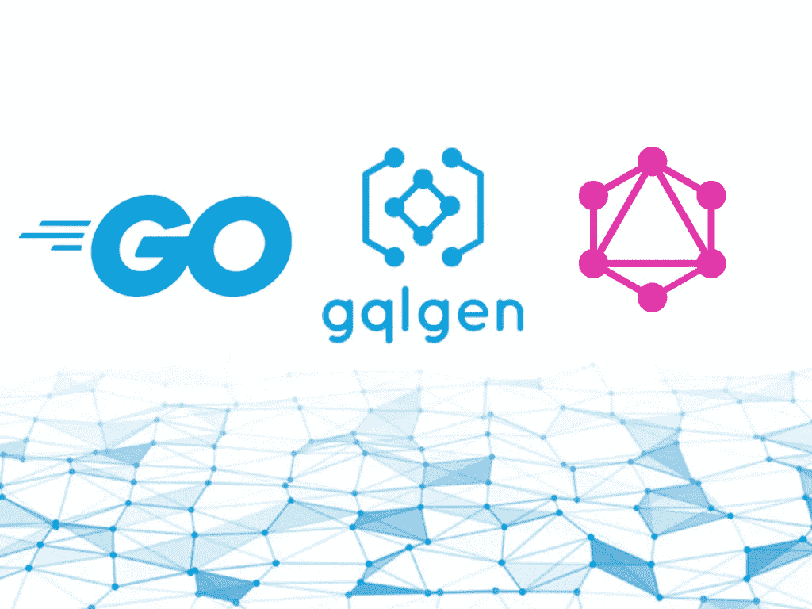
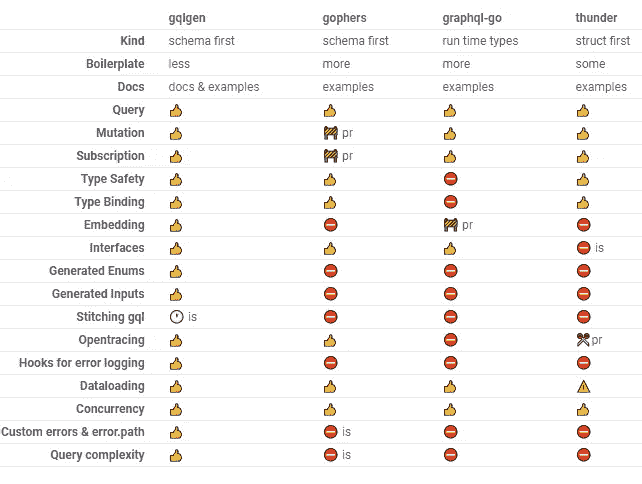
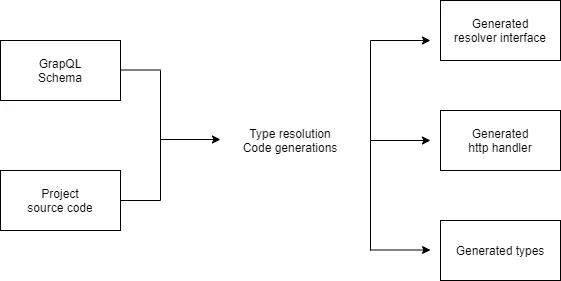
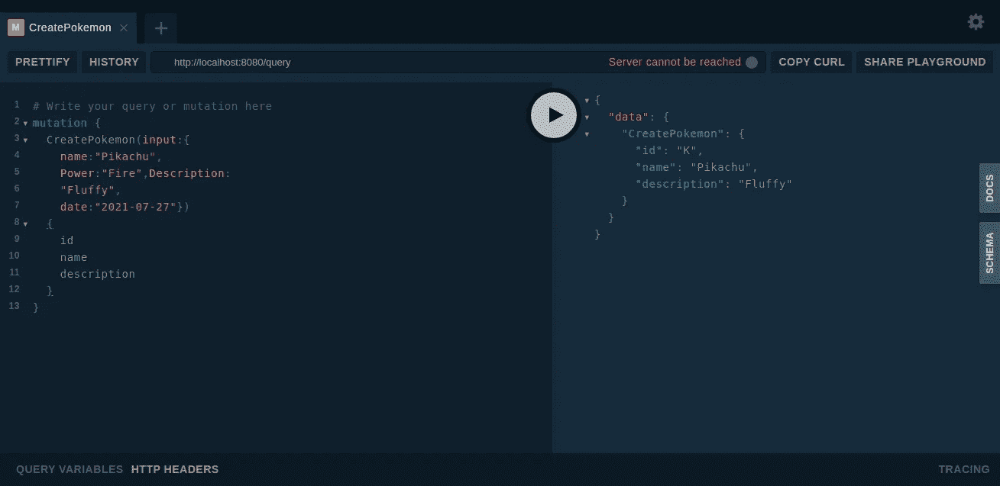

# 让我们开始用 gqlgen 构建 Graphql API

> 原文：<https://levelup.gitconnected.com/lets-go-and-build-graphql-api-with-gqlgen-bfea2f346ea1>



Golang 是过去十年中最受欢迎的编程语言之一，主要是因为它是一种快速、高性能、开源的统计类型编译编程语言。Go 早在 2009 年就由 google way 开发，作为 C++和 Java 的替代品，包括 C++和 Java 的所有酷功能，为 google 的网络服务器和分布式系统创建可扩展的应用程序。

*   *快速性能*
*   *简单易学*
*   *轻松并发模型*
*   *强大的标准库*

当 Golang 迅速流行起来的时候，API 世界发生了一场范式变革。最受欢迎的 REST 架构被一个新的竞争对手 Graphql 继承了下来。与 Graphql 中的 REST 架构不同，一切都被视为一个图，这意味着它与定义的实体相关联。因此，您可以只请求获取所需的详细信息。Graphql 有一个基于模式的 API 架构，带有一个**健壮类型系统**，它本质上告诉客户端如何访问数据。遵循这个模式的主要好处是前端和后端开发人员都知道数据结构，因此可以独立工作。

如你所知，Grapghql 和 Go lang 是两种卓越的技术。如果我们用 Go lang 构建一个 Graphql API 会怎么样？这将是一个非常有趣的组合，让我们来看看 Graphql 和 Go lang 相处得如何。在 Go lang 中实现 Graphql API 有各种各样的库。其中，以下是最著名的。

*   [gqlgen](https://github.com/99designs/gqlgen)
*   [地鼠](https://github.com/graph-gophers/graphql-go)
*   [图表 ql-go](https://github.com/graphql-go/graphql)
*   [惊雷](https://github.com/samsarahq/thunder)

# 什么是 **gqlgen**

gqlgen 是一个用于 Go 的类型安全 GraphQL。gqlgen 是由 [99Designs](https://99designs.com/) 通过权衡其他库如 [gophers](https://github.com/graph-gophers/graphql-go) 和 [graphql-go](https://github.com/graphql-go/graphql) 开发的。两者都缺乏通用特性，引入了样板代码和名称空间冲突，难以阅读。gqlgen 的目标是提供

*   键入不带样板代码的 Safty
*   良好的开发者体验
*   快速运行时间

所以 gqlgen 可以被认为是他们两个的接班人。

# 是什么让它独一无二

*   **模式优先** —使用 GraphQL [模式定义语言](http://graphql.org/learn/schema/)定义您的 API。
*   **类型安全**——你永远不会在这里看到`map[string]interface{}`。
*   **Codegen**——让我们生成枯燥的代码，这样你就可以快速构建你的应用。

# gqlgen 与 gophers、graphql-go 和 thunder 的比较

下面是这四个库之间的一个很好的比较。



从这个比较中，我们可以看出为什么与其他 go-graphql 客户端相比，gqlgen 是一个更好的解决方案。所以让我们从创建一个 graphql API 开始。

# gqlgen 入门

在本节中，让我们用 Go 和 gqlgen 创建一个口袋妖怪应用程序。

## 01:初始化项目

让我们初始化我们的 gqlgen 项目。让我们在项目根目录下的终端上运行以下命令。

```
go mod init github.com/[username]/gqlgen-pokemon
go run github.com/99designs/gqlgen init
```

上述命令将在您的项目根目录下生成一些文件和目录。

*   `gqlgen.yml`—gqlgen 配置文件，您可以在其中更改或添加 GraphQL 服务器的配置。该文件定义了解析器、模型和模式文件的位置。
*   `graph/generated/generated.go`—graph QL 执行运行时，生成的大部分代码。您不需要对此进行编辑
*   `graph/model/models_gen.go` —生成构建图形所需的模型。对`schema.graphqls`的更改将重新生成该文件。
*   `graph/schema.graphqls` —这是您将添加 GraphQL 模式的文件。
*   `graph/resolvers.go` —这是 gqlgen 将生成 Go 结构的文件，它将模式绑定到我们的 GraphQL 服务器
*   `graph/schema.resolvers.go` —这是你的应用程序代码所在的地方。generated.go 将调用这个来获取用户请求的数据。
*   `server.go`:这是我们为 GraphQL playground 定义端点的服务器文件。这个文件是您的服务器应用程序的起点

接下来，让我们为我们的应用程序定义模式。

## 02:定义我们的模式

gqlgen 是一个模式优先的库，它在编写任何严格的逻辑之前使用 [GraphQL SDL](https://graphql.org/learn/schema/) 来定义模式。让我们将下面的代码添加到`schema.graphqls`文件中。

```
type Pokemon {
  id: ID!
  name: String!
  power: String
  description: String
}

type Battle {
  id: ID!
  pokemon_id: String!
  opponent: String!
  location: String
  date: String
}

input NewPokemon {
  name: String!
  Power: String
  Description: String!
  date:String!
}

input NewBattle {
  pokemon_id: ID!
  opponent: String!
  location: String!
}type Query {
  GetPokemon(id:ID!): Pokemon!
  ListPokemon: [Pokemon!]!
  GetBattle(id:ID!): Battle!
  ListBattle:[Battle!]!
}type Mutation {
  CreatePokemon(input:NewPokemon!): Pokemon!
  DeletePokemon(id:ID!): Pokemon!
  UpdatePokemon(input:NewPokemon!): Pokemon!
  CreateBattle(input:NewBattle!): Battle!
  DeleteBattle(id:ID!): Battle!
  UpdateBattle(id:ID!): Battle!
}
```

## 类型映射

gqlgen 通过遍历。您定义的模式。该命令将生成类型或结构`*gqlgen generate*` ***，其中*** 将重新生成解析器、处理程序和类型/go 结构。



gqlgen 中的类型映射

默认情况下，gqlgen 会在模型目录下为我们生成一个`*models_gen.go*`，你可以编辑它或者创建一个新的模型文件，并将其映射到`*gqlgen.yaml*` 文件中的配置

```
models:
  filename: graph/model/models_gen.go
  package: model
```

编辑完***schema . graph qls***或对***models _ gen . go***文件进行更改后，请确保删除 ***resolver.go、*** 文件，该文件包含使 graphql 服务器正常工作的解析器。当您运行命令 ***gqlgen generate 时，将重新生成该解析器。***

## 03:使用 Graphql playground 中的解析函数

在使用解析器函数之前，请先在我们的 resolver.go 文件中添加结构。

```
type Resolver struct{
   pokemon []*model.Pokemon
   battle []*model.Battle
}
```

gqlgen 生成一个名为 schema.resolvers.go 的文件，其中保存了使我们能够与 GraphQL 服务器通信的应用程序代码。模式解析器文件将如下所示。

```
func (r *mutationResolver) CreatePokemon(ctx context.Context, input model.NewPokemon) (*model.Pokemon, error) {
   panic(fmt.Errorf("not implemented"))
}

func (r *mutationResolver) DeletePokemon(ctx context.Context, id string) (*model.Pokemon, error) {
   panic(fmt.Errorf("not implemented"))
}

func (r *mutationResolver) UpdatePokemon(ctx context.Context, input model.NewPokemon) (*model.Pokemon, error) {
   panic(fmt.Errorf("not implemented"))
}
```

请注意，这些方法没有实现，您现在要做的是实现它们来处理数据。让我们尝试实现一个将数据保存在数组中的方法。

```
var PokemonData []*model.Pokemon
var BattleData []*model.Battle

func (r *mutationResolver) CreatePokemon(ctx context.Context, input model.NewPokemon) (*model.Pokemon, error) {
   newPokemon := model.Pokemon{
      Name: input.Name,
      Power: input.Power,
      Description: input.Description,
   }
   PokemonData = append(PokemonData, &newPokemon)
   return &newPokemon, nil
}func (r *queryResolver) ListPokemon(ctx context.Context) ([]*model.Pokemon, error) {
   return PokemonData,nill
}
```

让我们通过 graphql 操场来使用这个解析器函数。现在，让我们从终端执行 go server.go 来启动我们的服务器，并在浏览器上打开 http//:localhost:8080。



这样，您就可以扩展将这些数据保存到数据库中的功能，使其成为一个完整的包。您可以使用一些优秀的工具，如 [sqlc](https://sqlc.dev/) 来生成与数据库相关的函数，如 gqlgen，这让开发人员的工作变得更加轻松。

# 结论

总之，gqlgen 是构建 go GraphQL 服务器的最佳库之一。像**类型安全**、**代码生成**这样的特性使得开发人员更容易使用 Graphql。gqlgen 还支持插件来扩展 Graphql 应用程序的特性。要了解更多信息，请务必通读 gqlgen 的[文档。最后，感谢您花时间阅读本文。我想看看你下面的问题和评论。](https://gqlgen.com/)

干杯！

# 了解更多信息

[](/urql-the-highly-customizable-and-versatile-graphql-client-69e4e3406904) [## 高度可定制和多功能的 GraphQL 客户端

### 在过去的十年里，REST 架构已经成为 web 应用程序的行业标准，因为 REST 提供了一个…

levelup.gitconnected.com](/urql-the-highly-customizable-and-versatile-graphql-client-69e4e3406904) [](/jotai-atom-based-state-management-for-react-1ce8fd380296) [## jotai:React 的基于原子的状态管理

### 在过去的几年里，国家管理有了很大的发展。有很多库和方法可以让你…

levelup.gitconnected.com](/jotai-atom-based-state-management-for-react-1ce8fd380296) [](/build-your-own-self-hosted-ci-cd-workflow-with-github-actions-ec9ee1dcd800) [## 使用 GitHub 操作构建您自己的自托管 CI/CD 工作流

### GitHub 引入了 GitHub Actions，使开发人员能够直接从他们的 GitHub 库自动化工作流…

levelup.gitconnected.com](/build-your-own-self-hosted-ci-cd-workflow-with-github-actions-ec9ee1dcd800) [](/hookstate-the-simplest-state-management-tool-b02f7d3b01a4) [## 最简单的状态管理工具

### 小型、最小、简洁、可扩展、基于钩子的状态管理库

levelup.gitconnected.com](/hookstate-the-simplest-state-management-tool-b02f7d3b01a4)