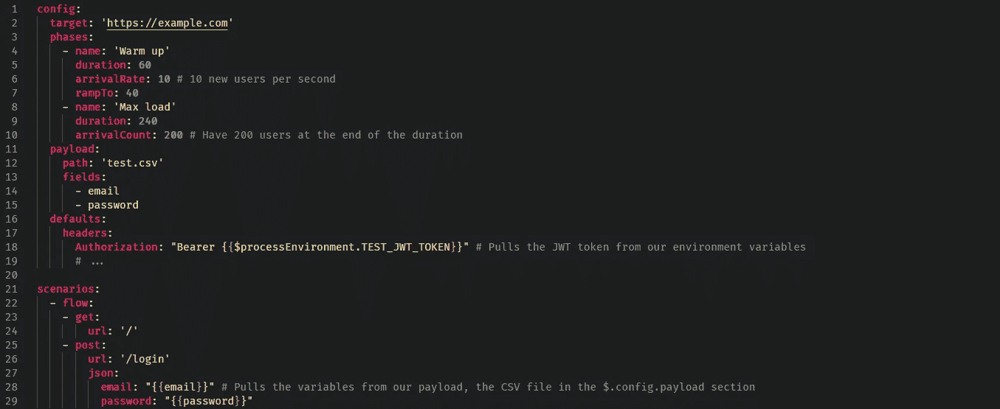
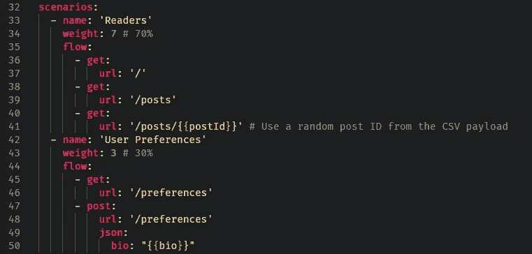
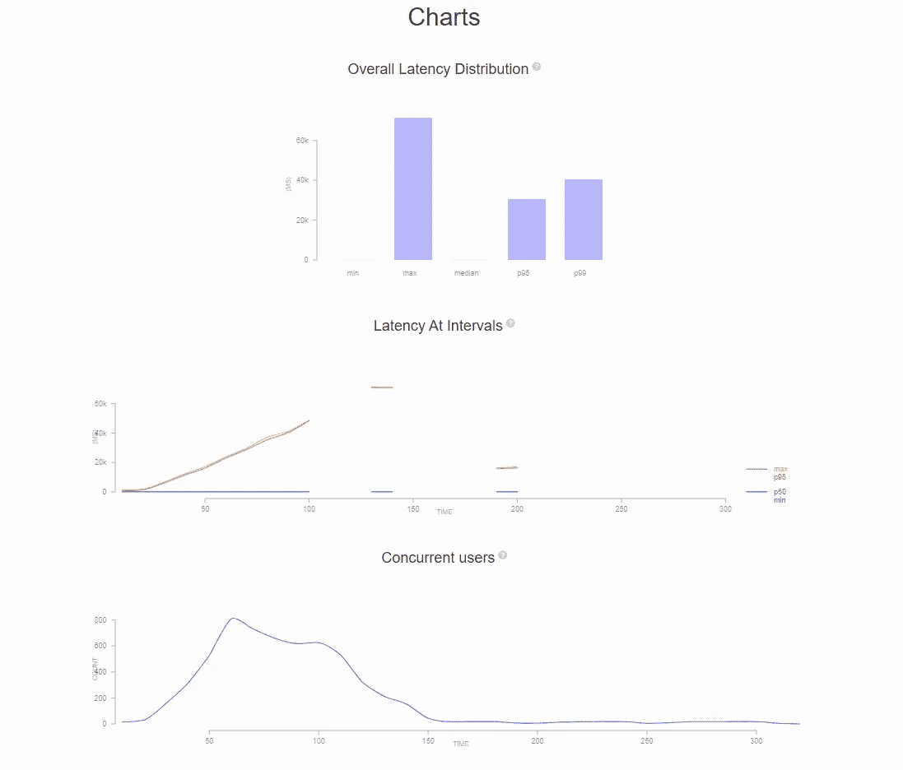
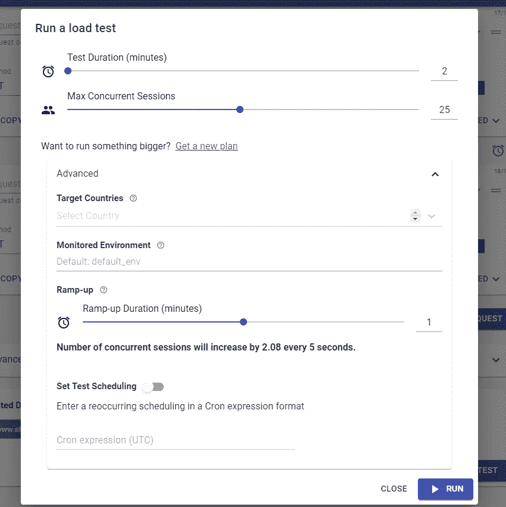
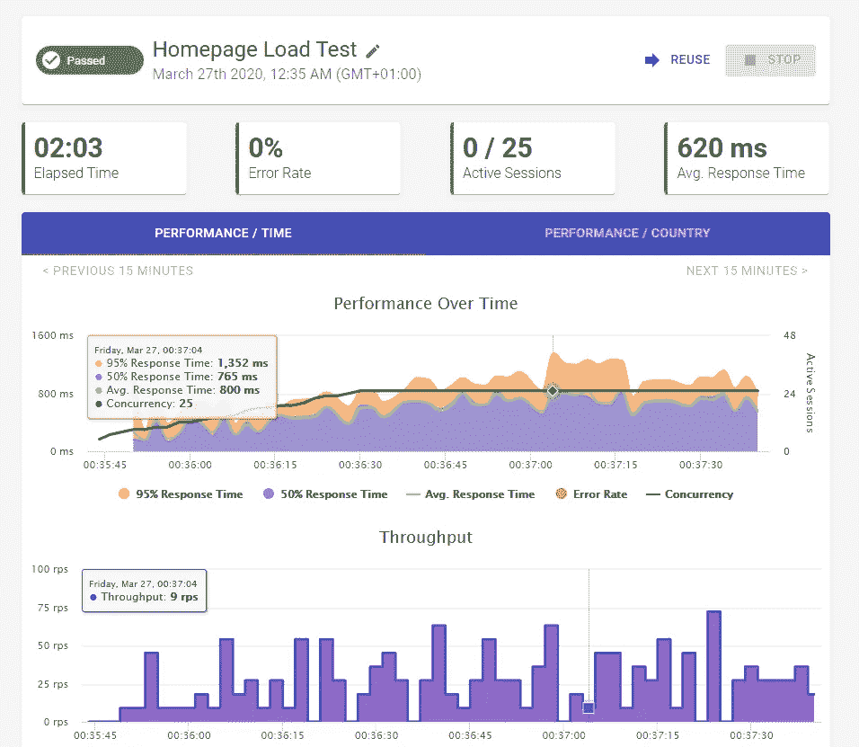

# 让我们从负载测试中获得一些乐趣

> 原文：<https://levelup.gitconnected.com/lets-have-some-fun-with-load-tests-c7b6b69e1cc6>

## 自动化 API 测试之旅

## 以及如何为一些繁重的工作做准备


SpaceX 在 [Unsplash](https://unsplash.com?utm_source=medium&utm_medium=referral) 上拍摄的

近年来，负载测试变得越来越普遍，尤其是在最近几周，因为新冠肺炎疫情迫使许多员工(包括我)在家工作或远程工作，并依赖基于云的服务与他们的队友合作。

但许多服务提供商仍在努力适应当前的需求。甚至微软也面临着问题和停机，并禁用了 Office 365 的一些非必要功能。排队的 Azure DevOps 构建运行需要很长时间才能最终开始。通知不会在 Microsoft 团队中弹出。Discord 经常停机，因为现在许多学校和组织都在使用它。

当前的环境激励我去研究负载测试，因为我以前从来没有机会尝试它。所以，我想我会分享我的见解[，作为我上一篇文章](https://medium.com/swlh/enhance-your-ci-cd-pipeline-with-automated-api-tests-2229425c2215)的延续。

在这篇文章中，我将解释负载测试的基本概念，并向您展示实现它们的方法。

# 负载测试到底是什么？

我认为首先熟悉压力测试很重要:

> **压力测试**是一种验证系统稳定性&可靠性的软件测试。该测试主要测量系统在极端负载条件下的健壮性和错误处理能力。

负载测试有些类似；然而，你的目标是*模拟实际的用户行为*——而不是仅仅为了让你的系统处于极端条件下。

另一个关键区别是负载测试不应该破坏系统。您希望依赖您的度量标准，并查看您的项目对负载的适应程度。这些度量将帮助您确定是否需要分配更多的资源或者对您的项目执行一些最小的修复。

你还应该记住，你的主要精力不应该依赖于测试你的代码，看看它在负载下表现如何。相反，您希望确定您的整个基础设施与负载的配合情况。这包括从负载平衡到缓存再到自动扩展。

# 何时加载测试？

您是否应该在每次将应用程序发布到生产环境时对其进行负载测试？你可以，但我认为你应该更关注这些发生的场合:

*   在你向大众发布你的产品之前
*   在发布备受期待的产品更新之前
*   根据你的产品，在节假日和黑色星期五等活动之前

# 如何加载测试？

我前面说过负载测试是基于实际用户行为的。但是你怎么能复制真实的行为呢？

理想情况下，你希望像你或你的普通用户通常会做的那样使用你的网站。现在，假设您将这一行为乘以 100 个并发用户(CCU)。你把用户群分割成个人用户；例如， **70%** 的用户会浏览你的网站(比如你的文章)，而 **30%** 的用户会更改个人资料设置。

然而，不是所有的用户都会一下子炮轰你的网站，至少不是字面上的意思。您需要考虑测试的三个不同阶段:

*   **预热阶段**
*   **上升阶段**
*   最后，**最大负载**持续时间比前两个阶段稍长。

除了测试计划之外，您还需要一个允许您执行负载测试的工具。就像我在[之前的帖子](https://medium.com/swlh/enhance-your-ci-cd-pipeline-with-automated-api-tests-2229425c2215)中一样，我对寻找适合我当前工具集的工具感兴趣。

在工作中，我们曾经使用过火炮，最近，我偶然发现 Loadmill 也提供负载测试。

# 在本地运行测试

cannon 是一个用于负载和功能测试的 npm CLI 工具。您指定 YAML 文件(想想 YAML 构建定义)来概述您的流程、参数等等，并让它通过 CLI 工具运行。你甚至可以把它作为一个 npm 包，用 JavaScript 创建你的东西。

我最喜欢的功能之一是它易于使用，支持 HTTP 和 WebSockets，支持扩展，并可以在每次测试运行后生成报告。

要开始使用 npm，请安装该工具:

```
npm install -g artillery
```

大炮遵循一个简单而直白的 YAML 图式来使用。看看吧，测试通常是这样的:



这可能是您的测试应该包含的最低要求。一旦你在`config`中配置好基础，你就可以专注于你的场景。同样值得一提的是，您可以在`config`下的`phases`部分复制您的负载阶段。在这里，我简单地设置了预热和最大负荷阶段。

您可能会问，为什么我们在有效载荷中引用 CSV 而不是 JSON 或其他什么？好吧，你想让你的负载测试尽可能真实，用户行为几乎准确。

在 CSV 文件中，您可以为 cannon 创建的每个虚拟用户设置不同的值(注意:您不希望同一个用户登录超过 1000 次，对吗？).

这些场景帮助您将负载测试塑造成不同的虚拟用户。我之前提到过，我希望 70%的用户浏览我的页面，其他人改变他们的个人资料设置。

这样的场景可能是这样的:



`weight`参数定义了场景被分配给虚拟用户的概率。

我们开始了，我们有一个测试计划，并准备发射它。

```
artillery run -o report.json test.ym
```

您还可以使用`artillery report report.json`将报告导出为 HTML 文件，它将生成一些精美的图表以供查看:



# 使用外部工具运行负载测试

出于两个原因，您可能会考虑在专用主机上运行负载测试:

*   在负载测试过程中，您很有可能会破坏本地网络连接，因为它被传出的负载淹没了。
*   理想情况下，您希望使用相同的测试计划同时跨不同的位置(例如北美和欧盟)进行测试。

因为我偶然发现了 Loadmill，并在我的两篇[前贴](https://medium.com/swlh/enhance-your-ci-cd-pipeline-with-automated-api-tests-2229425c2215)中使用了它，所以我也想尝试一下他们的负载测试工具，看看它如何帮助我运行负载测试。

Loadmill 是一个基于云的服务，专注于运行自动化 API 和负载测试。他们的负载测试工具有一个与 cannon 相当的工作流程，只是它还不支持不同的场景。

但是，它可以为您导入 HAR 文件并运行它们，无需额外的配置。这使得运行负载测试变得非常容易，因为您只需在开发工具中打开网络分析器，开始浏览，将其作为 HAR 文件导出和导入到 Loadmill，就可以开始测试了。它也支持参数的 CSV 文件，就像 cannon 一样。



在测试结束时，您将会收到一份详细的报告，帮助您理解负载测试。详细报告包括所有 HTTP 请求及其内容的列表。



如果你不想导入 HAR 文件，也没关系。您可以创建一个带有自定义流程的自定义测试运行，并按照您的需求进行调整，就像我在之前的一篇文章中写的第一个 API 测试[一样。](https://medium.com/swlh/run-your-first-automated-api-test-in-5-minutes-4ba92451b686)

# 裁决

在我运行我的第一个 API 测试之前，我不确定我应该如何以及为什么要运行这样的测试。这些测试是有益的，因为如果您覆盖尽可能多的*明智的*测试，您就可以放心地测试和发布(不仅仅是为了测试)。您可能会偶然发现其他工具，但是这些工具可以帮助我完成任务，并很好地适应我的总体工作量。

请记住，您也可以将它们集成到 CI/CD 中，因为我在这里强调的两种解决方案都提供了 npm 包。

感谢阅读，请让我知道你的想法。

## 自动化 API 测试之旅

*   **上一篇文章:** [通过自动化 API 测试增强您的 CI/CD 渠道](https://medium.com/swlh/enhance-your-ci-cd-pipeline-with-automated-api-tests-2229425c2215)

## 更多参考

*   什么是压力测试？【https://www.guru99.com/stress-testing-tutorial.html 
*   负载测试和压力测试的区别:[https://www . geeks forgeeks . org/difference-between-Load-Testing-and-Stress-Testing/](https://www.geeksforgeeks.org/difference-between-load-testing-and-stress-testing/)
*   炮兵剧本参考:[https://artillery.io/docs/script-reference/](https://artillery.io/docs/script-reference/)
*   使用带负荷磨的 HAR:[https://docs.loadmill.com/load-testing/getting-started](https://docs.loadmill.com/load-testing/getting-started)