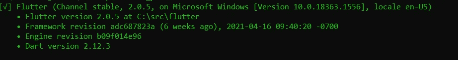
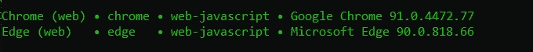
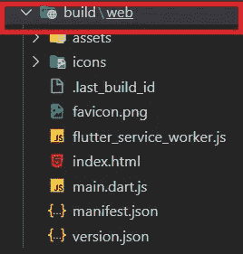
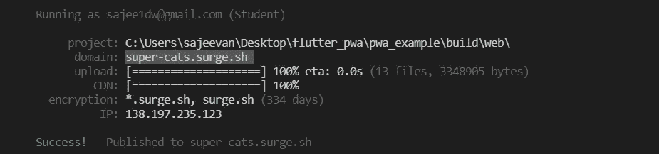
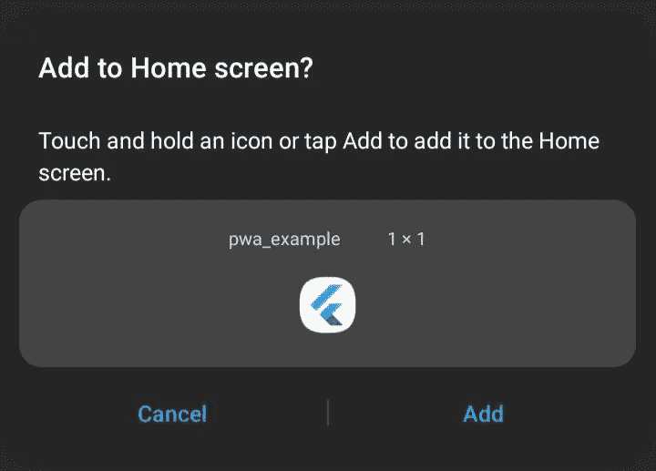

# 让我们实施并启动一个颤振 PWA

> 原文：<https://levelup.gitconnected.com/lets-implement-and-launch-a-flutter-pwa-aab5648f620>

## 珍贵的步骤，发展一个扑 PWA 没有挣扎

> 渐进式网络应用程序(PWA)是一项热门技术，它有助于在手机网络浏览器上运行，而不是在手机上安装应用程序。

为什么要关注 PWA？

*   对于有限的手机存储来说，这是一个有效的解决方案，因为如果我们将 PWA 添加到移动应用程序中，它只需在移动电话网络浏览器中打开，并且它提供了与移动应用程序相同的感觉，而无需安装原生应用程序。
*   PWA 提供离线访问，我们可以在该链接上保留一个书签。
*   它有助于提高性能

这篇文章是关于用 flutter cross 平台构建 PWA 的。为了用 flutter 构建 PWA，我们需要在电脑上安装 Flutter SDK 和 Chrome 浏览器。

## 1.为 web 设置颤振

如你所知，在 flutter 中有 4 个通道，它们是主通道、测试通道、开发通道和稳定通道。Flutter PWA 已经支持 beta 和 master，因为只有这两个频道是 web 支持的频道。但是现在稳定频道也支持网络。 [*因此现在主通道和β通道稳定，可以用来建立颤振 PWA。*](https://flutter.dev/docs/whats-new)

此命令将帮助您将最新的 dart SDK 下载到您的计算机上，此过程可能需要一些时间。

您应该得到以下输出:

此命令将确保我们拥有最新的桌面支持，并且它已被启用。

如果系统支持 web，我们应该检查哪些设备可用。

您可能会得到如下快照所示的输出:

在这些步骤之后，您已经完成了颤振 web 设置。

## *2。创建一个新的颤振项目*

按照这个命令，你可以在一个想要的文件夹位置创建一个新的 flutter 项目。如果你没有故意改变颤振通道，它是在稳定通道。

导航至设备上新创建的应用程序。

这个命令非常重要，因为它有助于为现有项目提供 web 支持。在这个命令中。是最重要的。

根据 flutter 的新版本(2.0)，这个命令是不必要的，因为它已经包含了一个新创建项目的 web 文件夹，并且有必要让您的 flutter 通道保持稳定。

这里有一点很重要，那就是有一个名为 [*manifest.json*](https://web.dev/add-manifest/) 的文件，您可以在其中配置该文件。通过配置它，您可以更改 Flutter PWA 应用程序的最终 web 视图。

通过遵循这些，你将最终拥有一个新创建的 flutter 项目，并启用对它的 web 支持。

## *3。新创建的应用程序在网络上运行*

该命令将有助于在机器上本地运行您创建的应用程序。然后该应用程序将在 Chrome 或 Microsoft Edge(前面提到的设备列表)中作为本地主机自动打开。

## *4。构建颤振项目*

通过使用此命令，您的应用程序将在您创建的项目的根目录中构建并自动创建另一个 build\web 文件夹。它会在新创建的 web 文件夹下自动创建以下文件。

如果你按照上面的步骤(1–4)，你将最终在 Flutter PWA 中成功创作！

除此之外，你还可以继续下面的步骤，在 Surge 的帮助下部署创建的应用程序。它将创建一个用于测试目的的活动链接。 [*Surge*](https://surge.sh/) 对于前端开发者来说是一个非常重要的工具，因为它可以帮助你以一种高效的方式将你的应用发布到产品中。

## *5。部署您的 PWA 应用程序*

系统要求:Node.js 的最新版本

该命令将帮助您在您的计算机上全局安装 Surge

> * *在使用此命令之前，请确保导航到先前在 build 文件夹下创建的 web 文件夹。**

这将需要一些时间，如果命令成功，您将收到如下命令行:

通过使用命令行中“域”下提供的 URL，使用移动浏览器打开它。

恭喜你！你的扑扑 PWA 现在起作用了。

此外，您可以将书签添加到浏览器上提供的 URL，或者使用浏览器设置将其添加到主屏幕。

设置>添加到主屏幕

该命令将帮助您从浪涌中移除项目，命令行如下所示:

**结论**

> lutter PWA 是当前的趋势，通过启用 web 支持，对开发者来说，稳定的渠道比以前更容易。本文为您提供了成功创建 Flutter PWA 的基本步骤。
> 
> 希望这可以帮助你理清思路，未来的文章将解释如何处理“添加到主屏幕”横幅。

感谢您的阅读！

# 分级编码

感谢您成为我们社区的一员！[订阅我们的 YouTube 频道](https://www.youtube.com/channel/UC3v9kBR_ab4UHXXdknz8Fbg?sub_confirmation=1)或者加入 [**Skilled.dev 编码面试课程**](https://skilled.dev/) 。

 [## 编写面试问题+获得开发工作

### 掌握编码面试的过程

技术开发](https://skilled.dev)