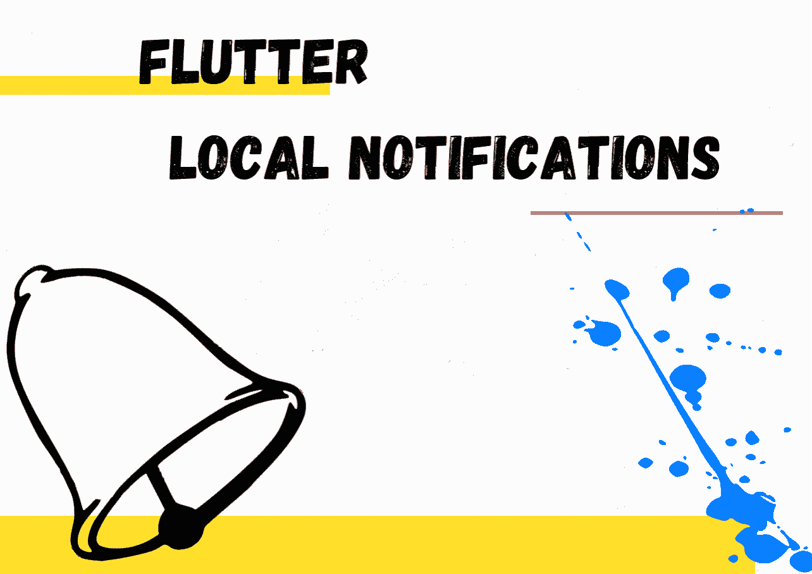
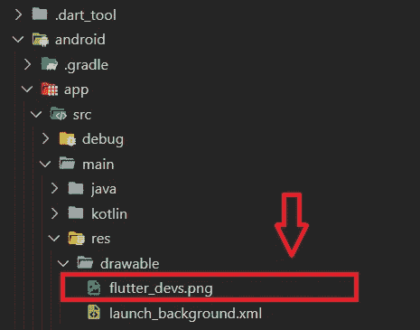
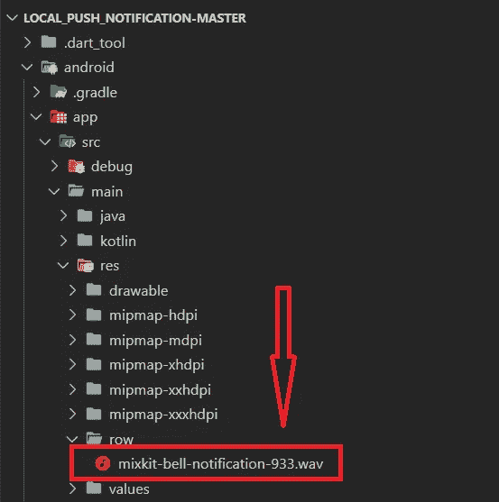
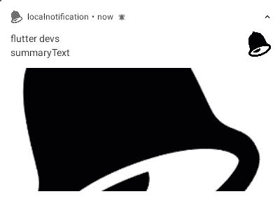
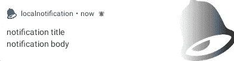

# 让我们用 Flutter 实现本地通知

> 原文：<https://levelup.gitconnected.com/lets-implement-local-notifications-with-flutter-ada0f029866d>

## 清晰的指南来实现如何使用 flutter 在您的移动应用程序中启用本地通知



作者 GIF

> 当我们处理它们时，移动应用程序通知发挥着重要的作用，因为当我们远离它时，它们用于使我们注意到特定的应用程序。因此，在这种情况下，在处理移动开发时，有两种主要类型的通知。

1.  本地通知
2.  推送通知

在这篇文章中，我将重点介绍一些要点以及在您的移动应用程序中实现本地通知的方法。

> **本地通知** *—生成应用程序本身的通知。*
> 
> **推送通知** *—通过远程服务器触发的通知。*

上述因素是本地通知和推送通知之间的差异。

为了更加清楚，让我们实现一些代码，并观察本地通知如何处理移动应用程序。这里 Flutter 是我用来实现推送通知任务的框架，因为我们可以轻松有效地完成它，因为 Flutter 包含了一个已经构建好的 Flutter 推送通知包。

在您创建了您的 flutter 项目之后，需要将**"*flutter _ local _ notifications*"**包添加到您的 ***pubspec.yaml*** 文件的 dependencies 下。它将帮助您有效地处理推送通知任务。

```
dependencies:
  flutter_local_notifications: ^8.0.0
```

然后将包导入到编码的必要位置。

```
**import** 'package:flutter_local_notifications/
flutter_local_notifications.dart';
```

# 让我们建立项目😃

1.  您的***AndroidManifest***文件应进行如下编辑，以获得计划通知功能:

```
<uses-permission android:name="android.permission.RECEIVE_BOOT_COMPLETED"/>
```

在应用程序部分:

```
<receiver android:name="com.dexterous.flutterlocalnotifications.ScheduledNotificationBootReceiver"><intent-filter><action android:name="android.intent.action.BOOT_COMPLETED"></action></intent-filter></receiver><receiver android:name="com.dexterous.flutterlocalnotifications.ScheduledNotificationReceiver" />
```

为了获得振动许可:

```
<uses-permission android:name="android.permission.VIBRATE" />
```

现在您已经完成了 AndroidManifest 文件的编辑部分。

2.然后，我们需要添加一个通知图标，当本地推送通知。因此在 drawable 目录下添加一张图片，其路径为**flutter _ app _ name>Android>app>src>RES>draw able>**[**flutter _ devs . png**](https://raw.githubusercontent.com/MaikuB/flutter_local_notifications/master/example/android/app/src/main/res/drawable/app_icon.png)



作者图片

如果没有，您可以通过使用存储在 Android MIP map 中的应用程序图标来避免添加通知图标。

3.为通知添加自定义音调/音乐

您可以跳过这一步，通知的提示音将是您通知的默认提示音。

在**flutter _ app _ name>Android>app>src>RES>raw>mix kit-bell-notification-933 . wav、**下制作一个目录并为其添加一个首选名称，我的是 notification_tone。



作者图片

在创建的目录中存储一个小的音乐文件

***好酷，让我们开始编码……*😜**

1.  **创建一个颤振本地通知对象**

```
FlutterLocalNotificationsPlugin flutterLocalNotificationsPlugin =FlutterLocalNotificationsPlugin();
```

创建 Flutter 本地通知对象的目的是对该对象执行各种操作。

**2。创建一个初始化状态**

```
void initState() {super.initState()**;**var initializationSettingsAndroid =AndroidInitializationSettings('flutter_devs')**;**var initializationSettingsIOs = IOSInitializationSettings()**;**var initSetttings = InitializationSettings(initializationSettingsAndroid**,** initializationSettingsIOs)**;**flutterLocalNotificationsPlugin.initialize(initSetttings**,**onSelectNotification: onSelectNotification)**;**}
```

*   ***androidInitializationSettings***—初始化 Android 设备设置的类
*   ***ios initializationsettings***—初始化 IOs 设备设置的类
*   ***初始化设置*** —目的是初始化 android 和 ios 平台的设置
*   ***initialize()*** 方法—根据设备平台设置设置，如果设备是 android，您的应用将根据 android 特定设置执行，如果是 ios，它将启用 ios 特定设置。
*   ***onSelectNotification***—该属性执行按下通知时给出的任务

```
Future onSelectNotification(String payload) {Navigator.*of*(context).push(MaterialPageRoute(builder: (_) {return NewScreen(payload: payload**,**)**;** }))**;** }
```

用户按下通知后出现的新屏幕将在一个 new screen 小部件中实现，如下所示。

```
class NewScreen extends StatelessWidget {String payload**;**NewScreen({@required this.payload**,**})**;**@overrideWidget build(BuildContext context) {return Scaffold(appBar: AppBar(title: Text(payload)**,**)**,**)**;**}}
```

1.  **简单通知——基本通知示例**

```
showNotification() async {var android = new AndroidNotificationDetails('id', 'channel ', 'description',priority: Priority.High, importance: Importance.Max);var iOS = new IOSNotificationDetails();var platform = new NotificationDetails(android, iOS);await flutterLocalNotificationsPlugin.show(0, 'Flutter devs', 'Flutter Local Notification Demo', platform,payload: 'Welcome to the Local Notification demo ');}
```

*   ***androidNotificationDetails***—包含有关 Android 设备上通知的详细信息

例如:*优先级* **，** *重要性* **，** *频道* ***，*** *名称* **，** *频道描述* **，** *频道 id* **，** *声音* **，**

***********************************************************************

***值得一提的是，您保存在项目中的声音文件可以设置为****AndroidNotificationDetails***下的声音参数**

***********************************************************************

**因此，***ios notification details***包含了 IOs 通知的详细信息。**

**此外，当您的应用程序特定于 android 或 ios 时，可以使用 NotificationDetails，这样您就不需要提供 android 和 ios 的详细信息，只需在 android 或 ios 中传递 null 即可。**

*   ****show()** —检查平台是否可用，是 ios 还是 android，如果平台是 android，**AndroidNotificationDetails**设置为通知细节。因此 show()将 **id、标题、正文、通知细节、有效负载**作为一个字符串，然后我们可以将它作为 **onSelectionNotification** 的一个参数进行传递**
*   **onSelectionNotification —根据单击的通知类型在新屏幕上显示一些文本。**

****2。计划通知—用于执行计划任务，并在特定时间实施通知。****

```
Future<void> scheduleNotification() async {var scheduledNotificationDateTime =DateTime.now().add(Duration(seconds: 4));var androidPlatformChannelSpecifics = AndroidNotificationDetails('channel id','channel name','channel description',icon: 'flutter_devs',largeIcon: DrawableResourceAndroidBitmap('flutter_devs'),);var iOSPlatformChannelSpecifics = IOSNotificationDetails();var platformChannelSpecifics = NotificationDetails(androidPlatformChannelSpecifics, iOSPlatformChannelSpecifics);await flutterLocalNotificationsPlugin.schedule(0,'scheduled title','scheduled body',scheduledNotificationDateTime,platformChannelSpecifics);}
```

****3。大图通知—用于显示更大的通知图标****

****

**作者图片**

```
Future<void> showBigPictureNotification() async {var bigPictureStyleInformation = BigPictureStyleInformation(DrawableResourceAndroidBitmap("flutter_devs"),largeIcon: DrawableResourceAndroidBitmap("flutter_devs"),contentTitle: 'flutter devs',htmlFormatContentTitle: true,summaryText: 'summaryText',htmlFormatSummaryText: true);var androidPlatformChannelSpecifics = AndroidNotificationDetails('big text channel id','big text channel name','big text channel description',styleInformation: bigPictureStyleInformation);var platformChannelSpecifics =NotificationDetails(androidPlatformChannelSpecifics, null);await flutterLocalNotificationsPlugin.show(0, 'big text title', 'silent body', platformChannelSpecifics,payload: "big image notifications");}
```

****4。媒体通知—通知图标将以最小化方式显示。****

****

**作者图片**

```
Future<void> showNotificationMediaStyle() async {var androidPlatformChannelSpecifics = AndroidNotificationDetails('media channel id','media channel name','media channel description',color: Colors.blue,enableLights: true,largeIcon: DrawableResourceAndroidBitmap("flutter_devs"),styleInformation: MediaStyleInformation(),);var platformChannelSpecifics =NotificationDetails(androidPlatformChannelSpecifics, null);await flutterLocalNotificationsPlugin.show(0, 'notification title', 'notification body', platformChannelSpecifics,payload: "show Notification Media Style");}
```

****5。取消通知—删除给定 id 的通知****

```
Future<void> cancelNotification() async {await flutterLocalNotificationsPlugin.cancel(0);}
```

# **结论**

> **本文提供了关于**如何使用 Flutter 以有效的方式处理本地通知**的细节。本地通知很重要，因为它是应用程序本身生成通知的方式，不需要网络连接。**

**我希望这篇文章提供了一些重要的机会，以增强您在使用 Flutter 实现本地通知的基础上的知识，如果您这样认为，请鼓掌。**

**[*GitHub 资源库完整代码…*](https://github.com/sajee1dw/Local-Notification)**

**感谢您的阅读！🙌**