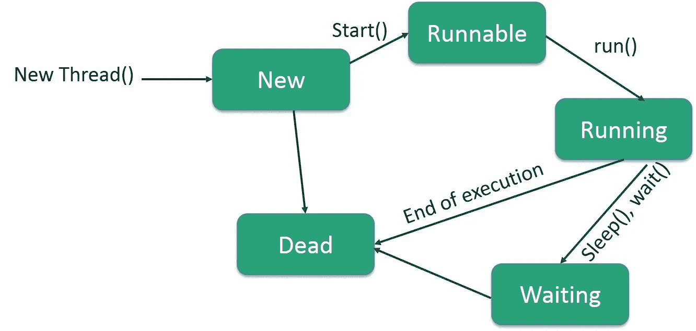

# 让我们学习 Java 线程

> 原文：<https://levelup.gitconnected.com/lets-learn-java-threads-e156481883cb>

> 在 Java 中使用线程的一个主要原因是让一个任务与另一个任务并行运行。


[阿历克斯·帕莫尔](https://unsplash.com/@thatalexpalmer?utm_source=medium&utm_medium=referral)在 [Unsplash](https://unsplash.com?utm_source=medium&utm_medium=referral) 上拍照

# 为什么我们在 Java 中使用线程？

我们使用线程通过同时做多件事来提高 Java 应用程序的速度。用技术术语来说，线程帮助我们在 Java 程序中实现并行。由于 CPU 是高速的，并且它甚至包含多个内核，所以仅仅一个线程不能利用所有的内核。这意味着我们昂贵的硬件将在大部分时间处于闲置状态。

使用多线程，我们可以通过服务更多客户端和更快地服务它们来充分利用多核。因为在当今快节奏的世界中，响应时间非常重要。这就是我们拥有多核 CPU 的原因。多线程。多线程是在 Java 应用程序中利用 CPU 巨大计算能力的一种方式。

# 在 Java 中使用多线程的原因

即使是 Java 应用程序也至少包含一个叫做主线程的线程，它执行你的 main 方法。JVM 使用了更多的线程，例如**守护线程**，它们负责垃圾收集和其他一些日常工作。作为应用程序开发人员，我们还可以添加新的用户线程，使我们的应用程序更快、更高效。这里有一些在 Java 中使用多线程的常见原因和场景。

# 1)并行编程

在 Java 中使用线程的主要原因之一是**让一个任务与另一个任务**并行运行，例如绘图和事件处理。GUI 应用程序(如 Swing 和 Java FX GUIs)是 Java 多线程的最佳范例。在典型的 GUI 应用中，用户发起一个动作，例如从网络下载文件或者从硬盘加载游戏模块。

这些操作需要一些时间来完成，但是我们不能冻结 GUI，因为那样用户会认为我们的应用程序被挂起了。相反，我们需要一个单独的线程来执行耗时的任务，并不断向用户显示相关的消息，或者允许他同时执行其他任务，以保持 GUI 的活力。这是通过在 Java 中使用多线程来实现的。

# 2)充分利用 CPU 的能力。

在 Java 中使用多线程的另一个常见原因是**通过充分利用 CPU 能力来提高应用程序的吞吐量**。例如，如果我们有 32 个核心 CPU，并且我们只使用其中的一个来服务 1000 个客户端，并且假设我们的应用程序受到 CPU 的限制，我们可以通过使用 32 个线程将吞吐量提高到 32 倍，这将利用您 CPU 的所有 32 个核心。

# 3)减少响应时间

我们还可以使用多线程来减少响应时间，通过**将一个大问题分成更小的块，并使用多线程**来处理它们，从而进行快速计算。例如，map-reduce 模式是基于将一个大问题分成几个小问题并处理它们。

# 4)同时服务多个客户端。

使用多线程显著提高应用程序性能的最常见场景之一是客户端-服务器应用程序。单线程应用程序意味着一次只有一个客户端可以连接到服务器，但多线程服务器意味着**多个客户端可以同时连接到服务器**。这意味着下一个客户端不必等到我们的应用程序处理完前一个客户端的请求。

# 线程的生命周期



礼遇:【https://www.tutorialspoint.com】T4

# 如何在 Java 中创建线程

创建线程有两种方法:

1.  通过扩展**线程类。**
2.  通过实现**可运行接口**。

# 线程类

Thread 类提供了在线程上创建和执行操作的构造函数和方法。Thread 类扩展 Object 类，实现 Runnable 接口。

# Thread 类的常用构造函数

*   线程()
*   线程(字符串名称)
*   线程(可运行 r)
*   Thread(Runnable r，字符串名称)

# 螺纹类的常用方法

```
**public void run():** is used to perform action for a thread.**public void start():** starts the execution of the thread. JVM calls the run() method on the thread.**public void sleep(long milliseconds): c**auses the currently executing thread to sleep (temporarily cease execution) for the specified number of milliseconds.**public void join():** waits for a thread to die.**public void join(long milliseconds):** waits for a thread to die for the specified milliseconds.**public int getPriority():** returns the priority of the thread.**public int setPriority(int priority):** changes the priority of the thread.**public String getName():** returns the name of the thread.**public void setName(String name):** changes the name of the thread.**public Thread currentThread():** returns the reference of currently executing thread.**public int getId():** returns the id of the thread.**public Thread.State getState():** returns the state of the thread.**public boolean isAlive():** tests if the thread is alive.**public void yield():** causes the currently executing thread object to temporarily pause and allow other threads to execute.**public boolean isDaemon():** tests if the thread is a daemon thread.**public void setDaemon(boolean b):** marks the thread as daemon or user thread.**public void interrupt():** interrupts the thread.**public boolean isInterrupted():** tests if the thread has been interrupted.**public static boolean interrupted():** tests if the current thread has been interrupted.
```

# 可运行接口

Runnable 接口应该由任何类来实现，这些类的实例应该由线程来执行。runnable 接口只有一个名为 run()的方法。

```
**public void run():** is used to perform action for a thread.
```

# 开始线程

线程类的 **start()方法**用于启动一个新创建的线程。它执行以下任务。

*   一个新线程启动(带有一个新的调用堆栈)。
*   线程从新状态转移到可运行状态。
*   当线程有机会执行时，它的目标 run()方法将会运行。

*让我们通过一个简单的例子来看看线程是如何工作的。*

# 线程同步

java 中的同步是控制多个线程访问任何共享资源的能力*。*

Java 同步是一个更好的选择，只允许一个线程访问共享资源。

## 同步主要用于

> *防止螺纹干涉。*
> 
> *防止一致性问题。*

# Java 中的锁概念

同步是围绕称为锁或监视器的内部实体建立的。每个对象都有一个与之关联的锁。按照惯例，需要一致访问对象字段的线程必须在访问它们之前获取对象的锁，然后在完成访问后释放锁。

在本例中，没有同步，因此输出不一致。让我们看看这个例子:

# Java 同步方法

如果我们将任何方法声明为 synchronized，它就是所谓的 synchronized 方法。

同步方法用于锁定任何共享资源的对象。

当线程调用同步方法时，它会自动获取该对象的锁，并在线程完成其任务时释放它。请参见下面的示例。

# 结论

本文结束时，我们已经学习了 Java 中的线程。以及他们是如何实施的。希望这篇文章能帮助你发展关于这些概念的知识。让我们在不久的将来遇见另一篇有趣的文章。

谢谢你看了我的文章，祝你学习愉快🙌😊

## 参考

大一新生 100 个核心 Java 面试问题…[https://techvidvan . com/tutorials/core-Java-interview-questions-answers/](https://techvidvan.com/tutorials/core-java-interview-questions-answers/)

在 Java 中创建线程—Java point。【https://www.javatpoint.com/creating-thread 号

Java 中的同步—Java point。【https://www.javatpoint.com/synchronization-in-java 