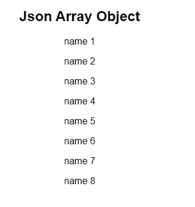
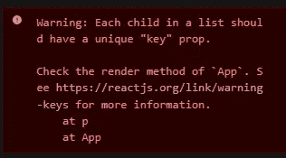
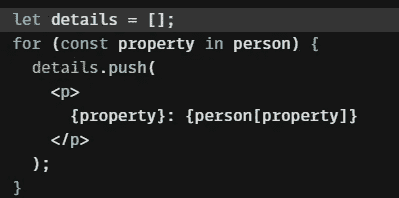
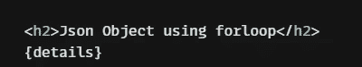
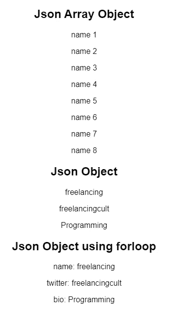

# 让我们在 React 组件中循环数据

> 原文：<https://levelup.gitconnected.com/lets-loop-data-inside-a-react-component-832e9130ed0f>

## 一篇文章中的所有方法都有沙盒代码可供使用


今天我将讨论我作为初学者开发 React 应用程序时面临的主要疑惑之一。我总是不得不使用 StackOverflow 并查看循环方法来从 JSON 响应中获取值。

我想到了在 react 组件中添加所有基本的循环方法。

我们从 API 获取数据主要有两种方式。最常见的是通过 JSON 数组。我们使用的另一种方法是在单个 JSON 对象中循环。

# 遍历数组

## 遍历 JSON 数组对象

这是我们大部分时间不得不处理的最常见的方法

我们可以使用`.map`遍历数组，并使用模板文字`{}`访问每个对象元素



如果您查看控制台，您会在控制台中看到以下警告



这个警告是说给每个元素添加一个关键道具。原因与 react 识别 UI 变化的方式有关。react.js 被创建的主要原因是其优化的 DOM 树呈现。React 使用这个唯一的键值来标识每次渲染时列表中是否有变化。如果值 1 被更改，它只在 dom 中呈现该值并更新它，这使得在 dom 操作中反应如此之快。

让我们像这样添加一个键值

```
{people.map((data, idx) => (
<p key={idx}>{data.name}</p>
))}
```

# 对对象循环作出反应

## 循环遍历对象而不是数组

如果我们想循环遍历一个对象，我们必须使用`Object.keys(objectName)`方法。然后我们可以用对象的所有键值创建一个数组。

然后我们可以使用`map`遍历这些键值，并得到如下所示的值

```
{Object.keys(person).map((key) => (
<p>{person[key]}</p>
))}
```

## 为什么总是映射

因为不像`foreach` 或者`for`循环。map()返回一个新数组。所以当发送参数到函数映射内部的返回方法时，因为它返回一个数组。

```
return([array])
```

## 对于循环

我们可以在返回函数之外使用 for 循环来创建一个包含所需 jsx 的数组，并将整个数组添加到返回函数中

参见下面的代码



我们可以像这样在返回中添加错误细节



我们可以使用任何形式的 js 数组`while` `foreach`或者任何外部的 return。生成预期的 jsx 并将其添加到数组中。然后在返回函数中使用该数组。

下面的沙盒中给出了完整的代码，供您尝试和测试

> 我希望你喜欢读这篇文章。如果你愿意支持我作为一个作家和我分享知识的时间，考虑注册[成为一个媒体成员](https://freelancingcult.medium.com/membership)。每月只需 5 美元，你就可以无限制地使用 Medium。

输出



> 如果你愿意支持我成为一名作家，考虑注册[成为一名媒体成员](https://freelancingcult.medium.com/membership)。这样我就可以花更多的时间来分享知识。每月只需 5 美元，你就可以无限制地使用 Medium。