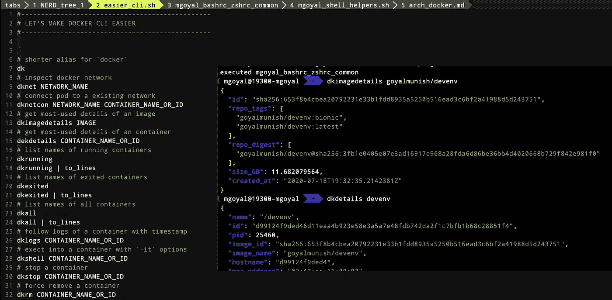

# Docker CLI 变得更加简单

> 原文：<https://levelup.gitconnected.com/lets-make-docker-cli-easier-75009d00830e>

Docker CLI 不是非常用户友好，当我们在一个多容器环境中工作时，你必须明确许多选项在日常使用和调试中作为默认选项是有意义的。这篇文章的目的是定义一些函数、别名和 JSON 模板，使 CLI 对我们来说更容易。

[**Docker CLI**](https://docs.docker.com/engine/reference/commandline/docker/) **(客户端)**是 **Docker API** 之上的一个包装器，它使我们能够将 **Docker API 调用**向下发送到 **Docker 守护进程**。

我们先来看看**最常用的 Docker CLI 命令**是它们最常用的选项(一定要注意注释):

此外，下面的快捷方式可以让你的生活更容易。您可以在您的概要文件或 rc 文件中找到这些脚本。但是，为了预先设置好一切，您可以使用[**goyalmunish/devenv**](https://hub.docker.com/r/goyalmunish/devenv)Docker 映像作为您的开发环境(是的，您可以轻松地将其连接到运行在您的主机上的 Docker 守护程序)。

它使用下面的辅助文件([**goyalmunish/devenv**](https://hub.docker.com/r/goyalmunish/devenv)image 为您处理所有设置):

请注意，虽然`[docker attach](https://docs.docker.com/engine/reference/commandline/attach/)`通过`ENTRYPOINT`或`CMD`将 docker 进程的输入、输出和错误附加到您的屏幕上，但是`[docker exec -it](https://docs.docker.com/engine/reference/commandline/exec/)`允许您在 docker 中运行一次性命令，例如`/bin/bash`(这样您就可以运行 shell 本身，以便您可以运行其他命令)。注意，使用`docker exec`启动的命令只在容器的主进程(`PID 1`)运行时运行，如果容器重启，它也不会重启。

这里有一些相关的有趣故事，你可能会觉得有帮助

*   [让我们让 Kubernetes CLI (](https://medium.com/@goyalmunish/lets-make-kubernetes-cli-easier-5ba7f9c0509a) `[kubectl](https://medium.com/@goyalmunish/lets-make-kubernetes-cli-easier-5ba7f9c0509a)` [)更容易](https://medium.com/@goyalmunish/lets-make-kubernetes-cli-easier-5ba7f9c0509a)
*   [为什么以及如何在 Kubernetes 中设置探头？设计一个健壮的 K8s 集群](https://medium.com/@goyalmunish/why-and-how-to-set-probes-in-kubernetes-d7da39e94e64)
*   [docker exec 命令中的主机与容器环境变量](https://medium.com/@goyalmunish/passing-host-vs-container-environment-variables-to-docker-exec-5c1b18e6de8e)
*   [Docker 简体！](https://medium.com/@goyalmunish/docker-simplified-ad1f8a7350bf)
*   [Kubernetes 简体！](https://medium.com/@goyalmunish/kubernetes-simplified-300fef5fb0e6)