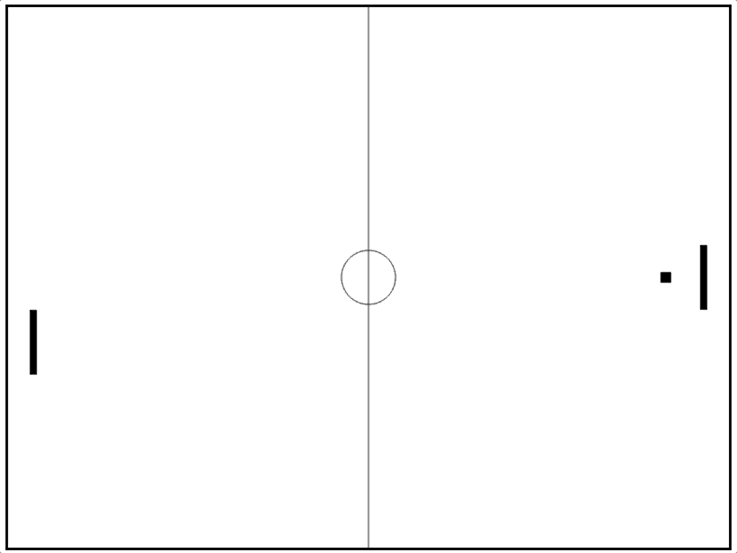

# 让我们做乒乓球吧！

> 原文：<https://levelup.gitconnected.com/lets-make-pong-d75dcc110ca5>

乓！

在这里，我们将制作一个经典的乒乓游戏！Pong 是一款非常古老和著名的游戏，[最初于 1972 年发布，是首批街机视频游戏](https://en.wikipedia.org/wiki/Pong)之一。翻拍这些经典游戏以其自身的方式是值得的，因为它们很容易识别，玩起来总是很有趣。它们也稍微容易制作，因为控制非常简单，大多数只需要两个输入。这仍然需要一些逻辑和推理技能，但也需要你改变你的思维框架，让游戏运行。我们将使用 HTML 画布和 JavaScript。所有你需要的[建兴服务器，](https://www.npmjs.com/package/lite-server)一个非常基本的理解[画布 API](https://developer.mozilla.org/en-US/docs/Web/API/Canvas_API) 和[请求动画帧 API，](https://developer.mozilla.org/en-US/docs/Web/API/window/requestAnimationFrame)所有这些都是链接。我将把这篇文章分成两篇博文，这篇是关于如何让基本游戏运行起来的。下一篇博文，我们将个性化它，并添加一些有趣的附加功能，如电源和有趣的效果。按照每一步的图片和描述，让我们用自己的方法重新创造 Pong！

首先，我们需要考虑我们希望这个游戏如何运行。如果我们停下来想一想，Pong 本质上只是一个球在一个有两个球拍的盒子里弹跳。我们将用上下箭头控制一个桨，并且必须设计某种计算机来对抗。你可以让两个人一起玩，让他们用“A”和“W”键来控制球拍，但我想只让一个人玩。

计算机应该追球，并且随着玩家分数的增加，速度越来越快，难度也越来越大。至于球，我们希望保持游戏的趣味性，所以我们需要让它的表现有点出乎意料。它会完美地从墙上弹开，但是当它碰到一个挡板时，有趣的事情会发生。当球更接近边缘时，它会以更尖锐的斜角射出，而不是正常的和更可预测的角度。最后，如果球经过任一桨并击中墙，计分器将会上升，球将回到中心，朝向胜利者。我们现在有了一些目标，让我们开始吧！

# 步骤 1:初始设置

我们将设置目录，创建我们的文件，并打开您选择的编辑器。我们的 HTML 文档只需要最少的标记，包括指向 JavaScript 文件的脚本标签和指向 CSS 文件的链接。在我们的 JS 文件中，创建 canvas 元素并将其附加到主体。我们将宽度和高度设置得相当大。由于这不是一个手机游戏，我们可以将画布设置为 800 x 800 左右。我们还需要获得上下文 id 为“2d”的画布的上下文，并将其设置为一个简单的变量。大多数人设置成 ctx，我也是这样。最后，我们将使用名为 animate 的函数和 requestAnimationFrame API 来设置基本动画。这将使动画函数以大约每秒 60 次的速度循环运行，给我们 60fps 的帧速率。我将画一条简单的垂直线穿过中心，中间有一个圆，给我们一个棋盘效果，并将它放在一个单独的函数中，这个函数在我们的 animate 函数中被调用。理想情况下，我们会把画布的宽度和高度作为一切的基础，这样我们就可以在游戏的后期有一些灵活性。我们还将使用 flexbox 将画布居中，并去掉所有内容的边距和填充。这是我所拥有的。

终端命令

超文本标记语言

半铸钢ˌ钢性铸铁(Cast Semi-Steel)

Java Script 语言

我们的董事会到此为止！

# 第二步:运动员划水

对于实际的游戏，将从创建我们的玩家的球拍开始，它应该对箭头按钮作出响应。桨只需要是一个矩形，大约是画布高度的 10%-20%。让我们创建一个名为 Player 的 JavaScript 类，在其构造函数中只接受一个参数“y”。我们需要“y”的原因是桨只上下移动，这对应于画布的 y 轴。

我们还需要提醒自己，画布有一个坐标系，随着 y 的增加而下降。让我们通过将桨的 y 点设置在画布的中间来简化我们的工作。我们的 Player 类也需要一个绘制桨的方法。我的球拍会放在离右边的墙大约 3%的地方，1%厚，12%宽，从中间开始。fillRect 函数接受 x、y、宽度和高度这四个参数。要在球拍的中间设置我们的 y 坐标，你需要根据球员实例的 y 值除以所需球拍高度的一半或 y-(h*6%)来设置 y 参数，因为我的球拍是宽度的 12%。一旦完成，我们需要实例化一个新的播放器，并在动画函数中调用我们播放器上的 draw 函数。

我们的播放器类和该类的一个实例

为了让球拍移动，我们必须有一个事件来改变我们的 player 实例的 y 值。条件将检查是否向上或向下箭头被按下。

事件监听器

哎呀！

为了让动画工作，我们每次都需要一个全新的帧，所以让我们在动画循环开始时清除旧帧

清空我们整个董事会

不错！

# 第三步:球…正方形？？

现在让我们制作球，但让我们把它做成正方形，给它一种复古的效果。它将有一个自己的类，在构造函数中有 x、y、dx 和 dy 参数。draw 函数很简单，因为我将把它设为画布宽度的 1.5%，并把它放在中间。我们希望我们的 x 和 y 位置代表正方形的中心，所以在 draw 方法中要考虑到这一点。创建一个新的 ball 实例，并在 animate 函数中调用 draw 方法。

我们的球类和一个新实例

我们的方形球在中间

现在，为了让它反弹，我们需要在类中有一个更新方法，分别通过 dx 和 d y 改变 x 和 y 的位置。这是游戏的大部分内容，因为游戏围绕着球在构造函数中的位置，现在将 dx 设置为 1，dy 设置为 3。确保在 animate 函数中包含新的更新方法。

新的更新方法

酷！

我们希望球从顶部和底部反弹，所以当球大于画布宽度小于 0 时，我们需要翻转 dy。确保说明球的 x 和 y 位置在球的中心，否则它看起来会像是撞到了墙上。

不错！

现在我们想让它从桨上弹开，如果它以一个更尖锐的角度撞击桨，让它弹开得更尖锐。条件需要检查球的中心和球拍中心之间的距离的绝对值是否小于球拍宽度加上球半径的一半。我们还希望有条件地看到球是否在桨的相同 x 位置，这是一个范围而不是具体值，因为如果球的 dx 大于 1，它有很小的机会跳过我们的桨，这不是理想的。现在，为了使球的移动不同于预期，我们需要在球拍击球时改变 dy。如何改变 dy 由你决定，但我要取球的 y 位置和桨的 y 位置的差，然后将它缩放到-3 到 3 之间。我也开始注意到我们使用了(w*.015/2)很多来说明球的中心，所以我将它设置为一个名为 ballRadius 的变量，并用新的变量名替换我使用它的时间次数(它不是一个圆，但也可以)。让我们也为桨做准备，因为我们也会经常用到它。这是我目前掌握的情况。

球更新方法中的条件

看起来不错！

# 第三步:电脑

当我第一次想到做一台电脑来玩的时候，我认为这太难了，但是我错了，这一点也不难！实际上，我们已经有了所需的大部分代码，所以实际上只是简单的复制和粘贴。我们将使用 dy 参数创建另一个类，就像 player 类一样，使用相同的 draw 方法，但是绘制在画布的右侧。

带有实例的新计算机类

不算太差！

现在我们想添加一个更新功能来“追”球。如果球在桨的上方，那么我们需要从 y 中减去，因为较低的 y 值较高，如果球低于桨，我们将增加 y。这将基于球的 y 和计算机桨的 y。因为我们正在改变 y，我们改变 y 的值是 dy，但这是为了下一个博客，我们只是想要一个工作的游戏。我还将控制桨的宽度，使它不会离开屏幕，并且不要忘记将计算机实例上的更新功能添加到动画功能中。

计算机更新方法

看起来像乒乓球比赛！

不算太糟吧？现在，从技术上来说，我们已经制造了一台无与伦比的计算机，因为球的最大 dy 值是 3，这是我们给计算机设置的值，所以它会一直保持并回击。在下一篇博文中，我们将让计算机变得更简单，并随着分数的上升而变得越来越难。

# 第四步:最后一步

现在我们所要做的就是让球从电脑挡板上弹开，当它碰到边缘时，回到中心，朝着最后一个进球的获胜者，我们就完成了一场比赛，有点儿！剩下的比赛都在球类。在更新函数中，我们想要和球从球员的球拍上反弹时一样的东西，这样我们就可以复制和调整那部分。最后，当球大于画布长度或小于 0 时，我们希望将球送回中心，dx 反转，使球回到中心。这是我所拥有的。

球的更新方法

它反弹并回到中间！

最后这里是我们的工作游戏！在制作游戏的时候，我们学到了更多关于画布、类方法和一些基本的物理知识！下一篇博文我们会清理一些东西，给我们的游戏添加一些很酷的效果，这样玩起来会更有趣。我希望你喜欢它！

我们完成的游戏！

**布拉德利哈利** *全栈开发者寻找我的下一场演出* [GitHub](https://github.com/bshaley25)**|**[LinkedIn](https://www.linkedin.com/in/bradley-haley-44a85b19a/)**|**|[Medium](https://medium.com/@bshaley25)**|**[网站](https://bradley-s-website.web.app/)