# 让我们做井字游戏！

> 原文：<https://levelup.gitconnected.com/lets-make-tic-tac-toe-51dd3fd188d>

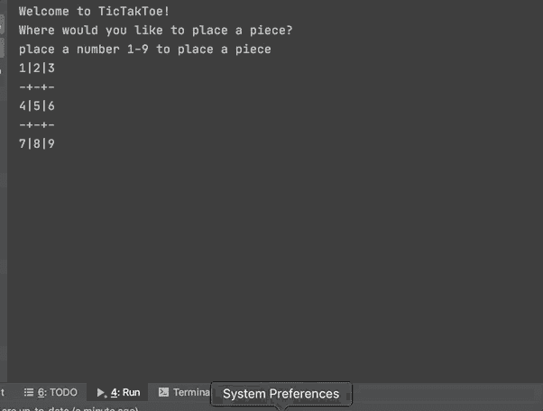

一款非常简单的井字游戏！

我们将制作一个超级简单的井字游戏！这种双人纸笔游戏有着非常古老的起源，在许多文化中无处不在。这个版本将由 Java 编写，我将使用 IntelliJ IDE。这款游戏还将配备一台超级简单的电脑，可以随机放置棋子。在未来的博客文章中，我们将讨论如何使用极大极小算法使其不可战胜，但现在我们只需要在屏幕上显示一些东西，并确保我们知道游戏何时获胜。按照每一步的图片和描述，让我们开始编码吧！

让我们首先决定如何将我们的项目关注点分开。由于 Java 是一种面向对象的语言，我们需要从面向对象的角度来考虑我们的游戏。你可能想分开你的文件不同，所以觉得自由这样做。在 Main.Java，我会提示问题，但我需要参考用户和计算机所做的移动。游戏逻辑也将保存在不同的文件中。一旦你决定了如何分离你的关注点，让我们开始编程吧！因为我们的游戏超级简单，所以让用户总是先走，并且永远是 x。计算机会跟着走，并且是 o。

# 第一步:设置

我将让 IntelliJ 为我做所有困难的工作，所以只需在您想要的目录中创建一个新项目，并将其命名为 TicTacToe。让我们也制作三个 Java 类文件。一个是游戏逻辑的 Game.java，一个是简单的电脑玩家的 Computer.java，最后一个是 TicTacToe.java，我们会提示用户问题。下面是我的文件结构！

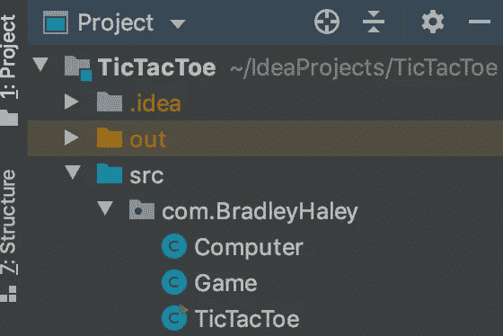

ItelliJ 为我们处理了大部分工作！

# 第二步:棋盘和游戏

我们将在 Game.java 制作我们的棋盘和所有的游戏逻辑。该局将是一个 2D 字符阵列展示如下。我还将使用另一个名为 placements 的数组来跟踪仓位。有 8 个获胜的位置，所以我创建了一个函数来检查位置数组中的位置，并且在每次移动后都调用这个函数。我还添加了 getter 函数。

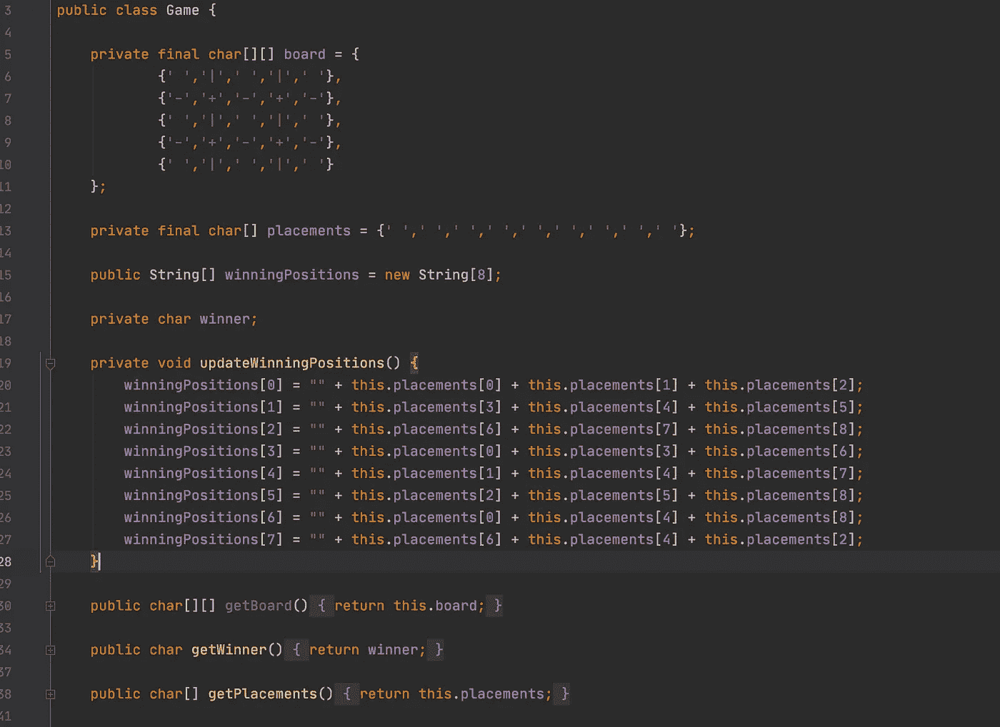

目前为止我的功能。

我还创建了一个名为 show options 的函数，它将显示所有的选项和打印板。给函数命名是如此简单，令人惊讶。这些函数是嵌套循环，在 2D 数组上迭代。

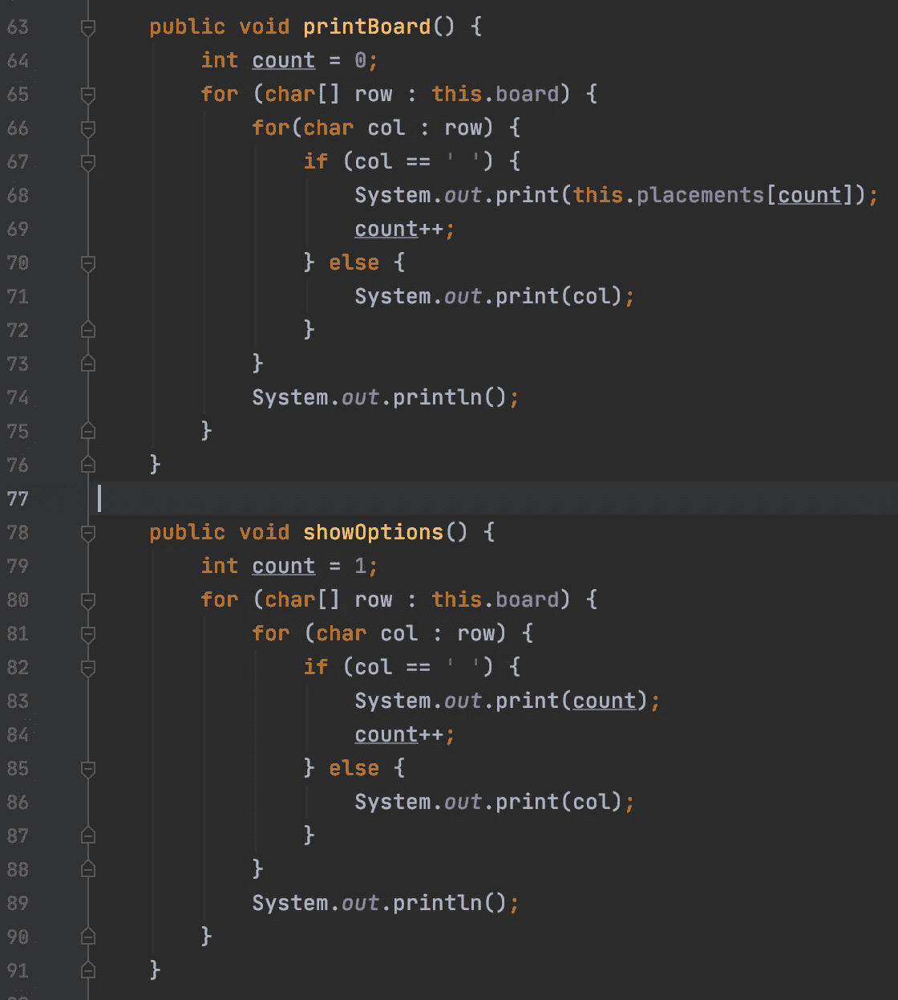

最后这些是为电脑或玩家定位的函数。用户的位置编号为 1–9，因此我减去 1，使其更容易匹配位置数组。它带有一个字符 X 或 O 以及一个位置。我们需要检查那个位置是否已经被占用，所以我们还要创建一个函数来检查那个位置是否被占用，并返回一个布尔值。

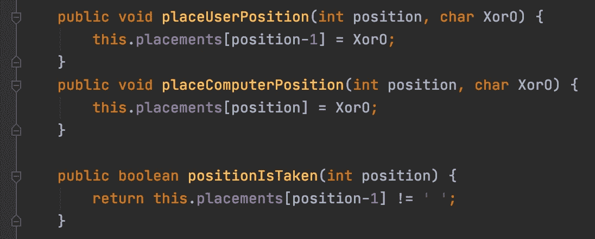

我的功能

最后，我们需要函数来检查游戏是否是平局，最后一步棋已经走完，或者游戏已经赢了。我们已经做了所有的艰苦工作，所以这些是简单的功能。

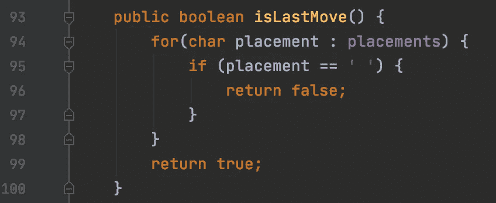

我的代码…

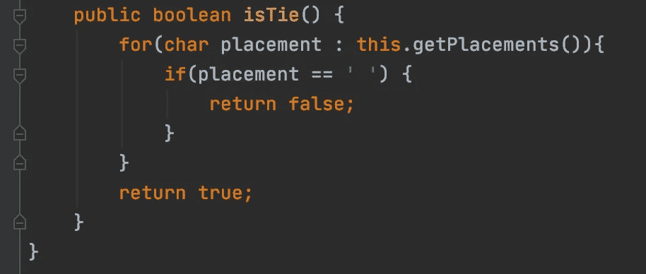

…一切都结束了…

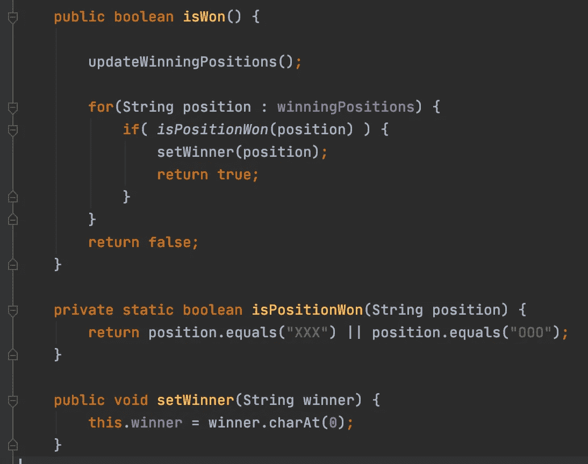

…这个地方！

这应该是棋盘和游戏逻辑的总结。这是最密集的部分，干得好！

# 3 .电脑

我们的计算机所要做的就是放置随机的零件，因为这是我们最小的可行产品(简称 MVP)。我需要得到位置数组并选择一个随机数。如果这个随机数被占用，那么选择另一个直到它没有被占用。一旦它找到了一个动作，它需要做的只是放置它！真的就这么简单！我们可以使用最小最大算法使它变得更困难，但这是一个单独的话题。

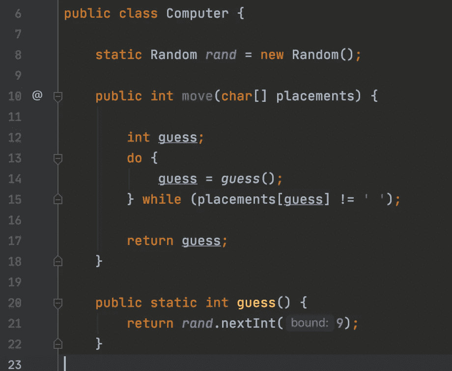

真的那么简单！

# 第四步:用户

最后一步是把它们放在一起！我们首先需要通过实例化将所有这些组件组合在一起，并创建一个漂亮的小 intro 函数！

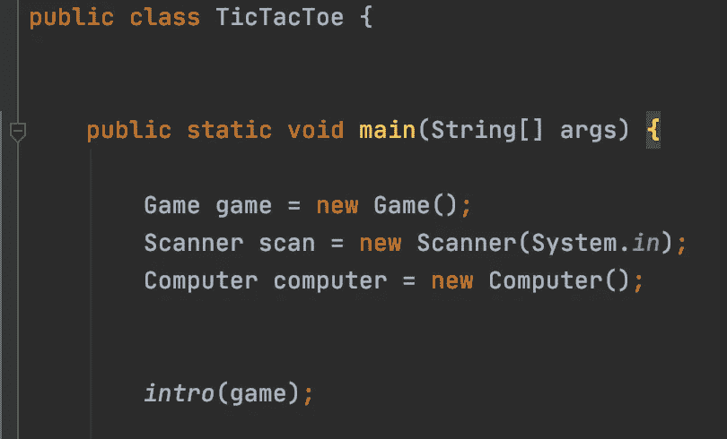

我们的实例化和介绍函数！

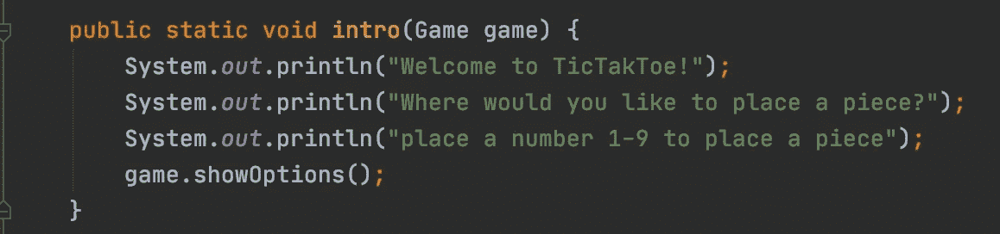

调用我们的显示选项方法

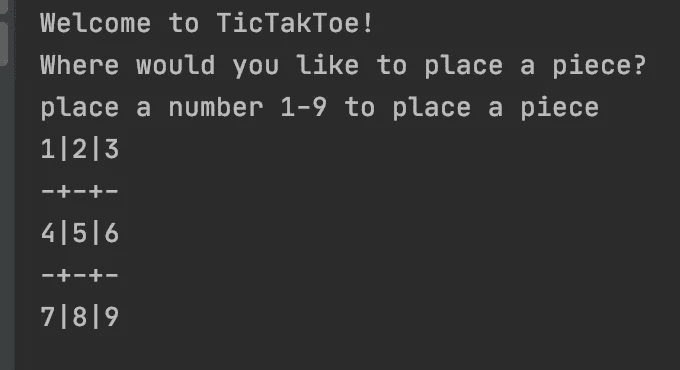

看起来相当不错！

在提示之后，我们需要采取用户行动。我们需要验证这个输入，以确保它是一个数字 1-9。我使用一个 try catch 块来检查它是否是一个整数，如果是，程序就退出。这是一个 while 循环，用于检查数字是小于 1 还是大于 9，如果是，将提示他们选择另一个数字，最后，如果该位置被占用，他们必须再次选择！这需要大量的验证！计算机有它自己的小功能，因为我们给它编了程序，使它只能做出正确的选择。

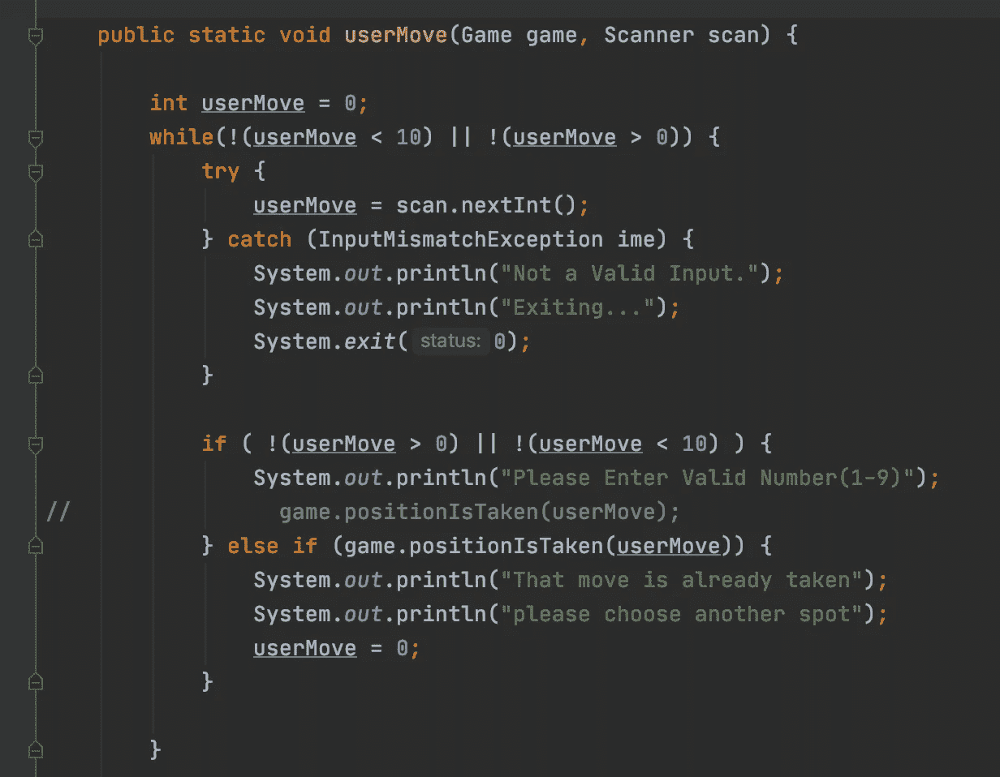

有点复杂，但做了它需要做的事情！

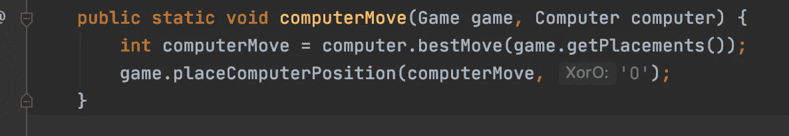

一个简单得多的函数！

现在这部分是我自己的，因为我喜欢分解成更小的函数，但是如果游戏打成平手或者赢了，我会为打印信息创建函数，但是之后我们需要做的就是把它打包。我设计的方式是让用户是 X，总是先走。我在每一步棋后都检查游戏是否赢了，这有点过分，但这是我们的 MVP！现在我们有 9 个位置，2 个玩家，第一个玩家将有最后一步棋。如果不小心的话，你可能会陷入一个无限循环。如果你在两个棋步结束时都检查了一个平手游戏，并且你下了你的棋步，那么计算机会继续寻找一个棋子，但是没有！再次，它结束了杀戮，但我检查是否有任何平局游戏后，用户每一轮。一旦我们有了它，我们就有了一个全功能的 TicTacToe 游戏！干得好！在以后的博客文章中，我们将使用最小最大算法制造一台无与伦比的计算机！

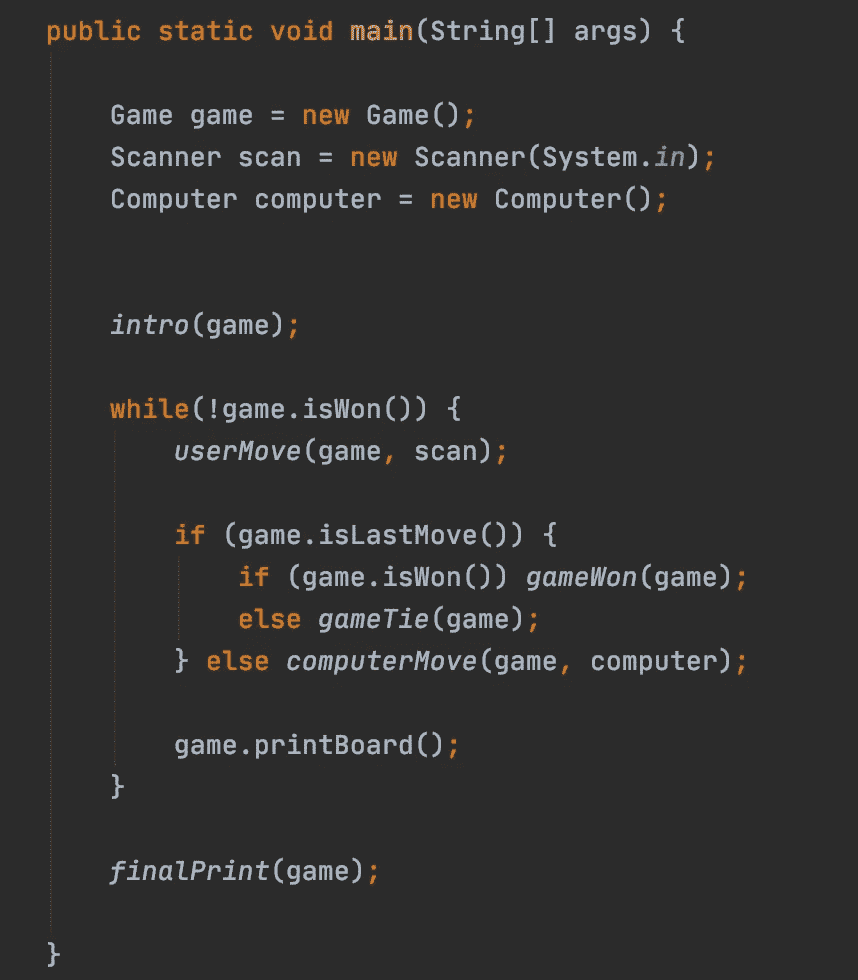

我们最后一个总结的方法！

**布拉德利哈利** *全栈开发者寻找我的下一场演出* [GitHub](https://github.com/bshaley25)**|**[LinkedIn](https://www.linkedin.com/in/bradley-haley-44a85b19a/)**|**|[Medium](https://medium.com/@bshaley25)**|**[网站](https://bradley-s-website.web.app/)

 [## 编写面试问题

### 一个完整的平台，在这里我会教你找到下一份工作所需的一切，以及…

技术开发](https://skilled.dev)