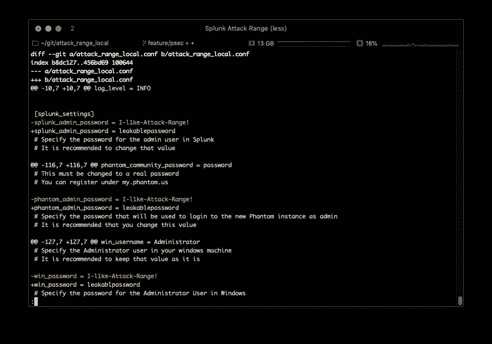
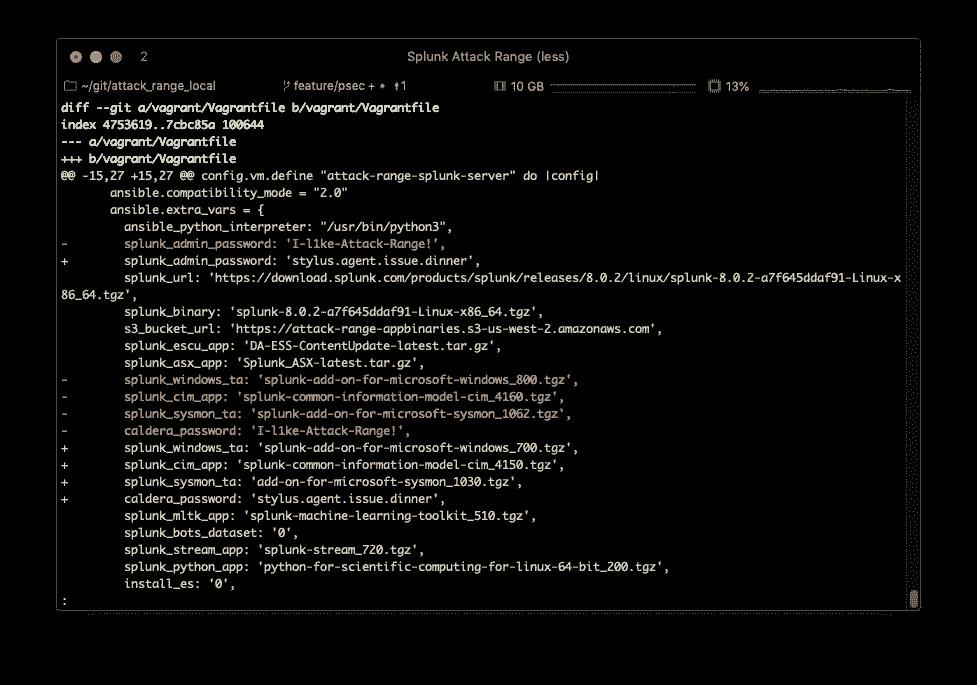
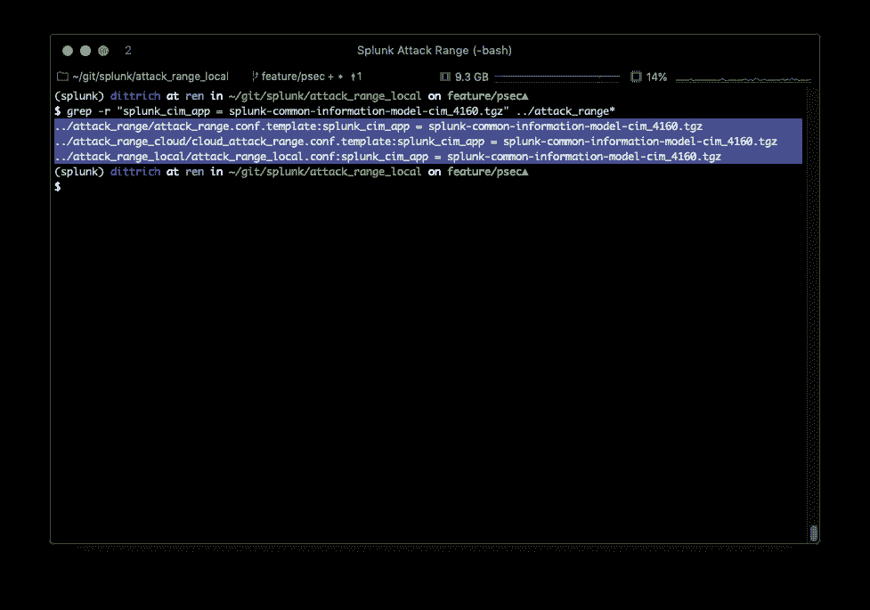

# 我们不要用默认密码，好吗？

> 原文：<https://levelup.gitconnected.com/lets-not-use-default-passwords-m-kay-2152c7a82ebc>

## 或者，“我如何将 python-secrets 与 Splunk 的攻击范围框架集成，以及您如何为您的开源项目做同样的事情！”


迈克尔·泽兹奇在 [Unsplash](https://unsplash.com/s/photos/unlock?utm_source=unsplash&utm_medium=referral&utm_content=creditCopyText) 上的照片

在这篇文章中，我想做三件事。(1)指出几个我认为普遍存在的基本计算机安全问题，(2)提供我自己提出的解决方案，以及(3)向您展示如何在您自己的开源项目中实现该解决方案(或者作为对其他人的开源项目的拉式请求)。

我将为你提供一个同时完成*所有*以下目标的方法:

1.  减少持续且可重复地配置和建立小规模分布式系统所需的时间。
2.  减少用户在配置和部署过程中犯错误的机会，避免花费时间和精力进行调试和纠正。
3.  减少由于公共资源存储库中的秘密泄露而导致用户系统暴露于未经授权的访问的机会(不需要额外的过程，如存储库扫描或 Git 预提交挂钩)。
4.  同样的三个原因也适用于维护或修改项目源代码的人，通过使项目更加*枯燥* ( [不要重复](https://en.wikipedia.org/wiki/Don%27t_repeat_yourself))并降低开发、测试、扩展部署等的摩擦来简化项目的编码。

最后有一个概念验证动画来演示这一点！

# 莫里斯蠕虫万岁？！？

自从我开始做安全事件响应以来——我必须承认这可以追溯到互联网出现之前！—我不断看到由于某些恶棍使用默认密码登录他人系统而导致的大规模系统入侵。

我和我的同事凯瑟琳·卡彭特(Katherine Carpenter)和马尼什·卡里尔(Manish Karir)在电气和电子工程师协会(IEEE)首届*工程、科学和技术伦理国际研讨会*上发表的一篇论文中写道，我们研究了“互联网人口普查数据集”和 *Carna 僵尸网络*，它通过在未经所有者授权的情况下控制全球 420，000 个系统并使用它们连续数周扫描整个互联网而创建了这个数据集！

 [## 对 2012 年互联网人口普查数据集的伦理审查

### 在 2012 年，一个匿名的个人在互联网接入设备上使用默认或无密码等基本技术…

dl.acm.org](https://dl.acm.org/doi/10.5555/2960587.2960646) 

当然，你*应该*看看我们的论文——我有没有提到我们获得了“最佳论文”奖的亚军？—但是如果你想要一个更有趣的视角，你不会后悔花时间去听[黑暗网日记](https://darknetdiaries.com/)播客，第 13 集。

[](https://darknetdiaries.com/transcript/13/) [## 卡纳僵尸网络-黑暗网络日记

### 2012 年，卡纳机器人建成并向全世界发布。但是它没有任何做任何事情的意图…

darknetdiaries.com](https://darknetdiaries.com/transcript/13/) 

它讲述了一个谷歌安全工程师的故事，他实际上接触了 Carna 僵尸网络的运营商，并与(巧合的是！)IEEE 和 AusCERT 来修复一些被 Carna 利用的未受保护的系统。

当然，读到这里的一些人(老实说，很多人)会说“但是这些系统的所有者活该，因为他们*应该修改*他们设备上的密码！”

对此，我不得不问，“为什么——在莫里斯蠕虫暴露了弱密码和默认密码的漏洞 32 年后，在互联网上的多个网站公布了一长串消费者和开源系统的默认登录和密码信息后——软件工程师没有开发和推广一种方法来首先避免硬编码的默认密码？!"

莫里斯蠕虫如何猜测密码？(Sourcefire 的 YouTube 视频，2013 年 11 月 4 日。)

# 但是等等，更糟的是！

然而，默认密码并不是唯一需要解决的问题。

弱密码和默认密码最近的一种变体，由于使用公共存储库服务(如 GitHub)的开源项目的增长而加剧，是通过意外发布密码和 API 密钥等秘密的泄露。即使是大公司也遭受过秘密的意外发布，这些秘密是由某人扫描公共存储库并通过利用泄露的凭证获得未授权的访问而发现的。

《与松露猪在源代码中战斗的秘密》，Dylan Ayrey，TOORCON XX，2018 年 11 月

除了他的[松露猪](https://github.com/dxa4481/truffleHog)之外，迪伦还提到了其他一些寻找 Git 秘密的工具，还有像[https://github.com/eth0izzle/shhgit/](https://github.com/eth0izzle/shhgit/)和[https://github.com/d1vious/git-wild-hunt](https://github.com/d1vious/git-wild-hunt)这样的工具。

像这样的发布工具有助于提高对问题的认识，但与软件项目的概念验证利用不同，没有供应商来开发补丁，这些概念验证工具没有为软件开发人员和网站可靠性工程师的大脑提供补丁，他们继续使用我在本文中指出的不安全的做法，导致 Git repos 中的秘密泄漏。

我想做点什么，首先把回购目录的秘密*弄出来*，让由多个互补的开源项目组成的分布式系统的安全部署更容易自动化*。如果更好的实践比其他选择更容易，人们更有可能遵循它！*

为此，我编写了[一个名为](https://github.com/davedittrich/python_secrets)`[p](https://github.com/davedittrich/python_secrets)ython-secrets`(又名`psec`)的程序，它旨在使发布一个需要秘密的开源项目变得容易，但当你建立一个实例而不是硬编码默认值时，就会生成它们。使用`psec`简化了创建、管理和应用秘密(以及其他需要的变量)的过程，从而更加安全地部署开源项目。

它还将这些秘密*存储在*源存储库目录之外，因此它们不会意外泄漏。无论您是在家庭网络上还是在互联网上安装系统，从一开始就应该一样简单和安全。

使用开源避免默认密码和安全漏洞，David Dittrich 和 Katherine Carpenter，TOORCON XX，2018 年 11 月

我一直致力于将`psec`集成到几个开源项目中，有些是我自己的，有些是别人的。如果你想在自己的项目中尝试，或者想以任何方式帮助我，请联系我！

# 理论上容易，实践上容易！

我最近偶然发现了一个开源项目，它被证明是`psec.`的一个很好的用例，也是一个简单的集成案例研究！

2020 年 11 月，我参加了 Scythe 的[紫色团队峰会](https://www.scythe.io/purple-team-summit)，特别是涵盖 Splunk 的*攻击范围*的研讨会。

早在 2020 年 5 月，Splunk 就将攻击范围作为开源项目发布了(尽管我只是通过紫色团队峰会才知道)。这是一个非常酷的平台！

[](https://www.splunk.com/en_us/blog/security/splunk-attack-range-now-with-caldera-and-kali-linux.html) [## Splunk 攻击范围现在有了 Caldera 和 Kali Linux

### Splunk 安全研究团队一直致力于对 Splunk 攻击范围进行新的改进和补充，这是一种工具…

www.splunk.com](https://www.splunk.com/en_us/blog/security/splunk-attack-range-now-with-caldera-and-kali-linux.html) 

它的架构和使用的工具类似于我自己最近的一些项目，所以我很乐意尝试通过创建一个 Pull Request integrated`psec`来取代 monolithic `attack_range_local.conf`配置文件，以简化密码和其他配置设置的管理，并避免在您的 public fork 中意外泄漏敏感信息。

而且由于是用 Python 写的，可以直接利用`python_secrets`作为可导入模块！

本文使用的是攻击范围的“本地”版本，它使用 Range 在您自己的系统上部署 Virtualbox 虚拟机。同样的策略可以很容易地扩展到处理风险更大的“云”部署，这种部署需要 API 密钥，创建包含机密的 Terraform 状态文件，并部署在互联网上。

难以在开源项目中集成`psec`的设计模式之一是混合配置和部署步骤，其中脚本提示用户输入秘密和/或在安装发生的同时生成它们。一个这样做的项目的例子是 [Algo VPN](https://github.com/trailofbits/algo/blob/master/docs/deploy-from-ansible.md) (尽管它仍然在我的“待办事项”列表中，如果时间允许的话)。我将在自己的文章中讨论这个问题，但是现在让我强调一些问题。

幸运的是，攻击范围清楚地将配置步骤与部署步骤分开。这使得通过替换几个简单的命令而不是编辑配置文件来减少最终用户在部署产品系列时遇到的摩擦变得非常容易。

# 为什么做事情不一样？

组装一个由共享公共配置设置的多台独立联网计算机组成的小规模分布式系统是很困难的！根据我的经验，我领导了一个项目几年，分享了这个目标。

Splunk 攻击范围就是这样一个系统。它包括多个虚拟机实例上的多个操作系统，以及一些跨系统共享的补充设置和通用密码。

构建系统工作顺利！

“那它有什么问题？”你可能会问。

这意味着建设性的批评(我有没有提到它会附带一个拉动请求？)所以这里先不说什么是“错”的。

相反，让我们考虑一下刚才展示的非常常见的系统设计模式——一个导致“默认密码”问题，另一个导致“机密泄漏”问题——着眼于获得与改进的用户(和开发人员)相同的最终结果！)通过应用*不同的*设计模式来体验。

具体来说，我们希望完成一开始设定的目标。让我们从配置系统开始。

## 入门指南

在克隆了 repo 并安装了所有软件必备组件后，系统会指示您编辑一个整体配置文件，并手动更改该文件中的几个变量。

[](https://github.com/splunk/attack_range_local/blob/master/attack_range_local.conf) [## splunk/attack_range_local

### 此文件包含可用于配置攻击范围的可能设置 log_path = attack_range.log #设置…

github.com](https://github.com/splunk/attack_range_local/blob/master/attack_range_local.conf) 

这只是文件的开始，直到用户在注释中被告知要更改的第一个变量(几个密码中的一个，见这里的**粗体**)。

```
# This file contains possible settings you can use to configure Attack Range

[global]
log_path = attack_range.log
# Sets the log_path for the logging file

log_level = INFO
# Sets the log level for the logging
# Possible values: INFO, ERROR

[splunk_settings]
splunk_admin_password = **I-l1ke-Attack-Range!**
# Specify the password for the admin user in Splunk
# It is recommended to change that value. . .
```

用户需要检查所有 296 行，手动编辑每个默认密码，以确保它们都被更改。在这一过程中，有可能出现疏忽和失误。

编辑完文件后，您可能会执行`git diff`操作，并看到对 repo 的这些更改:



`git diff output`

等等。什么？注意到这里有什么问题吗？

`git diff --patch`的输出显示了回购中发布的文件和当前工作目录中文件的修改版本之间的差异(这很容易导致提交和推送，尤其是如果您是使用 Git 的新手、很匆忙或者只是一个普通人。)

那些是被认为是秘密的密码！

任何需要定制配置以及面向互联网部署的访问控制的开源项目都存在同样的问题。大多数开发人员也做同样的事情(例如，向 repo 提交一个主要工作的示例配置文件，指示部署它的人员在安装之前请更改密码！)

> 求你了。所有阅读这篇文章的人！我们别这样了！

一些项目要求用户在对副本进行手动编辑之前复制通用配置文件*，但这并没有真正改善源 repo 目录中可泄漏机密的情况。而且远程攻击范围构建脚本已经强制用户更改默认密码，这比很多开源项目都领先了一步！*

但是再仔细看看“沃尔多在哪里？”算是吧。还有一个更微妙的问题可能更难发现。也许如果我们问 Vanna 我们能不能买一个*元音*？😉)

是的，我打错了！第三个密码在字符串中间缺少一个`e`。

当然，这不会成为一个问题，直到你编辑文件很久以后，当虚拟机最终启动，你不能登录到它“由于一些奇怪的原因。”此时，您会花费大量时间试图找出为什么“我可以登录 Splunk 和 Phantom，但我无法登录 Windows VM？他们之间有什么不同？”接下来是“好的，也许我可以从日志中找出答案？”接下来是“Windows 系统会在某个地方记录它的事件吗？”也许还会听到你桌子附近的东西“出于某种奇怪的原因”破碎的声音

除非用户想记住一堆密码(以及哪些系统使用它们),否则用户必须在出现一个普通密码时使用*完全相同的*密码来更改*。这不是很干。*

如果您想加入另一个需要共享相同密码的开源系统(比如在攻击范围内增加一个网络数据包捕获和分析系统),这个密码同步问题会变得更加严重。这是我认为阻碍开源项目集成到更大系统中的摩擦点之一。

现在考虑这样一种情况，您希望在同一个系统上进行两个部署，一个用于开发，另一个用于测试或演示。现在，您必须手动维护两个独立的配置文件，每当您从开发转移到特性分支时，都要小心地来回交换它们(或者将它们放在回购的两个独立分支中，在回购之间复制开发中的文件)。

然而，`attack_range_local.conf`文件并不是唯一包含敏感信息的文件。

看看显示在`git diff --patch`输出中的另一个文件:



流浪汉文件后期模板渲染

正如我前面提到的，本地攻击范围使用哈希公司的[流浪者](https://www.vagrantup.com/)来构建和控制 [Virtualbox](https://www.virtualbox.org/) 虚拟机。

vagger 使用一个名为`Vagrantfile`的文件(默认情况下在当前工作目录中)，该文件通过复制文件、运行 shell 脚本、应用 Ansible 剧本等来执行供应。为了获得每个虚拟机的特定值，`Vagrantfile`需要从某个地方获取这些值，通常是从`Vagrantfile`中的硬编码值中获取。遵循 DRY，你不想到处硬编码，所以经常使用变量。

`attack_range_local.py`脚本构建了一个具有多个`config.vm.provision`部分的单片`Vagrantfile`，每个部分对应于配置文件中启用的每个系统，由每个虚拟机的模板呈现，替换配置文件中变量的值。

你听懂了吗？(不用担心答案是不是今天由字母“W”、“T”、“F”带给我们的。这很正常。)

我在这里就实话实说，我刚开始用游民的时候也是这么做的，就是从一个模板渲染出`Vagrantfile`。在我的例子中，从 Ansible 内部使用 Jinja 模板引擎，但在这个例子中，从[一个 Python 脚本](https://github.com/splunk/attack_range_local/blob/c87412072d12526998d6eabb69a90923021c6d1a/modules/VagrantController.py#L46-L50)摘录如下:

```
def read_vagrant_file(self, path):
        j2_env = Environment(loader=FileSystemLoader('vagrant'),
                             trim_blocks=True)
        template = j2_env.get_template(path)
        vagrant_file = template.render(self.config)
        return vagrant_file
```

这确实有效，但是由于将秘密暴露在存储库目录空间中的文件中，您必须做额外的工作以确保永远不会意外提交，这又有泄露秘密的风险，这取决于使用该 repo 的每个程序员始终遵守纪律并且永远不会出错。我不会打赌那会发生。

我们马上就会看到这个问题的解决方案。(剧透预警！它涉及到使用流程环境直接注入值，而不使用可能[在 Git Repo](https://github.com/splunk/attack_range_local/blob/master/vagrant/Vagrantfile) 中结束的中间文件。😉)

我猜这个文件应该列在`.gitignore`文件中，因为它是生成的(没有编辑)。将它置于版本控制之下没有多大意义，因为用于构建它的所有组成文件本身都处于版本控制之下。

# 更加模块化的配置处理

我将深入研究如何将一个单一的配置文件转换成一组组定义的技术细节，其风格与`psec`在另一篇文章中使用的一样。这个解释是为那些在项目中使用`psec`的开源开发者准备的。

想要在本地系统上显示 Splunk 攻击范围的人只关心快速显示范围。

1.  克隆我的叉子，去`feature/psec`分店结账

```
$ git clone -b feature/psec https://github.com/davedittrich/attack_range_local.git
```

2.遵循相同的[先决条件安装说明](https://github.com/davedittrich/attack_range_local/tree/feature/psec#installation-)，从 Python `requirements.txt`文件安装`psec`。

3.当您在运行`attack_range_local.py`脚本之前进入配置阶段时，您只需使用这一个命令行:

```
$ psec secrets generate && psec secrets set --from-options
```

就是这样！

这些都记录在我的 fork 中[。](https://github.com/davedittrich/attack_range_local/tree/feature/psec)

# 把所有的放在一起

在做了一些非常小的源代码更改，并经历了将配置文件转换成变量描述的一次性过程之后，我提交并把上面提到的 fork 的`feature/psec`分支推送到我的 GitHub 帐户。

站立和维持局部攻击范围的过程现在满足了*我们之前设定的所有*目标:

*   现在站起来攻击范围更快了(而且没有默认密码*！);*
*   *不太可能因为打字错误(或者当你试图找出如何退出`vim`时意外的行删除)而导致错误的部署！);*
*   *通过允许基于变量类型、组等检查设置，可以更容易、更快地检查您的配置是否有错误。；*
*   *通过意外提交到您的公共分支泄漏任何秘密的可能性更小；和*
*   *现在，您可以轻松地维护多个不同的配置并在它们之间切换，用于开发、测试、演示或使用 CI/CD 管道中的攻击范围！*

*这里有一个[asci inema](https://asciinema.org/)[asci icast](https://asciinema.org/a/375132)以近乎实时的方式展示了这些步骤:*

*[](https://asciinema.org/a/375132) [## 使用 python_secrets 部署 Splunk 攻击范围

### 此 asciicast 显示了部署使用 python_secrets 包的 Splunk 攻击范围(本地版本)的修改分支的步骤…

asciinema.org](https://asciinema.org/a/375132) 

在测试完成和正式评估并接受拉取请求之前，我会将我的 fork 与 Splunk 的回购保持同步。我正在更新`psec`,以解决漏洞并添加必要的功能来解决攻击范围等用例。

我鼓励你尝试一下，并让我知道你的想法！

# 其他未来变化

攻击范围源还有其他变化，可以使事情变得更干，但需要一些仔细的规划，因为它们有交叉回购逻辑耦合的影响。

例如，有几个包含默认设置的变量出现在多个存储库中的配置文件中。这里只是其中之一，变量`splunk_cim_app`:



回购中常见变量的示例

这不仅背离了 DRY 原则，而且还耦合了这些文件，使得对一个存储库的更改需要同时对另外两个存储库进行更改(和推送)。如果您只使用这些存储库中的一个，而不使用其他的，这可能不是问题。

但是，如果您希望使用本地攻击范围进行开发和测试，拥有完全相同的主机和模拟配置，但是您希望在会议上的教程会话中使用云部署，该怎么办呢？在这种情况下，拥有相同的版本和配置非常重要。您不希望在笔记本电脑上运行良好，但在云中失败(反之亦然)。

在多个 repos 中具有相同值的相同变量也增加了错误发生的机会，因为需要对三个存储库而不是一个进行代码审查，以确保在所有三个存储库中统一集成和测试变更。或者在三个 repos 中维护一个单独的分支(并且让它们都被同样地检出)用于开发和测试。通过交换`python_secrets`环境，而不是维护多个配置文件，这种事情要容易得多。

*可以*将通用定义放入一个全局组文件中，该文件包含在`python_secrets`环境中，使用`secrets.d`目录的插入模型，仅来自一个存储库，但是本地特定变量与云特定变量放在另一个存储库中它们自己的组中。`psec`目前没有一个功能可以`--clone-from`一个网址(虽然它现在已经在[“待办事项”列表](https://github.com/davedittrich/python_secrets/projects/1#card-49719321))。

`psec`也有一些变化，将防止强加限制或负担给维护攻击范围源报告的人。例如:

*   当`.tgz`文件的版本号被更新时，意味着`secrets.d`插入目录中的定义改变以反映新的缺省值，需要有一种方法既能更新`python_secrets`环境中的描述(与`--mirror-locally`选项所做的相反)，又能更新当前环境中的值。用户可能不希望自动更新值(考虑“固定版本”的稳定性，直到用户有意更改)，因此应该存在一些允许这种控制的选项。
*   需要有一种方法来处理像 commit `72352c2aed0a237c082b5cf4dbe866ef1ee48bda`中这个新添加的变量这样的情况，在注释中还附带了一个建议，说明在哪里可以获得选择值的帮助，不是通过使用一个离散的列表(这将会很大)，而是通过引用一个 URL。也许在`Options`字段中允许一个 URL 就足够了？🤷‍♂️


从 URL 选择选项的帮助

我已经开始着手做一些改变。让我们看看新的一年带来了什么！* 

**作者是 IEEE 的资深会员，曾就计算机安全和事件响应中的道德问题发表过*[](https://scholar.google.com/scholar?hl=en&as_sdt=0%2C48&q=%22d+dittrich%22+ethics)**的大量文章。***

***感谢*[*Jose Hernandez*](https://github.com/d1vious)*的反馈和建议。***