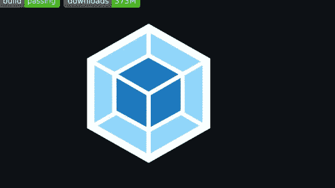
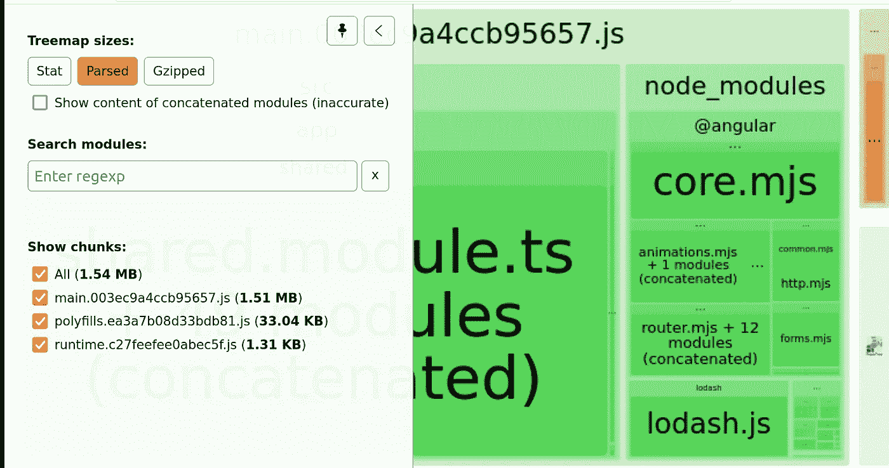
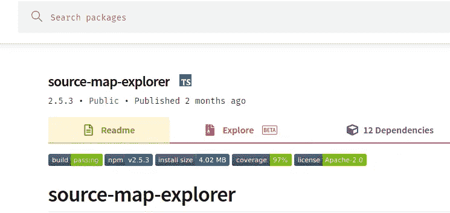
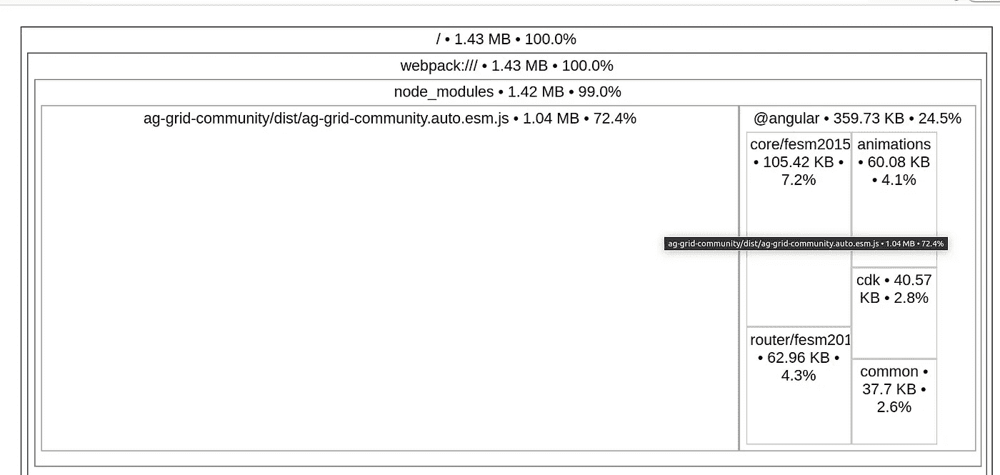
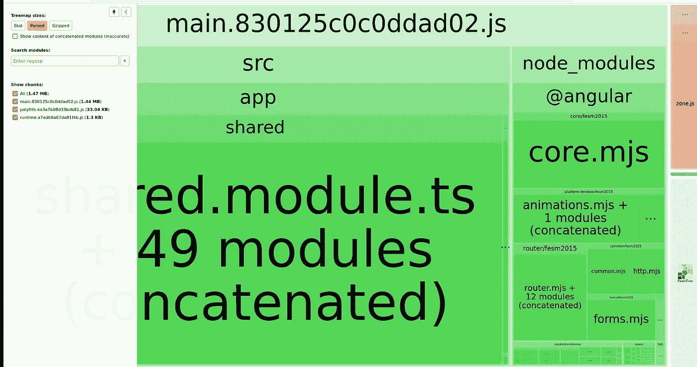
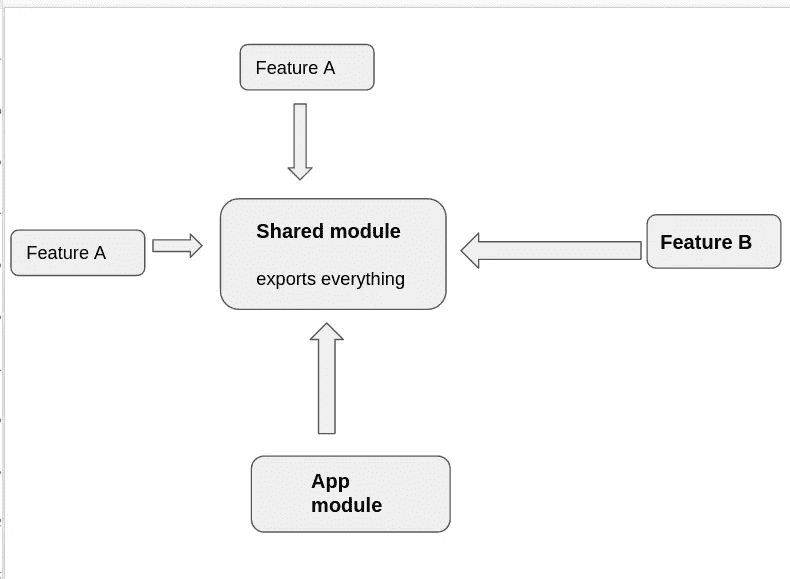
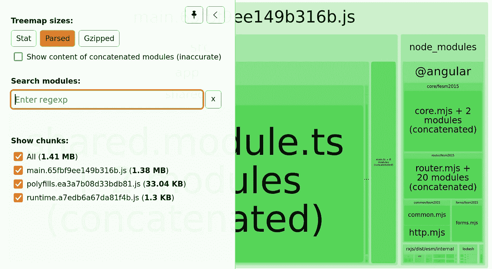

# 通过以下步骤优化角度束尺寸

> 原文：<https://levelup.gitconnected.com/lets-optimize-angular-bundle-size-with-these-steps-6d6b753ac256>


# 简介:

许多大型项目都是用 Angular 框架构建的，它是可伸缩的和健壮的，但是我们忽略了对包大小的关心。

因为拥有大型包的项目会对用户体验产生影响

因此，在这篇博客中，我们将一起探讨如何分析我们当前的包大小，并应用一些技术来优化它。

快乐阅读！

# 第一步:监控我们当前的捆绑包大小:

我们需要的第一步是分析当前的包大小，因此在这一节中，我将列出为此所需的工具

## **所需工具:**

## 选项 A: Webpack 捆绑包分析器



来源:[https://github.com/webpack-contrib/webpack-bundle-analyzer](https://github.com/webpack-contrib/webpack-bundle-analyzer)

[web pack-bundle-analyzer](https://github.com/webpack-contrib/webpack-bundle-analyzer)是一个很棒的工具，它可以将当前的 bundle 内容显示为一个方便的交互式可缩放树形图。

## 用法:

## 安装`webpack-bundle-analyzer`:

`npm install --save-dev webpack-bundle-analyzer`

我们需要构建带有`stats-json`选项的 angular 项目，以便在包分析之后使用它

将该命令添加到您的包中`.json`

```
"build:stats": "ng build --stats-json",
```

运行构建以拥有 dist 文件夹

```
npm run build:stats
```

执行`webpack-bundle-analyzer`

```
webpack-bundle-analyzer dist/project-name/stats.json
```

## 输出:

您将通过输入到 [http://127.0.0.1:8888/](http://127.0.0.1:8888/) 得到这个输出

初始管束尺寸为**1.54 毫米**



优化前的捆绑包大小

## 选项 B:源地图浏览器



来源:https://www.npmjs.com/package/source-map-explorer

> [源地图浏览器](https://www.npmjs.com/package/source-map-explorer)决定了你的精简代码中的每个字节来自哪个文件。它向您展示了一个[树形图](https://github.com/martine/webtreemap)可视化，帮助您调试所有代码的来源

## 用法:

## 安装源地图资源管理器:

```
npm i --save-dev source-map-explorer 
```

使用选项`source-map`运行生产构建

```
ng build --prod --source-map 
```

将这个命令添加到您的 package.json:

```
"analyze-bundle": "source-map-explorer dist/project-name/main.ea52d6960c8f284dfbec.js --no-border-checks"
```

执行`npm run analyze-bundle`

## 输出:

我们将得到一个树形图，向我们展示对当前包大小有贡献的文件和模块的可视化



源地图资源管理器输出

# 减少它的进一步措施

在本节中，我们将进一步探索减少和优化角度应用的步骤


# 1)优化第三库导入

首先，我们将回顾使用的第三个库，以及我们如何在组件中导入所需的模块！

在做了一些代码审查和调查之后，建议只导入我们需要的东西

我从`lodash`找到了这个导入

**代码实现:**

```
import { Component } from '@angular/core';
import * as _ from 'lodash';
@Component({
selector: 'app-root',
templateUrl: './app.component.html',
styleUrls: ['./app.component.scss']
})
export class AppComponent {
constructor() {
console.log((_.includes['a', 'b', 'c', 'd'], 'b')); 
}
}
```

**优化前的包大小测量:1.54 MB(初始计算)**


优化前的捆绑包大小

## 解决方案:优化 lodash 第三库导入

```
// install these packages 
npm i lodash-es
npm i -D @types/lodash-es

//Change how we do our import

//import { includes } from 'lodash';
import includes from 'lodash/includes';

// Add this config to tsconfig.json
    "allowSyntheticDefaultImports": true,
  "baseUrl": "./",
  "typeRoots": ["node_modules/@types", "manual_typings"],
  "paths": {
    "lodash/*": ["node_modules/@types/lodash-es/*"]
  }
```

优化后的束尺寸从 **1.54 个月减少到 1.47 个月** ☝️☝️



优化后的束尺寸

# 2)重构共享模块

[共享模块](https://angular.io/guide/sharing-ngmodules)由指令、管道和组件组成，它们可以在不同的应用程序特性之间重用

## **问题** ❗:

但是随着时间的推移，我们的应用程序增长得越多，我们将在我们的**共享模块**中放入的就越多，然后依赖性将会增长，这导致了捆绑包大小的增长↗️↗️↗️

如您所见，如图所示，我们有许多取决于共享模块的功能



共享模块依赖关系

**当前实施:(受生产中实际应用的启发)**

这段代码模拟了一个 Angular 项目的`shared-module`实现的例子，这个项目使用了很多导入、组件和第三个库…

**共享模块代码**:

```
import { NgModule } from '@angular/core';
import { CommonModule } from '@angular/common';
import { ArrowIndicatorComponent } from './arrow-indicator/arrow-indicator.component';
import { MinusPipe } from './pipes/minus.pipe';
import { AgePipe } from './pipes/age.pipe';
import { FilterPipePipe } from './pipes/filter-pipe.pipe';
import { FileSizePipePipe } from './pipes/file-size-pipe.pipe';
import { FormsModule, ReactiveFormsModule } from '@angular/forms';
import { HttpClientModule } from '@angular/common/http';
import { AgGridModule } from 'ag-grid-angular';
import { SqrtPipePipe } from './pipes/sqrt-pipe.pipe';
import { MatButtonModule } from '@angular/material/button';
import { MatCardModule } from '@angular/material/card';
import { MatChipsModule } from '@angular/material/chips';
import { MatIconModule } from '@angular/material/icon';
import { MatMenuModule } from '@angular/material/menu';
import { MatPaginatorModule } from '@angular/material/paginator';
import { MatTableModule } from '@angular/material/table';
import { MatToolbarModule } from '@angular/material/toolbar';
import { MatTooltipModule } from '@angular/material/tooltip';
import { BannersComponent } from './banners/banners.component';
import { RatingComponent } from './rating/rating.component';
import { GenericTableComponent } from './generic-table/generic-table.component';
import { GenericDialogComponent } from './generic-dialog/generic-dialog.component';

@NgModule({
  declarations: [ArrowIndicatorComponent, MinusPipe, AgePipe, FilterPipePipe, FileSizePipePipe, SqrtPipePipe, BannersComponent, RatingComponent, GenericTableComponent, GenericDialogComponent,],
  imports: [CommonModule,FormsModule,ReactiveFormsModule,HttpClientModule,AgGridModule,
    MatButtonModule,
    MatCardModule,
    MatChipsModule,
    MatIconModule,
    MatMenuModule,
    MatPaginatorModule,
    MatTableModule,
    MatToolbarModule,
    MatTooltipModule,],
  exports: [ArrowIndicatorComponent, MinusPipe, AgePipe, FilterPipePipe, FileSizePipePipe, SqrtPipePipe,BannersComponent, RatingComponent, GenericTableComponent, GenericDialogComponent,],
})
export class SharedModule {}

// StockqQuoteModule needs only ArrowPipe and MatToolbarModule only
import { NgModule } from '@angular/core';
import { CommonModule } from '@angular/common';
import { StockQuoteComponent } from './stock-quote.component';
import { SharedModule } from 'src/app/shared/shared.module';

@NgModule({
  declarations: [StockQuoteComponent],
  imports: [
    CommonModule,
    SharedModule
  ],
  exports:[StockQuoteComponent]
})
export class StockqQuoteModule { }

// StockMonthSentimentModule needs only ArrowPipe and MatIconModule
import { CommonModule } from '@angular/common';
import { NgModule } from '@angular/core';
import { SharedModule } from 'src/app/shared/shared.module';
import { StockMonthSentimentComponent } from './stock-month-sentiment.component';

@NgModule({
  declarations: [StockMonthSentimentComponent],
  imports: [
    CommonModule,
    SharedModule
  ],
  exports:[StockMonthSentimentComponent]
})
export class StockMonthSentimentModule { } 
```

## **解决方案** ✅ **:** 共享模块重构

减小共享模块尺寸的解决方案是使用 [SCAM 模块](https://angular-training-guide.rangle.io/modules/module-scam-pattern)(单组件角度模块)

**组件解决方案**:我们在`stock-quote-module` 和`stock-month-sentiment` 有`arrow-indicator-component`使用的组件，所以不需要为其他模块导出

我们将创建一个模块`arrow-indicator.module` ，并为使用它的两个模块导入它

```
import { NgModule } from '@angular/core';
import { CommonModule } from '@angular/common';
import { ArrowIndicatorComponent } from './arrow-indicator.component';

@NgModule({
  declarations: [ArrowIndicatorComponent],
  imports: [
    CommonModule
  ],
  exports:[ArrowIndicatorComponent]
})
export class ArrowIndicatorModule { } 
// SCAM to be used in the needed modules
```

**第三库解决方案:**

我们将删除所有特性之间不常用的第三个库，这将有助于减少导入的依赖性

```
import { NgModule } from '@angular/core';
import { CommonModule } from '@angular/common';
import { MinusPipe } from './pipes/minus.pipe';
import { AgePipe } from './pipes/age.pipe';
import { FilterPipePipe } from './pipes/filter-pipe.pipe';
import { FileSizePipePipe } from './pipes/file-size-pipe.pipe';
import { FormsModule, ReactiveFormsModule } from '@angular/forms';
import { HttpClientModule } from '@angular/common/http';
import { AgGridModule } from 'ag-grid-angular';

@NgModule({
  declarations: [ MinusPipe, AgePipe, FilterPipePipe, FileSizePipePipe, SqrtPipePipe,],
  imports: [CommonModule,FormsModule,ReactiveFormsModule,HttpClientModule,AgGridModule,
],
  exports: [MinusPipe, AgePipe, FilterPipePipe, FileSizePipePipe, SqrtPipePipe,
],
})
export class SharedModule {} 
```

共享模块重构⛏⛏后，包大小从 **1.47 MO** 减少到 **1.41MO**



优化后的束尺寸(步骤 2)

## 来源:

我非常感谢这些资源，它们对我写这篇博客帮助很大

*   [https://Cory rylan . com/blog/measuring-angular-performance-with-source-map-explorer](https://coryrylan.com/blog/measuring-angular-performance-with-source-map-explorer)
*   https://github.com/ivanblazevic/ngx-unused-css
*   [https://stack overflow . com/questions/44758755/how-to-enable-gzip-compression-in-angular-CLI-for-production-build](https://stackoverflow.com/questions/44758755/how-to-enable-gzip-compression-in-angular-cli-for-production-build)
*   [https://github.com/depcheck/depcheck](https://github.com/depcheck/depcheck)
*   [https://dev . to/dylanvdmerwe/reduce-angular-style-size-using-purge CSS-to-remove-unused-styles-3b2k](https://dev.to/dylanvdmerwe/reduce-angular-style-size-using-purgecss-to-remove-unused-styles-3b2k)
*   [https://www.youtube.com/watch?v=8lUkVsvCsl8](https://www.youtube.com/watch?v=8lUkVsvCsl8)
*   [https://indepth . dev/posts/1191/stop-using-shared-material-module](https://indepth.dev/posts/1191/stop-using-shared-material-module)
*   [https://Pham . codes/blog/how-to-make-bundle-size-small-lodash-angular](https://pham.codes/blog/how-to-make-bundle-size-smaller-lodash-angular)
*   [https://stack overflow . com/questions/41991178/correct-way-of-import-and-use-lodash-in-angular](https://stackoverflow.com/questions/41991178/correct-way-of-importing-and-using-lodash-in-angular)

## 额外资源📗：

如果你对阅读更高级的角度话题感兴趣，可以看看这些博客

*   [优化角度单元测试以加快执行速度](/optimizing-angular-unit-tests-for-faster-execution-70c7adda6b21)
*   [通过以下步骤优化角度束尺寸](/lets-optimize-angular-bundle-size-with-these-steps-6d6b753ac256)
*   [你应该避免使用棱角分明的坏习惯](/bad-practices-you-should-avoid-with-angular-development-58098e5542d5)
*   [Ngrx 和 Angular 状态管理简介](/introduction-to-state-management-with-ngrx-and-angular-91f4ff27ec9f)
*   [用 Angular 和 Cypress 编写 CRUD E2E 测试](/write-e2e-tests-with-angular-and-cypress-1f011f673a5e)

## 最后的话:

如果你喜欢这篇文章，请留下你的👏，并在 [Twitter](https://twitter.com/RebaiAhmed_) 和 [Github](https://github.com/Rebaiahmed) 上关注我

感谢阅读

【https://ahmedrebai.medium.com/membership 