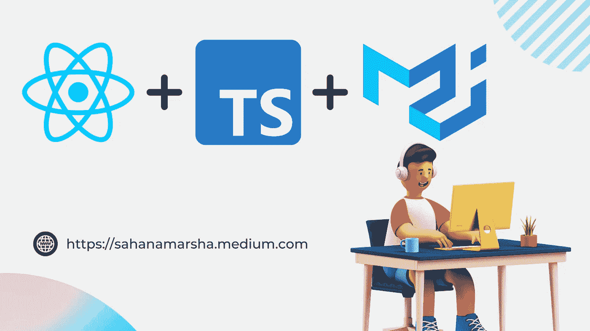
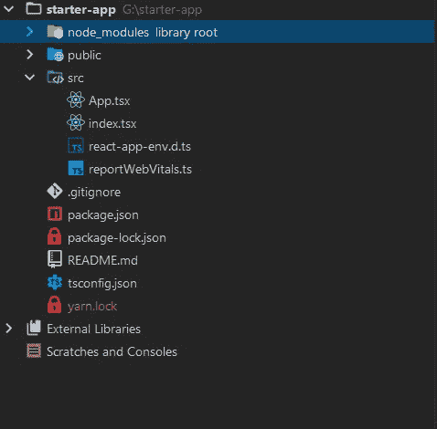
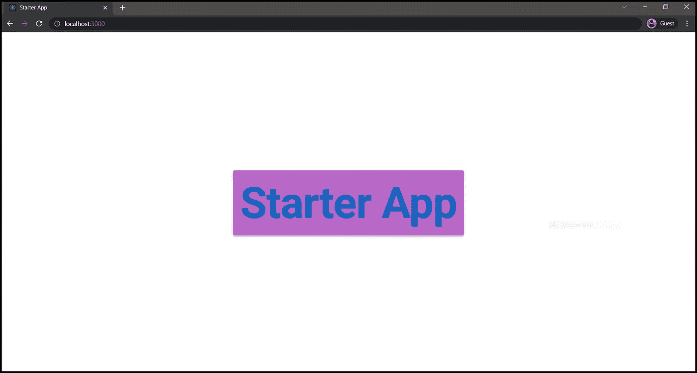
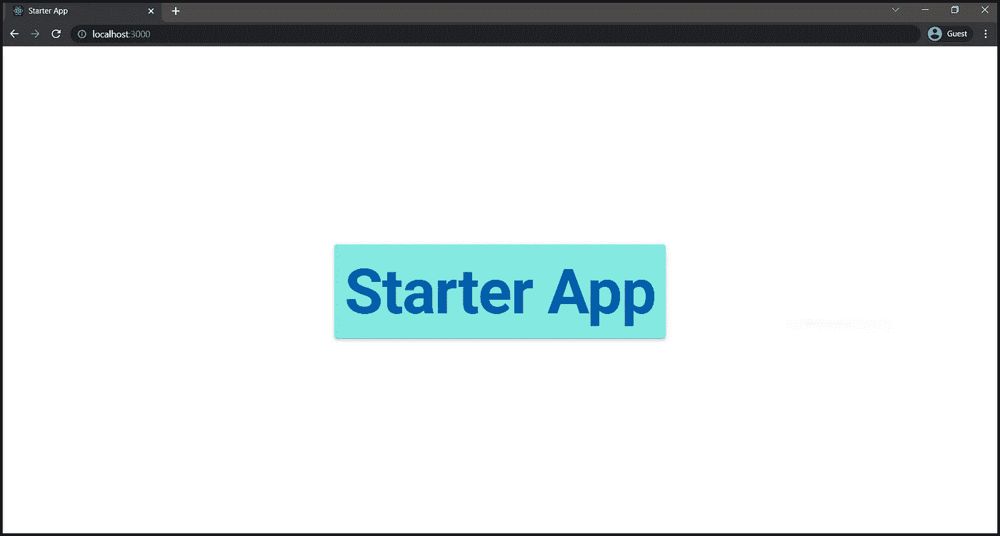
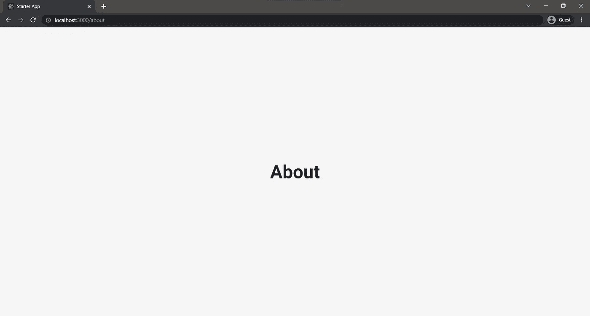
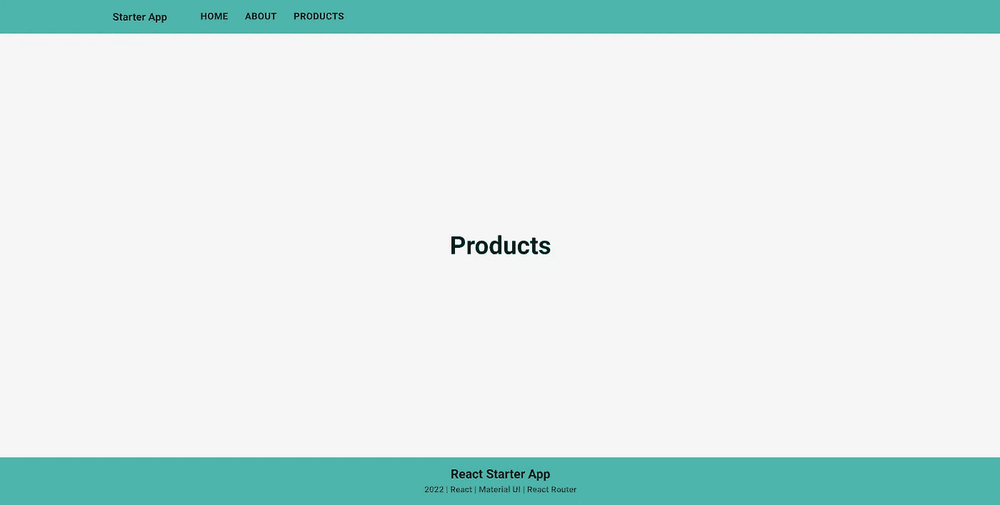
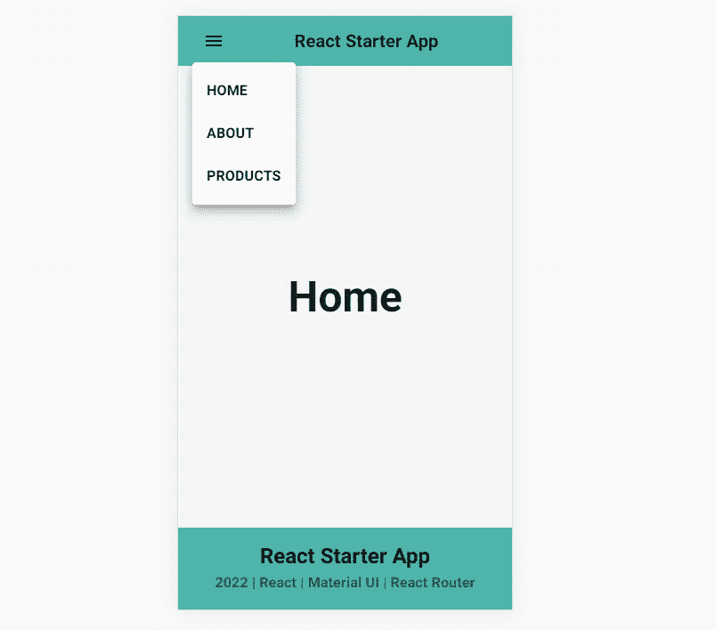

# 让我们用材质 UI 和 React 路由器设置一个 React 类型脚本项目

> 原文：<https://levelup.gitconnected.com/lets-setup-a-react-typescript-project-with-material-ui-react-router-3d7ea8cb5596>

## 使用 Material UI 设置 React TypeScript 项目的分步入门指南



使用 Canva 设计

# 介绍

在本教程中，我们将实现一个带有材质 UI 的 React TypeScript 应用程序。稍后，我们将把 React 路由器添加到我们的应用程序中。首先，让我们谈谈先决条件。

## 为什么打字稿？

[TypeScript](https://www.typescriptlang.org) 是 JavaScript 的超集。它是一种由微软开发和维护的免费开源编程语言。当我们使用 React with TypeScript 时，它使前端开发更容易，错误更少。

*   提高代码可读性
*   静态类型检查
*   更好地支持 JSX
*   对公共库的类型脚本支持

## 为什么要材质 UI？

[材质 UI](https://mui.com) 是最流行的 React UI 库之一。当我们使用 Material UI 时，作为前端开发人员，我们不必从底层构建每个 UI 组件。

*   内置了谷歌材质设计的 React 组件
*   可以创建自定义主题
*   定期更新
*   大型社区支持

# 安装节点、NPM 和纱线

如果你已经安装了 Node.js、NPM 和 Yarn，你可以跳过这一部分。我们将使用纱作为我们的包装经理。首先，我们需要安装 Node.js 和 npm。

*   从 [Node.js|Downloads](https://nodejs.org/en/download) 下载 Node.js 预建安装程序。
*   下载后，启动 Node.js 安装向导。
*   接受默认设置，然后点击安装按钮。安装完成后，单击完成。
*   打开你的终端，输入`node -v`和`npm -v`，系统会显示版本。
*   一旦你安装了 Node 和 NPM，那么你就可以运行下面的命令来[安装 Yarn](https://classic.yarnpkg.com/lang/en/docs/install/#windows-stable) 。

```
npm install --global yarn
```

你也可以在你的终端运行`yarn --version`来检查你的纱线版本。

```
C:\> yarn --version
**1.22.5**C:\> node -v
**v14.17.6**C:\> npm -v
**8.5.2**
```

参考[原始指南](https://classic.yarnpkg.com/en/docs/usage)了解更多关于纱线命令的信息。

准备好构建应用程序了吗？让我们开始吧。🛠️

# 创建 React 应用

让我们使用 Create React 应用程序来设置 React 项目。现在，由于我们想要创建一个 TypeScript 项目，我们需要添加`-- template typescript`。

```
npx create-react-app starter-app **--template typescript**
```

在 IDE 中打开这个新创建的项目。我用的是 WebStrom。您可以使用任何您喜欢的 IDE。

导航到您的项目目录，使用 Yarn 运行下面的命令。

```
cd starter-app
yarn start
```

现在，React 应用程序应该在您的 web 浏览器中运行。如果 React 标志在旋转，我们就可以开始了。

# 设置材料用户界面

让我们将材料 UI 设计添加到 React 应用程序组件中。

首先，我们需要使用 yarn 安装材质 UI 依赖项。默认情况下，MUI 使用情感作为风格引擎。

```
yarn add @mui/material @emotion/react @emotion/styled
```

如果你想用 styled-components 代替 emotion，你可以用`@mui/styled-engine-sc styled-components`代替`@emotion/react @emotion/styled`。我发现这篇非常有用的博文解释了这两种风格引擎的区别。你也可以去看看。

接下来，我们可以使用 yarn 安装材质图标包。

```
yarn add @mui/icons-material
```

现在既然用的是 Material UI，就不一定需要那些 CSS 文件了。因此，让我们清除这些文件和任何其他我们不需要的文件。



删除不必要的文件后的项目文件

在我们的 App.tsx 中，让我们清除与这些文件相关的导入。为了测试材质 UI，让我们渲染 MUI 的排版和纸张组件。

移除导入并添加 MUI 组件后的 App.tsx

*   `**line:7**`我们使用了来自 MUI 的 CssBaseline 组件。根据[文档](https://mui.com/components/css-baseline/)，MUI 使用这个类来重置 CSS。
*   `**line:17**`sx 道具可用于定义定制风格。在这个 sx 道具中，我们可以很容易地访问主题属性。

现在，如果我们保存并重新运行我们的应用程序，它应该会呈现我们的新组件。



查看 MUI 组件

这是一个 MUI 纸组件。我们成功安装了 MUI。让我们向 React 应用程序添加一个自定义的 MUI 主题。

# 设置自定义主题(可选)

因此，我们经常需要使用带有 MUI 组件的自定义主题。用 Material UI 设置自定义主题非常容易。

首先，你需要定义主题。

定义自定义主题

接下来，我们需要用 MUI 的 ThemeProvider 组件包装我们的应用程序组件，并且我们需要传递我们定义的主题。所以这是我建立自定义主题后的`App.tsx`文件。

添加自定义主题后的 App.tsx

*   `**line:43**` `secondary.light`相当于`theme.pallete.secondary.light`。因为我们传递主题颜色，所以当我们改变主题时，组件颜色也应该改变。

让我们`save`看看它在浏览器上是什么样子。



使用新主题查看组件

我觉得不错。所以我们只是在这里配置我们的调色板。您还可以编辑其他自定义变量，如间距、阴影、过渡等等。如果你想了解更多关于应用程序主题化的知识，你可以查看来自 MUI 的原版指南，[https://mui.com/customization/theming](https://mui.com/customization/theming/)。

最后一步，让我们将 React Router 添加到我们的应用程序中。

# 集成反应路由器

在我们的 React 应用程序中，现在我们希望浏览不同的页面。是的，React 应用程序是一个单页应用程序。然而，我们可以使用许多库来实现多个视图。React 路由器库，是最流行的实现路由的库之一。因此，让我们了解如何将 React Router 添加到我们的应用程序中。

首先，我们需要安装 React 路由器库。

```
yarn add react-router-dom
```

让我们在`src/pages`目录中定义一些虚拟页面组件。这里有一个。

主页组件

我创建了 3 个页面。“关于页面”、“产品页面”和“主页”。现在，我们需要在应用程序中将这些页面定义为路线。我们需要在源目录中创建一个名为`routes.ts`的单独文件。

在*routes . ts*T2 中定义路线

*   因为我们在这里没有渲染任何 JSX 元素，所以我们可以使用`.ts`扩展。
*   我们在这里使用了一些打字稿魔法。我们定义了一个单独的路由接口，以便每个路由都具有相同的属性。

现在让我们继续我们的`App.tsx`文件。因此，为了在我们的应用程序中应用路由，React 路由器库有这些主要组件，如 BrowserRouter、Routes(交换机)和 Route 组件。我们可以根据 URL 使用这些组件来改变我们的视图。

我们在`routes.ts`文件中已经定义的路线，应该像这样用在`App.tsx`中。

在 App.tsx 中渲染路线

*   对于我们呈现的每条路线，我们应该传入一个路线关键字、路线路径和元素。

让我们保存并运行我们的应用程序，看看它是否工作。



通过将 URL 更改为[http://localhost:3000/about](http://localhost:3000/about)来测试路由

是的，成功了！🎉

我们实施了我们的路线。现在这里要做的最后一件事。让我们添加一个页脚和一个导航栏组件来实现页面之间的导航。

这是我的例子 Navbar 组件。我们可以创建一个新的`/components`目录来存储我们的定制组件。

示例导航栏组件

这里，我使用了一个由 [MUI 组件指南](https://mui.com/components/app-bar)提供的示例 AppBar 组件。我想你也应该看看指南。这个应用程序栏也支持移动视图。这就是为什么我喜欢 Material UI，你只需要几行代码就可以创建复杂的 UI。

让我们也添加一个示例页脚组件。

页脚组件示例

让我们将这些导航栏和页脚组件导入到我们的`App.tsx`文件中。

在 App.tsx 中呈现导航栏和页脚组件

只要确保**在路由器组件**中添加导航栏和页脚组件。

现在，如果我们重新运行我们的应用程序，它应该可以完美地工作。



React Starter 应用程序—网络视图



React Starter 应用程序—移动视图

Perfect🥳！现在，您可以使用这个入门应用程序构建任何东西。

# 结论

这就是我对本教程的全部计划。

在本教程中，我们使用 React、Typescript、Material UI 和 React 路由器库创建了一个初学者应用程序。你也可以在我的 Github 上查看这个项目。

🖥️ Github 项目—[https://github . com/sahanamarsha/react-material ui-starter-app](https://github.com/SahanAmarsha/react-materialui-starter-app)

我希望你已经完成了所有的步骤，没有遇到任何问题。然而，如果你这样做了，你可以在下面的评论区问任何问题。

编码快乐！😃