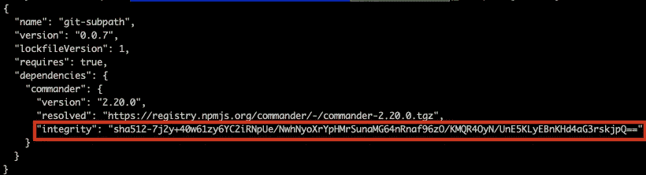
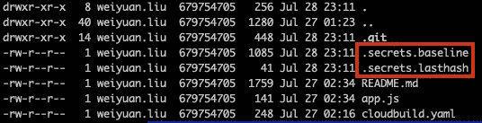
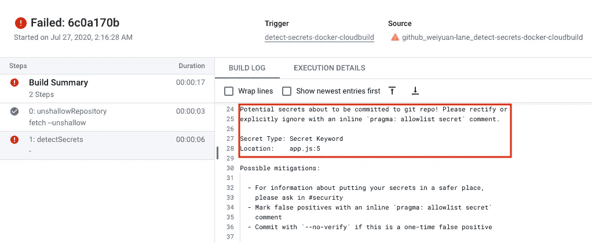
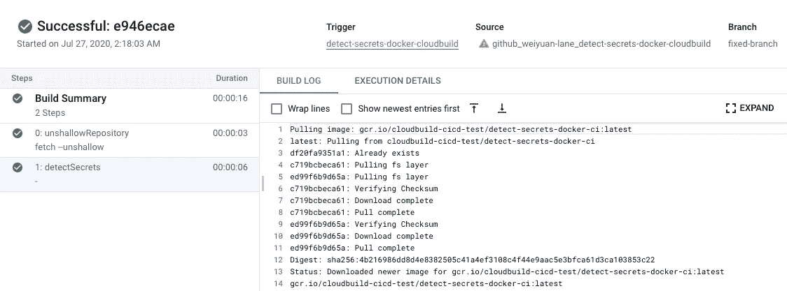

# 让我们增强我们的 CI——在代码早期检测“意外”的秘密

> 原文：<https://levelup.gitconnected.com/lets-supercharge-our-ci-detecting-accidental-secrets-early-in-our-code-195b753692ed>


来源: [pixabay](https://pixabay.com/illustrations/binary-magnifying-glass-hand-http-1607161/) ，作者: [geralt](https://pixabay.com/users/geralt-9301/)

> 梳理我们的代码就像大海捞针，那么我们如何定期保持代码的整洁呢？

**秘密，秘密，秘密……是我们应用的*【灵丹妙药】**【毒药】*。我们需要各种应用程序的秘密——API 密钥、数据库密码等等。这允许我们授权使用某些资源，特别是当我们为这些资源的使用付费时。**

然而，“秘密”也是我们应用程序的祸根。如果保护不当，我们有可能将您组织的隐私信息泄露给潜在的恶意方，或者更糟的是，违反我们组织拥有的用户数据的各种隐私法律。

之前，我介绍过如何使用 Yelp 的 detect-secrets 来防止代码提交秘密，使用预提交钩子。我还介绍了如何使用我创建的名为 [detect-secrets-node](https://www.npmjs.com/package/detect-secrets-node) 的节点模块，将这个预提交挂钩扩展到开发人员设备上的每个克隆节点项目。

然而，由于预提交挂钩只存在于本地机器上，并且无法被监控，因此并不总是保证能够工作。**因此，需要采取全面的措施，以便在机密泄露到您的远程存储库时有效地监控机密，从而能够及时地对这些机密做出反应并进行轮换。**

# 重访“探秘”

回到 Yelp 的 [detect-secrets](https://github.com/Yelp/detect-secrets) ，我们知道它可以用于扫描文件的秘密，还可以将误报列入白名单以减少噪音。他们的实现还提供了一个名为 [detect-secrets-server](https://github.com/Yelp/detect-secrets-server) 的服务器端组件，可用于定期扫描选定的存储库，并在检测到机密时发送警报。

将这一工作流程与我们自己的 CI 工具整合起来怎么样？如果每个构建都是由对某个目标分支的新提交触发的，我们难道不能在它发生时设法捕捉这些事件吗？这也将使我们能够以更一致的方式进行这种验证，确保我们可以在泄露机密的情况下进行轮换。

# “容器”和探测秘密


来源: [pixabay](https://pixabay.com/photos/container-port-loading-stacked-3118783/) ，作者:[distelaparth](https://pixabay.com/users/distelAPPArath-2726923/)

在决定如何构建这个工具时，我考虑了应该为哪个平台构建它。然后，我突然想到，大多数现代 CI 工具似乎都支持针对定制需求的定制 Docker 映像——[云构建](https://cloud.google.com/cloud-build/docs/configuring-builds/use-community-and-custom-builders#creating_a_custom_builder)、 [CircleCI](https://circleci.com/docs/2.0/custom-images/) 、[无人机](https://docs.drone.io/pipeline/docker/syntax/images/)等等。构建 Docker 映像来执行扫描，也可以更容易地为不同管道的不同项目进行推广。

基于以上内容，我能够从 detect-secrets 创建 [detect-secrets-docker](https://github.com/Weiyuan-Lane/detect-secrets-docker) 。让我们看看如何使用这个库来保护您的代码库。

# 步骤 1 —“列入白名单”可接受的内容

在我们将 secret scanning Docker 映像集成到 CI 之前，我们需要首先将我们的存储库的当前状态列入白名单。为什么？看看下面的图片:



package-lock.json 中的内容示例

如果您熟悉使用节点模块的项目，上面的场景应该很熟悉。它代表[*package-lock . JSON*](https://docs.npmjs.com/configuring-npm/package-lock-json.html)文件，可以包含类似于高亮显示的哈希值。如果没有列入白名单，它可能会被检测为潜在机密，从而导致误报。其他语言如 Golang，在管理 go 模块的 [*go.sum*](https://blog.golang.org/using-go-modules) 文件中也包含类似的内容。

要将内容列入白名单，我们需要首先准备好环境。

从 [detect-secrets-docker](https://github.com/Weiyuan-Lane/detect-secrets-docker) 存储库中，克隆它，并运行以下命令来构建 docker 映像:

```
docker build -f Dockerfile.base -t detect-secrets-docker .
```

一旦构建了上面的映像，转到这个集成的目标代码库的根目录，并运行下面的命令:

```
docker run --name detect-secrets-docker -v $(pwd):/opt --entrypoint "create-basefiles" detect-secrets-docker
```

成功返回后，您应该会在本地存储库中看到以下文件:



. secrets.baseline 和. secrets.lasthash

上述文件包含对为所有文件生成的基线的引用，以及当前的提交散列。这对我们以后的扫描程序很重要！让我们提交这些文件。

# 步骤 2 —构建自定义配置项映像

接下来，我们需要构建一个映像，它将扫描管道中的代码。回到 [detect-secrets-docker](https://github.com/Weiyuan-Lane/detect-secrets-docker) 的根目录，运行下面的命令来构建想要的 docker 映像:

```
docker build -f Dockerfile.ci -t detect-secrets-docker-ci:latest .
```

注意，在上面，我已经将**图像名称**和**标签**分别设置为`detect-secrets-docker-ci`和`latest`。根据您自己的配置，您可以更改这些值以适合您的图像存储库。例如，在 GCP 的云构建上，你可以使用容器注册表(参见这里的说明)。

将这个 Docker 映像推送到您的映像存储库，我们将在下一步中使用它。

# 第 3 步—让我们来测试一下！

准备好代码库，构建并推送自定义 Docker 映像后，让我们测试一下管道，看看它是否工作。

在这一步中，我将使用云构建来满足我的 CI 需求。但是，您可以将以下任何说明替换为 CI 工具中的等效说明。

从管道配置开始，我们有以下云构建(使用 yaml 文件):

重要的是第 7 行到第 9 行，它们将执行对代码库的扫描。仅此而已！

*(旁注:* ***在云构建*** *的情况下，第 2 行到第 5 行也是必不可少的，这里的代码是一个浅层 git 克隆，不包含用于所需比较的其他提交)*

让我们来看看这是如何工作的。我在我的代码库中添加了一些虚假的秘密来测试它，这立即导致了一个失败的构建。



使用 detect-secrets，我们能够在第 5 行显示出`app.js`有一个秘密，正如我们预期的那样！这条错误路线是我有意为之的，见这里的。

**最明显的解决方法是删除第 5 行的** `**app.js**` **。但是，如果打算添加这一行，您可以在本地运行下面的命令将内容列入白名单:**

```
docker run --name detect-secrets-docker -v $(pwd):/opt --entrypoint "update-basefiles" detect-secrets-docker
```

提交您的新基线文件，您应该可以开始了！



:D

# 还有吗？

假设你已经使用上面的方法在你的存储库中发现了秘密，并且成功地移除了秘密，这实际上并不是结束。本地和远程存储库中的悬空提交可能会存在一段时间。例如，在 GitHub 上，只要散列是已知的，就仍然可以在 web 控制台上访问提交。有一些方法可以删除这些内容，如这里的[所探讨的](https://medium.com/dev-genius/its-a-trap-committing-bad-stuff-to-github-and-fixing-the-mistake-12ccb080fa02)。

就这些，我希望你喜欢我创建的这个附带项目，主要是供我和我的组织使用。我大力提倡易用性，这样我们就可以很容易地扩大使用范围，我希望上面所说的能够快速简单地实现。如果您对此有任何反馈，请告诉我！

Ciao~