# 让我们以 UI 开发为中心🚀第 001 号质疑

> 原文：<https://levelup.gitconnected.com/lets-take-a-pivot-to-ui-dev-challenge-no-01-2459e9e0527c>

欢迎光临👋最近，我听到一个伟大的说法叫做*“小变化最终积累成巨大的结果”*。由于我一直在写 UI/UX，所以我想换一条路线，和大家一起转向 UI 开发。这将有助于我们更新思维，学习新的东西，提高我们的技能。

由于我已经写了关于[HTML 初学者指南](https://uxplanet.org/beginners-guide-to-html-and-css-letss-start-off-with-html-3d7ffd035182)、 [CSS 基础知识](https://bootcamp.uxdesign.cc/beginners-guide-to-css-9bc8298985c0)和 [FlexBox](/understanding-flexbox-to-make-things-easy-adf90891ff25) 的文章，为什么不从那里开始呢？

首先，我从[前端导师](https://www.frontendmentor.io/challenges/nft-preview-card-component-SbdUL_w0U)那里找到了一个简单的皮斯挑战。👉**挑战 01**——**NFT 预览卡组件**

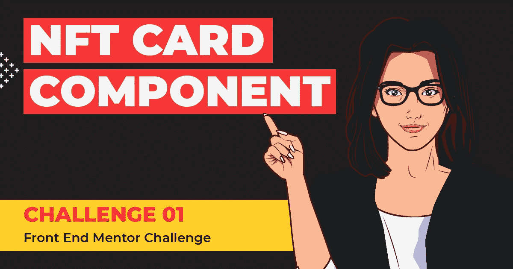

*在开始之前，让我强调一个小注意:* -
对你们中的一些人来说，这可能是一个闭着眼睛也能完成的挑战，对你们中的一些人来说，这可能是一个学习新事物的挑战，对你们中的一些人来说，这可能是 UI 开发的初级步骤。因此，这篇文章是写给任何喜欢学习和提高技能的人，从专业人士到初学者。🤓有了那个…..

# 让挑战开始吧💣

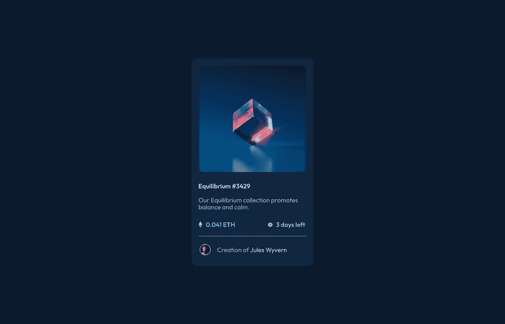

NFT 预览卡组件的预览

## 🔸**挑战名称:-**

[NFT 预览卡组件](https://www.frontendmentor.io/challenges/nft-preview-card-component-SbdUL_w0U)

## 🔸**描述:-**

你的挑战是构建预览卡组件，并让它看起来尽可能接近设计。您的用户应该能够:

*   根据设备的屏幕尺寸查看最佳布局(响应)
*   请参见交互式元素的悬停状态

## 🔸**工具:-**

HTML、CSS 和 Figma

# 步骤 01 —从蓝图(HTML)开始🚀

正如你在设计中看到的，卡片组件在页面的中间。首先，我们将使用 HTML 绘制卡片组件的草图/蓝图。

**步骤 1.1**➡**html 的基本结构**

```
<!DOCTYPE *html*>
<html *lang*="en">**<!-- Head Section-->**
  <head>
    <meta *charset*="UTF-8">
    <meta *http-equiv*="X-UA-Compatible" *content*="IE=edge">
    <meta *name*="viewport" *content*="width=device-width, initial-
     scale=1.0">
    <title> NFT Preview Card Component </title>
  </head>**<!-- Body Section-->**
  <body>
  </body>
</html>
```

**步骤 1.2** ➡ **链接字体**

让我们将标题部分的谷歌字体中的“服装”字体链接起来

```
<head>
   <meta *charset*="UTF-8">
   <meta *http-equiv*="X-UA-Compatible" *content*="IE=edge">
   <meta *name*="viewport" *content*="width=device-width, initial-
   scale=1.0"> **<link *href*="https://fonts.googleapis.com/css2?family=Outfit:wght@100;300;400;500;600;700;800;900&display=swap" *rel*="stylesheet">** <title>
       NFT Card Componet
    </title>
</head>
```

**步骤 1.3** ➡ **创建卡组件的结构**

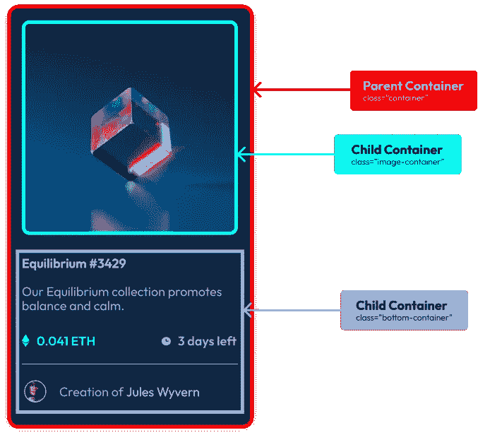

卡组件的结构

01)从划分主要的三个类开始，如上面的快照所示

```
<body>**<!-- Parent container -->**
  <div *class*="container">**<!-- Child 01 container -->**
    <div *class*="image-container">
      
    </div>**<!-- Child 02 container -->**
    <div *class*="bottom-container">
    </div> </div></body>
```

02)既然我们已经将卡片组件分成了三个类，并完成了图像部分的布局，那么让我们转到**绘制底部部分的布局**👇

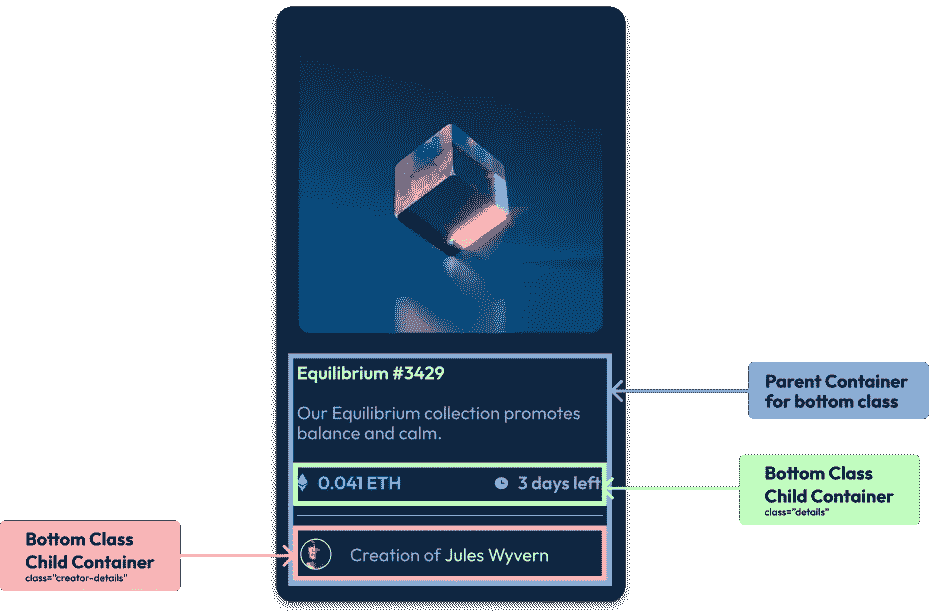

```
**<!-- Child 02 container -->****<!-- PARENT CLASS FOR BOTTOM SECTION -->**
    <div *class*="bottom-container">
      <h1>
        Equilibrium #3429
      </h1>
      <p> 
        Our Equilibrium collection promotes balance and calm.
      </p> **<!-- Child 01 Class for bottom section -->** <div *class*="details">
          <div *class*="ethereum">
            
            <p *class*="amount"> 0.041 ETH </p>
          </div>
          <div *class*="days">
            
            <p *class*="amount"> 3 days left </p>
          </div>
      </div> **<!-- Horizontal Line -->** <div *class*="horizontal-line"></div>**<!-- Child 02 Class for bottom section -->** <div *class*="creator-details">
          <div *class*="creator-image">
            
           <div *class*="creator">
             <p *class*="des"> Creation of </p>
             <p *class*="creator-name"> Jules Wyvern </p>
           </div>
     </div>**<!-- END OF PARENT CLASS FOR BOTTOM SECTION -->** </div></div>
</body>
```

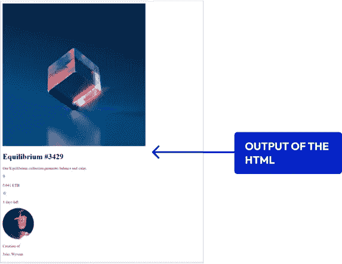

HTML 的输出

*下面是我们仅使用 HTML 绘制卡片组件时的输出。*

## 看起来很丑不是吗？？？🤮

> 不要担心，我们在这里的生活一开始也是一团糟，因为最好的事情总是在最后出现*😎*。

## 卷起你的袖子，准备好你的咖啡，是时候让它变得更有吸引力了…🎨

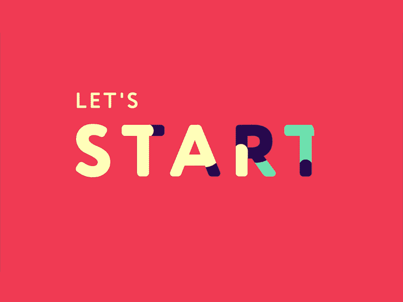

# 步骤 02——让我们做室内装饰方案(CSS)🚀

现在，我们已经使用 HTML 完成了 NFT 卡组件的基本布局草图。是时候按照设计所示设计 NFT 卡片了。

**步骤 2.1** ➡首先，**将** **外部样式表链接到 HTML 文件**

```
<head>
   <meta *charset*="UTF-8">
   <meta *http-equiv*="X-UA-Compatible" *content*="IE=edge">
   <meta *name*="viewport" *content*="width=device-width, initial-scale=1.0">

    **<link *rel*="stylesheet" *href*="styles.css">** <link *href*="https://fonts.googleapis.com/css2?family=Outfit:wght@100;300;400;500;600;700;800;900&display=swap" *rel*="stylesheet"> <title>NFT Card Componet</title></head>
```

**步骤 2.2** ➡包括通用选择器的**样式**

例如，我们在整个页面中使用相同的字体系列和字体大小。我们可以简单地为[通用选择器](https://bootcamp.uxdesign.cc/beginners-guide-to-css-9bc8298985c0)包含通用样式，作为整个页面的默认样式，而不是一遍又一遍地包含相同的样式。

```
*****{
   align-items: center;
   color: #ffffff;
   font-size: 18*px*;
   font-family: 'Outfit', sans-serif;
   margin: 0*px*;
}
```

**步骤 2.3** ➡包括车身部分的**造型**

正如你在设计中看到的，整个页面使用了深蓝色的背景色。作为一个简单的解决方案，我们使用这种颜色作为身体的背景色。

```
**body**{
   background-color: #0D1A2D;
}
```

**步骤 2.4** ➡为 NFT 预览卡组件的父容器添加**样式**

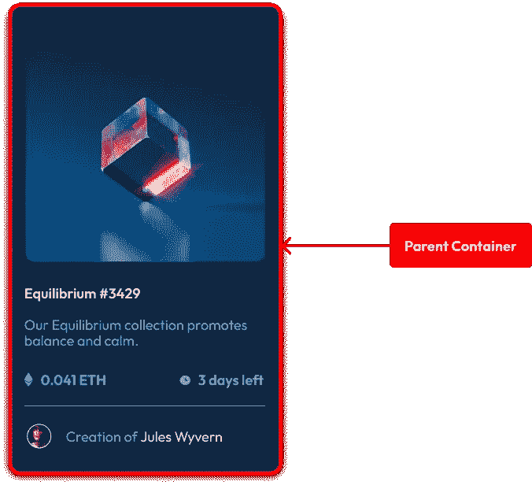

```
***.container*** {
   border-radius:16*px*;
   background-color:#15273F;
   max-height: 595*px*;
   margin-left: auto;
   margin-right: auto;
   padding-top: 22*px* padding-right: 22*px*;
   padding-bottom: 22*px*;
   padding-left: 22*px*;
   width: 350*px*;
}
```

**步骤 2.5** ➡添加第一个子容器的**样式**

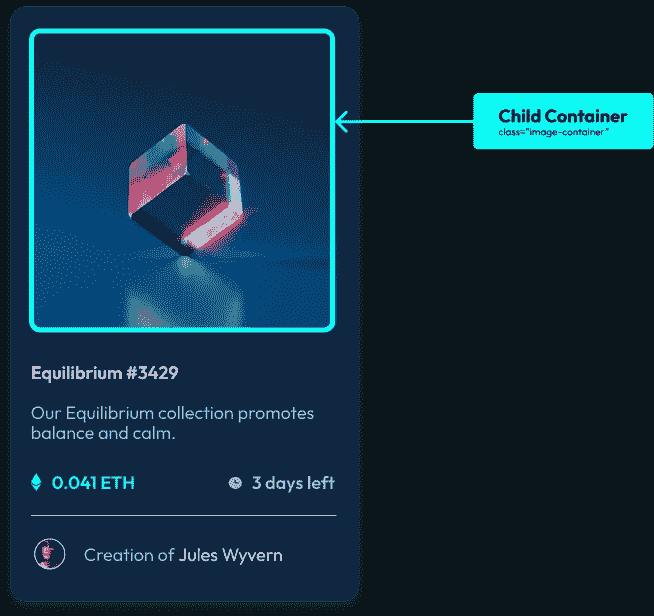

```
*.container* *.image-container* {
    height: 330*px*;
    border-radius: 11*px*;
    margin-left: auto;
    margin-right: auto;
    width: 330*px*;
}*.image-container* img {
    height: 330*px*;
    border-radius: 11*px*;
    width: 330*px*;
}
```

**步骤 2.6** ➡添加第二个子容器的**样式**

因此，正如我们在 HTML 部分所做的那样，我们将**class = " bottom-container "**作为底部部分的主类，并且在主类中包含了两个子类。因此，在本节中，我们将描述性地介绍每个步骤。

步骤 2.6.1 ➡风格的主要底部容器包装

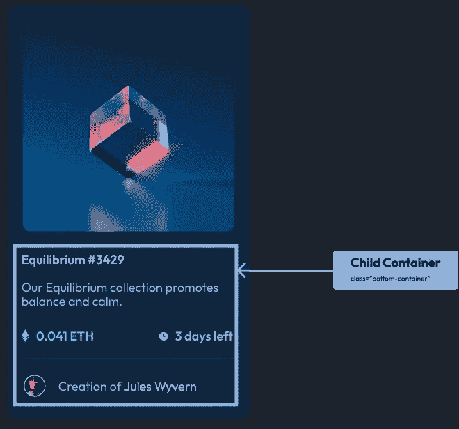

```
***/*main bottom container */*** *.container* *.bottom-container* {
     padding-left: 8*px*;
     padding-right: 8*px*;
}*.bottom-container* h1 {
    color:#ffffff;
    font-family: 'Outfit', sans-serif;
    font-weight:600;
    padding-top: 30*px*;
    padding-bottom: 10*px*;
}*.bottom-container* p {
    color:#8BACDA;
    font-weight:400;
    padding-top: 10*px*;
    padding-bottom: 20*px*;
}
```

步骤 2.6.2 ➡风格的细节部分(子类 01 内的父底部容器)

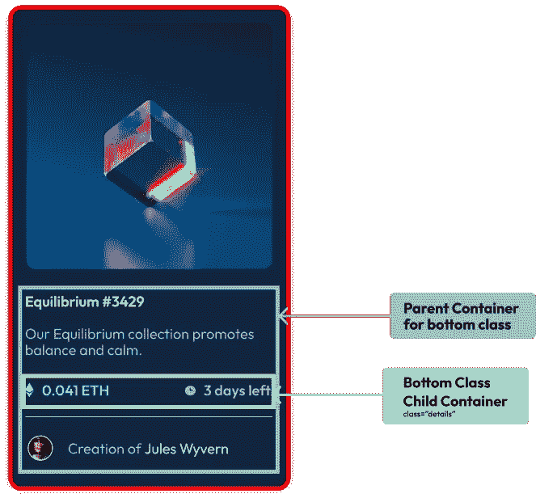

```
***/*Child container 01 inside the main parent bottom container */*** *.bottom-container* *.details* {
    align-items: center;
    display: flex;
    justify-content: space-between;
}*.details* *.ethereum*,
*.details* *.days* {
    align-items: center;
    display: flex;
    flex-direction: row;
}*.details* *.ethereum* img,
*.details* *.days* img {
    bottom: 5*px*;
    position: relative;
}*.details* *.ethereum* img {
    height:18*px*;
    width:11*px*;
}*.details* *.days* img {
    height:18*px*;
    width:18*px*;
}*.ethereum* *.amount*,
*.days* *.amount* {
   font-weight:600; 
   padding-left: 10*px*;
}*.ethereum* *.amount* {
  color:#00FFF7;
}*.days* *.amount* {
  color:#8BACD9;
}*.bottom-container* *.horizontal-line* {
  border-bottom: 1*px* solid #8BACDA;
}
```

步骤 2.6.3 ➡样式创建者部分(父底部容器中的子类 02)

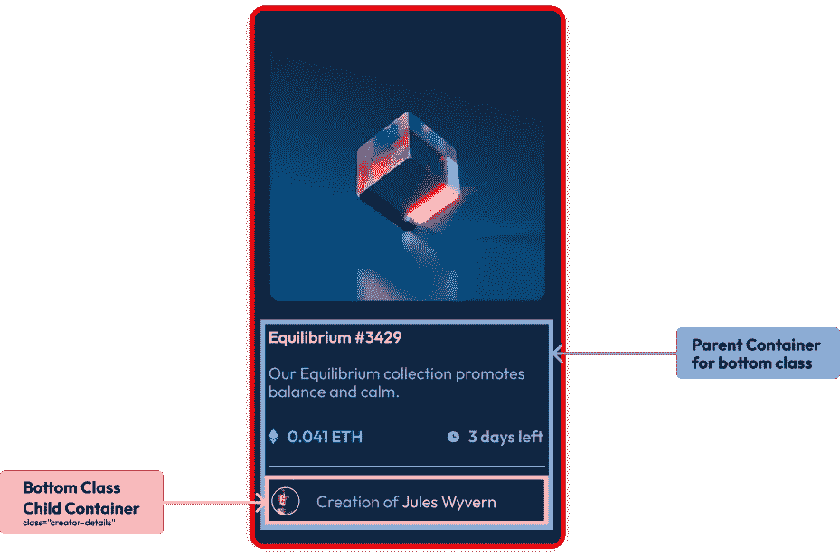

```
***/*Child container 02 inside the main parent bottom container */*** *.bottom-container* *.creator-details* {
   align-items: center;
   display:flex;
   flex-direction: row;
   padding-top: 22*px*;
}*.creator-details* *.creator-image* {
   border: 1*px* solid white;
   border-radius: 100*%*;
   height: 30*px*;
   width: 30*px*;
}*.creator-details* *.creator-image* img {
   height: 30*px*;
   width: 30*px*;
}*.creator-details* *.creator* {
   display: flex;
   flex-direction: row;
}*.creator-details* *.creator* *.des* {
   font-weight:400;
   color:#8BACD9;
   padding-left: 10*px*;
   padding-bottom: 10*px*;
}*.creator-details* *.creator* *.creator-name*  {
  color:#ffffff;
  font-weight:400;
  padding-left: 5*px*;
  padding-bottom: 10*px*;
}
```

**第 2.7 步** ➡使**反应灵敏**

现在是我们添加媒体查询的时候了。现在我们已经为桌面视图设计了样式，现在是时候为移动视图设计相应的样式了。

```
***/* MOBILE  */****@media* screen *and* (min-width: 300*px*) *and* (max-width: 760*px*){
  *.container* {
    width: 280*px*;
  }*.container* *.image-container*{
   height: 280*px*;
   width: 280*px*;
}
}
```

## 是时候看结果了🤩👇

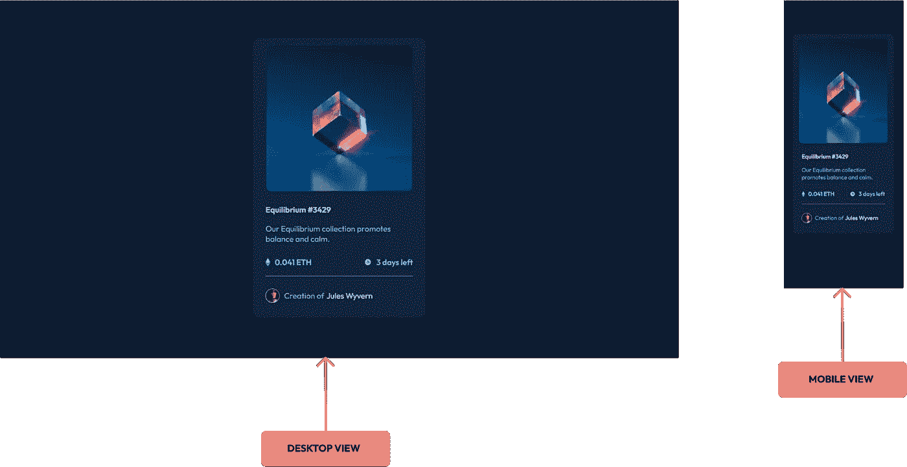

你们对结果有什么看法？它如你所愿吗？你们让我知道你们的反馈和想法。但在此之前，我们还要做一件事

# 步骤 03—应用悬停效果🚀

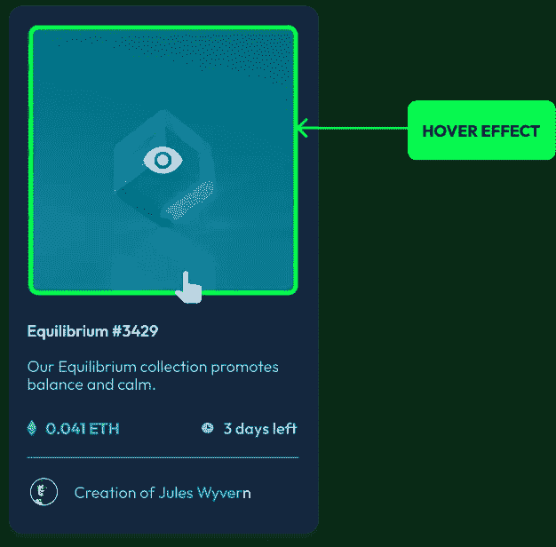

这里，我们删除了 image-container 类中的 image 标签，并替换了 image-container 中的图像作为背景。

HTML 文件

```
<div *class*="image-container">
  *<!-- 
       <div class="hover-option">
       
       </div> -->* </div>
```

CSS 文件

```
*.container* *.image-container* {
  height: 330*px*;
  border-radius: 11*px*;
  **background: url("./images/image-equilibrium.jpg") no-repeat;
  background-position: center;
  background-size: contain;**
  display: inline-block;
  margin-left: auto;
  margin-right: auto;
  width: 345*px;* }***.container* *.image-container:hover* {
  background: url("./images/hover-image-equilibrium.png") no-repeat;
  background-position: center;
  background-size: contain;
  height: 330*px*;
  width: 345*px*;
}**
```

# 最终想法

我们已经完成了挑战，我将带着你已经获得和学到一些东西的希望结束这篇文章。感谢您的参与，请不要犹豫尝试这项挑战。

如果你有兴趣获得更多的知识，磨练你的技能，或者需要一个小小的提醒，看看下面的文章。👇🧠

**了解 flexbox 让事情变得简单:-**[https://level up . git connected . com/Understanding-flexbox-to-make-things-easy-ADF 90891 ff 25](/understanding-flexbox-to-make-things-easy-adf90891ff25)

**几分钟内学会 CSS 的基础:-**[https://boot camp . UX design . cc/初学者指南-css-9bc8298985c0](https://bootcamp.uxdesign.cc/beginners-guide-to-css-9bc8298985c0)

**HTML 入门指南:-**[https://UX planet . org/beginners-guide-to-HTML-and-CSS-letss-start-off-with-HTML-3d 7 ffd 035182](https://uxplanet.org/beginners-guide-to-html-and-css-letss-start-off-with-html-3d7ffd035182)

> 如果你喜欢这个，请给一个或多个掌声，并在评论区留下你的想法和反馈。
> 
> *感谢您查看这篇文章，也可以点击下面的链接查看我的其他文章👇*
> 
> [***查一下***](https://medium.com/@nknuranathunga)

🔸在推特上关注我👀:[**@ nathasar 97**](https://twitter.com/NathashaR97)🔸

**参考以下代码库和设计的链接**

01)代码库:-[https://github . com/nathas har 97/NFT-Preview-Card-component . git](https://github.com/NathashaR97/NFT-Preview-Card-Component.git)

[](https://github.com/NathashaR97/NFT-Preview-Card-Component.git) [## GitHub-nathas har 97/NFT-预览-卡片-组件

### 挑战 01 [Figma 文件链接] (…

github.com](https://github.com/NathashaR97/NFT-Preview-Card-Component.git)