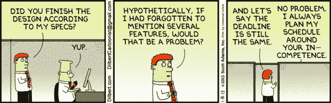
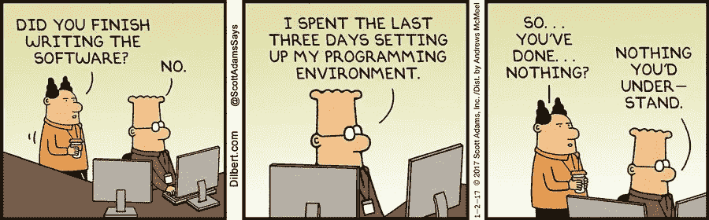
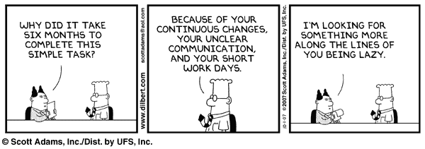

# 先说估算。

> 原文：<https://levelup.gitconnected.com/lets-talk-about-estimation-6f80c48a4f7d>

一个真诚的向导，帮助你按时完成任务。

沃洛季米尔·赫里先科在 [Unsplash](https://unsplash.com/s/photos/communication?utm_source=unsplash&utm_medium=referral&utm_content=creditCopyText) 上的照片

在我作为开发人员的两年时间里，我为评估做了很多努力。我不是唯一一个，我的大多数同事也有这个问题。

## 但是为什么这么难呢？

我觉得是因为当你成为开发者的时候没人教你怎么估算。你只是在过程中学习，编码越来越多，直到你能更准确地估计完成一项任务需要多长时间。

# 慢慢来。

当你被分配到一个项目或任务时，要花时间确切地知道需要什么。也许这是一个需要几个月的长期项目，或者也许是一个只需要几个小时的任务。

无论是哪种情况，你都可以在几分钟内得到一个估计值，也可能需要几天时间。提出你对项目的所有问题，确保工作流程已经完成，如果你有一个设计，问产品团队在每一个可能的场景中会是什么样子。

## 如果需求没有完全定义好呢？

这些可能是最难估计的项目。如果你收到一个客户的短信，他说他想要一个电子商务应用程序，但不确定他需要什么样的支付网关，或者产品团队提供了一个针对桌面的网页设计，但没有针对平板电脑和移动设备的*(这让我抓狂)*，你可能会觉得卡住了。

需要指出的是，你无法给出一个精确的估计，因为你需要更多的信息，而你定义的时间可能会因为信息的缺乏而延长。

[*D*](https://dilbert.com/)伊尔伯特

# 拆分流程。

当你开始工作时，永远记住项目的范围；有了这个想法，试着把这个过程分成小任务，一个接一个地进行。这将帮助你维持秩序，并意识到你已经做了什么，还有什么要做。许多应用程序，如 Trello 和吉拉可以帮助你做到这一点。你也可以估计这个小任务，这将有所帮助。

## 很容易走神。

项目时间越长，难度越大。我记得我开始编写一个新的特性，我回到我做的一个老组件，想*嗯，我认为这需要重构*。我在那个组件上花了 3 个小时，重构完成了，但是我在超出范围的事情上浪费了 3 个小时。

不要误解我的意思，为了继续完成任务，有些时候重构或调整是必要的，但是对于我一直在做的特性来说，这不是必要的。如果你想尝试一个新的库或者改变大量的代码，请三思，这真的有必要吗？

[D伊尔伯特](https://dilbert.com/)

# 交流。

这是团队的关键。如果你有不明白的地方，就去问，如果产品团队给你一个对你来说并不聪明的设计，就去问必要的问题。

最重要的是，当你觉得你正在做的任务或项目将花费你更长的时间，不要等到最后一天才向你的经理宣布，是的，我知道，我们倾向于认为我们会做到这一点，即使离最后期限还有两天，有很多事情要做，通常需要你四五天的事情，我们希望在两天内完成。这是不可能的，或者可能是，但它会占用你大量的时间，你会感到压力，而且很可能你也完成不了。

## 但是如果我要求延期，我可能会失去我的信誉。

有时候你不能在截止日期前一两天完成，这没什么大不了的，但是如果一个项目非常重要，并且许多领域都将受到影响，你需要有效地沟通，并详细说明为什么这比约定的时间长。这不会降低你的可信度，它会反映出你为了完成出色的工作而做出的妥协。

如果你选择匆忙结束一个项目，也许它成功了，也许没有，也许它有问题，或者你在流程中错过了一些重要的东西。如果是这样的话，你可能会失去交付一个没有完成需求的任务的可信度。

[*D*](https://dilbert.com/)伊尔伯特

我希望这些建议对你有用，并能提高你在分配给你的任何任务中的表现。请记住，你永远不会停止学习，知道如何处理估计可能需要一些时间，也许你会在这个过程中失败，但会为下一次学习。