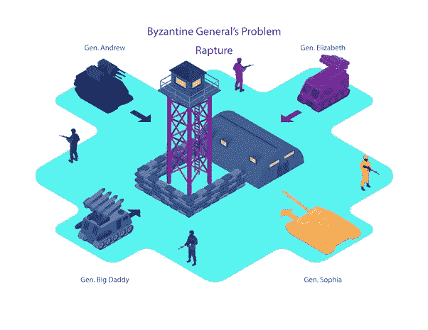
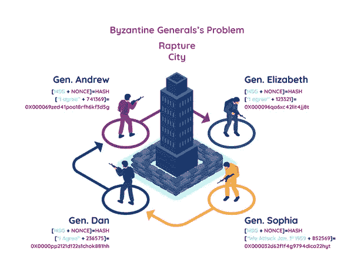
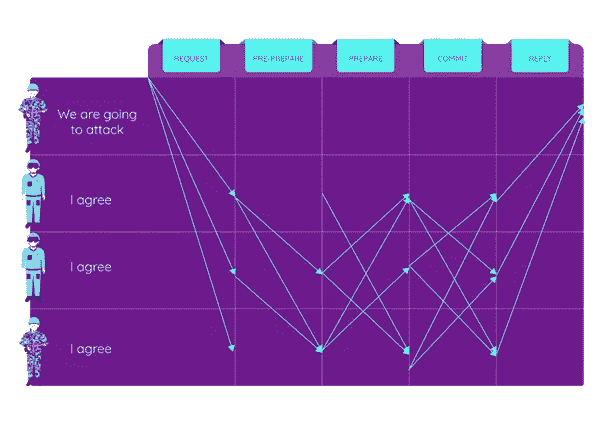

# 来说说战争吧！实用拜占庭容错共识

> 原文：<https://levelup.gitconnected.com/lets-talk-about-war-the-practical-byzantine-fault-tolerant-consensus-b6991b603cd6>

## 在任何一个区块链，善与恶之间都有一场持续的战争！好的节点想要保持区块链的真实状态，但是坏的参与者想要进行欺诈交易！解决拜占庭将军的问题让我们赢得了与邪恶节点的斗争，甚至可以容忍它们！

本文是我讨论其他共识机制的系列文章的一部分。在你读完关于 PBFT ⚔的文章后，你可以查看下面的链接

*   [经过时间的证明是什么](https://medium.com/nerd-for-tech/whats-proof-of-elapsed-time-4f67cf3f45b3)
*   [比特币工作证明——你必须阅读的唯一一篇文章](/bitcoin-proof-of-work-the-only-article-you-will-ever-have-to-read-4a1fcd76a294)
*   [利益相关证明——什么是利益相关证明，它是如何工作的？](https://medium.com/nerd-for-tech/proof-of-stake-what-is-and-how-does-it-work-1c8bd7f00303)
*   [重要性共识机制证明](/proof-of-importance-consensus-mechanism-5e0d7abbd5ba)
*   [委托股权证明](/delegated-proof-of-stake-of-dpos-f60a27c16341)
*   [燃烧证明](https://medium.datadriveninvestor.com/proof-of-burn-9e348725953c)

# 我们开战吧！

区块链的节点就像战争中的将军和士兵

区块链就像善节点和恶节点之间的持续战争。作为一个具有数十个、数百个甚至数千个节点的分布式网络，需要就区块链的当前状态达成一致，并确保好节点战胜坏节点。这就是我们所说的共识成就。

然而，在一个分布式系统中以安全有效的方式达成共识并不是一件容易的事情。

就像在战争中一样，如果一些节点最终会失败或不诚实地行动，我们如何才能让一个由独立节点组成的网络就一项决策或一段数据达成一致？好的节点如何战胜邪恶的、欺诈的或有故障的节点？

这是拜占庭将军问题的根本问题！一个困扰了数学家几千年的问题(是啊，这个问题 1988 年才正式发表)终于在 1999 年解决了！

# 这个实用的拜占庭容错共识到底是什么？

PBFT 试图解决拜占庭将军的问题！但是为什么将军们会有问题呢？

拜占庭将军问题是一个假设的情况，许多将军带领他们的拜占庭军队需要决定他们是进攻还是从他们包围的城市撤退。

将军们位于目标城市周围的不同地点，这意味着他们彼此相距很远。

他们只有全部同时进攻，无人撤退，才能攻克城池。为了确保行动的成功，将军们需要达成共识！他们要么进攻，要么全部撤退。他们需要达成共识！

每位将军将投票决定是进攻还是撤退。投票后，他们不能改变主意。此外，所有将军都需要就同一决定达成一致，并协调执行。

但是有个问题！他们需要与在将军之间传递信息的马信使交流。其中一个问题是，送信人可能是叛徒，也可能中途被杀。其中一个信使也可以改变主意或临阵脱逃，这将危及整个军队。我们如何解决这个问题？

这就是为什么拜占庭将军需要有一个共识机制来确保每个人都在同一页上。

在区块链网络的上下文中，潜在的叛徒可能是节点，而信使可能是它们之间潜在的被破坏的通信信道。这个问题在 1999 年由两位计算机科学家 Miguel Castro 和 Barbara Liskov 开发的 PBFT 算法解决了。PBFT 也可用于除区块链之外的其他分布式系统，如对等网络和物联网网络。

PBFT 使分散式系统对故障具有弹性，并允许有多个参与者的系统一致工作。PBFT 系统对于恶意节点或无法与其他节点正常通信的节点是有弹性的，即容错的。PBFT 可以保护具有多个节点的系统，并增加一些弹性和容错能力。它们是 BFT，即拜占庭容错，这意味着它们可以容忍一定比例的节点发生故障(例如 1/3)。

拜占庭将军的问题:

*   通信信道可能不可信
*   该消息可以被改变或替换
*   信使可以被杀死
*   信使可以被延迟

解决方案是:

*   共识算法，它不受信任缺失的影响
*   诸如 PBFT、PoW 和 PoS 的共识机制是拜占庭容错的
*   “好的”将军在网络中必须比那些有缺点的将军拥有更大的权力
*   加密集成创建共识和数据不变性

比特币的工作证明被认为是拜占庭将军问题最天才的解决方案之一，也是最安全的共识机制之一。

在比特币和其他区块链工作证明中，当安德鲁将军想要给“大老爹”将军发送消息时，他可以接收消息，并添加随机数，产生特定的唯一散列。然后，他可以把这个送给大爸爸。即使送信人试图改变消息(中间人攻击)，他也必须改变这条消息和其他将军发送的其他消息的散列。这将需要太多的工作，使得这种攻击不可行。

一旦 Big Daddy 将军收到来自 Andrew 将军的消息，他可以很容易地验证该消息没有被修改，并且他将向该组回复“我同意”，添加 nonce 和 hash，以便其他人看到该消息是合法的。其他将领也会这样做，达成共识。每个人都必须执行这种工作证明，使得攻击者(内部或外部攻击)很难改变将军们的共识。

如果其中一个将军决定撤退而不是进攻，这个决定不会影响共识，因为其他三个将军都保持共识。这就是为什么这些共识机制被称为“容错”的原因，因为它们容忍大量节点的故障。一旦将军们达成共识，他们就可以进攻提并征服这座城市(或者在这种情况下，他们同意在区块链建立一个新的街区)！

没有工作证明的区块链也应用拜占庭容错机制。例如，Hyperledger 锯齿使用 PBFT——实用的拜占庭容错。

我们看到拜占庭容错系统是分布式系统，可以在一定程度上容忍故障节点。在 PBFT，如果 *f* 是故障节点的数量，那么 *2f + 1* 个非故障节点需要达成共识。

让我们看看 PBFT 算法是如何恢复的。假设以下情况

*n* =节点总数

*f* =故障节点数

PBFT 最多可以容忍 *f = (n-1) / 3*

*或 n — f = (2n + 1) /3*

PBFT 算法的高度简化说明:

1.  请求:一个客户端，在本例中是我们的将军 Andrew，向对等节点之一——将军 Big Daddy 发送消息/请求
2.  预先准备:Andrew 和 Big Daddy 都向其他节点多播消息，有时在 PBFT 也称为副本(将军 Sophia 和 Elizabeth)
3.  准备和提交:副本执行请求并向其他节点发送回复
4.  回复:客户端等待将军们的 n + 1 个相同结果的回复。这将导致积极的共识

瞧，共识达成了，拜占庭将军的问题解决了！达成共识！让我们征服狂喜！

**🚀关注我并查看我的🧱区块链课程:**

**🐶** [**有史以来第一次 Dogecoin 课程**](https://www.udemy.com/course/-dogecoin-course-the-first-complete-dogecoin-course/?referralCode=9416B1408224CE309DD8)

**💸** [**Fintech、云与网络安全课程**](https://www.udemy.com/course/fintech-technologies-cloud-and-cybersecurity/?referralCode=F1D4EA005A2881735A36)

**📖** [**完整的 NFTs 教程**](https://www.udemy.com/course/the-complete-nft-course-learn-everything-about-nfts/?referralCode=AAEE908D13D0E2276B19)

**👨‍🎓** [**Unblockchain 课程**](https://www.udemy.com/course/blockchain-deep-dive-from-bitcoin-to-ethereum-to-crypto/?referralCode=B8463EE382E6D313304B) **—脑洞大开的区块链课程**