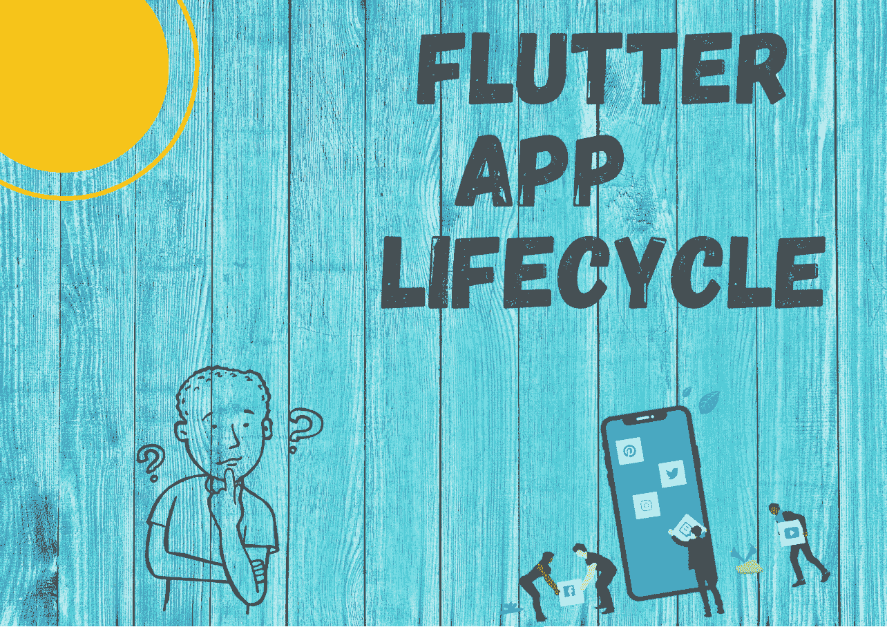
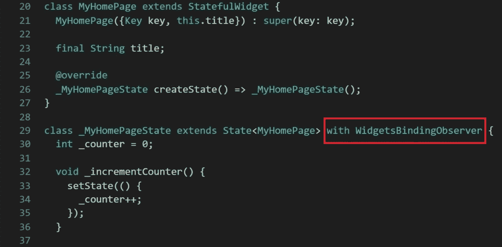
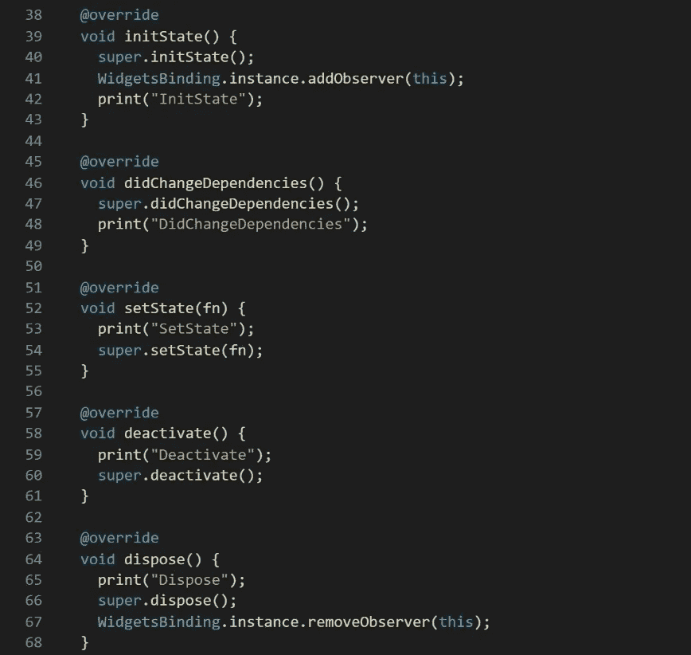
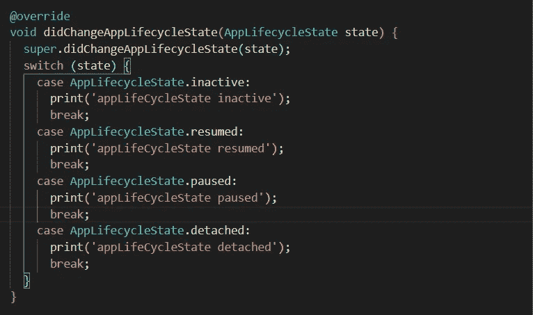
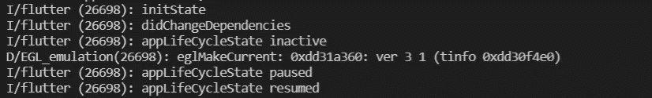

# 让我们利用 Flutter 应用程序的生命周期

> 原文：<https://levelup.gitconnected.com/lets-utilize-the-flutter-app-lifecycle-388121533fd9>

## *检测移动应用生命周期变化的清晰指南*



> **Flutter** 是一个开源的移动框架，用于为 Android 和 iOS 创建原生应用。当您处理移动应用程序时，在实现某些功能时了解应用程序的生命周期是很重要的。因此，本文将详细描述 Flutter 应用程序生命周期方法。

## 为什么我们需要关注应用程序的生命周期？

实际上，在处理移动应用程序时，有一些主要的问题，比如某个特定的应用程序是在后台还是前台运行。因此，这可以很容易地处理颤振 [*应用周期状态*](https://api.flutter.dev/flutter/dart-ui/AppLifecycleState-class.html) 和 4 个主要的生命周期状态:

**分离的** →固定的[应用循环地产](https://api.flutter.dev/flutter/dart-ui/AppLifecycleState-class.html):

如果一个应用程序处于这种状态，颤振引擎正在运行，但我们看不到视图。简单假设手机里有任何 app 但是你没有打开。因此，如果应用程序托管在 flutter 引擎中，它将从任何主机视图中分离出来。

**无效** →常量[应用循环属性](https://api.flutter.dev/flutter/dart-ui/AppLifecycleState-class.html):

如果应用程序处于这种状态，它不会接收用户输入。简单来说，我们可以说这个应用程序在前台，而不是在你的手机后台运行。例如，如果我们按下后退按钮并移动到一个新的应用程序，那么之前工作的应用程序将进入前台非活动状态，并且不会接收用户输入。因此，状态中的应用程序应该假设它们可以随时暂停。

**暂停** →常量[应用循环属性](https://api.flutter.dev/flutter/dart-ui/AppLifecycleState-class.html):

如果应用程序处于这种状态，它对用户是不可见的，并且不响应用户输入。但是需要注意的是，它是在后台运行的。举个例子，假设你在脸书，你从 WhatsApp 收到一个通知，然后你点击那个聊天通知，进入 WhatsApp。在这种情况下，脸书处于暂停状态，它在后台运行，但对用户不可见。

**恢复** → const [应用循环地产](https://api.flutter.dev/flutter/dart-ui/AppLifecycleState-class.html):

如果应用程序处于这种状态，它会响应用户的输入，并在后台显示应用程序。假设您正在使用 WhatsApp 即时消息。

现在，我想你可以对应用程序的生命周期有一个清晰的概念，然后让我们来看代码实现。

1.创建一个演示应用程序。

2.创建 StatefulWidget 和 WidgetsBinindingObserver



StatefulWidget 和 WidgetsBinindingObserver

3.然后，您需要分别使用 addObserver 方法和 removeObserver 方法添加和删除观察器来管理观察器:

initState(): 这是创建小部件时调用的第一个方法(当然是在类构造函数之后。)initState 被调用一次，且只能调用一次。它必须调用 super.initState()。

**dispose():** dispose()在状态对象被移除时被调用，是永久的。这种方法是你应该退订和取消所有动画，流等。

**deactivate()** :从树中移除状态时调用。这种方法的存在基本上是因为状态对象可以从树中的一点移动到另一点。

setState() :经常从 Flutter 框架本身和开发者那里调用。它用于通知框架“数据已经更改”，并且应该重新构建该构建上下文中的小部件。

[*参见更多*](https://www.bookstack.cn/read/flutterbyexample/aebe8dda4df3319f.md) *…..*



作者图片

4.创建 didChangeAppLifecycleState，它将 AppLifecycleState 作为对象参数，用于检查应用程序生命周期中的各种状态。当[State]对象的依赖关系改变时，调用 didChangeAppLifecycleState。

此外，第一次构建小部件时，会在 initState 之后立即调用 didChangeAppLifecycleState。



didChangeAppLifecycleState 方法

5.您用于检测应用生命周期变化的应用现已准备就绪。完整的代码实现如下。

```
import 'package:flutter/material.dart';void main() {
  runApp(MyApp());
}class MyApp extends StatelessWidget {
  [@override](http://twitter.com/override)
  Widget build(BuildContext context) {
    return MaterialApp(
      title: 'Flutter Demo',
      theme: ThemeData(
        primarySwatch: Colors.blue,
      ),
      home: MyHomePage(title: 'Flutter Demo Home Page'),
    );
  }
}class MyHomePage extends StatefulWidget {
  MyHomePage({Key key, this.title}) : super(key: key);final String title;[@override](http://twitter.com/override)
  _MyHomePageState createState() => _MyHomePageState();
}class _MyHomePageState extends State<MyHomePage> with WidgetsBindingObserver {
  int _counter = 0;void _incrementCounter() {
    setState(() {
      _counter++;
    });
  }[@override](http://twitter.com/override)
  void initState() {
    super.initState();
    WidgetsBinding.instance.addObserver(this);
    print("InitState");
  }[@override](http://twitter.com/override)
  void didChangeDependencies() {
    super.didChangeDependencies();
    print("DidChangeDependencies");
  }[@override](http://twitter.com/override)
  void setState(fn) {
    print("SetState");
    super.setState(fn);
  }[@override](http://twitter.com/override)
  void deactivate() {
    print("Deactivate");
    super.deactivate();
  }[@override](http://twitter.com/override)
  void dispose() {
    print("Dispose");
    super.dispose();
    WidgetsBinding.instance.removeObserver(this);
  }[@override](http://twitter.com/override)
  void didChangeAppLifecycleState(AppLifecycleState state) {
    super.didChangeAppLifecycleState(state);
    switch (state) {
      case AppLifecycleState.inactive:
        print('appLifeCycleState inactive');
        break;
      case AppLifecycleState.resumed:
        print('appLifeCycleState resumed');
        break;
      case AppLifecycleState.paused:
        print('appLifeCycleState paused');
        break;
      case AppLifecycleState.detached:
        print('appLifeCycleState detached');
        break;
    }
  }[@override](http://twitter.com/override)
  Widget build(BuildContext context) {
    return Scaffold(
      appBar: AppBar(
        title: Text(widget.title),
      ),
      body: Center(
        child: Column(
          mainAxisAlignment: MainAxisAlignment.center,
          children: <Widget>[
            Text(
              'You have pushed the button this many times:',
            ),
            Text(
              '$_counter',
              style: Theme.of(context).textTheme.headline4,
            ),
          ],
        ),
      ),
      floatingActionButton: FloatingActionButton(
        onPressed: _incrementCounter,
        tooltip: 'Increment',
        child: Icon(Icons.add),
      ),
    );
  }
}
```

6.您可以运行您的应用程序，并观察应用程序生命周期的变化。生命周期变更的示例片段如下:



作者图片

***结论***

> 检测应用程序生命周期是一种简单的方法，但当您处理移动应用程序以及需要实现一些特殊的本机应用程序相关开发时，这种方法非常有用。

## 感谢你阅读这篇文章，如果你喜欢这篇文章或者学到了新的东西，尽可能多的鼓掌来表示你的支持。🙌😎