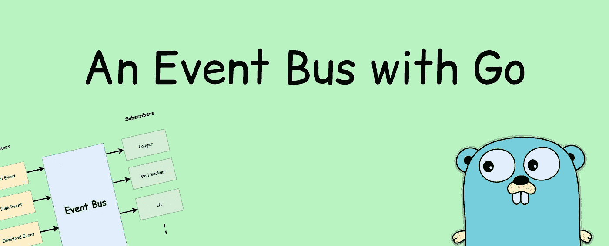
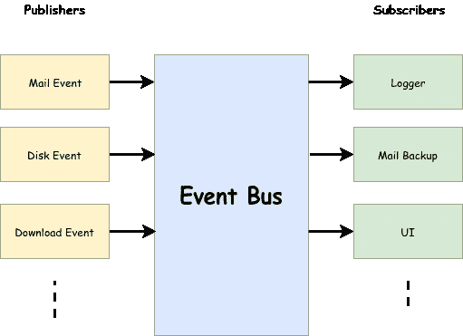

# 让我们在 Go 中编写一个简单的事件总线

> 原文：<https://levelup.gitconnected.com/lets-write-a-simple-event-bus-in-go-79b9480d8997>



事件驱动架构是计算机科学中高度可扩展的范例。它允许我们通过多方异步处理事件。

事件总线是[发布/订阅模式](https://en.wikipedia.org/wiki/Publish%E2%80%93subscribe_pattern)的一个实现，发布者发布数据，感兴趣的订阅者可以监听它们并根据数据采取行动。这允许发布者和订阅者的松散耦合。发布者将数据事件发布到事件总线，总线负责将它们传递给订阅者。



活动巴士

实现事件总线的传统方法包括使用回调。订户通常实现一个接口，然后事件总线通过该接口传播数据。

通过 go 的并发模型，我们知道通道可以在大多数地方用来代替回调。在本文中，我们关注如何使用通道来实现事件总线。

> 我们关注基于**主题的事件**。发布者发布主题，订阅者可以收听。

# 定义数据结构

对于这个任务，我们需要定义要传递的数据结构。我们可以简单地使用`struct`创建一个新的数据类型。让我们如下定义一个`DataEvent`结构:

```
**type** DataEvent **struct** {
   Data **interface**{}
   Topic string
}
```

在这里，我们将底层数据定义为一个接口，这意味着它可以是任何值。此外，我们还将主题定义为结构的成员。您的订户可能会收听不止一个主题。因此，传递主题是一个好的做法，这样订阅者就可以区分事件。

# 介绍渠道

现在我们已经为任务定义了主要的数据结构，我们需要一种方法来传递它。为此，我们可以定义一个能够传播一个`DataEvent`的`DataChannel`。

```
*// DataChannel is a channel which can accept an DataEvent* **type** DataChannel **chan** DataEvent*// DataChannelSlice is a slice of DataChannels* **type** DataChannelSlice [] DataChannel
```

`DataChannelSlice`是为了保存一部分频道并方便引用而创建的。

# 事件总线

```
*// EventBus stores the information about subscribers interested for // a particular topic* **type** EventBus **struct** {
   subscribers **map**[string]DataChannelSlice
   rm sync.RWMutex
}
```

`EventBus`有`subscribers`是保存`DataChannelSlices`的地图。我们使用了一个`mutex`来保护它免受读写并发访问。

通过使用一个`map`并定义`topics`，它允许我们轻松地组织事件。主题被视为地图中的一个键。当有人发布到它时，我们可以很容易地通过关键字找到主题，然后将事件传播到通道进行进一步处理。

# 订阅主题

为了订阅主题，使用通道。它的作用类似于传统方法中的回调。当发布者将数据发布到主题时，通道将接收数据。

```
**func** (eb *EventBus)Subscribe(topic string, ch DataChannel)  {
   eb.rm.Lock()
   **if** prev, found := eb.subscribers[topic]; found {
      eb.subscribers[topic] = append(prev, ch)
   } **else** {
      eb.subscribers[topic] = append([]DataChannel{}, ch)
   }
   eb.rm.Unlock()
}
```

简单地说，我们将订户附加到通道片，并在操作后锁定结构和解锁它。

# 发布到主题

要发布事件，发布者需要为订阅者提供需要广播的主题和数据。

```
**func** (eb *EventBus) Publish(topic string, data **interface**{}) {
   eb.rm.RLock()
   **if** chans, found := eb.subscribers[topic]; found {
      *// this is done because the slices refer to same array even though they are passed by value
      // thus we are creating a new slice with our elements thus preserve locking correctly.* channels := append(DataChannelSlice{}, chans...)
      **go func**(data DataEvent, dataChannelSlices DataChannelSlice) {
         **for** _, ch := **range** dataChannelSlices {
            ch <- data
         }
      }(DataEvent{Data: data, Topic: topic}, channels)
   }
   eb.rm.RUnlock()
}
```

在这个方法中，首先我们检查是否有任何订阅者存在于这个主题中。然后，我们只需简单地遍历与主题相关联的通道片段并发布它。

> 请注意，我们在 publish 方法中使用了 goroutine 来避免阻塞发布者

# 让我们试试吧

首先，我们需要创建事件总线的一个实例。在一个真实的场景中，你可以从包**中导出一个单独的`EventBus`，让它表现得像一个单独的**。

```
**var** eb = &EventBus{
   subscribers: **map**[string]DataChannelSlice{},
}
```

为了测试新创建的事件总线，我们将创建一个以随机间隔发布给定主题的方法

```
**func** publisTo(topic string, data string)  {
   **for** {
      eb.Publish(topic, data)
      time.Sleep(time.Duration(rand.Intn(1000)) * time.***Millisecond***)
   }
}
```

接下来，我们需要一个可以监听主题的主函数。它使用一个助手方法来打印事件数据。

```
**func** printDataEvent(ch string, data DataEvent)  {
   fmt.Printf(**"Channel: %s; Topic: %s; DataEvent: %v\n"**, ch, data.Topic, data.Data)
}**func** main()  {
   ch1 := make(**chan** DataEvent)
   ch2 := make(**chan** DataEvent)
   ch3 := make(**chan** DataEvent) eb.Subscribe(**"topic1"**, ch1)
   eb.Subscribe(**"topic2"**, ch2)
   eb.Subscribe(**"topic2"**, ch3) **go** publisTo(**"topic1"**, **"Hi topic 1"**)
   **go** publisTo(**"topic2"**, **"Welcome to topic 2"**) **for** {
      **select** {
      **case** d := <-ch1:
         **go** printDataEvent(**"ch1"**, d)
      **case** d := <-ch2:
         **go** printDataEvent(**"ch2"**, d)
      **case** d := <-ch3:
         **go** printDataEvent(**"ch3"**, d)
      }
   }
}
```

我们已经创建了三个可以订阅主题的频道。其中两个 ch2 和 ch3 监听相同的事件。

我们使用 select 语句从最快的通道获取数据。然后它使用另一个 goroutine 来打印输出数据。这完全没有必要。但在某些情况下，您必须对事件进行一些繁重的操作。为了防止阻塞 select，我们使用了 goroutine。

示例输出将如下所示

```
Channel: ch1; Topic: topic1; DataEvent: Hi topic 1
Channel: ch2; Topic: topic2; DataEvent: Welcome to topic 2
Channel: ch3; Topic: topic2; DataEvent: Welcome to topic 2
Channel: ch3; Topic: topic2; DataEvent: Welcome to topic 2
Channel: ch2; Topic: topic2; DataEvent: Welcome to topic 2
Channel: ch1; Topic: topic1; DataEvent: Hi topic 1
Channel: ch3; Topic: topic2; DataEvent: Welcome to topic 2
...
```

您可以看到事件总线通过通道传递事件。

基于事件总线的简单通道的源代码。

# 完全码

事件总线的完整代码

# 那么，为什么要用通道而不是回调呢？

传统的回调方式需要你实现某种接口。

举个例子，

```
**type** Subscriber **interface** {
   onData(event Event)
}
```

现在，如果您想订阅一个事件，您需要实现接口，以便事件总线可以传播它。

```
**type** MySubscriber **struct** {
}**func** (m MySubscriber) onData(event Event)  {
   // do anything with event
}
```

通道方法允许您在一个简单的函数中简单地注册一个订户，而不需要接口。

```
**func** main() {
   ch1 := make(**chan** DataEvent)
   eb.Subscribe(**"topic1"**, ch1)
   fmt.Println((<-ch1).Data)
   ...}
```

# 结论

本文的目标是指出编写事件总线的不同范例。

> 这可能不是理想的解决方案。

例如，频道被封锁，直到有人消费它们。它们有局限性。

> 我使用了一个片来存储一个主题的所有订阅者。这是用来简化文章的。这需要用一个**集合**来替换，这样列表中就不会出现重复的条目

传统的回调方法可以通过使用提供的相同机制来简单地实现。您可以很容易地在 goroutine 中实现异步包装发布。

我很想听听你对这篇文章的看法。:)

[](https://levelup.gitconnected.com)[](https://gitconnected.com/learn/golang) [## 学习围棋-最佳围棋教程(2019) | gitconnected

### 23 大围棋教程-免费学习围棋。课程由开发者提交和投票，使您能够找到…

gitconnected.com](https://gitconnected.com/learn/golang)