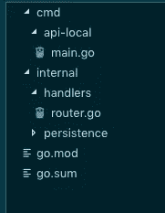

# 让我们用 Golang-1 编写一个 API

> 原文：<https://levelup.gitconnected.com/lets-write-an-api-in-golang-1-7d8a9e69aca1>

在开始我的新职位@BuzzBird 后，我的任务是编写一个服务，将我们选择的 CRM 连接起来，并将其转换为我们可以用来识别客户的内部实体。
在这个过程中，我学到了很多关于如何在 Go 中编写 API 的知识，这篇文章应该会给你一个小小的介绍。会有更多这样的文章，我们将继续这个 API，所以我们最终会有一个您可以使用的项目。

## 放弃

为了简单起见，我假设你至少已经完成了围棋的*之旅*，你可以在这里找到。这是一个很好的教程，会给你一个坚实的基础。由于我是新手，我很想听听你的反馈。如果你对你看到的任何东西有强烈的感觉或有建议，请让我知道，我总是渴望学习！

## 极简设置

作为 HTTP 服务器的起点，我开发了一个可以测试的本地版本。它加快了开发速度，使寻找 bug 变得更加容易，在运行之后，我有了一种在它之上构建的自然方式，在添加新功能的同时测试它们。

## 文件结构

因为在这个话题上有很多不同的观点，你可以就这个话题写一整篇博客文章。我想在这里给你的是一个你可以开始使用的结构，它应该工作得很好。
如果你对这个话题感兴趣，这是一个很好的起点:[Kat Zien 的谈话](https://www.youtube.com/watch?v=oL6JBUk6tj0)。

对于根目录，我们应该有两个不同的子目录:`cmd`包含用于执行 web 服务器的主文件，而`internal`包含处理程序和任何相关的数据。
如果你打算让任何其他 Go 服务与它交互，那么还需要一个`pkg`文件夹，我们将使用它来定义我们的包的类型和功能。

## 设置服务器

在基本设置之后，我们的 main.go 文件应该是这样的:

如您所见，我们所做的只是初始化路由器和记录器，我们将使用它们来调试我们的应用程序，这将对我们有很大帮助。最后，我们告诉路由器接受端口 8080 上的请求。到目前为止一切顺利！不幸的是，如果我们现在运行它，我们得到的只是一个错误。

我们还没有做的是设置我们的路由器和它将接受请求的路由！所以让我们继续前进，就这样做吧！

## 结构

因为这里发生了很多事情，所以让我们打开它！在最初的导入语句之后，我们正在定义包含所有处理程序方法的结构。

我之所以使用这种结构，是因为它使组织方法本身变得容易，并且它为我提供了一个中心点来授予对共享资源的访问权限——就像您在本例中看到的 DB access 或 logger！NewRouter 函数使用 Chi 包创建 handlerShared 结构和路由器的实例。

它还负责添加我们想要的路由，并将它们与各自的处理程序相结合。

## 经理人

与 JavaScript 和 Python 之类的语言相比，在 Go 中编写一个简单的响应都不是小事，因为它不理解 JSON。

我们将使用编组将数据编码成字节格式，然后我们可以在 HTTP 响应中使用它。你可以在这篇[博客文章](http://localhost:8000/Writing%20REST%20APIs%20in%20Golang/)中读到更多关于这个话题的内容。

一旦我们深入这个项目，我们将引入帮助器，使我们发送响应和错误更加方便。

## 少了什么

要获得一个全功能的 REST API，还有很多方法。我们需要用户可以与之交互的实际资源，以及用户与之交互的方式！此外，我们应该简化处理 HTTP 请求的方式，并添加一个助手函数来发送我们的响应。所有这些和更多的你可以在这篇文章的下一部分找到，我将在 04/14 发布，所以请继续关注！

作者**南多·泰森**一位软件工程师&目前在 [BuzzBird](https://www.buzzbird.de/) 工作的德国电竞迷。要了解更多信息，请在 Twitter 上关注我，或在 LinkedIn 上找到我，并将我添加到您的联系人中！

*最初发布于*[*www . blog . nando . codes*](https://www.blog.nando.codes/Writing%20REST%20APIs%20in%20Golang/)*。*

 [## 学习围棋-最佳围棋教程(2019) | gitconnected

### 22 大围棋教程-免费学习围棋。课程由开发者提交和投票，使您能够找到…

gitconnected.com](https://gitconnected.com/learn/golang)