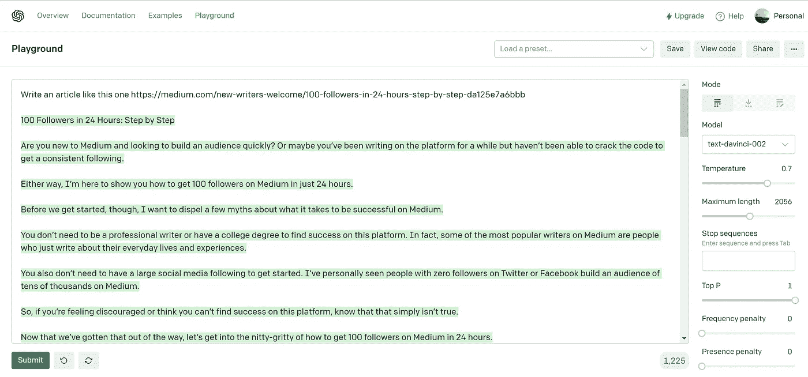

# 让人工智能在不到 10 秒的时间内完成后续工作。

> 原文：<https://levelup.gitconnected.com/letting-an-ai-do-the-follow-for-follow-work-in-under-10s-7ee59efcd78>

使用 OpenAI 的操场使用 AI 对你有利是非常简单的。

想要拥有 100 名粉丝，有两种方法:

*   扩大观众群
*   为追随而追随

我选择了第二个，因为自己做很无聊，所以我想用人工智能来做。我的想法是将其完全自动化，并构建一个脚本来完成点击工作，关注和评论其他人的后续文章，并让人工智能创建我的后续文章。

## 创建我的后续文章

1.  首先，我在最上面的文章中搜索“100 个追随者”标签，并用它作为输入来生成我自己的文章。然后我只需要复制 pasta，并适当地格式化文章。

> 写一篇这样的文章[https://medium . com/new-writers-welcome/100-followers-in-24-hours-step-by-step-da 125 e 7 a6 BBB](https://medium.com/new-writers-welcome/100-followers-in-24-hours-step-by-step-da125e7a6bbb)

https://beta.openai.com/playground

2.第二，我手写了这篇关于它的文章。

3.最后，除了作为一名软件工程师学习和工作之外，创建自动化脚本还有太多的工作要做，所以当我通勤或拖延学习以准备考试时，我会跟随作者。

> *我还担心媒体可能不喜欢在他们的网站上运行类似机器人的脚本*

因此，如果你觉得这很有趣，并想听到更多，考虑以下；)

 [## 24 小时内的追随者:一步一步(跟随回来)

### 你是新接触媒体的人吗？你想快速建立一个观众群吗？

medium.com](https://medium.com/@nick.wallner/followers-in-24-hours-step-by-step-follow-back-6b761a87404f)