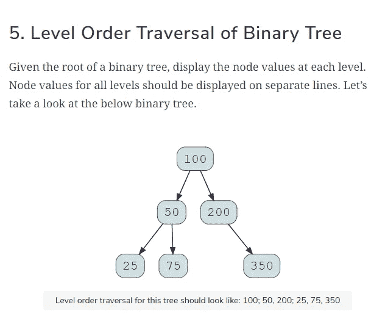
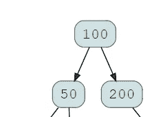
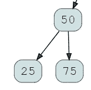
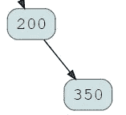
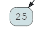
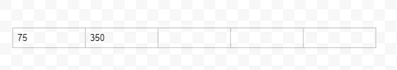
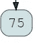
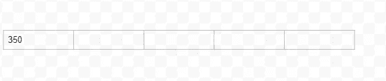
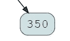

# 二叉树的层次顺序遍历

> 原文：<https://levelup.gitconnected.com/level-order-traversal-of-a-binary-tree-a3425ebb4256>


来源:通过[Unsplash.com](https://unsplash.com/photos/tGTVxeOr_Rs)的 Niko 照片

一棵树！自然和宁静的象征。但对我们计算机科学家来说，我们用它们来存储数据和翻转数据，因为它看起来更酷，而且总是在室内，几乎看不到树。

树形数据结构允许机器以二进制方式遍历数据。数据被一分为二，以使遍历更容易。我们将讨论层次顺序遍历，这也是一个常见的面试问题。

# 问题陈述



层级顺序遍历也称为广度优先搜索，从上到下导航。我们将引入一个辅助数据结构，称为队列。

我们从根节点 100 开始，将它插入到我们的队列数据结构中，这个过程称为入队。


然后查看队列中的项目，输出/打印号码。

产量:100

一旦我们达到顶点并打印出数字，我们就让它出队并探索它的子节点。



100 的子节点是 50 和 200。然后，我们将把它们插入(排队)到队列数据结构中，从左边的子节点开始，然后是右边的子节点。


然后，我们将队列中的第一个项目增加到峰值，即 50。我们继续输出、打印它并将其出队(从我们的队列中删除)。

产量:50

然后，我们研究 50 的子节点，即 25 和 75，并将它们排列到队列数据结构中，从左节点开始，然后是右节点。



然后我们到达顶点并检查，这是队列中的第一个项目。我们注意到它是 200，我们输出/打印 200，然后将其出队。然后继续探索它的子节点。

产量:200



我们看到 200 只有一个子节点，即 350，因此我们将把它添加到队列中。


我们再次开始这个过程，我们查看队列中的第一个元素是什么。我们看到它是 25。然后我们输出/打印它，并将其从队列中移除(出列)。

产量:25

然后，我们评估 25 的子节点，看到它们都不是，我们继续处理队列中的下一个项目。



我们接着看 peak，我们队列中的第一项，75。我们将它输出/打印出来，然后从列表中删除它(出列)。

产量:75

然后我们检查 75 的子节点，发现它们都不是。我们继续处理队列中的下一项。



我们重新开始，我们检查队列中的第一个项目 350。我们输出/打印它，然后从队列中移除 350(出列)该项目。



产量:350

我们接着检查，350 的子节点是什么。我们看到它们都不是，我们完成了我们的层次顺序遍历。



这是一个相当累人的编写过程，幸运的是，计算机可以很容易地做到这一点，利用了一个被称为递归的过程。让我们把我们的过程写成代码。

# 代码实现

## 算法

1.  我们需要定义队列数据结构，以便于层次顺序遍历。
2.  我们将根节点插入到队列中。
3.  将节点从队列数据结构中出队。
4.  打印节点中的元素
5.  将左边的孩子排入队列
6.  将正确的孩子排入队列

我们将使用 Python 来实现代码。

我们将从实现队列数据结构开始。

```
form queue import Queue
```

然后创建一个二叉树类，我们不能只是遍历一棵树，而不告诉我们不太聪明的朋友，解释器我们想要创建一棵树。然后我们需要告诉它遍历树，以及如何遍历树。

```
class BinaryTreeNode:
    def__init__(self,data):
        self.data = data
        self.leftChild = None
        self.rightChild = None
```

在上面的代码中，我们已经告诉解释器创建一个二叉树节点，它将接受数据作为输入，左右子节点将开始为空。

```
def levelorder(root):
    Q = Queue()
    Q.put(root)
    while(not Q.empty()):
        node = Q.get()
        if node == None:
            continue
        print(node.data)
Q.put(node.leftChild)
Q.put(node.rightChild) 
```

上面是我们的层次顺序函数，它告诉解释器如何遍历二叉树。

因此，当我们的队列不为空时，我们将根节点插入(入队)到队列中，输出/打印根节点的值，然后将其从队列中出队。然后评估根节点的子节点，如果有子节点的话，首先将它们插入到队列中的左子节点，然后是右子节点。

```
def insert (root, newValue):
    if root is None:
        root = BinaryTreeNode(NewValue)
            return root
    if newValue < root.data:
        root.leftChild = insert(root.leftChild,newValue)
    else:
        root.rightChild = insert(root.rightChild,newValue)
            return root 
```

以上是我们的插入函数，我们如何告诉解释器插入项目。如果根节点是空的，那么创建一个二叉树并创建一个新节点，它将是根节点。

如果新值大于当前值(根)，则将该值插入左侧。如果值小于根，则将其插入右侧。

```
root = insert(None, 100)
insert(root,50)
insert(root,200)
insert(root,25)
insert(root,75)
insert(root,350)
```

最后，我们给解释器我们想要它执行遍历的值。