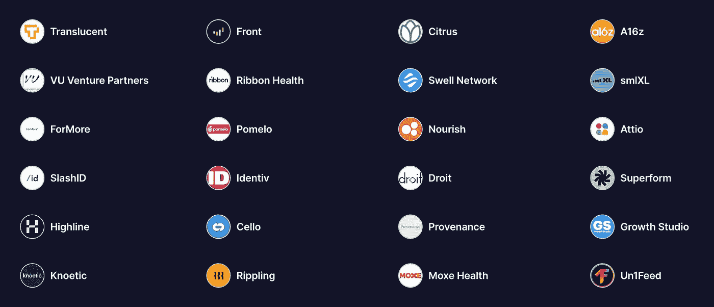

# 🔥升级天赋掉落

> 原文：<https://levelup.gitconnected.com/level-up-talent-drop-fcc9fda61d68>

## 2022 年 11 月:会见 24 家顶级科技公司和初创公司，他们想从高级编码社区雇佣像你这样的开发人员

[加入升一级天赋掉落的➡️](https://levelup.pallet.com/talent/welcome?referral=true)



Level Up 的使命是改变招聘方式。本月，Level Up 与 24 家令人难以置信的科技公司和初创公司合作。本文分为两个部分:

1.  认识更高级别的合作伙伴公司
2.  了解如何提升人才集体的工作

[加入人才下降的行列，让公司申请雇佣你➡️](https://levelup.pallet.com/talent/welcome?referral=true)

```
👋 **Are you a company hiring software engineers?** At Level Up, we're experts at scaling teams and building product. 
**We love to work directly with companies to match them with passionate devs that deliver.** Email us: hello@gitconnected.com
Or connect on LinkedIn: [https://www.linkedin.com/in/treyhuffine/](https://www.linkedin.com/in/treyhuffine/)
```

# 🤝升级合作伙伴公司🤝

*   [**(a16z)安德森·霍洛维茨**](https://a16z.com/)——一家领先的风险投资公司，投资了 Airbnb、GitHub、StackOverflow、比特币基地、Lyft、Slack 等等。
*   [**SlashID**](https://www.slashid.dev/) —用户友好的标识。取悦并保护用户。
*   [**膨胀**](https://swellnetwork.io/) —无权限、非托管、液态 ETH 打桩。
*   [**Citrus**](https://www.citrus.fund/)—Citrus 让所有投资者都能轻松买卖创业公司的股票。想想投资创业公司的 Robinhood。
*   [**正面**](https://www.getfront.com/)——金融科技的现代积木。允许跨经纪公司交易+通过账户聚合和数据洞察进行加密资产转移。
*   [**VU 风险投资伙伴**](https://www.vuventurepartners.com/)——专注于全球最大机遇的全球风险投资基金。
*   [**Ribbon**](https://www.ribbonhealth.com/)—Ribbon Health 为医疗保健企业提供了一个 API 层，用于获取关于医生、保险计划和成本&医疗质量的准确数据。
*   [**滋养**](https://www.usenourish.com/)——找到注册营养师并让它被你的保险覆盖的最简单方法。
*   [](https://www.translucent.app/)**—打造下一代会计 app。**
*   **[**ForMore**](https://formoresavings.com/) —打造金融的未来。**
*   **[**柚子**](https://www.pomelo.com/) —从美国汇款到菲律宾。**
*   **[**Attio**](https://attio.com/) —现代团队的数据驱动型 CRM。**
*   **[**identif**](https://www.identiv.com/)—物联网领域的全球数字安全和识别领导者。**
*   **[**Droit**](https://droit.tech/) —授权机构每天做出数百万个决策，遵守数千条复杂的规则**
*   **[**超形态**](https://www.superform.xyz/)**——**通用的屈服界面正在形成**
*   **[**Highline**](https://highline.co/) —一个新的支付平台，直接从工资单上自动化账单支付。**
*   **[**大提琴**](https://cello.so/) —把用户变成你最有价值的成长通道。Cello 是在几个小时内为任何 SaaS 产品添加 P2P 推荐程序的最简单的方法。**
*   **[**Comum**](https://en.comun.app/) —面向拉美的现代银行。用手机上的护照开一个银行账户**
*   **[**出处**](https://www.provenance.co/) —设计自己的现代婚礼。**
*   **[**成长工作室**](https://www.growthstudio.info/)——我们以一种快速而节俭的方式发现、捕捉并捍卫成长机会。建造。测试。迭代。规模。**
*   **[**Knoetic**](https://www.knoetic.com/) —借助人员分析的力量和由 2000 多名首席人员组成的网络，在您的公司做出更明智的决策。**
*   **[**ripping**](https://www.rippling.com/)—ripping 让您在一个地方轻松管理员工的工资单、福利、费用、设备和应用&。**
*   **[**【Moxe】**](https://moxehealth.com/)—通过更智能、更简单的数据交换让医疗变得更实惠。**

# **如何提升人才集体的工作**

**升级解决了开发者和公司的招聘问题。**

**招聘中断:**

*   **新程序员找不到工作**
*   **有经验的程序员被无休止地骚扰**
*   **寻找人才是发展一家伟大软件公司最痛苦的部分**

**升级可以解决这一切。✨**

**[**加入升一级天赋掉落的➡️**](https://levelup.pallet.com/talent/welcome?referral=true)**

**如果有一个平台专注于为像你这样的软件工程师匹配完美的角色，而不是高流动率和痛苦的面试过程，会怎么样？**

*   **开发者会更高兴**
*   **开发人员会更有效率**
*   **开发人员将不再频繁地转移工作**

**每个人都赢了🏆**

**如果你是已经使用了 [https://levelup.dev](https://levelup.dev/) 工具的 400 多万名每月程序员之一，你会知道我们对帮助开发人员发展他们的职业生涯和找到实现目标的机会充满了极大的热情。这是因为我们自己就是软件工程师，完全理解您所经历的一切。**

**如果你是开发者，我们强烈建议你[加入我们的人才集体](https://levelup.pallet.com/talent/welcome?referral=true)。你可以直接接触到我和我们出色的团队，我们非常高兴能认识你并帮助你找到你梦想中的角色。**

**我们遵循一些基本原则，使招聘过程对每个人都更好，这一切都始于专注于使它成为像你这样的开发人员的良好体验。**

**为什么你应该加入升级人才下降:**

1.  **将候选人的需求放在首位— **我们关注你和你的成功**。LinkedIn 和招聘人员的垃圾邮件让你疲惫不堪吗？我们也是。我们相信如果开发者开心，每个人都会开心。**
2.  **公司向候选人申请— **你在掌控**。不要把你的申请扔进黑洞，然后期待回报。公司会申请和你谈话。**
3.  **告诉公司你想要的报酬——招聘经理会提前知道你的价值。**
4.  ****只有最好的公司**——我们只让你愿意合作的公司加入。**
5.  **全球、本地或远程—任何人、任何地方的工作。**

**[**加入降级人才，有公司申请录用你➡️**](https://levelup.pallet.com/talent/welcome?referral=true)**

**[](https://jobs.levelup.dev/talent/welcome?referral=true) [## 升级—转变技术招聘

### 升级—转变技术招聘🔥使软件工程师能够找到完美的角色…

作业. levelup.dev](https://jobs.levelup.dev/talent/welcome?referral=true) 

```
👋 Are you a company hiring software engineers? At Level Up, we're experts at scaling teams and building product. 
**We love to work directly with companies to match them with passionate devs that deliver.** Email us: hello@gitconnected.com
Or connect on LinkedIn: [https://www.linkedin.com/in/treyhuffine/](https://www.linkedin.com/in/treyhuffine/)
```