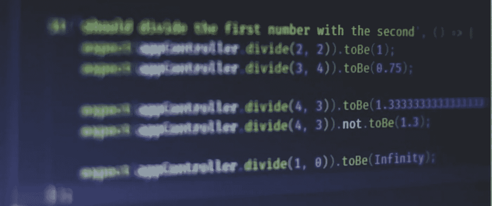

# 使用 Polly 测试您的客户端应用

> 原文：<https://levelup.gitconnected.com/level-up-your-client-tests-with-polly-5f240a58bf53>

## 以及为什么录音比模仿更进一步。

图片来自 Unsplash，作者为 [Ferenc Almasi](https://unsplash.com/@flowforfrank)

对于任何调用外部 API 端点的应用程序，一个常见的问题是如何最好地为与 API 调用相关联的客户端逻辑编写自动化测试。

考虑下面的`UserService`。它只是调用一个服务器端点(`APIService`)并返回一个格式化的响应。

有几个原因可以解释为什么`UserService`的测试应该与实际的`APIService`分离。在基本层面上，服务器通常以[有状态](https://en.wikipedia.org/wiki/State_%28computer_science%29)的形式存在，如果您想为孤立的场景编写确定性测试，这是有问题的。也就是说，如果您的测试依赖于实际用户，那么如果他们的概要文件被删除或更新，会发生什么呢？

更具体地说，服务器可能只是对单元测试来说太慢了，或者对实时呼叫收费。

这就是我们使用 [test doubles](https://en.wikipedia.org/wiki/Test_double) 的原因——它是“*对象或过程的通称，这些对象或过程的行为类似于它们面向发布的对应物，但实际上是降低复杂性和便于测试的简化版本。*

尽管测试替身有不同的风格，我们上下文中的标准方法是使用*模拟*——简而言之，预先编程的简化来替换选定的模块。使用 [Jest](https://jestjs.io/) ，一个广泛采用的 JavaScript 测试框架，我们可以模仿`APIService`如下:

这当然比没有测试要好，但是模拟的缺点是它们必须被维护。也就是说，您没有明显的方法来检测 API 行为的变化，并且您的测试可能会产生误报。

这让我想到了我们的主要问题:是否有一个 test-double 的实现来确保快速、确定性的测试，并且只需要最少的努力来与实际的 API 保持一致？

可能有多种答案，但是*录音*引起了我的注意。

简而言之，记录的方法包括调用一个 API 端点*一次*，记录它的响应，并在未来的测试中重放它——“T23”存根”实际的 HTTP 调用。

我最近开始使用 [Polly](https://netflix.github.io/pollyjs) ，一个由网飞维护的 JavaScript 库，在我的测试中实现录音。重要的是，Polly 要求您为记录设置一个截止日期，这迫使您用 API 来更新您的测试。

以我们的`UserService`为例，您可以将 Polly 添加到 Jest 测试中，如下所示:

1.  通过运行`npm install — save-dev @pollyjs/core [@pollyjs/adapter-node-http](http://@pollyjs/adapter-node-http) [@pollyjs/persister-fs](https://www.npmjs.com/package/@pollyjs/adapter-node-http) setup-polly-jest`安装依赖项。
2.  创建一个新文件来配置 Polly。

最复杂的配置是`matchRequestBy`。它规定了如何为请求生成唯一标识符，以及相应地如何将请求与记录相匹配。换句话说，请求是通过 HTTP 还是 HTTPS 发出的有关系吗？请求的顺序相关吗？两个标题不同的相同请求是否分开分类？

对于一个简单的实现，您可以通过`method`和`body`，以及 URL `hostname`、`pathname`和`query`字符串配置 Polly 来匹配请求。

现在，你所要做的就是在你的测试中给波利打电话。

第一次运行测试时，它们会调用服务器端点，并将其响应保存在文件系统中。该记录将用于所有后续运行，一旦过期，Polly 将向您发出警告。

最后，您可能希望 Polly 在您的机器上的行为不同于在 CI 上的行为。例如，我更喜欢只在我的机器*上创建录音*，并在 CI 上禁用它们。

要创建这个逻辑，您可以利用`CI`环境变量(至少在 CircleCI 或 Travis 上)进行如下配置:

Et voilà:快速、确定性的测试与保持与 API 一致的机制、良好的文档和简单的设置相结合。

测试愉快！🚀