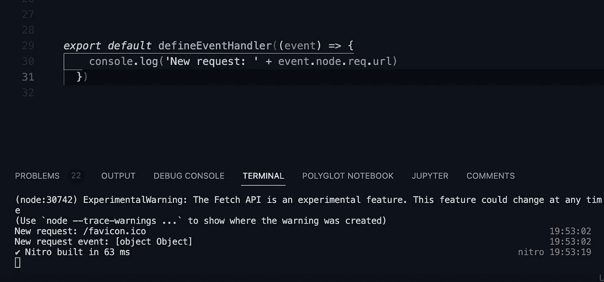

# 用这个概念提升你的 nuxt 技能

> 原文：<https://levelup.gitconnected.com/level-up-your-nuxt-skills-with-nuxt-middlewares-242b3ff38b6f>


照片由[天当](https://unsplash.com/@th_dangvu?utm_source=medium&utm_medium=referral)在 [Unsplash](https://unsplash.com?utm_source=medium&utm_medium=referral) 上拍摄

*在 nuxt 的世界里，中间件是将你的应用程序的模块化联系在一起的强大纽带。但是 nuxt 中间件也给了你很多老大哥的力量。您可以使用一些高级技术来充分利用这些中间件，从而大大增强您的应用程序的功能。今天，我将讲述你需要知道的关于 nuxt 中间件的一切，让你的应用程序变得更好。*

# 什么是 Nuxt.js

Nuxt.js 框架是一个很棒的工具，可以用服务器端渲染(SSR)来创建 Vue 单页应用程序(SPA)。它建立在 Vue 的基础上，所以你可以使用所有你需要的工具，不费吹灰之力就能建造强大的水疗中心。js 是一个框架，它给了我们开发人员构建高性能应用程序的能力。

Nuxt 提供了很多现成的特性，比如路由、[管理元数据](https://www.the-koi.com/projects/everything-you-need-to-know-about-nuxt3-usehead/)、服务器端渲染等等。Nuxt 还提供了一个基于最佳实践的良好的文件夹结构来启动你的下一个项目。

# 什么是中间件(通用)

我总是喜欢在将它放入框架的上下文之前理解这个术语。

[我很喜欢微软 Azure 的定义:](https://azure.microsoft.com/en-us/resources/cloud-computing-dictionary/what-is-middleware/)

> *中间件是位于操作系统和运行于其上的应用程序之间的软件。本质上作为隐藏的翻译层，中间件实现了分布式应用的通信和数据管理。它有时被称为管道，因为它将两个应用程序连接在一起，因此数据和数据库可以很容易地在“管道”之间传递使用中间件允许用户执行诸如在 web 浏览器上提交表单之类的请求，或者允许 web 服务器根据用户的配置文件返回动态网页。*

所以中间件是一种粘合剂，将软件的两个部分相互连接起来。

# Nuxt.js 中的中间件是什么

在 nuxt.js 中，中间件是一个在站点呈现之前执行的功能。这可以是例如检查用户是否具有访问该站点的特权的功能。

在 nuxt 中有两种类型的中间件。在应用程序的 **vue** 部分执行的**路由中间件**。

普通的**中间件**在应用程序的 **nitro** 部分执行。

上面的例子是一个路由中间件，因为它会拦截内置的 vue 路由器。

所有的 nuxt 中间件都必须放在中间件/目录中。

# Nuxt3 路由器中间件

路由器中间件位于应用程序的 vue 部分。

nuxt 3 中有三种类型的路由中间件:

## 1:内联中间件

直接在页面中定义。

## 2:命名中间件

在中间件目录中定义。当在页面中被引用时，可以在导航到页面之前使用。

我们将在下一章构建引用的中间件。

```
<script setup>
definePageMeta({
  middleware: ["isAdministrator"]
  // or middleware: 'isAdministrator'
})
</script>3: Global middleware
```

也在中间件目录中定义。将在传送到任何页面之前执行。

# Nuxt 路由器中间件示例

如上所述，最流行的用例是身份验证防护。

我也在我的项目中使用这个。但出于安全考虑，我将用一个微不足道的例子来描述。

```
// middlewares/isAdministrator
export default defineNuxtRouteMiddleware((to, from) =>
  // isAdmin() is an example method verifying if an user is authenticated
  if (isAdmin() === false) {
		logout();
    return navigateTo('/login')
  }
})
```

上面的中间件检查当前认证的用户是否具有管理员特权。

每个中间件都有两个参数，to 和 from。

到是我们希望**到**去的地方。

从哪里来就是从哪里来**。**

如果用户没有管理员权限，该用户将被注销，我们将把他重定向到登录页面以再次登录。不是最好的 UX，但当一个用户是邪恶的，我们将是😈。

如果用户有权限，我们什么也不做，这意味着我们重定向到想要的页面。

这也是标准 vue 路由器实现的主要区别和一个大问题。

在旧版本的 vue-router 中，有第三个参数叫做 next()，它可以导航到想要的路径，但是在 nuxt 中间件中没有这个参数。

[下一个参数也已从 vue-router 中删除，现在仅在那里是可选的。](https://router.vuejs.org/guide/advanced/navigation-guards.html#optional-third-argument-next)

# Nuxt3 服务器中间件

相同的名字，不同的目的。

nuxt 3 中的[服务器中间件](https://nuxt.com/docs/guide/directory-structure/server)位于应用程序的 nitro 端。

你可以想象这个中间件类似于 axios 拦截器。

它会在任何其他路由之前，将你的 nuxt 应用程序发出的任何请求发送给它自己。

从那里你可以记录，检查标题或添加额外的数据或准备回应。

您还可以在其中构建一些自定义的错误处理。

他们能做的非常多，但是**服务器中间件不能有返回值！**

让我们举一个简单的例子来更好地理解它:

# Nuxt 服务器中间件示例

我们将拦截任何请求，并在继续之前记录我们得到的信息。

为此，创建一个服务器文件夹，并在其中创建一个中间件文件夹。

创建一个名为 logger.ts 的新文件，并将以下代码粘贴到其中:

```
export default defineEventHandler((event) => {
  console.log('New request: ' + event.node.req.url)
})
```

这将在您的控制台中产生以下输出。



注意，我们是在服务器端，所以这个输出在浏览器控制台中是不可见的。

# Nuxt 3 服务器中间件用例

给你一些建议，告诉你为什么要用这个。

*   匹配路线参数，如 param [article]

```
export default defineEventHandler((event) => 
  `You want to read, ${event.context.params.name}!`) 
```

*   访问请求 cookies
*   日志请求
*   预热一个 API，你可能有一个 Azure free plan API，当没有请求时它会进入睡眠状态。所以第一个通常会导致超时。当你的应用程序第一次加载时，你可以发出一个初始请求来唤醒 API。
*   捕捉所有路线
*   日志查询参数

更多…

# 结论

在 nuxt3 中有两种类型的中间件，一旦你理解了它们，它们都非常有用。

他们真的把你的应用程序粘在一起。

感谢您的阅读，

亚历克斯

*最初发表于 https://www.the-koi.com*[*。*](https://www.the-koi.com/projects/nuxt3-middlewares-everything-you-need-to-know/)

# 参考

[Nuxt.js 中间件文档](https://nuxtjs.org/docs/directory-structure/middleware/)

[Nuxt.js 服务器文档](https://nuxt.com/docs/guide/directory-structure/server)

[Axios 拦截器](https://axios-http.com/docs/interceptors)

[微软 Azure 中间件定义](https://azure.microsoft.com/en-us/resources/cloud-computing-dictionary/what-is-middleware/)

[RedHat 中间件定义](https://www.redhat.com/en/topics/middleware/what-is-middleware)

[Vue 路由器文档](https://router.vuejs.org/guide/advanced/navigation-guards.html#optional-third-argument-next)