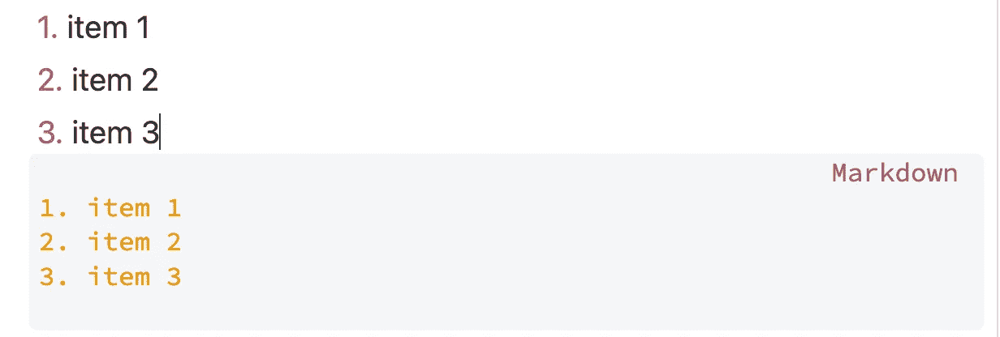

# 用降价提高你的生产力:学习降价的终极指南

> 原文：<https://levelup.gitconnected.com/level-up-your-productivity-using-markdown-75f402abc8e9>

## 轻松格式化文本，创建代码块和各种复杂的图表。


由[李冠仪](https://medium.com/u/9f2dc23bfffa?source=post_page-----75f402abc8e9--------------------------------)使用 Canva 创建的图像。

*2022 . 11 . 23 更新*

作为一个科技作家，[我使用 Obsidian 做笔记/制作系统的主要原因之一是因为它是一个基于 Markdown 的编辑器。这篇文章将解释为什么我们使用 markdown 编辑器，我们可以从中获得什么好处，以及如何在我们的日常写作工作中快速习惯 markdown 编辑器。](https://amy-juan-li.medium.com/why-i-use-obsidian-for-note-taking-making-system-as-a-tech-writer-e208699e0011)

# 什么是降价？

来自维基百科的简短定义:

> ***Markdown*** *是一种* [*轻量级标记语言*](https://en.wikipedia.org/wiki/Lightweight_markup_language) *用于创建*[](https://en.wikipedia.org/wiki/Formatted_text)**格式化文本*[](https://en.wikipedia.org/wiki/Text_editor)**..其目标是让人们“能够使用易于阅读和易于书写的纯文本格式进行书写”。***
> 
> ***——*[*百科*](https://en.wikipedia.org/wiki/Markdown)**

# **Markdown Editor 对我们做笔记有什么好处？**

## **1.快速获取信息**

**首先，如果你的笔记需要格式化，你就更容易写下来。与富文本编辑器相比，Markdown 语言极大地减少了为文本寻找正确格式的摩擦。**

**你越容易把信息按照你想要的方式格式化，你记笔记时遇到的摩擦就越少，你就越有可能把笔记写下来。**

**另一方面，在你的日常笔记活动中使用 Markdown 可以在笔记过程中为你创造一个集中思考的空间。因为如果你使用谷歌文档、苹果笔记等富文本编辑器，你可以通过移动手指或鼠标找到格式化按钮，点击并选择你需要的正确格式，从而轻松格式化你的笔记，而不会失去注意力。**

## **2.易于阅读和书写**

> **Markdown 的目的是尽可能的易读、易写。**

**与 HTML 的出版格式不同，Markdown 是一种写作格式。你可以很容易地知道什么是标题、副标题、粗体文本、项目符号列表、代码块等。从减价单上。**

## **3.接近标准化**

**几乎所有的笔记应用程序都是 Markdown 或富文本编辑器。一些应用程序甚至包括这两个选项，如允许你写减价或使用其内置格式样式的概念。因此，以 Markdown 为基础，您可以利用不同的应用程序来实现不同的目的。您可以轻松地在不同的应用程序中使用它**

**因此，尽管我将在下一节演示如何使用 Obsidian 编写 Markdown 语法，但您不必担心本视频中的知识仅限于 Obsidian。由于 Markdown 是一种通用语言，您可以很容易地将这些知识应用到任何其他支持 Markdown 的平台或应用程序中。**

## **4.灵活的能力**

**使用 markdown 我们可以实现的不仅仅是格式化标题、副标题、项目符号列表、粗体文本等。，您可以创建一些惊人的图表、流程图、匹配方程，甚至数据表，这些都将在下一节中介绍。**

***到目前为止，你可能正在学习 markdown 并开始使用 Markdown editor。让我们进入下一部分。***

# **如何开始使用 Markdown**

**让我们首先快速了解一下最常用的 markdown 语法。没什么大不了的，只是用一些基本的降价语法来格式化你的笔记。那么我们应该从黑曜石开始我们的日常写作。我想你几乎每天都写笔记，不管是为了工作还是为了个人目的。因此，与其使用苹果笔记或概念之类的笔记应用，不如去黑曜石。因为 Obsidian 是一个纯粹的 markdown 编辑器，你不允许用我们的鼠标点击按钮来欺骗你的写作。换句话说，你是被迫的，但这是一种好的方式，由 markdown 编辑器使用 Markdown 语法来格式化你的文本。如果你完全是 markdown 的初学者，或者你知道一点 markdown 语法，但从来没有使用纯 Markdown 编辑器来写笔记，这可能会感到害怕，但用不了多久你就会习惯于完全使用 Markdown 编辑器来写笔记。久而久之，我相信编写 markdown 语法将成为你的第二天性——不加思考地使用它。**

## **第一步:掌握最常用的降价语法**

## **标题**

****

## **列表**

**有序列表:**

****

**无序列表:**

****

## **创建清单(待办事项)**

****

## **强调**

****

## **批量报价**

********

## **可折叠内容**

****

## **码组**

****

## **连接**

****

****嵌入图像****

**！[图像名称](链接到图像)**

```
****
```

**或本地图像文件**

```
**![[file-name.png]]**
```

## **第二步:用减价编辑器做笔记**

**通过日常使用来学习。在做笔记的同时，试着做一些事情，比如发表一篇博客或者写一段视频或者写一些数字产品文档。那么你就不会因为仅仅练习 markdown 语法而感到厌烦。如果你总是在做某件事，即使要花很多努力才能完成，你也会不知何故地忘记辛苦的工作，只是享受这个过程。**

## **第三步:通过 Markdown 尝试其他酷的创意**

****数学方程式:****

****

****流程图:****

****

****序列图****

****

**示例代码来自 [GitHub 官方文档](https://github.blog/changelog/2022-02-28-gists-now-support-mermaid-diagrams/)。**

****数据视图中的黑曜石****

**如果你正在使用黑曜石，一个最流行的黑曜石插件叫做数据视图**

********

**左:启用黑曜石内部的数据视图插件。右图:Dataview 插件的 [Github repo。](https://github.com/blacksmithgu/obsidian-dataview)**

********

**左图:从名为“book notes”的文件夹中查询我的笔记的代码。右图:数据视图是由代码使用 data view 插件创建的。截图由[李冠仪](https://medium.com/u/9f2dc23bfffa?source=post_page-----75f402abc8e9--------------------------------)**

**作为一名程序员，我非常喜欢使用 Obsidian，尤其是编写一些代码来完成一些功能，比如 *Dataview* 。稍后，我将写一些文章，介绍如何使用 *Dataview* 来创建一些有用的数据表，并使用 Obsidian 集成到我们的 PKM 系统中。如果有兴趣，请关注我的更新。**

**视频版本**

**[https://www.youtube.com/watch?v=gSEVo5C5gAE](https://www.youtube.com/watch?v=gSEVo5C5gAE)**

# **包裹**

**显然，Markdown 的功能很容易被插件扩展。使用 Markdown Editor 作为日常笔记编辑器的潜力会让你惊讶不已。**

**我们既可以是消费者，也可以是建设者。因此，如果你对如何自己构建一个 markdown 编辑器感到好奇，你可以看看我的这个演示项目— [我如何使用 Next.js、TypeScript、CodeMirror 6 和 react-markdown](/build-a-markdown-editor-with-next-js-typescript-and-codemirror-6-38d4d5a8d3b3) 构建和部署一个 Markdown 编辑器。**

**[*如果你想在 Medium 上阅读来自*](https://medium.com/@amy-juan-li/membership)[](https://medium.com/u/9f2dc23bfffa?source=post_page-----75f402abc8e9--------------------------------)**和其他成千上万作家的每一个故事，考虑成为 Medium 成员* *。每月 5 美元，你可以无限制地访问媒体内容。如果你通过我的推荐链接* *注册，我会得到一点佣金。****

# ***你可能会喜欢***

***[](https://amy-juan-li.medium.com/why-i-use-obsidian-for-note-taking-making-system-as-a-tech-writer-e208699e0011) [## 作为一名软件开发人员，我从概念转向黑曜石的主要原因

### 基于 VIM 的编辑器，用于快速编辑和快速格式化的 markdown>创建了一个专注的笔记环境。

amy-juan-li.medium.com](https://amy-juan-li.medium.com/why-i-use-obsidian-for-note-taking-making-system-as-a-tech-writer-e208699e0011) [](https://amy-juan-li.medium.com/convert-obsidian-markdown-to-medium-blog-2b52f9bd1c28) [## 如何将黑曜石 Markdown 转化为中型博客

### 格式化要在媒体编辑器中使用的基于减价的笔记。

amy-juan-li.medium.com](https://amy-juan-li.medium.com/convert-obsidian-markdown-to-medium-blog-2b52f9bd1c28)***