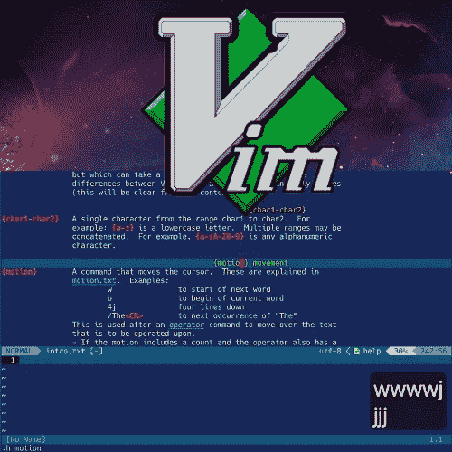
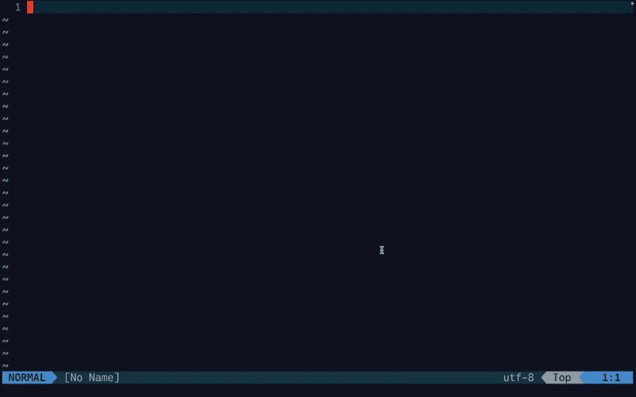
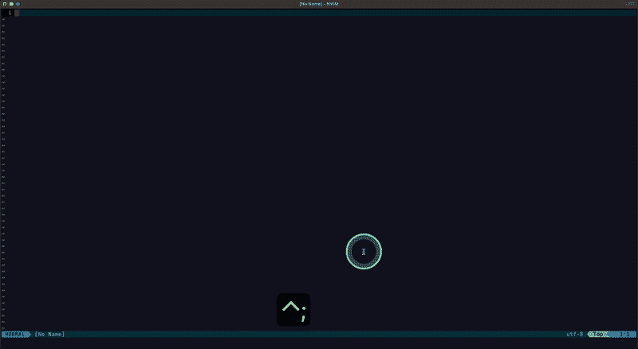
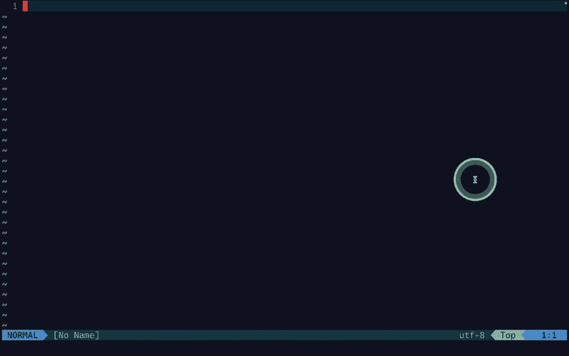

# 用 Vim 提升你的生产力:程序员和非程序员完全指南

> 原文：<https://levelup.gitconnected.com/level-up-your-productivity-with-vim-acfa27afb15a>

## 掌握 Vim 模式和语法规则，将 Vim 集成到您生产工作流程中。



图片由 [**动议**](https://medium.com/u/9f2dc23bfffa#)

运动用于在 Vim 的正常模式下移动光标。使用 Vim 运动有两种方式:

*   单独使用动作

```
[motion]
**h**   Move one character left
**j**   Move one row down
**k**   Move one row up
**l**   Move one character right

**w**   Move to the beginning of the next word
**e**   Move to the end of the current word
**E**   Move to the end of the word before a whitespace
**b**   Move to the previous beginning of the word
**B**   Move to the beginning of the previous word before a whitespace
**0**   Move to the beginning of the line
**$**   Move to the end of the line 
**^**    Go to the start of the line
**}**    Jump to the next paragraph
..
```

*   使用[计数]动作

动议接受计数作为参数。如果需要上 3 行，不用按`k` 3 次，可以做`3k`。

*提示:通过 Vim 编辑器中的* `*:h motion*` *查看参考手册。*

***演示 Vim 动作***



在 Vim 中演示动作。GIF 由 [**运算符**](https://medium.com/u/9f2dc23bfffa#operator)

学习这 3 个操作符(`y, d, c`)对于我们的大部分编辑工作来说已经足够了:

```
**y**    Yank text (copy)
**yy**   Yank entire line
**d**    Delete text and save to register
**dd** Delete the entire line
**c**    Delete text, save to register, and start insert mode
```

## **操作员+动作**

现在你知道了基本的操作和运动。让我们应用语法规则，运算符+动作。

***演示组合——操作符+动作***

```
const tool = "vim";
const traits = "minimal but efficient editor";
console.log(`The ${tool} is a ${traits}`);
```

*   把所有东西从你现在的位置拉到终点:`y$`。
*   将当前位置的所有内容拖到单词末尾:`yw`。
*   删除从您当前位置到行尾的:`d$`。
*   删除从您当前位置开始的下一个单词:`dw`。
*   要从当前位置切换到当前段落的结尾，请说`c}`。
*   要从您的当前位置更改到当前行的末尾，请说`c$`。
*   要从当前位置切换到当前单词的末尾，请说出`cw`。
*   向左/右猛拉三个字符:`y3h/y3l`。
*   删除下面两个字:`d2w`。
*   删除下面 2 行(删除 3 行):`d2j`。
*   要改下 2 行(改 3 行):`c2j`。


在 Vim 中演示操作员+运动组合。GIF 作者[跳转列表](https://medium.com/u/9f2dc23bfffa#jumplist)

另一个重要的技巧是利用好 Vim 跳转列表。Vim 跳转列表是您在文件间进行的跳转(光标移动)的历史记录，存储在`[jump list](https://vimhelp.org/motion.txt.html#jumplist)`中。当进行某些动作时，比如用`16G`跳转到第 10 行，用`gg/G`跳转到当前文件的开始/结尾，Vim 会将每一个动作保存为`jump list`中的一个“跳转”(注意:`hjkl`动作不存储在`jump list`中)。

*提示:使用* `*:jumps*` *命令列出跳转，使用* `*:clearjumps*` *命令清除跳转。详见* `[*:h jump-motions*](https://vimhelp.org/motion.txt.html#jump-motions)` *。*

这些跳跃动作可通过`<ctrl-o>`和`<ctrl-i>`导航:

```
**Ctrl+o** Navigate to the previous location in the jump list (o = "old")
**Ctrl+i** Navigate to the next location in the jump list
```

***演示 Vim 跳转列表*** 的用法

打开任何文件并停留在 Vim 正常模式:

*   清除现有跳转列表:`:clearjumps`
*   跳到文件的开头:`gg`
*   跳到第 10/20/30/40 行:`10G/20G/30G/40G`
*   跳到文件末尾:`G`
*   导航至上一个/下一个位置(跳转):`Ctrl+o/Ctrl+i`

打开几个文件(这些动作也存储在跳转列表中)

*   导航至上一个/下一个文件:`Ctrl+o/Ctrl+i`



通过[变更列表](https://medium.com/u/9f2dc23bfffa#changelist)

理解 Vim 跳转列表和 Vim 更改列表的区别:Vim 跳转列表是你在文件间跳转的历史记录，而 Vim 更改列表是你所做更改的历史记录。并且改变不必是要存储在 Vim 跳转列表中的“跳转”。

```
**g;**     Go to the [count] previous change location
**g,**     Go to the [count] newer change location

**gi**     Place the cursor at the position where it was left last time in the Insert mode
```

*到目前为止，我们已经学习了最重要和最有用的 Vim 命令和操作，以方便文本操作。对于一个真实的工作项目，很可能你需要同时打开多个文件，然后你需要一种方法来快速浏览不同的文件，或者比较文件之间的差异，等等。为了通过我们现实世界的工作流来处理这些需求(可以说是一个相对较大的项目)，让我们在下一节学习 Vim 缓冲区、窗口和选项卡。*

# 使用 Vim 缓冲区、窗口和标签

## Vim 缓冲区

缓冲区是文件的内存文本。例如，`vim filename`创建一个新的缓冲区，`vim file1.txt file2.txt`创建两个缓冲区。运行`:buffers`查看所有缓冲区。

## Vim 窗口

窗口是缓冲区上的视口。

```
**:vsplit **  Split window vertically
**:split**    Split window horizontally
```

## Vim 标签

标签页是窗口的集合。

```
**:tabnew file.js **     Open a file in a new tab
**:tabclose**            Close current tab
**:tabnext** or **gt**       Go to the next tab
**:tabprevious** or **gT**   Go to the previous tab
**:tablast**             Go to the last tab
**:tabfirst**            Go to the first tab
```

## 如何在您的工作流程中有效使用 Vim 缓冲区、窗口和标签

*   使用缓冲区打开当前任务所需的所有文件。不要担心打开了许多缓冲区。Vim 允许您浏览缓冲区并无摩擦地处理缓冲区。
*   当您需要查看不同文件的多个缓冲区、引用其他代码等时，请使用 windows。
*   在处理具有不同目的的项目时使用选项卡。例如，一个选项卡用于客户端应用程序，一个选项卡用于服务器。



演示 Vim 中的缓冲区、窗口和选项卡。GIF 作者[李冠仪](https://medium.com/u/9f2dc23bfffa?source=post_page-----acfa27afb15a--------------------------------)

# 包裹

我们已经介绍了 Vim 的主要概念。希望这篇文章能够激励您了解 Vim，并开始在工作中使用它。做一个‘参考手册’(像`:h buffers`)做你的好朋友。学习 Vim 是一个持续的过程。你总能找到一些方法来改进你的工作流程。稍后，我将分享更多我在日常编码项目中使用的基于 Vim 的工作流。

一如既往，编码快乐！

视频版本:

[*如果你想在 Medium 上阅读来自*](https://medium.com/@amy-juan-li/membership)[](https://medium.com/u/9f2dc23bfffa?source=post_page-----acfa27afb15a--------------------------------)**和成千上万其他作家的每一个故事，考虑成为 Medium 会员* *。每月 5 美元，你可以无限制地访问媒体内容。如果你* [*通过我的推荐链接*](https://medium.com/@amy-juan-li/membership) *报名，我会得到一点佣金。**

# *你可能会喜欢*

*[](/how-i-learned-to-love-vim-9b7fe53a4615) [## 我是如何学会爱上 Vim 并在一个月内从 VS 代码过渡到 Neovim 编码工作流的

### 快速过渡到基于 Neovim 的文本编辑器是正确的选择！

levelup.gitconnected.com](/how-i-learned-to-love-vim-9b7fe53a4615) [](https://blog.devgenius.io/set-up-a-next-js-application-workflow-using-neovim-typescript-tailwind-23621a34ed38) [## 使用 Neovim + Lua、TypeScript 和 TailwindCSS 设置 Next.js 应用程序工作流

### 为 Next.js 应用程序创建高效的工作流。

blog.devgenius.io](https://blog.devgenius.io/set-up-a-next-js-application-workflow-using-neovim-typescript-tailwind-23621a34ed38) 

# 分级编码

感谢您成为我们社区的一员！在你离开之前:

*   👏为故事鼓掌，跟着作者走👉
*   📰查看[升级编码出版物](https://levelup.gitconnected.com/?utm_source=pub&utm_medium=post)中的更多内容
*   🔔关注我们:[推特](https://twitter.com/gitconnected) | [LinkedIn](https://www.linkedin.com/company/gitconnected) | [时事通讯](https://newsletter.levelup.dev)

🚀👉 [**加入升级人才集体，找到一份惊艳的工作**](https://jobs.levelup.dev/talent/welcome?referral=true)*