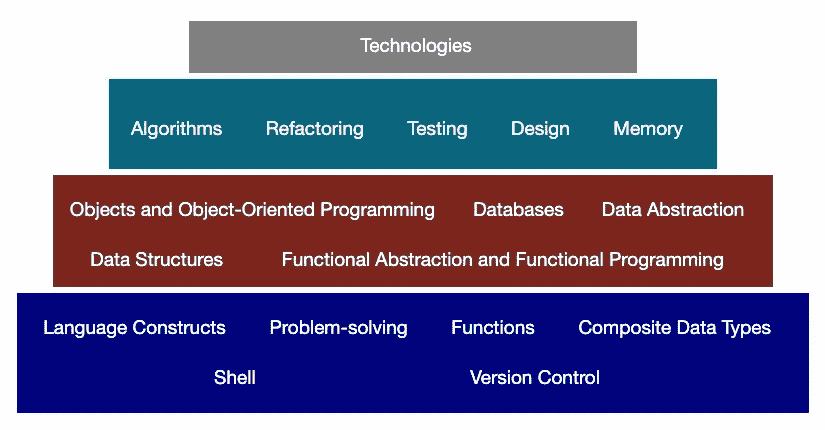
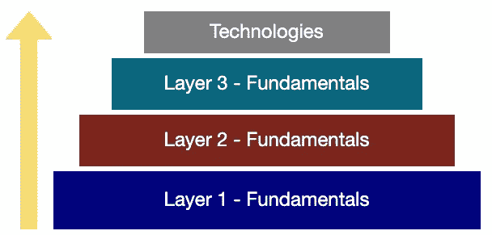

# 用程序员金字塔提升你的编程水平(这是免费的！)

> 原文：<https://levelup.gitconnected.com/level-up-your-programming-with-programmers-pyramid-1d1186d053c0>

你意识到学习像 React 和 Node 这样的技术是不够的。所以你想通过学习编程的基础来增强你的技能和加深你的知识。

但是你有一些问题:

*   什么是编程的**基础**？
*   你应该首先关注哪些**话题**？
*   哪些**资源**最好？

你并不孤单。这些是我在自学过程中反复问的一些问题。我最需要的是一份路线图。

我没有，就创建了:[程序员金字塔](https://programmerspyramid.com/)。

这个*免费的*自学工具教你编程的基础。它定义了你需要学习什么以及学习的顺序。它还提供了您需要的资源，并解释了如何着手学习材料。

因此，你将**建立坚实的知识基础，发展核心技能**，这将增强你作为程序员的能力，并为更高级的学习做准备。

最后，学习编程有一个清晰易懂的过程。

# 我们在为同一个目标而战

程序员的金字塔是出于一种需求——我自己的需求——而创建的。

学习编程对我来说就像一个黑洞。我学得越多，我就越意识到有很多东西要学。我很难确定先学什么以及如何学。

鉴于这些早期的障碍，我花了很多时间学习如何学习，审查资源，并研究伟大的程序员。我知道一定有更好的——更有效的——学习编程的方法。

所以我开始在我的博客上分享我关于[学习有效编程的想法:学习策略、有用的编程资源和重要的编程技能。在这个过程中，我发现有很多人和我一样。我们在为同一个目标而战:我们希望在我们的工艺上做得更好，并且需要一种有效的方法来实现它。](https://amymhaddad.com/)

编程是一项需要开发的奇妙技能。但是学习过程不应该如此模糊和复杂。进入程序员的金字塔。

# 你的学习系统

迷失在细节中——所有的细节——无论我在学习什么都是我经常犯的错误。这减缓了我的进度，增加了我的挫败感。此刻一切似乎都很重要。但事后看来，事实并非如此。

虽然完成起来很有挑战性，但学到了重要的一课:一旦核心结构到位，细节就变得更有意义了。埃隆·马斯克说得好:

“将知识视为一棵语义树是很重要的——在你进入树叶/细节之前，确保你理解了基本原则，即主干和大树枝，否则就没有什么可以依靠的了。”

这就是为什么**核心在程序员的金字塔中排在第一位**。

# 学习编程的自底向上的方法

程序员金字塔提倡一种[自下而上的方法](https://programmerspyramid.com/approach/)来学习编程。这个想法是建立一个坚实的基础——从基础开始。

这种方法与当今流行的方法背道而驰。我称之为自上而下的方法。这是程序员从金字塔的顶端开始，几乎完全专注于技术。编程基础是一个事后的想法，如果他们被解决的话。

这是一个问题。

自顶向下的方法绕过了许多重要的编程主题和技能，导致知识基础不牢固。

# 打基础:关注基本面

这并不是说你不需要技术。你知道。然而，基本面是第一位的，因为这个原因:**基本面是推动者**。

它们使我们能够更好地利用技术。

它们使我们能够写出更好——更有效——的程序。

它们使我们变得更加多才多艺，适应性更强。

最重要的是，基础使我们能够成为更好的程序员。

编程是一门技能。培养任何一种技能的方法都是将它分解并专注于它的核心部分。

许多领域的专家都遵循这个精确的配方。想想国际象棋界的乔希·威茨金或篮球界的科比·布莱恩特:两人都不懈地专注于基本面。

程序员金字塔也是如此。它清楚地描述了**什么是**编程的基础，同样重要的是**何时**和**如何**学习它们。金字塔形状给出了学习的结构:从底部开始，一步步向上。

# 粉碎内容

你需要关注的——编程的基础——只是战斗的一半。另一个是*如何*去学习它们。

程序员金字塔提倡一种积极的学习方法，我称之为[先应用，再学习](https://amymhaddad.com/apply-first)。

想法是先*试*解决问题或者写程序。不一定要得到正确的解。相反，这是所有关于尝试:看看你能走多远，然后你就会被卡住。换句话说，找到路障。如果你陷入困境，那么参考一本书或一门课程，把注意力集中在那个特定的障碍上。

这种方法奏效有几个原因。首先，它让你意识到你有麻烦的一些具体的事情。

假设你开始了一个问题，并且在使用一个 **while 循环**时被卡住了(为什么它不会终止？！).通过首先尝试解决问题，您将使用具有*目的*的资源。不要机械地在讲座中循环，只关注那些能让你摆脱困境的。因此，在这个例子中，您将关注 while 循环，尤其是无限循环。

因此，你的学习过程会更有效率。我们经常坐着听视频讲座，听我们已经知道的内容。或者我们让自己淹没在细节中——那些现在与我们无关的细节。**使用“先应用，后学习”的方法，你可以专注于一件事并抓住它，而不是专注于每件事。**

用这种方法学习也更有意义，至少在我看来是这样。这是因为当你看讲座或看书时，你会在脑海中有一个特定的情境来联系信息。

当你需要更多细节的时候，那就去获取当时的细节。否则，你很可能会忘记它们。“在很短的时间内，我们会失去我们刚刚听到或读到的 70%的东西，”这本书的作者解释说。

这就引出了为什么先申请，后学习行得通的另一个原因:你一定会更好地记住信息，因为学习过程是主动的，而不是被动的。即使你第一次尝试没有解决问题，你也可能会记得这个过程。那是因为我们常常记得自己奋斗的时光。

例如，我清楚地记得我的第一次半程马拉松。我挣扎着通过它，因为我没有为此进行适当的训练。虽然那一刻很难忍受，但我从那场比赛中学到了很多东西——这些重要的教训我至今仍记忆犹新。

我不是被动的看一个关于如何跑步的讲座学来的。相反——这是重要的一点——我通过采取行动来学习:我在比赛日出现并参加了比赛。

由于这些原因，程序员的金字塔提倡先应用，后学习的方法。金字塔内的每个主题都包含两个部分:“参考”和“应用”。首先尝试“应用”部分中的一个问题。然后，如果你遇到困难，可以在“参考”部分查阅课程、书籍或文章。

我的任务是帮助程序员学会有效地编程。是的，有很多编程信息要学。但是当你有了*什么*和*如何*的时候，你的旅程会变得更加顺利。它始于扎实的基础和有效的学习习惯。这就是[程序员金字塔](https://programmerspyramid.com/)的目标。

*程序员和作家:*[*amymhaddad.com*](https://t.co/7bVIE3mzYN?amp=1)*|*[*programmerspyramid.com*](https://t.co/p9TJMZ7Fs1?amp=1)*|我关于编程、学习和生产力的推文*[*@ amymhaddad*](https://twitter.com/amymhaddad)

*原载于*[【amymhaddad.com】T21](https://amymhaddad.com/level-up-your-programming-with-programmers-pyramid)*。*