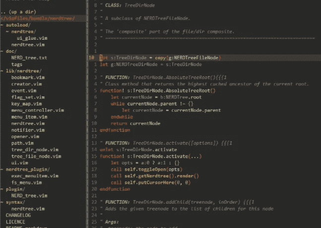
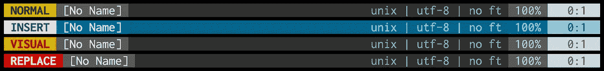
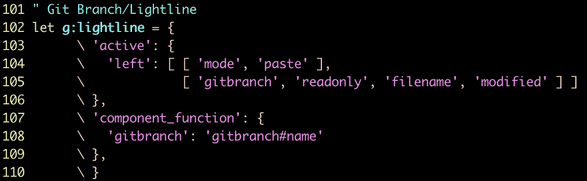
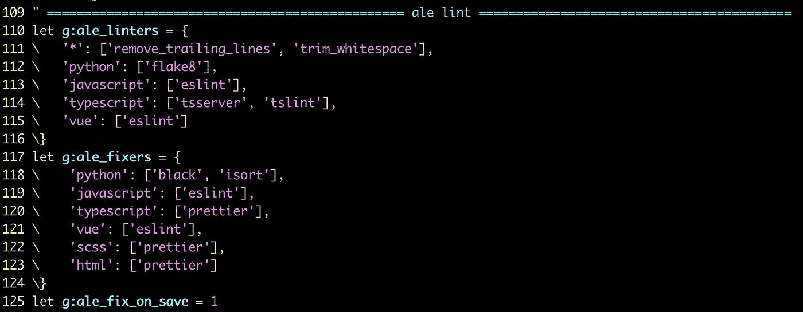
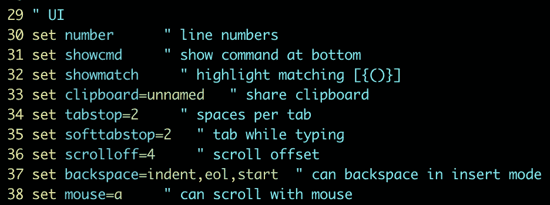
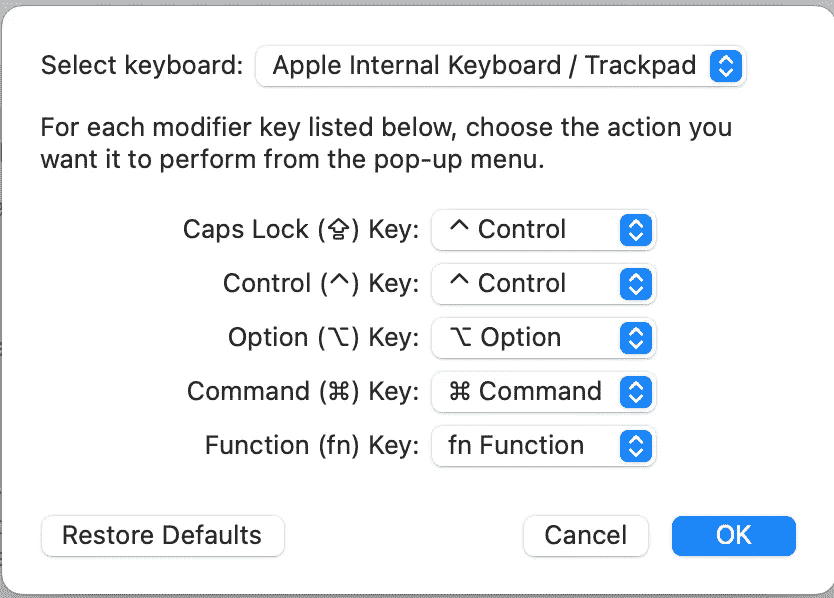

# 提升您的 Vim 体验

> 原文：<https://levelup.gitconnected.com/level-up-your-vim-experience-d7d68b82a570>

## 刚接触 Vim？这是我推荐的插件和设置

詹姆斯·哈里森在 [Unsplash](https://unsplash.com?utm_source=medium&utm_medium=referral) 上的照片

在我的上一篇[文章](https://medium.com/@taylork26/why-i-chose-to-learn-vim-5bf430b1bc9)中，我告诉了你我为什么选择学习 Vim 以及我迄今为止的 Vim 经验。在这里，我将带您了解我个人的 Vim 环境，以及是什么让它如此出色。

## 设置

1.  下载 Vim(我用的是[自制](https://formulae.brew.sh/formula/vim) — `brew install vim`)
2.  下载[vu ndle](https://github.com/VundleVim/Vundle.vim)——这是你用来管理你的插件的
3.  按照 Vundle 的自述文件中的说明，将启动代码复制并粘贴到您的`~/.vimrc`文件中

> 想要更多的 Vim 练习吗？**使用 Vim 编辑您的点文件。我曾经在文本编辑器中编辑我的点文件——你能想象吗？！为什么不直接从命令行进入文件？在终端提示符下键入`vim ~/.vimrc`——文件直接在 Vim 环境中打开，可以编辑了。现在我给了你另一个学习 Vim 的理由和一个简单的练习方法！**

## `~/.vimrc`

您的`~/.vimrc`文件是您所有 Vim 配置的所在。这是你添加插件、按键映射和设置的地方。一旦你有了 Vundle 的启动代码，你就可以根据自己的需要定制这个文件了。

# 值得注意的插件和特性

## [NERDTree](https://github.com/preservim/nerdtree)

他们的自述文件中的三个例子

NERDTree 在编辑器的左侧显示所有文件，这与 Visual Studio 代码中的文件显示没有什么不同。使用它可以轻松导航并快速打开文件进行阅读或编辑。例如——我将我的编辑器分开，将我正在编辑的代码放在左边，将我的测试文件放在右边(TDD——另一个话题)。 **Vim 快捷方式—** `^W V` **拆分你的编辑器。**

## [光线](https://github.com/itchyny/lightline.vim)

他们的[自述文件](https://github.com/itchyny/lightline.vim)中使用 Lightline 的状态栏示例

Lightline 会在编辑器的底部插入一个状态栏。根据你对颜色的喜好，有几个主题可供选择。这个插件可以让你很容易地看到你当前正在运行的模式。没有什么比认为自己处于`NORMAL`模式并直接在代码中输入命令更令人沮丧的了，因为你实际上处于`INSERT`模式。省省你的头痛吧。

## [vim-gitbranch](https://github.com/itchyny/vim-gitbranch)

我在`~/.vimrc`的 Lightline/Gitbranch 设置

利用你的 Lightline 插件——这个插件与 Lightline 一起工作，并在你的状态栏中显示你当前工作的分支。当您频繁切换分支并失去当前工作分支的踪迹时，这尤其有用。

## [ALE(异步 Lint 引擎)](https://github.com/dense-analysis/ale)

我的 Ale 配置在~/。vimrc

编辑文件时，您可以一站式获得林挺、语法检查和语义错误警告。换句话说，在你打字的时候。您可以设置棉绒机和固定器。它可以基于语言进行定制，并且有几个我还没有探索过的特性。

## [你让我完整](https://github.com/ycm-core/YouCompleteMe)

从他们的 GitHub 来看，“YouCompleteMe 是一个快速的、随你输入的、模糊搜索的代码完成、理解和重构引擎，用于 [Vim](https://www.vim.org/) 这个插件会像疯了一样提升你的效率。安装需要一些配置，但是请仔细阅读它们的自述文件，您很快就可以安装完毕。

## 用户界面配置

/中的我的 UI 配置。vimrc

有几种方法可以定制您的 Vim UI。例如，`set number`显示您的行号。这只是几个例子——我鼓励你在个性化你的 Vim 环境时灵活运用你的 [Google Fu](https://en.wiktionary.org/wiki/Google-fu#:~:text=Google%2Dfu%20(uncountable),useful%20information%20on%20the%20Internet.) 。

> 这绝不是 Vim 插件的详尽列表。接受对你有用的东西，并把它作为一个小小的娱乐和探索的机会。

## 插件的有用命令:

1.  将插件行添加到您的`~/.vimrc`文件中(它看起来应该类似于下面的例子)

~/中的示例插件行。vimrc

1.  安装插件——启动`vim`并运行`:PluginInstall`
2.  删除插件——从你的`~/.vimrc`文件中删除这一行，启动`vim`，运行`:PluginClean`

## 一个关键的地图游戏改变者

> 我把最近教我的最后一个小技巧留给你…

如果你用的是 Mac 键盘，如果你在打字课上专心听讲，当你的手指很好地放在它们应该在的*位置时，左下角的四个键会有点碍事。召回梅维斯·贝肯——还有人在小学上过这样的课吗？*

*Vim 中的编码都是关于效率的。我们经常使用`Control`键。将你的小拇指向下伸向`Control`按钮不是很有效，而且会让你的手指与 home 键不在一条线上。*

*你最后一次使用`Caps Lock`是什么时候？在极少数情况下，当我需要输入几个全大写的单词时，我倾向于按住`Shift`键，让它顺其自然。你不认为钥匙可以被更好地使用吗？*

*Enter —键盘映射。我们将映射我们的`Caps Lock`键来执行`Control`键的动作。*

## *尝试一下*

1.  *打开系统偏好设置*
2.  *导航到键盘*
3.  *点击修饰键*
4.  *您将看到一个弹出窗口，其中列出了按键以及当您点按它们时它们所执行的操作*
5.  *将您的`Caps Lock`键更改为`Control`*
6.  *砰——现在每次你按住`Caps Lock`，你就会触发`Control`动作*

*注意:保留`Control`键不变的选项，这样两个键现在都是有效的`Control`键。如果您仍然想访问`Caps Lock`，我建议您将`Control`映射到`Caps Lock`。*

**

***这篇文章只是触及了 Vim 中你所能做的一切的表面——我只是一个初学者:)让你的好奇心去探索还有什么是可能的吧！***

*如果你想看我的`~/.vimrc`文件，可以看看我的 GitHub [repo](https://github.com/t-keazirian/dotfiles) 我的 dotfiles 所在的地方。我还建议用你的点文件创建你自己的回购协议。*

*每个人都有不同的`~/.vimrc`设置——这是适合我的，我一直在寻找提高它的方法。如果你对令人敬畏的插件或 Vim 配置有任何建议，我很想听听。编码快乐！*